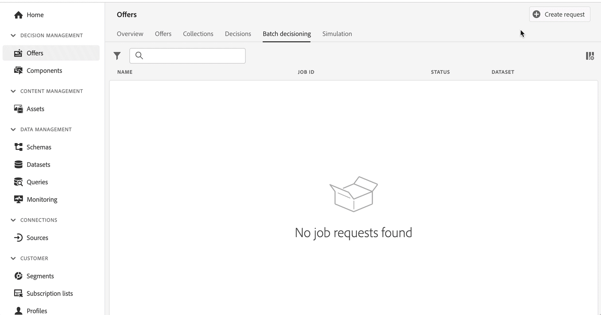

# 發行說明 {#release-notes}

本頁面列出[!DNL Journey Optimizer]所有新功能和改進項目。您還可以參閱[最新文件更新](documentation-updates.md)頁面以了解更多變更。

[!DNL Adobe Experience Platform] 上內建的原生 [!DNL Adobe Journey Optimizer] 延續了最新版本的創新和改進內容。 欲深入瞭解這些變動，可參閱 [Adobe Experience Platform 發行說明](https://experienceleague.adobe.com/docs/experience-platform/release-notes/latest.html?lang=zh-Hant){target=&quot;_blank&quot;}。

 立即註冊 [Adobe Journey Optimizer 季度電子報](https://www.adobe.com/subscription/Adobe_Journey_Optimizer_NL.html){target=&quot;_blank&quot;} ，直接把每季最新產品更新、激勵人心的故事、使用案例、提示等內容傳送到您的收件匣。

## 2022 年 7 月發行版本 {#july-2022-release}

### 新功能

<table>
<thead>
<tr>
<th><strong>新的線上消息傳遞流</strong> </th>
</tr>
</thead>
<tbody>
<tr>
<td>

Journey Optimizer為「旅程」中的消息創作提供了新流。 線上消息傳遞將為用戶節省大量時間，並簡化在Journey Optimizer建立和傳遞電子郵件、推送通知或簡訊的工作流程。 通過將消息作為單獨的步驟刪除，而將其作為Journey Canvas上操作的一部分進行串聯可編輯，用戶將需要按一下較少的按鈕並導航較少的螢幕來設計和編輯其內容。

如需詳細資訊，請參閱<a href="../messages/get-started-content.md">詳細文件</a>。

</td>
</tr>
</tbody>
</table>

<table>
<thead>
<tr>
<th><strong>基於屬性的訪問控制（有限的可用性）</strong> </th>
</tr>
</thead>
<tbody>
<tr>
<td>

現在，您可以使用定義組織或資料使用範圍的標籤來標識架構欄位。 管理員可以使用「權限」介面定義涵蓋XDM架構欄位的訪問策略，並更好地管理授予用戶或用戶組（內部、外部或第三方用戶）的訪問權限，以及管理對特定類型資料（即敏感個人資料/SPD）的訪問權限。

基於屬性的訪問控制目前僅限於選定用戶，將在以後的版本中部署到所有環境。

如需詳細資訊，請參閱<a href="../administration/attribute-based-access.md">詳細文件</a>。

</td>
</tr>
</tbody>
</table>

<table>
<thead>
<tr>
<th><strong>批量決策作業</strong> </th>
</tr>
</thead>
<tbody>
<tr>
<td>

現在，您可以從用戶介面運行批決策作業，這樣我就不需要開發人員來運行批API作業，而且我可以減少營銷所需的時間。 此新介面允許您建立作業和管理當前/過去的作業。

如需詳細資訊，請參閱<a href="../offers/batch-delivery.md">詳細文件。

</td>
</tr>
</tbody>
</table>

<!--
<table>
<thead>
<tr>
<th><strong>Automatically use the best performing offer in your decisions (limited availability)</strong> </th>
</tr>
</thead>
<tbody>
<tr>
<td>

You can now use personalized optimization model systems in Decision Management. This new type of model allows you to optimize and personalize offers based on segments and offer performance.

The use of personalized optimization AI models is currently restricted to selected users, and will be deployed to all environments in a future release.

For more information, refer to the detailed documentation.

</td>
</tr>
</tbody>
</table>
-->

### 改進項目

<!--
**Journeys**

* **Ending a journey** - In the journey canvas, the **End** activity has been removed from the palette. End tags are now added by default at the end of each path and cannot be removed. This improvement allows better reporting of where a customer dropped out of the journey, without any action from the user.
-->

**訊息**

* 現在是消息預設 **通道曲面**。 [進一步了解](../configuration/channel-surfaces.md)

**管理**

* **PTR記錄版本**  — 現在，更新PTR記錄時，處理時間最多只需3小時。 [了解更多](../configuration/ptr-records.md#processing)

* **允許清單UI**  — 您現在可以使用Journey Optimizer用戶介面將新電子郵件地址或域添加到允許的清單中。 [了解更多](../configuration/allow-list.md)

* **允許的清單邏輯更新**  — 現在，即使清單為空，允許的清單邏輯在功能啟用後即會應用。 [了解更多](../configuration/allow-list.md#logic)

* **URL跟蹤參數**  — 現在，您可以使用表達式編輯器在電子郵件曲面中配置URL跟蹤參數（即消息預設）。 [了解更多](../configuration/email-settings.md#url-tracking)

**Offer Decisioning**

* **受眾大小**  — 當建立決策規則、選擇段或規則以設定聘用資格或將段或規則添加到決策範圍時，新的受眾規模估計元件現在顯示在用戶介面中。