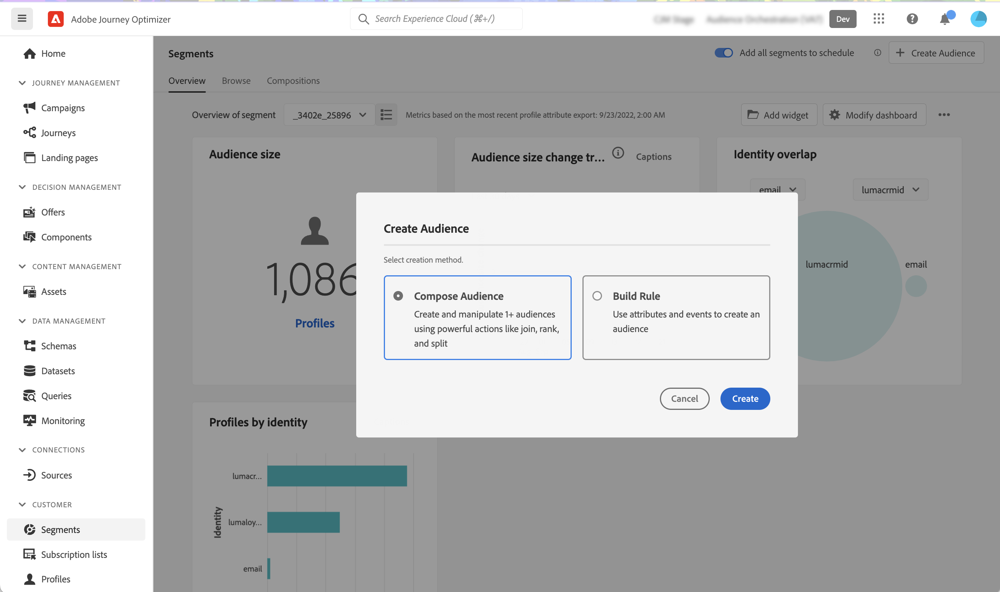

# 建立合成工作流程 {#create-compositions}

合成工作流程可讓您結合併排列現有對象以建立新對象。

## 建立合成工作流程 {#create}

1. 存取 **[!UICONTROL 區段]** 選取 **[!UICONTROL 建立對象]**.

1. 選擇 **[!UICONTROL 撰寫對象]**.

   >[!NOTE]
   >
   >此 **[!UICONTROL 建置規則]** 建立方法可讓您使用 [區段服務](https://experienceleague.adobe.com/docs/experience-platform/segmentation/ui/overview.html).

   

1. 合成畫布會顯示兩個預設活動：

   * **[!UICONTROL 對象]**:構圖的起點。 此活動可讓您選取一或多個對象，作為工作流程的基礎，

   * **[!UICONTROL 儲存]**:作品的最後一步。 此活動可讓您將工作流程的結果儲存至新對象。
   有關如何在合成工作流程畫布中配置活動的詳細資訊，請參閱 [使用合成畫布](composition-canvas.md).

1. 選取 **[!UICONTROL 對象]** 活動，然後指定合成的標籤。

   >[!IMPORTANT]
   >
   >此 **[!UICONTROL 對象]** 活動標籤是合成的標籤。 請務必提供有意義的名稱，以便更輕鬆地在清單中擷取構圖。

   

1. 視需要在 **[!UICONTROL 對象]** 和 **[!UICONTROL 儲存]** 活動。 [了解如何使用構圖畫布](composition-canvas.md)

   

1. 當您的構圖準備就緒後，按一下 [**!UICONTROL發佈]**按鈕，發佈構圖並將產生的對象儲存至Adobe Experience Platform。

   如果發佈期間發生任何錯誤，則會顯示警報，其中包含如何解決問題的資訊。

   

1. 作文已發佈。 產生的對象會儲存至Adobe Experience Platform。 <!-- and are ready to be targeted in Journey Optimizer campaigns. [Get started with campaigns](../campaigns/get-started-with-campaigns.md)-->

## 存取組合物 {#access}

>[!CONTEXTUALHELP]
>id="ajo_ao_publish"
>title="發佈您的對象"
>abstract="發佈您的構圖，將產生的受眾儲存至Adobe Experience Platform。"

所有建立的組合皆可從 **[!UICONTROL 組合物]** 標籤。 它們可以有多種狀態：

* **[!UICONTROL 草稿]**:該構成正在進行中，尚未公佈。
* **[!UICONTROL 已發佈]**:已發佈合成，因此已儲存對象。 <!-- and are available for use.-->
* **[!UICONTROL 已封存]**:已封存了構圖。

>[!NOTE]
>
>您可以隨時使用清單中的橢圓按鈕複製或刪除現有合成。

更多詳情:

* [開始使用受眾構成](get-started-audience-orchestration.md)
* [使用合成畫布](composition-canvas.md)
* [存取及管理對象](access-audiences.md)
