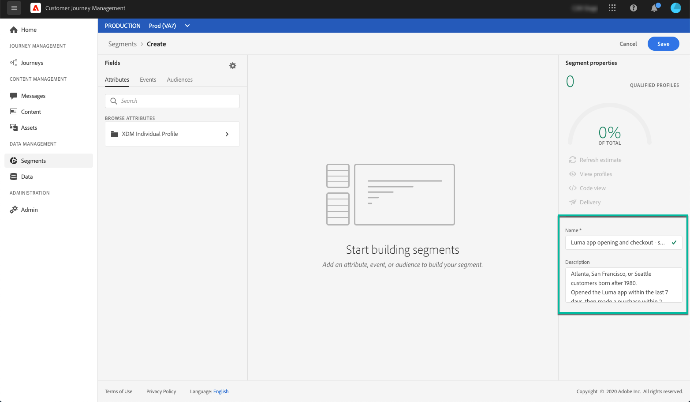

# 建立區段 {#build-segments}

在此範例中，我們將建立一個區段來鎖定居住在亞特蘭大、舊金山或西雅圖且在1980年後出生的所有客戶。 所有這些客戶應在過去7天內開啟Luma應用程式，然後在開啟應用程式後2小時內購買。

1. 訪問&#x200B;**[!UICONTROL Segments]**&#x200B;菜單，然後按一下&#x200B;**[!UICONTROL Create segment]**&#x200B;按鈕。

   

   區段定義畫面可讓您設定所有必填欄位來定義區段。 了解如何在[分段服務檔案](https://experienceleague.adobe.com/docs/experience-platform/segmentation/ui/overview.html){target=&quot;_blank&quot;}中設定區段。

   

1. 在&#x200B;**[!UICONTROL Segment properties]**&#x200B;窗格中，提供區段的名稱和說明（選用）。

   

1. 將需要的欄位從左窗格拖曳至中央工作區，然後根據您的需求進行設定。

   >[!NOTE]
   >
   >請注意，左窗格中的可用欄位會依貴組織的&#x200B;**XDM個別設定檔**&#x200B;和&#x200B;**XDM ExperienceEvent**&#x200B;結構設定方式而有所不同。  如需詳細資訊，請參閱[Experience Data Model(XDM)檔案](https://experienceleague.adobe.com/docs/experience-platform/xdm/home.html?lang=zh-Hant){target=&quot;_blank&quot;}。

   

   在此範例中，我們需要仰賴&#x200B;**Attributes**&#x200B;和&#x200B;**Events**&#x200B;欄位來建立區段：

   * **屬性**:1980年後出生在亞特蘭大、舊金山或西雅圖的個人檔案

      

   * **事件**:過去7天內開啟Luma應用程式，然後在開啟應用程式後2小時內購買的設定檔。

      

1. 當您新增和設定工作區中的新欄位時，會自動更新&#x200B;**[!UICONTROL Segment Properties]**&#x200B;窗格，其中包含屬於區段之預估設定檔的資訊。

   

1. 區段準備就緒後，按一下&#x200B;**[!UICONTROL Save]**。 它會顯示在Adobe Experience Platform區段清單中。 請注意，搜尋列可協助您搜尋清單中的特定區段。

區段現在可用於您的歷程。 如需詳細資訊，請參閱[本章節](../segment/about-segments.md)。

## 教學課程影片{#create-segment-video}

>[!VIDEO](https://video.tv.adobe.com/v/334281?quality=12)
