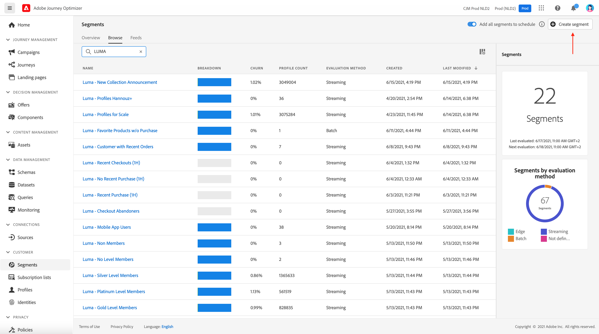

# 建立區段 {#build-segments}

在此示例中，我們將構建一個細分市場，以1980年後出生的所有居住在亞特蘭大、舊金山或西雅圖的客戶為目標。 所有這些客戶應在過去7天內開啟Luma應用程式，然後在開啟應用程式後2小時內進行購買。

1. 訪問 **[!UICONTROL Segments]** ，然後按一下 **[!UICONTROL Create segment]** 按鈕

   

   段定義螢幕允許您配置所有必需欄位以定義段。 瞭解如何在 [分段服務文檔](https://experienceleague.adobe.com/docs/experience-platform/segmentation/ui/overview.html){target=&quot;_blank&quot;}。

   

1. 在 **[!UICONTROL Segment properties]** 框中，為段提供名稱和說明（可選）。

   

1. 將所需欄位從左窗格拖放到中心工作區中，然後根據需要配置它們。

   >[!NOTE]
   >
   >請注意，左窗格中的可用欄位因 **XDM個人配置檔案** 和 **XDM體驗事件** 已為您的組織配置了架構。  在 [體驗資料模型(XDM)文檔](https://experienceleague.adobe.com/docs/experience-platform/xdm/home.html?lang=zh-Hant){target=&quot;_blank&quot;}。

   

   在這個例子中，我們需要依靠 **屬性** 和 **事件** 要構建段的欄位：

   * **屬性**:1980年後出生在亞特蘭大、舊金山或西雅圖的檔案

      

   * **事件**:在過去7天內開啟Luma應用程式的配置檔案，然後在開啟應用程式後2小時內進行購買。

      

1. 在工作區中添加和配置新欄位時， **[!UICONTROL Segment Properties]** 窗格會自動更新，其中包含屬於段的估計配置檔案的資訊。

   

1. 段準備好後，按一下 **[!UICONTROL Save]**。 它顯示在Adobe Experience Platform段清單中。 請注意，搜索欄可幫助您搜索清單中的特定段。

此段現在可用於您的行程。 如需詳細資訊，請參閱[本章節](../segment/about-segments.md)。

## 教程視頻{#create-segment-video}

>[!VIDEO](https://video.tv.adobe.com/v/334281?quality=12)
