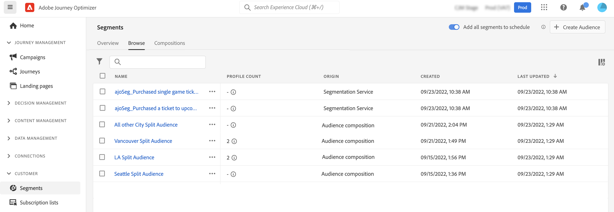

# 開始使用對象組合 {#get-start-audience-composition}

>[!CONTEXTUALHELP]
>id="ajo_ao_create_composition"
>title="建立合成"
>abstract="建立合成工作流程，將現有的Adobe Experience Platform對象結合至視覺畫布，並運用各種活動（分割、排除……）來建立新對象。"

>[!BEGINSHADEBOX]

本檔案提供下列內容：

* **[開始使用對象組合](get-started-audience-orchestration.md)**
* [建立您的第一個合成工作流程](create-compositions.md)
* [使用組合畫布](composition-canvas.md)
* [存取及管理對象](access-audiences.md)

>[!ENDSHADEBOX]

>[!AVAILABILITY]
>
>受眾構成目前僅以私人測試版形式提供，且可能會經常更新，恕不另行通知。 測試版是在IMS組織層級布建，這表示會影響組織內的所有沙箱。

對象構成可讓您建立 **組成工作流程**，您可以將現有的Adobe Experience Platform對象結合至視覺畫布，並運用各種活動（分割、排除……）來建立新對象。

完成後， **產生的對象** 與現有對象一起儲存至Adobe Experience Platform，而且 **在行銷活動中運用** 來鎖定客戶。 [了解如何使用行銷活動](../campaigns/get-started-with-campaigns.md)

>[!IMPORTANT]
>
>合成工作流程產生的對象只能鎖定在Journey Optimizer促銷活動中。 它們無法用於歷程。

可從Adobe Journey Optimizer存取受眾構成 **[!UICONTROL 區段]** 功能表：

* 此 **[!UICONTROL 概述]** 索引標籤提供與您組織的區段資料相關的關鍵量度專用控制面板。 若要進一步了解，請參閱 [Adobe Experience Platform控制面板指南](https://experienceleague.adobe.com/docs/experience-platform/dashboards/guides/segments.html).

* 此 **[!UICONTROL 瀏覽]** 索引標籤會列出儲存至Adobe Experience Platform的所有現有對象。

* 此 **[!UICONTROL 組合物]** 標籤可讓您建立構圖工作流程，在其中結合和排列對象以建立新對象。

按一下每張卡片，了解如何使用受眾構成：

<table style="table-layout:fixed"><tr style="border: 0;">
<td>

<a href="create-compositions.md"><strong>建立您的第一個合成工作流程</strong></a>
</td>
<td>

<a href="composition-canvas.md"><strong>使用組合畫布</strong></a>
</td>
<td>

<a href="access-audiences.md"><strong>存取及管理對象</strong></a>
</td>
</tr></table>
