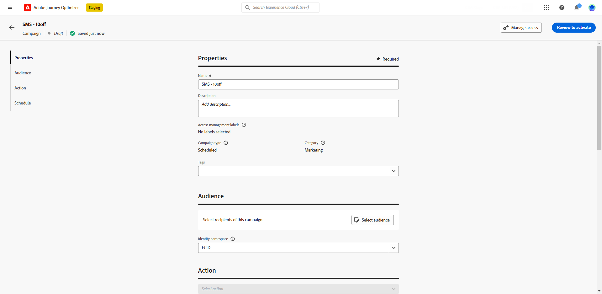

# 建立簡訊訊息 {#create-sms}

>[!CONTEXTUALHELP]
>id="ajo_message_sms"
>title="建立簡訊訊息"
>abstract="新增您的簡訊並開始使用運算式編輯器對其進行個人化。"

## 新增簡訊訊息 {#create-sms-journey-campaign}

瀏覽下列標籤，瞭解如何在行銷活動或歷程中新增SMS訊息。

>[!BEGINTABS]

>[!TAB 將SMS訊息新增至歷程]

1. 開啟您的歷程，然後從拖放簡訊活動 **動作** 區段。

   

1. 提供訊息的基本資訊（標籤、說明、類別），然後選擇要使用的訊息介面。

   

   有關如何設定歷程的詳細資訊，請參閱 [此頁面](../building-journeys/journey-gs.md)

   此 **[!UICONTROL 表面]** 依預設，欄位會預先填入使用者用於該管道的最後一個表面。

您現在可以從以下網址開始設計簡訊的內容： **[!UICONTROL 編輯內容]** 按鈕。 [定義您的簡訊內容](#sms-content)

>[!TAB 新增簡訊至行銷活動]

1. 建立新的排程或API觸發的行銷活動，選取 **[!UICONTROL 簡訊]** 作為您的動作，然後選擇 **[!UICONTROL 應用程式表面]** 以使用。 [進一步瞭解簡訊設定](sms-configuration.md).

   

1. 按一下&#x200B;**[!UICONTROL 建立]**。

1. 從 **[!UICONTROL 屬性]** 區段，編輯您的行銷活動 **[!UICONTROL 標題]** 和 **[!UICONTROL 說明]**.

   

1. 按一下 **[!UICONTROL 選取對象]** 按鈕，從可用的Adobe Experience Platform對象清單定義要定位的對象。 [了解更多](../audience/about-audiences.md)。

1. 在 **[!UICONTROL 身分名稱空間]** 欄位，選擇要使用的名稱空間，以識別所選對象中的個人。 [了解更多](../event/about-creating.md#select-the-namespace)。

   

1. 按一下 **[!UICONTROL 建立實驗]** 開始設定內容實驗並建立處理方式，以測量其效能並識別目標對象的最佳選項。 [了解更多](../campaigns/content-experiment.md)

1. 在 **[!UICONTROL 動作追蹤]** 區段，指定您是否想要追蹤SMS訊息中連結的點按。

1. 行銷活動旨在特定日期或循環頻率執行。 瞭解如何設定 **[!UICONTROL 排程]** 中的行銷活動 [本節](../campaigns/create-campaign.md#schedule).

1. 從 **[!UICONTROL 動作觸發程式]** 功能表，選擇 **[!UICONTROL 頻率]** SMS訊息的：

   * 一次
   * 每日
   * 每週
   * 月

您現在可以從以下網址開始設計簡訊的內容： **[!UICONTROL 編輯內容]** 按鈕。 [設計您的簡訊內容](#sms-content)

>[!ENDTABS]

## 定義您的簡訊內容{#sms-content}

>[!CONTEXTUALHELP]
>id="ajo_message_sms_content"
>title="定義您的簡訊內容"
>abstract="透過使用運算式編輯器定義內容並結合動態元素，自訂與個人化簡訊訊息。"

1. 在歷程或行銷活動設定畫面中，按一下 **[!UICONTROL 編輯內容]** 按鈕以設定簡訊內容。

1. 按一下 **[!UICONTROL 訊息]** 欄位以開啟運算式編輯器。

   

1. 使用運算式編輯器來定義內容及新增動態內容。 您可以使用任何屬性，例如設定檔名稱或城市。 進一步瞭解 [個人化](../personalization/personalize.md) 和 [動態內容](../personalization/get-started-dynamic-content.md) 在運算式編輯器中。

1. 定義內容後，您可以將追蹤URL新增至訊息。 若要這麼做，請存取 **[!UICONTROL 輔助函式]** 功能表並選取 **[!UICONTROL 協助程式]**.

   請注意，若要使用URL縮短功能，您必須先設定子網域，然後將其連結至您的表面。 [了解更多](sms-subdomains.md)

   >[!CAUTION]
   >
   > 若要存取及編輯SMS子網域，您必須擁有 **[!UICONTROL 管理SMS子網域]** 生產沙箱的許可權。

   

1. 在 **[!UICONTROL 輔助函式]** 功能表，按一下 **[!UICONTROL URL函式]** 然後選取 **[!UICONTROL 新增URL]**.

   

1. 在 `originalUrl` 欄位，貼上您要縮短的URL並按一下 **[!UICONTROL 儲存]**.

1. 啟用MMS選項以將媒體新增到您的SMS內容。

   MMS隨附下列幾項限制 [此頁面](../start/guardrails.md#sms-guardrails).

   >[!NOTE]
   >
   > MMS選項僅適用於Sinch。 您需要建立特定的API認證才能建立MMS。 [了解更多](sms-configuration.md#create-new-api)

   

1. 新增 **[!UICONTROL 標題]** 至您的媒體。

1. 在「 」中輸入媒體的URL **[!UICONTROL 媒體]** 欄位。

   

1. 按一下「**[!UICONTROL 儲存]**」並在預覽中查看您的訊息。您可以使用 **[!UICONTROL 模擬內容]** 以預覽您縮短的URL或個人化內容。

   

您現在可以測試並傳送簡訊給對象。 [瞭解更多](send-sms.md)
傳送後，您可以在行銷活動或歷程報告中測量簡訊的影響。 如需報告的詳細資訊，請參閱[本區段](../reports/campaign-global-report.md#sms-tab)。

>[!NOTE]
>
>根據行業標準及法規，所有簡訊行銷訊息都必須包含讓收件者輕鬆取消訂閱的方式。 要執行此操作，簡訊收件者可以使用選擇加入和選擇退出關鍵字進行回覆。 [瞭解如何管理選擇退出](../privacy/opt-out.md#sms-opt-out-management-sms-opt-out-management)

**相關主題**

* [預覽、測試和傳送您的SMS訊息](send-sms.md)
* [設定簡訊頻道](sms-configuration.md)
* [簡訊報告](../reports/journey-global-report.md#sms-global)
* [在歷程中新增訊息](../building-journeys/journeys-message.md)
* [在行銷活動中新增訊息](../campaigns/create-campaign.md)
