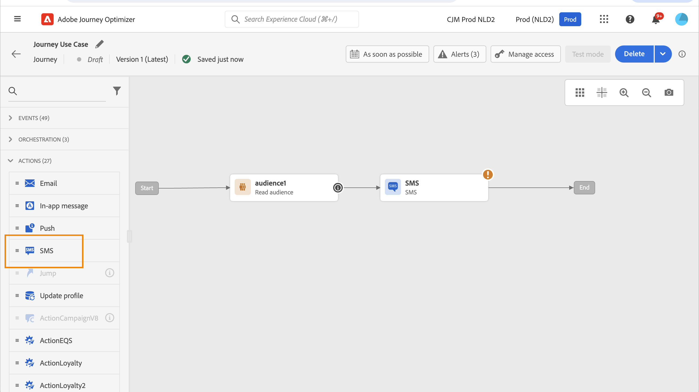
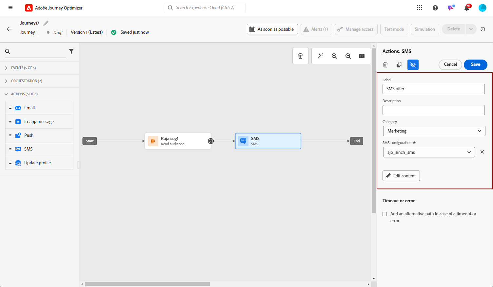
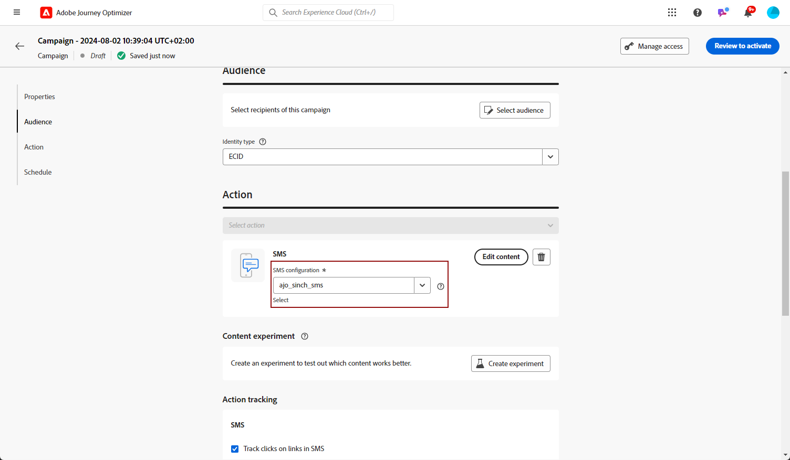
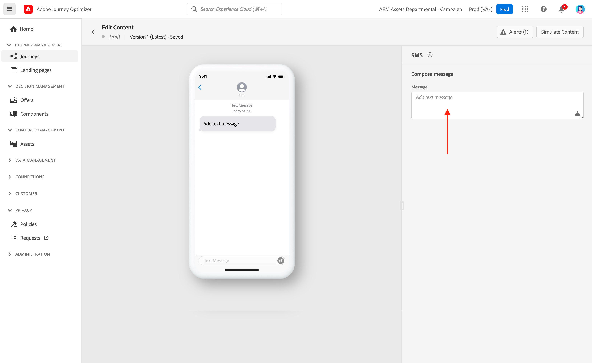
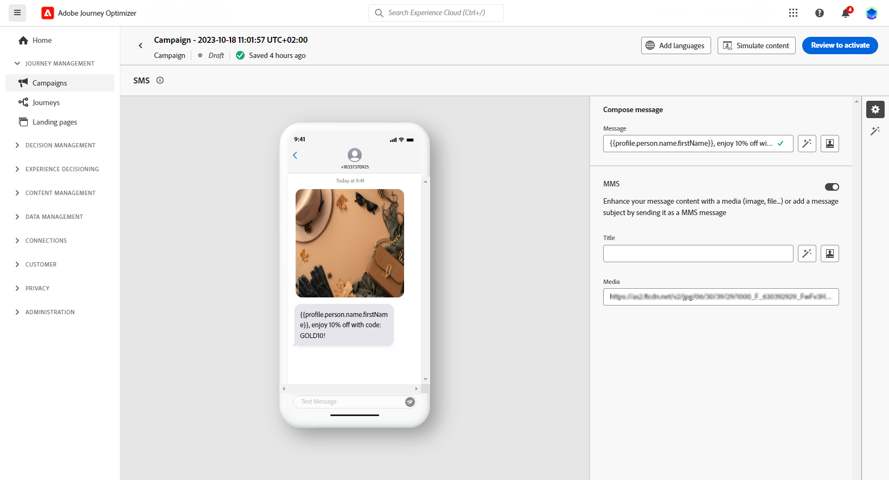

# 建立簡訊/MMS/RCS 訊息 {#create-sms}

>[!CONTEXTUALHELP]
>id="ajo_message_sms"
>title="建立文字訊息。"
>abstract="若要建立文字訊息 (簡訊/MMS/RCS)，請在歷程或行銷活動中新增簡訊動作，然後使用個人化編輯器開始對其進行個人化設定。"

您可以使用Adobe Journey Optimizer設計和傳送文字(SMS)、豐富通訊(RCS)和多媒體(MMS)訊息。 您首先需要在歷程或行銷活動中新增SMS動作，然後定義文字訊息的內容，如下所述。 Adobe Journey Optimizer也提供在傳送文字訊息前先測試訊息的功能，讓您可檢查轉譯、個人化屬性和所有其他設定。

>[!NOTE]
>
>根據業界標準及法規，所有簡訊/多媒體簡訊行銷訊息都必須包含讓收件者輕鬆取消訂閱的方式。 要執行此操作，簡訊收件者可以使用選擇加入和選擇退出關鍵字進行回覆。 [瞭解如何管理選擇退出](../privacy/opt-out.md#sms-opt-out-management-sms-opt-out-management)

## 新增文字訊息 {#create-sms-journey-campaign}

瀏覽下方的索引標籤，瞭解如何在行銷活動或歷程中新增文字訊息(SMS/MMS/RCS)。

>[!BEGINTABS]

>[!TAB 新增簡訊至歷程]

1. 開啟您的歷程，然後從浮動視窗的&#x200B;**動作**&#x200B;區段拖放簡訊活動。

   

1. 提供訊息的基本資訊（標籤、說明、類別），然後選擇要使用的訊息設定。

   

   如需如何設定歷程的詳細資訊，請參閱[此頁面](../building-journeys/journey-gs.md)

   根據預設，**[!UICONTROL 組態]**&#x200B;欄位會預先填入使用者用於該頻道的最後一個組態。

您現在可以從&#x200B;**[!UICONTROL 編輯內容]**&#x200B;按鈕開始設計SMS訊息的內容，如下所述。

>[!TAB 新增簡訊至行銷活動]

1. 存取&#x200B;**[!UICONTROL 促銷活動]**&#x200B;功能表，然後按一下&#x200B;**[!UICONTROL 建立促銷活動]**。

1. 選取您要執行的行銷活動型別

   * **已排程 — 行銷**：立即或在指定日期執行行銷活動。 已排程的行銷活動旨在傳送行銷訊息。 可從使用者介面設定及執行。

   * **API觸發 — 行銷/異動**：使用API呼叫執行行銷活動。 API觸發的行銷活動旨在傳送行銷或交易式訊息，也就是在個人執行動作後傳送的訊息：密碼重設、購物車購買等。

1. 從&#x200B;**[!UICONTROL 屬性]**&#x200B;區段，編輯行銷活動的&#x200B;**[!UICONTROL 標題]**&#x200B;和&#x200B;**[!UICONTROL 描述]**。

1. 按一下&#x200B;**[!UICONTROL 選取對象]**&#x200B;按鈕，從可用的Adobe Experience Platform對象清單中定義要定位的對象。 [了解更多](../audience/about-audiences.md)。

1. 在&#x200B;**[!UICONTROL 身分識別名稱空間]**&#x200B;欄位中，選擇要使用的名稱空間，以識別所選對象中的個人。 [了解更多](../event/about-creating.md#select-the-namespace)。

1. 在&#x200B;**[!UICONTROL 動作]**&#x200B;區段中，選擇&#x200B;**[!UICONTROL 簡訊]**，然後選取或建立新的設定。

   在[此頁面](sms-configuration.md)上進一步瞭解SMS設定。

   

1. 按一下&#x200B;**[!UICONTROL 建立實驗]**&#x200B;以開始設定您的內容實驗，並建立處理以測量其效能，並為您的目標對象識別最佳選項。 [了解更多](../content-management/content-experiment.md)

1. 在&#x200B;**[!UICONTROL 動作追蹤]**&#x200B;區段中，指定您是否想要追蹤簡訊訊息中連結的點按次數。

1. 行銷活動旨在特定日期或循環頻率執行。 在&#x200B;**[!UICONTROL 本節]**&#x200B;中瞭解如何設定行銷活動的[排程](../campaigns/create-campaign.md#schedule)。

1. 從&#x200B;**[!UICONTROL 動作觸發程式]**&#x200B;功能表，選擇SMS訊息的&#x200B;**[!UICONTROL 頻率]**：

   * 一次
   * 每日
   * 每週
   * Month

您現在可以從&#x200B;**[!UICONTROL 編輯內容]**&#x200B;按鈕開始設計文字訊息的內容，如下所述。

>[!ENDTABS]

## 定義您的簡訊/RCS 內容{#sms-content}

>[!CONTEXTUALHELP]
>id="ajo_message_sms_content"
>title="定義您的簡訊內容"
>abstract="透過使用個人化編輯器定義內容並結合動態元素，自訂和個人化文字訊息 (簡訊/MMS/RCS)。"

若要設定訊息內容，請遵循下列步驟。 MMS的設定在[本節](#mms-content)中有詳細說明。

1. 在歷程或行銷活動設定畫面中，按一下&#x200B;**[!UICONTROL 編輯內容]**&#x200B;按鈕以設定文字訊息內容。

1. 按一下&#x200B;**[!UICONTROL 訊息]**&#x200B;欄位以開啟個人化編輯器。

   針對使用Infobip、Twilio或其他協力廠商提供者的RCS傳訊，請將必要的JSON裝載貼入您的[自訂SMS設定](sms-configuration-custom.md#api-credential)。

   

1. 使用個人化編輯器來定義內容、新增個人化和動態內容。 您可以使用任何屬性，例如設定檔名稱或城市。 您也可以定義條件式規則。 瀏覽下列頁面，瞭解個人化編輯器中[個人化](../personalization/personalize.md)和[動態內容](../personalization/get-started-dynamic-content.md)的詳細資訊。

1. 定義內容後，您可以將追蹤的URL新增至訊息。 若要這麼做，請存取&#x200B;**[!UICONTROL 協助程式功能]**&#x200B;功能表，然後選取&#x200B;**[!UICONTROL 協助程式]**。

   請注意，若要使用URL縮短功能，您必須先設定子網域，然後再將其連結至您的設定。 [了解更多](sms-subdomains.md)

   >[!NOTE]
   >
   > 若要存取及編輯SMS子網域，您必須對生產沙箱具有&#x200B;**[!UICONTROL 管理SMS子網域]**&#x200B;許可權。 若要了解更多關於權限的資訊，請參閱[此區段](../administration/high-low-permissions.md)。

   

1. 在&#x200B;**[!UICONTROL 協助程式函式]**&#x200B;功能表中，按一下&#x200B;**[!UICONTROL URL函式]**，然後選取&#x200B;**[!UICONTROL 新增URL]**。

   

   <!--The URL shortening function cannot be used within a fragment. TBC-->

1. 在`originalUrl`欄位中，貼上您要縮短的URL，然後按一下&#x200B;**[!UICONTROL 儲存]**。

   >[!CAUTION]
   >
   > 短URL的生命週期設為15天。 在此期間之後，將無法再存取這些短URL，且會顯示訊息： `404 short-code not found`。

1. 按一下&#x200B;**[!UICONTROL 儲存]**，然後在預覽中檢查您的訊息。 您現在可以測試並檢查您的訊息內容，如[本節](#sms-mms-test)所詳述。

## 定義多媒體簡訊內容{#mms-content}

您可以透過傳送多媒體訊息服務(MMS)訊息、啟用視訊、圖片、音訊剪輯和GIF等媒體共用，來增強您的通訊能力。 此外，MMS最多可在您的訊息中使用1600個字元文字。

>[!NOTE]
>
> MMS頻道在[此頁面](../start/guardrails.md#sms-guardrails)上提供一些限制。

若要建立MMS內容，請遵循下列步驟：

1. 建立簡訊，如[本節](#create-sms-journey-campaign)所述。

1. 編輯您的SMS內容，如[此區段](#sms-content)中所詳述。

1. 啟用MMS選項以將媒體新增到您的SMS內容。

   

1. 將&#x200B;**[!UICONTROL 標題]**&#x200B;新增至您的媒體。

1. 在&#x200B;**[!UICONTROL 媒體]**&#x200B;欄位中輸入您的媒體URL。

   

1. 按一下&#x200B;**[!UICONTROL 儲存]**，然後在預覽中檢查您的訊息。 您現在可以測試和檢查您的訊息內容，如下所述。

## 測試並傳送您的訊息 {#sms-mms-test}

使用&#x200B;**[!UICONTROL 模擬內容]**&#x200B;按鈕來預覽您的文字訊息內容、縮短的URL和個人化內容。

執行測試並驗證內容後，您就可以傳送簡訊給對象。 這些步驟在[此頁面](send-sms.md)上詳細說明

傳送後，您可以在行銷活動或歷程報告中測量簡訊的影響。 如需報告的詳細資訊，請參閱[本區段](../reports/campaign-global-report-cja-sms.md)。

**相關主題**

* [預覽、測試並傳送您的文字訊息](send-sms.md)
* [設定簡訊頻道](sms-configuration.md)
* [簡訊/多媒體簡訊報告](../reports/journey-global-report-cja-sms.md)
* [在歷程中新增訊息](../building-journeys/journeys-message.md)
* [在行銷活動中新增訊息](../campaigns/create-campaign.md)
