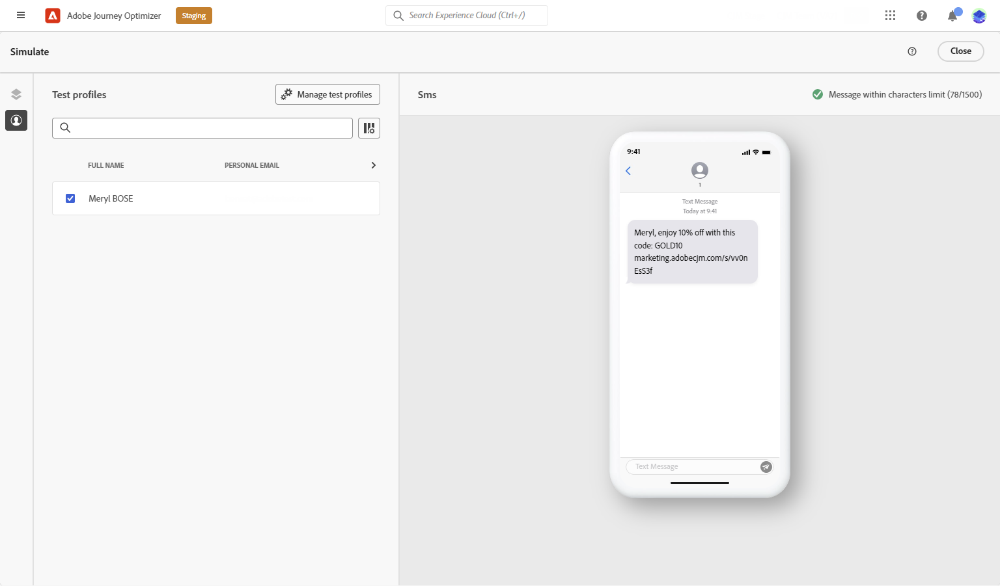

# 建立SMS訊息 {#create-sms}

>[!CONTEXTUALHELP]
>id="ajo_message_sms"
>title="簡訊建立"
>abstract="新增文字訊息，並開始使用運算式編輯器進行個人化。"

>[!NOTE]
>
>根據業界標準和法規，所有SMS行銷訊息都必須包含讓收件者輕鬆取消訂閱的方式。 若要這麼做，SMS收件者可以使用選擇加入和選擇退出關鍵字回覆。 [了解如何管理選擇退出](../privacy/opt-out.md#sms-opt-out-management-sms-opt-out-management)

## 在歷程或行銷活動中建立SMS訊息 {#create-sms-journey-campaign}

若要開始個人化SMS訊息，請遵循下列步驟：

>[!BEGINTABS]

>[!TAB 將SMS訊息新增至歷程]

1. 開啟您的歷程，然後從浮動視窗的「動作」區段拖放SMS活動。

   

1. 提供訊息的基本資訊（標籤、說明、類別），然後選擇要使用的訊息表面。

   

   如需如何設定歷程的詳細資訊，請參閱 [本頁](../building-journeys/journey-gs.md)

您現在可以開始從 **[!UICONTROL Edit content]** 按鈕。 [設計您的SMS內容](#sms-content)

>[!TAB 新增SMS訊息至促銷活動]

1. 建立新的排程或API觸發促銷活動，請選取 **[!UICONTROL SMS]** 作為您的動作，並選取 **[!UICONTROL App surface]** 來使用。 [進一步了解SMS設定](sms-configuration.md).

   

1. 按一下 **[!UICONTROL Create]**.

1. 從 **[!UICONTROL Properties]** 區段，編輯您的促銷活動 **[!UICONTROL Title]** 和 **[!UICONTROL Description]**.

   

1. 在 **[!UICONTROL Actions tracking]** 區段，指定是否要追蹤SMS訊息中連結的點按次數。

1. 按一下 **[!UICONTROL Select audience]** 按鈕，從可用的Adobe Experience Platform區段清單中定義要鎖定的對象。 [深入了解](../segment/about-segments.md).

1. 在 **[!UICONTROL Identity namespace]** 欄位中，選擇要使用的命名空間，以識別所選區段中的個人。 [深入了解](../event/about-creating.md#select-the-namespace).

   

1. 促銷活動設計為在特定日期或循環頻率上執行。 了解如何設定 **[!UICONTROL Schedule]** 在 [本節](../campaigns/create-campaign.md#schedule).

1. 從 **[!UICONTROL Action triggers]** 菜單，選擇 **[!UICONTROL Frequency]** 簡訊：

   * 一次
   * 每日
   * 每週
   * 月

您現在可以開始從 **[!UICONTROL Edit content]** 按鈕。 [設計您的SMS內容](#sms-content)

>[!ENDTABS]

## 定義您的SMS內容{#sms-content}

1. 在歷程或行銷活動設定畫面中，按一下 **[!UICONTROL Edit content]** 按鈕來設定SMS內容。

1. 按一下 **[!UICONTROL Message]** 欄位來開啟運算式編輯器。

   

1. 使用運算式編輯器來定義內容並新增動態內容。 您可以使用任何屬性，例如設定檔名稱或城市。 深入了解 [個人化](../personalization/personalize.md) 和 [動態內容](../personalization/get-started-dynamic-content.md) 在運算式編輯器中。

1. 按一下 **[!UICONTROL Save]** 並在預覽中檢查您的訊息。 [深入了解](send-sms.md)

   

**相關主題**

* [設定SMS通道](sms-configuration.md)
* [SMS報表](../reports/journey-global-report.md#sms-global)
* [在歷程中新增訊息](../building-journeys/journeys-message.md)
