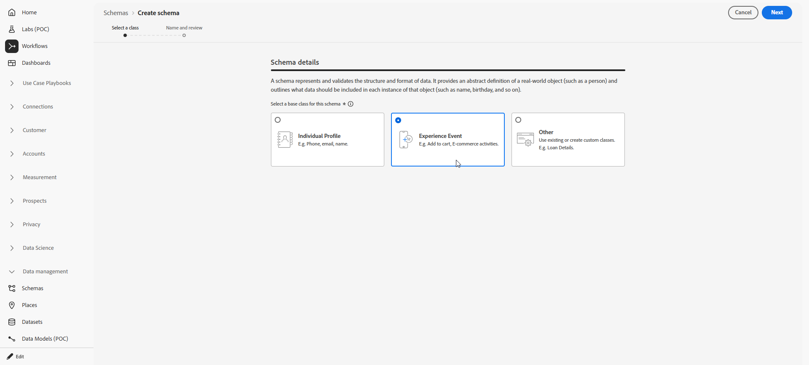

# 對傳入關鍵字使用自訂資料集 {#custom-dataset-inbound-keywords}

傳入簡訊關鍵字可以儲存在啟用設定檔的自訂資料集中。 此設定包含Adobe Experience Platform結構描述、從該結構描述建立的資料集，以及參照傳入訊息資料集的Journey Optimizer SMS API認證。

如需結構描述、欄位群組和資料集的背景，請參閱下列Adobe Experience Platform檔案：

* [XDM系統概覽](https://experienceleague.adobe.com/docs/experience-platform/xdm/home.html?lang=zh-Hant){target="_blank"}
* [結構描述構成的基礎知識](https://experienceleague.adobe.com/docs/experience-platform/xdm/schema/composition.html?lang=zh-Hant){target="_blank"}
* [資料集總覽](https://experienceleague.adobe.com/docs/experience-platform/catalog/datasets/overview.html?lang=zh-Hant){target="_blank"}

若要針對傳入關鍵字使用自訂資料集，您需要：

1. [建立結構描述](#create-schema)
1. [建立資料集](#create-dataset)
1. [設定API認證](#configure-api-credentials)

## 建立結構描述 {#create-schema}

結構描述會定義適用於已擷取資料的結構和驗證規則。 新增下列現有欄位群組，為傳入關鍵字集合撰寫體驗事件結構描述。

➡️ [在Adobe Experience Platform檔案中進一步瞭解結構描述建立](https://experienceleague.adobe.com/en/docs/experience-platform/xdm/schema/composition)

1. 在Adobe Experience Platform中，從&#x200B;**[!UICONTROL 資料管理]**，存取&#x200B;**[!UICONTROL 結構描述]**&#x200B;並選取&#x200B;**[!UICONTROL 建立結構描述]**。

   

1. 選擇&#x200B;**[!UICONTROL 標準結構描述]**。

1. 選取&#x200B;**[!UICONTROL 體驗事件]**。

   

1. 輸入結構描述的&#x200B;**[!UICONTROL 顯示名稱]**&#x200B;並按一下&#x200B;**[!UICONTROL 完成]**。

   結構會儲存並開啟結構編輯器中。

1. 開啟&#x200B;**[!UICONTROL 結構描述屬性]**&#x200B;並啟用&#x200B;**[!UICONTROL 設定檔]**&#x200B;的結構描述。

   

1. 在&#x200B;**[!UICONTROL 欄位群組]**&#x200B;中，新增這些現有的欄位群組：

   * [!DNL Adobe CJM ExperienceEvent - Message interaction details]
   * [!DNL Adobe CJM ExperienceEvent - Message Execution Details]
   * [!DNL Adobe CJM ExperienceEvent - Message Profile Details]

1. 按一下&#x200B;**[!UICONTROL 儲存]**。

## 建立資料集 {#create-dataset}

資料集是內嵌資料的儲存容器。 每個資料集都與一個結構描述相關聯，寫入資料集的記錄必須符合該結構描述。

1. 在Adobe Experience Platform中，從&#x200B;**[!UICONTROL 資料管理]**，存取&#x200B;**[!UICONTROL 資料集]**&#x200B;並選取&#x200B;**[!UICONTROL 建立資料集]**。

   

1. 選擇&#x200B;**[!UICONTROL 從結構描述建立資料集]**。

1. 選取在上一節中建立的結構描述，然後按一下[下一步] ****。

   

1. 輸入&#x200B;**[!UICONTROL 名稱]**&#x200B;並按一下&#x200B;**[!UICONTROL 完成]**。

1. 從&#x200B;**[!UICONTROL 資料活動]**&#x200B;索引標籤，啟用&#x200B;**[!UICONTROL 設定檔]**&#x200B;的資料。

   選取適合組織治理要求的&#x200B;**[!UICONTROL 資料保留]**&#x200B;原則。

   

1. 按一下&#x200B;**[!UICONTROL 儲存]**。

## 設定API認證 {#configure-api-credentials}

根據您的SMS提供者設定認證，使用[開始使用SMS / MMS / RCS設定](sms-configuration.md)。 然後完成下列步驟，以選取自訂的傳入資料集。

1. 在左側邊欄中，瀏覽至&#x200B;**[!UICONTROL 管理]** > **[!UICONTROL 管道]** `>` **[!UICONTROL SMS設定]**&#x200B;並選取&#x200B;**[!UICONTROL API認證]**&#x200B;功能表。 按一下&#x200B;**[!UICONTROL 建立新的API認證]**&#x200B;按鈕。

1. 根據您的提供者建立或編輯認證。

1. 啟用&#x200B;**[!UICONTROL 對傳入]**&#x200B;使用自訂資料集選項。

1. 選取在前一個區段中建立的&#x200B;**[!UICONTROL 資料集]**。

   

1. 完成任何剩餘的必要欄位，然後按一下[儲存]。****

   >[!NOTE]
   >
   >儲存API認證後，Journey Optimizer會驗證輸入關鍵字資料集是否已正確設定。 如果驗證失敗，錯誤訊息會指出必要的更正。

儲存認證後，傳出和傳入傳訊行為不會變更；該認證的傳入關鍵字會記錄在所選的自訂資料集中。
