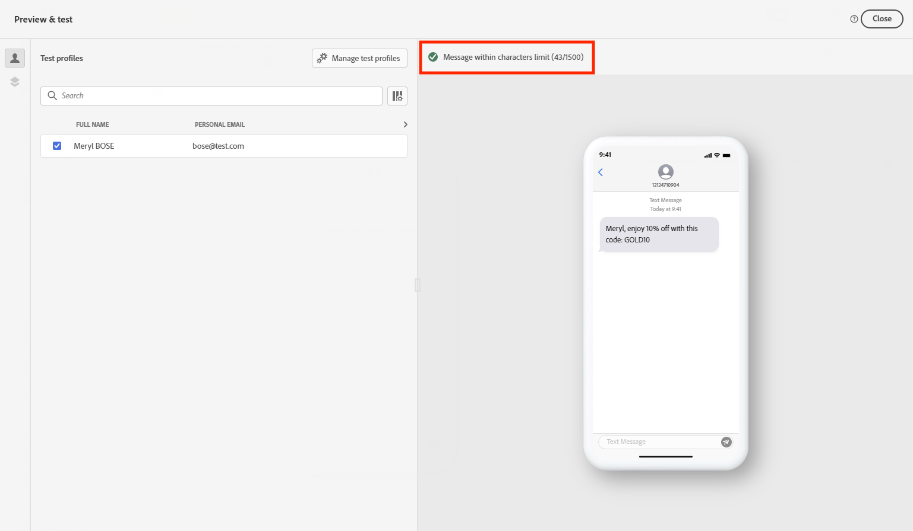

# 檢查並傳送您的簡訊（簡訊/多媒體簡訊）{#send-sms}

## 預覽您的文字訊息 {#preview-sms}

定義訊息內容後，您可以使用測試設定檔或範例輸入資料（從CSV/JSON檔案上傳或手動新增）來預覽其內容。 如果您已插入個人化內容，您可以檢查此內容在訊息中的顯示方式。

若要這麼做，請按一下&#x200B;**[!UICONTROL 模擬內容]**，然後使用測試設定檔資料檢查您的訊息。

有關如何預覽及測試內容的詳細資訊，請參閱[內容管理](../content-management/preview-test.md)區段。

### 字元編碼和限制 {#sms-character-limits}

存取&#x200B;**[!UICONTROL 模擬內容]**&#x200B;功能表時，會顯示字元計數，以協助規劃及管理您的SMS訊息。

Journey Optimizer在其SMS編輯器中使用UTF-8編碼，可讓您輸入或貼上雙位元組或Unicode字元。 然後這些字元會傳輸到服務提供者進行傳遞。 大部分的SMS提供者會針對具有160個字元限制的標準訊息使用GSM 7位元編碼，並在偵測到具有70個字元限制的非GSM字元時切換至UTF-16 (UCS-2)。

請注意，字元計數不會反映動態個人化或非GSM 7位元特殊字元引進的變數。

>[!IMPORTANT]
>
>Journey Optimizer SMS傳遞報告不會將串連訊息和動態個人化列入考量，因此可能無法反映提供者所傳送的實際訊息數量。 如需詳細使用情況和計費資訊，請聯絡您的Adobe代表。
>
>若要瞭解儘量降低SMS計費超額的最佳實務，請參閱[字元最佳化的SMS最佳實務](sms-cost-optimization.md)。

## 驗證您的內容 {#sms-validate}

您必須檢查編輯器上半區段的警示。 其中一些是簡單的警告，但其他警告可能會阻止您傳送訊息。 可能會發生兩種型別的警報：警告和錯誤。

* **警告**&#x200B;參考建議和最佳實務。 例如，如果您的文字訊息為空白，則會顯示警告訊息。

* **錯誤**&#x200B;會阻止您測試或啟動歷程，或發佈行銷活動，只要這些錯誤未解決。 例如，當主旨行遺失時，錯誤訊息會警告您。

>[!NOTE]
>
> 若要改善您的傳遞能力，請以提供者支援的格式使用電話號碼。 例如，Twilio和Sinch只支援E.164格式的電話號碼。

## 傳送您的簡訊 {#sms-send}

>[!IMPORTANT]
>
> 如果您的行銷活動受核准政策的約束，您將需要請求核准才能傳送您的文字訊息。 [了解更多](../test-approve/gs-approval.md)

當您的文字訊息準備就緒時，請完成[歷程](../building-journeys/journey-gs.md)或[行銷活動](../campaigns/create-campaign.md)的設定以傳送。

**相關主題**

* [設定簡訊頻道](sms-configuration.md)
* [簡訊/多媒體簡訊報告](../reports/journey-global-report-cja-sms.md)
* [建立文字訊息。](create-sms.md)
* [在歷程中新增訊息](../building-journeys/journeys-message.md)
