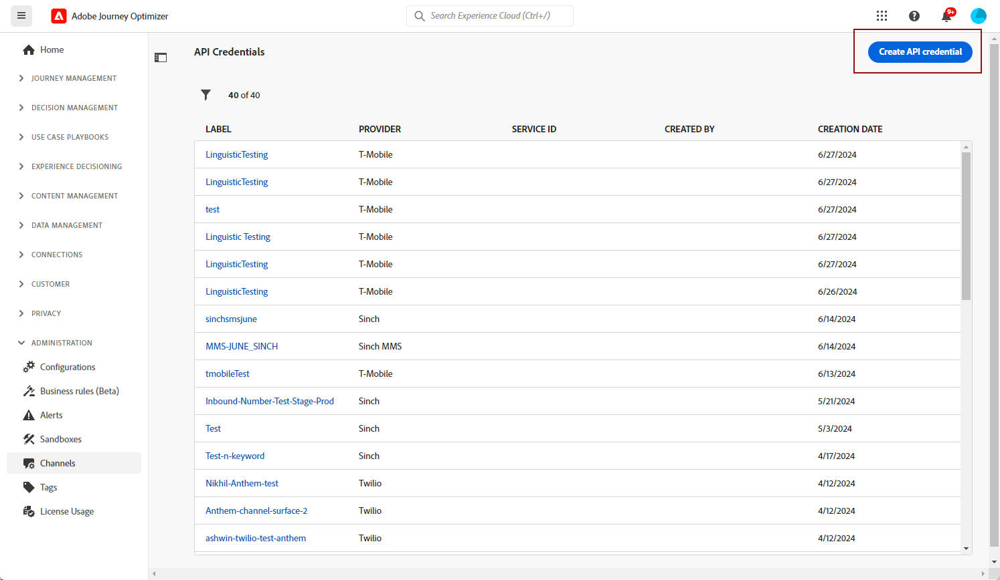
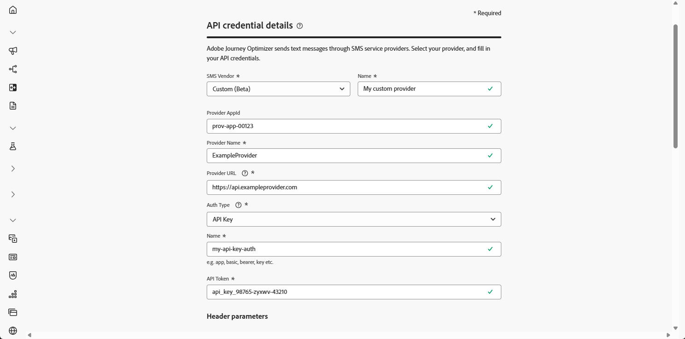
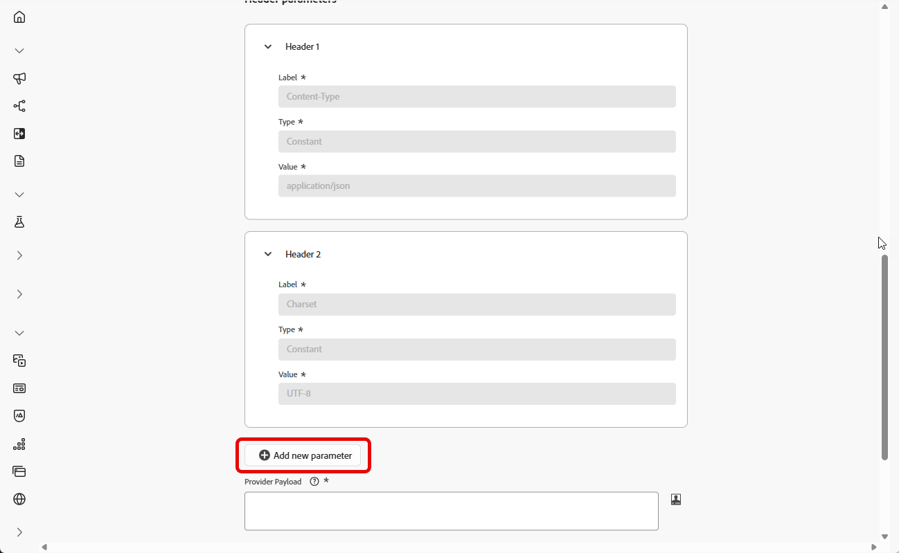
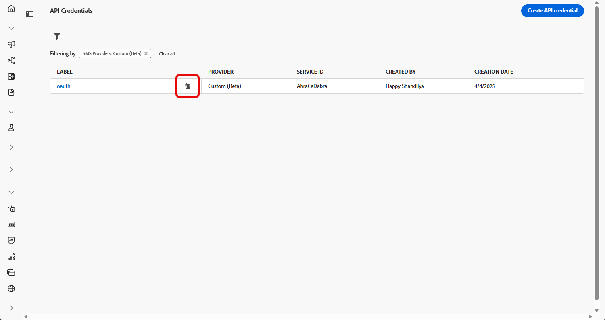
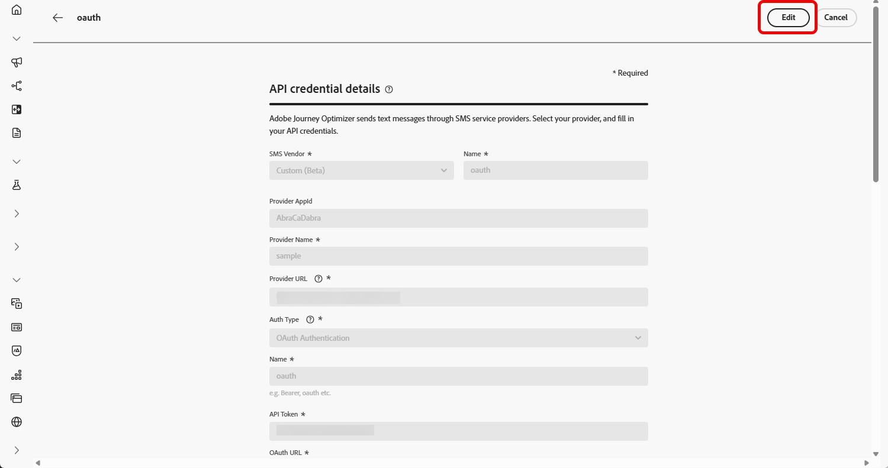
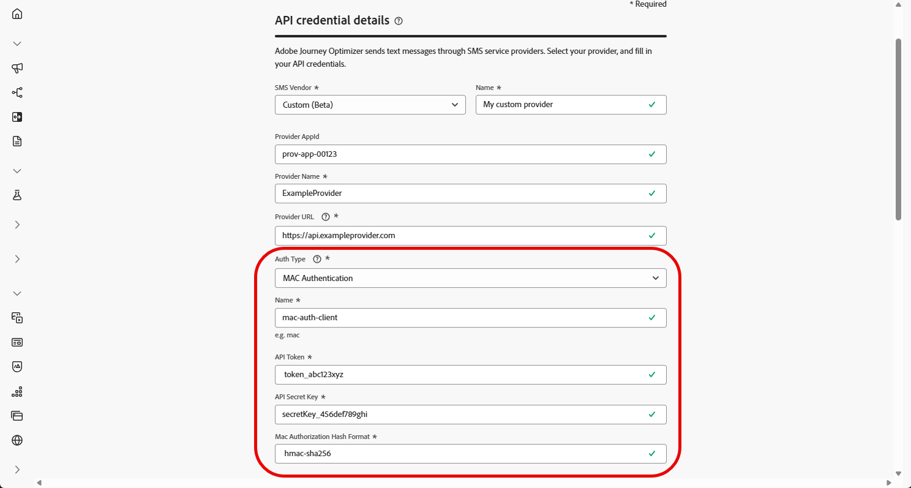
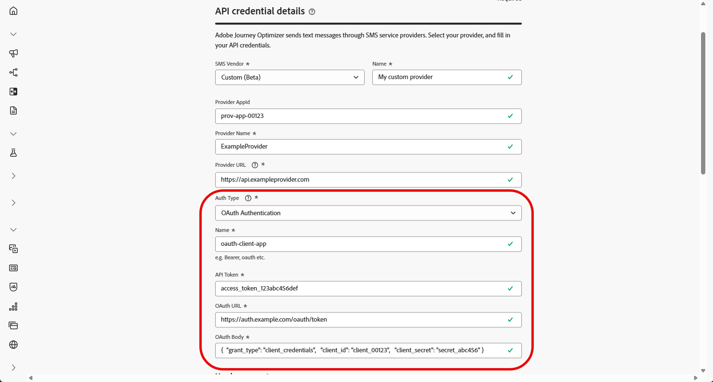
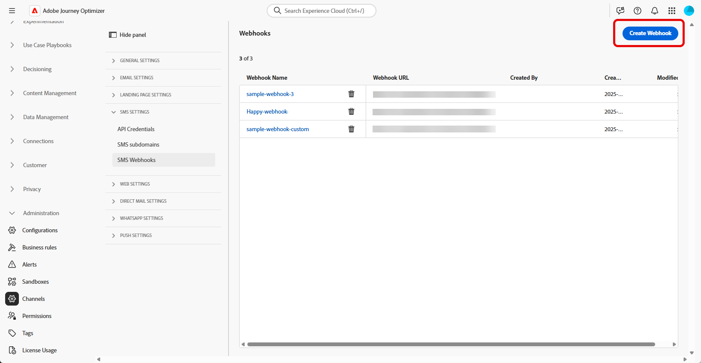
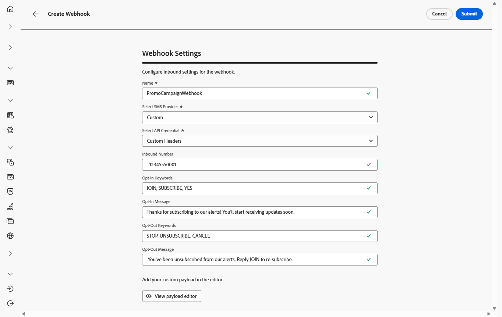
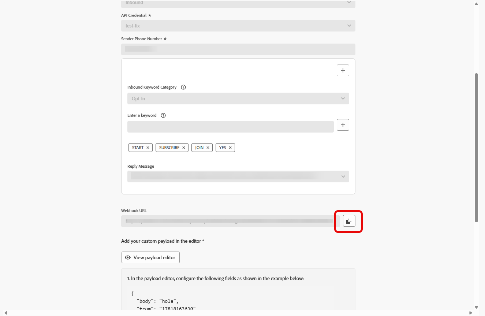

# 設定自訂提供者 {#sms-configuration-custom}

>[!CONTEXTUALHELP]
>id="ajo_admin_sms_api_byop_provider_url"
>title="提供者 URL"
>abstract="指定您計劃連線之外部 API 的 URL。此 URL 會做為存取 API 功能的端點。"

>[!CONTEXTUALHELP]
>id="ajo_admin_sms_api_byop_header_parameters"
>title="標頭參數"
>abstract="指定附加標頭的標籤、類型和值，以啟用正確的驗證、內容格式和有效的 API 通訊。 "

>[!CONTEXTUALHELP]
>id="ajo_admin_sms_api_byop_provider_payload"
>title="提供者承載"
>abstract="提供要求承載，確保能發送用於進行處理和產生回應的正確資料。"

此功能可讓您整合及設定自己的傳訊提供者，除了預設選項（Sinch、Twilio和Infobip）以外，還提供了彈性。 這可為SMS和RCS訊息實現順暢的撰寫、傳遞、報告和同意管理。

透過自訂提供者設定，您可以直接在Journey Optimizer中連線協力廠商傳訊服務、自訂動態內容的訊息裝載，以及管理選擇加入/選擇退出偏好設定，以確保在SMS和RCS通道間保持一致。

若要設定自訂提供者，請遵循下列步驟：

1. [建立API認證](#api-credential)
1. [建立 Webhook](#webhook)
1. [建立頻道設定](sms-configuration-surface.md)
1. [透過簡訊頻道動作建立歷程或行銷活動](create-sms.md)

## 建立您的API認證 {#api-credential}

若要使用Adobe現成未提供的自訂提供者（例如Sinch、Infobip、Twilio）在Journey Optimizer中傳送SMS和RCS訊息，請執行以下步驟：

1. 在左側邊欄中，瀏覽至&#x200B;**[!UICONTROL 管理]** `>` **[!UICONTROL 管道]**，選取&#x200B;**[!UICONTROL 簡訊設定]**&#x200B;下的&#x200B;**[!UICONTROL API認證]**&#x200B;功能表，然後按一下&#x200B;**[!UICONTROL 建立新的API認證]**&#x200B;按鈕。

   

1. 設定您的SMS API認證，如下所述：

   * **[!UICONTROL SMS供應商]**：自訂。

   * **[!UICONTROL 名稱]**：輸入您的API認證名稱。

   * **[!UICONTROL 提供者AppId]**：輸入您的SMS提供者提供的應用程式ID。

   * **[!UICONTROL 提供者名稱]**：輸入您的SMS提供者的名稱。

   * **[!UICONTROL 提供者URL]**：輸入簡訊提供者的URL。

   * **[!UICONTROL 驗證型別&#x200B;]**：選取您的授權型別，並根據選取的驗證方法[完成對應的欄位](#auth-options)。

     

1. 啟用&#x200B;**[!UICONTROL mTLS支援]**&#x200B;選項，以確保使用者端和伺服器在建立安全連線之前互相驗證。

   若要僅使用mTLS，請從&#x200B;**[!UICONTROL 驗證型別]**&#x200B;下拉式清單中選取&#x200B;**[!UICONTROL 無驗證]**，然後啟用&#x200B;**[!UICONTROL mTLS支援]**。

1. 在&#x200B;**[!UICONTROL 標頭]**&#x200B;區段中，按一下&#x200B;**[!UICONTROL 新增引數]**&#x200B;以指定將傳送給外部服務的要求訊息的HTTP標頭。

   **Content-Type**&#x200B;和&#x200B;**Charset**&#x200B;標頭欄位已預設設定，無法刪除。

   

1. 新增您的&#x200B;**[!UICONTROL 提供者裝載]**，以驗證及自訂您的要求裝載。

   對於RCS訊息，此承載稍後會在[內容設計](create-sms.md#sms-content)期間使用。

1. 完成API認證的設定時，請按一下&#x200B;**[!UICONTROL 提交]**。

1. 在&#x200B;**[!UICONTROL API認證]**&#x200B;功能表中，按一下以刪除您的API認證。

   

1. 若要修改現有認證，請找到所需的API認證，然後按一下&#x200B;**[!UICONTROL 編輯]**&#x200B;選項以進行必要的變更。

   

1. 從您現有的API認證按一下&#x200B;**[!UICONTROL 驗證SMS連線]**，透過傳送範例訊息至指定裝置來測試及驗證SMS API認證。

1. 填寫&#x200B;**數字**&#x200B;和&#x200B;**訊息**&#x200B;欄位，然後按一下&#x200B;**[!UICONTROL 驗證連線]**。

   >[!IMPORTANT]
   >
   >訊息的結構必須符合提供者的裝載格式。

   

在建立及設定您的API認證後，您現在需要為Webhook[設定](#webhook)簡訊的傳入設定。

### 自訂 SMS 提供者的驗證選項 {#auth-options}

>[!CONTEXTUALHELP]
>id="ajo_admin_sms_api_byop_auth_type"
>title="驗證類型"
>abstract="指定存取此 API 所需的驗證方法，可確保與外部服務進行安全且獲授權的通訊。"

>[!BEGINTABS]

>[!TAB API金鑰]

建立API認證後，請完成API金鑰驗證所需的欄位：

* **[!UICONTROL 名稱]**&#x200B;：輸入API金鑰組態的名稱。
* **[!UICONTROL API Token]**&#x200B;：輸入您的SMS提供者提供的API Token。

>[!TAB MAC驗證]

建立API認證後，請完成MAC驗證所需的欄位：

* **[!UICONTROL 名稱]**&#x200B;：輸入MAC驗證組態的名稱。
* **[!UICONTROL API Token]**&#x200B;：輸入您的SMS提供者提供的API Token。
* **[!UICONTROL API秘密金鑰]**：輸入您的SMS提供者提供的API秘密金鑰。 此金鑰用於產生MAC （訊息驗證代碼），以進行安全通訊。
* **[!UICONTROL Mac授權雜湊格式]**：選擇MAC驗證的雜湊格式。

>[!TAB OAuth驗證]

建立API認證後，請完成OAuth驗證所需的欄位：

* **[!UICONTROL 名稱]**&#x200B;：輸入您OAuth驗證組態的名稱。

* **[!UICONTROL API Token]**&#x200B;：輸入您的SMS提供者提供的API Token。

* **[!UICONTROL OAuth URL]**&#x200B;：輸入用於取得OAuth權杖的URL。

* **[!UICONTROL OAuth內文]**&#x200B;：提供JSON格式的OAuth要求內文，包括`grant_type`、`client_id`和`client_secret`等引數。

>[!TAB JWT驗證]

建立API認證後，請完成JWT驗證所需的欄位：

* **[!UICONTROL 名稱]**&#x200B;：輸入JWT驗證組態的名稱。

* **[!UICONTROL API Token]**&#x200B;：輸入您的SMS提供者提供的API Token。

* **[!UICONTROL JWT裝載]**&#x200B;：輸入包含JWT所需宣告的JSON裝載，例如簽發者、主體、對象和到期日。

>[!ENDTABS]

## 建立 Webhook {#webhook}

>[!BEGINSHADEBOX]

如果未提供選擇加入或選擇退出關鍵字，系統會使用標準同意訊息來尊重使用者隱私權。 新增自訂關鍵字會自動覆寫預設值。

**預設關鍵字：**

* **選擇加入**：訂閱，是，取消停止，開始，繼續，繼續，開始
* **選擇退出**：停止、結束、取消、結束、取消訂閱、否
* **說明**：說明

>[!ENDSHADEBOX]

成功建立API認證後，下一步就是建立webhook並設定您的傳入設定。 此設定可確保您的系統能夠正確接收及處理傳入的資料或訊息。

1. 在左側邊欄中，瀏覽至&#x200B;**[!UICONTROL 管理]** `>` **[!UICONTROL 管道]**，選取&#x200B;**[!UICONTROL 簡訊設定]**&#x200B;下的&#x200B;**[!UICONTROL 簡訊Webhook]**&#x200B;功能表，然後按一下&#x200B;**[!UICONTROL 建立Webhook]**&#x200B;按鈕。

   

1. 設定您的Webhook設定，如下所述：

   * **[!UICONTROL 名稱]**：輸入您Webhook的名稱。

   * **[!UICONTROL 選取簡訊供應商]**：自訂。

   * **[!UICONTROL 選取API認證]**：從下拉式清單中選擇您[先前設定的API認證](#api-credential)。

   * **[!UICONTROL 選擇加入關鍵字]**：輸入將會自動觸發選擇加入訊息的預設或自訂關鍵字。 對於多個關鍵字，請使用逗號分隔值。

   * **[!UICONTROL 選擇加入訊息]**：輸入自訂回應，此回應會自動作為您的選擇加入訊息傳送。

   * **[!UICONTROL 選擇退出關鍵字]**：輸入將會自動觸發選擇退出訊息的預設或自訂關鍵字。 對於多個關鍵字，請使用逗號分隔值。

   * **[!UICONTROL 選擇退出訊息]**：輸入自訂回應，此回應會自動作為您的選擇退出訊息傳送。

   

1. 按一下&#x200B;**[!UICONTROL 檢視裝載編輯器]**&#x200B;以驗證及自訂您的要求裝載。

   您可以使用設定檔屬性來動態個人化您的裝載，並透過內建的協助程式函式，確保傳送準確資料以供處理和產生回應。

1. 完成Webhook的設定時，請按一下&#x200B;**[!UICONTROL 提交]**。

1. 在&#x200B;**[!UICONTROL Webhook]**&#x200B;功能表中，按一下以刪除您的Webhook。

1. 若要修改現有組態，請找到所需的Webhook，然後按一下&#x200B;**[!UICONTROL 編輯]**&#x200B;選項以進行必要的變更。

1. 從您先前提交的&#x200B;**[!UICONTROL Webhook]**&#x200B;存取及複製新的&#x200B;**[!UICONTROL Webhook URL]**。

   

在建立並設定Webhook的輸入設定後，您現在需要建立SMS訊息的[頻道設定](sms-configuration-surface.md)。

設定後，您就可以運用所有立即可用的頻道功能，例如訊息製作、個人化、連結追蹤和報告。

## 作法影片 {#video}

>[!VIDEO](https://video.tv.adobe.com/v/3431625)

