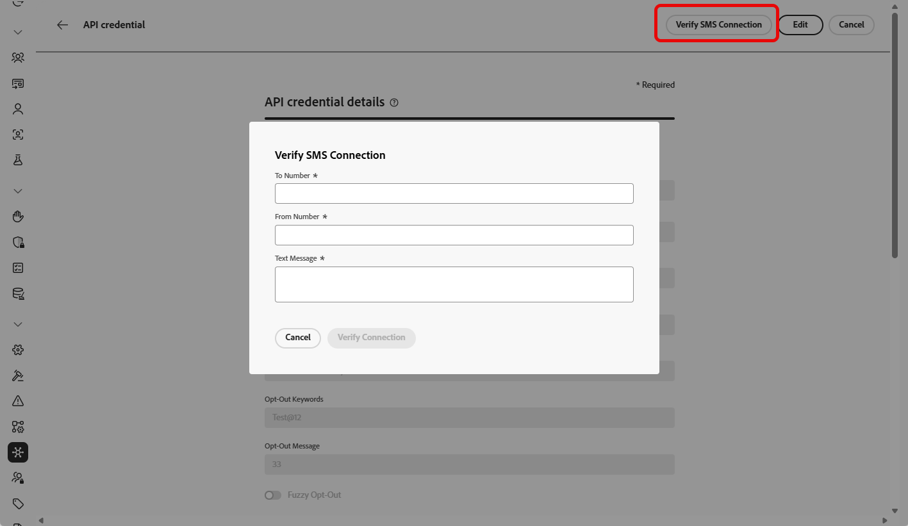
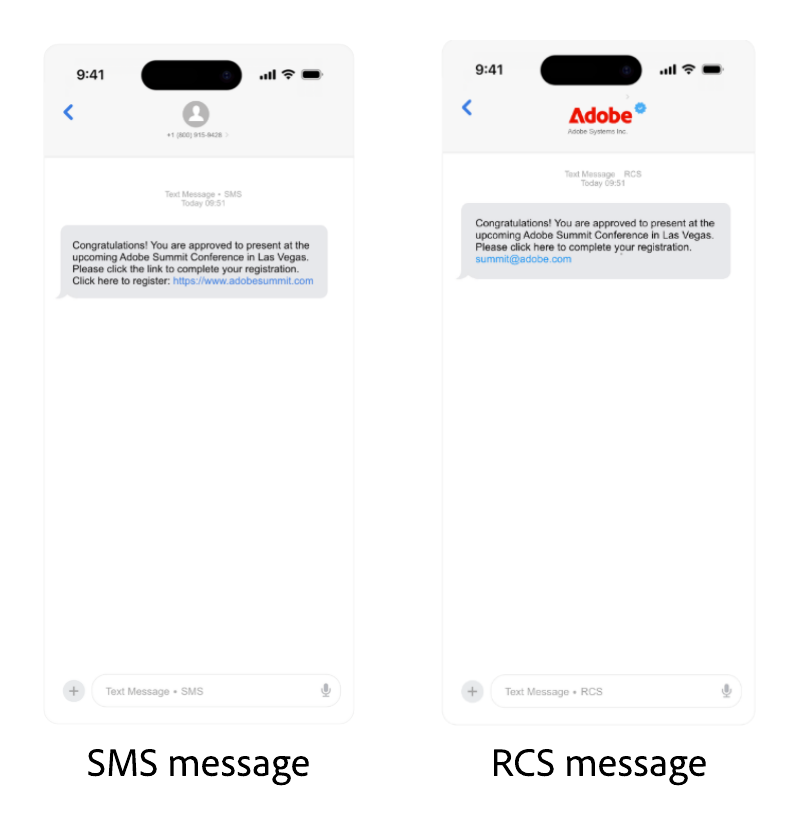

# 設定 Sinch 提供者 {#sms-configuration-sinch}

搭配Journey Optimizer使用Sinch提供者時，您可以找到三個不同的選項：

* **SMS設定**：設定您的Sinch API認證，以順暢地傳送SMS訊息。

* **MMS設定**：對於多媒體訊息(MMS)，請設定您的Sinch MMS API認證。 請注意，追蹤和回應傳入訊息由SMS設定處理。 MMS設定僅適用於MMS訊息的傳出傳遞。

* **RCS設定**：設定您的Sinch API認證，以順暢地傳送RCS訊息。

## 設定簡訊的API認證{#create-api}

>[!BEGINSHADEBOX]

如果未提供選擇加入或選擇退出關鍵字，系統會使用標準同意訊息來尊重使用者隱私權。 新增自訂關鍵字會自動覆寫預設值。

**預設關鍵字：**

* **選擇加入**：訂閱，是，取消停止，開始，繼續，繼續，開始
* **選擇退出**：停止、結束、取消、結束、取消訂閱、否
* **說明**：說明

>[!ENDSHADEBOX]

若要設定您的Sinch提供者使用Journey Optimizer傳送SMS訊息和MMS，請遵循下列步驟：

1. 在左側邊欄中，瀏覽至&#x200B;**[!UICONTROL 管理]** > **[!UICONTROL 管道]** `>` **[!UICONTROL SMS設定]**&#x200B;並選取&#x200B;**[!UICONTROL API認證]**&#x200B;功能表。 按一下&#x200B;**[!UICONTROL 建立新的API認證]**&#x200B;按鈕。

1. 設定您的SMS API認證，如下所述：

   +++ 設定的SMS認證清單

   | 設定欄位 | 說明 |
   |---|---|    
   | 簡訊供應商 | Sinch |
   | 名稱 | 選擇您的API認證名稱。 |
   | 服務ID和API權杖 | 存取API頁面，您可以在SMS標籤下找到您的認證。 在[Sinch檔案](https://developers.sinch.com/docs/sms/getting-started/){target="_blank"}中進一步瞭解。 |
   | 選擇加入關鍵字 | 輸入將會自動觸發選擇加入訊息的預設或自訂關鍵字。 對於多個關鍵字，請使用逗號分隔值。 |
   | 選擇加入訊息 | 輸入自訂回應，此回應會自動作為您的選擇加入訊息傳送。 |
   | 選擇退出關鍵字 | 輸入將會自動觸發選擇退出訊息的預設或自訂關鍵字。 對於多個關鍵字，請使用逗號分隔值。 |
   | 選擇退出訊息 | 輸入自訂回應，此回應會自動作為您的選擇退出訊息傳送。 |
   | 說明關鍵字 | 輸入將會自動觸發您的&#x200B;**說明訊息**&#x200B;的預設或自訂關鍵字。 對於多個關鍵字，請使用逗號分隔值。 |
   | 說明訊息 | 輸入自動傳送為&#x200B;**說明訊息**&#x200B;的自訂回應。 |
   | 雙重選擇加入關鍵字 | 輸入觸發雙重加入流程的關鍵字。 如果使用者輪廓不存在，則會在成功確認時加以建立。對於多個關鍵字，請使用逗號分隔值。 [進一步瞭解SMS雙重選擇加入](https://video.tv.adobe.com/v/3427129/?learn=on)。 |
   | 雙重選擇加入訊息 | 輸入自動傳送以回應雙重選擇加入確認的自訂回應。 |
   | 傳入號碼 | 新增您的唯一傳入號碼或短代碼。 這可讓您在不同的沙箱中使用相同的API認證，每個沙箱都有自己的傳入號碼或短程式碼。 |
   | 自訂傳入關鍵字 | 為特定動作定義唯一的關鍵字，例如DISCOUNT、OFFERS、ENROLL。 這些關鍵字會擷取並儲存為設定檔中的屬性，可讓您在歷程中觸發串流區段資格，並提供自訂回應或動作。 |
   | 預設傳入回複訊息 | 輸入當一般使用者傳送的傳入SMS不符合任何已定義的關鍵字時傳送的預設回覆。 |
   | 覆寫URL | 輸入您的自訂URL以取代SMS傳送報告、意見資料、傳入訊息或事件通知的預設端點。 Sinch會將所有相關更新傳送至此URL，而非預先定義的更新。 |

   +++

1. 啟用&#x200B;**[!UICONTROL 模糊選擇退出]**&#x200B;選項，以偵測類似選擇退出關鍵字（例如，&#39;CANCIL&#39;）的訊息，並在&#x200B;**[!UICONTROL 模糊自動回覆]**&#x200B;欄位中自訂確認回覆。

   **[!UICONTROL 模糊選擇退出]**&#x200B;會識別指出使用者想要取消訂閱的SMS訊息，即使該訊息與定義的選擇退出關鍵字不完全相符。 它可以偵測常見的選擇退出片語和某些冒犯性詞語，協助確保您的行銷活動遵守使用者偏好設定並保持合規性。

1. 完成API認證的設定時，請按一下&#x200B;**[!UICONTROL 提交]**。

1. 在&#x200B;**[!UICONTROL API認證]**&#x200B;功能表中，按一下bin圖示以刪除您的API認證。

1. 若要修改現有認證，請找到所需的API認證，然後按一下&#x200B;**[!UICONTROL 編輯]**&#x200B;選項以進行必要的變更。

1. 從您現有的API認證按一下&#x200B;**[!UICONTROL 驗證SMS連線]**，透過傳送範例訊息至指定裝置來測試及驗證SMS API認證。

1. 填寫&#x200B;**數字**&#x200B;和&#x200B;**訊息**&#x200B;欄位，然後按一下&#x200B;**[!UICONTROL 驗證連線]**。

   >[!IMPORTANT]
   >
   >訊息的結構必須符合提供者的裝載格式。

   

建立和設定API認證後，您現在需要建立SMS訊息的通道設定。 [了解更多](sms-configuration-surface.md)

## 設定MMS的API認證{#sinch-mms}

>[!IMPORTANT]
>
> 除了MMS設定，您還需要建立Sinch API認證，專門用於追蹤傳入訊息及管理同意請求。

若要設定Sinch MMS以使用Journey Optimizer傳送MMS，請遵循下列步驟：

1. 在左側邊欄中，瀏覽至&#x200B;**[!UICONTROL 管理]** > **[!UICONTROL 管道]** `>` **[!UICONTROL SMS設定]**&#x200B;並選取&#x200B;**[!UICONTROL API認證]**&#x200B;功能表。 按一下&#x200B;**[!UICONTROL 建立新的API認證]**&#x200B;按鈕。

1. 設定您的MMS API認證，如下所述：

   * **[!UICONTROL SMS廠商]**： Sinch MMS。

   * **[!UICONTROL 名稱]**：為您的API認證選擇一個名稱。

   * **[!UICONTROL 專案識別碼]**、**[!UICONTROL 應用程式識別碼]**&#x200B;和&#x200B;**[!UICONTROL API權杖]**：請依照下列步驟收集您的MMS API認證。

      * 針對&#x200B;**[!UICONTROL 專案識別碼]**&#x200B;和&#x200B;**[!UICONTROL 應用程式識別碼]**：存取您Sinch儀表板上Sinch專案的[交談API總覽](https://dashboard.sinch.com/convapi/overview)頁面。
      * 針對&#x200B;**[!UICONTROL API Token]**：取得您Sinch專案的[存取金鑰](https://community.sinch.com/t5/Customer-Dashboard/Sinch-Access-Keys/ta-p/12638)，並從您的Sinch專案&#x200B;**存取金鑰**&#x200B;中產生&#x200B;**Base64 API Token**。

1. 完成API認證的設定時，請按一下&#x200B;**[!UICONTROL 提交]**。

1. 在&#x200B;**[!UICONTROL API認證]**&#x200B;功能表中，按一下bin圖示以刪除您的API認證。

1. 若要修改現有認證，請找到所需的API認證，然後按一下&#x200B;**[!UICONTROL 編輯]**&#x200B;選項以進行必要的變更。

建立和設定API認證後，您現在需要建立MMS訊息的通道設定。 [了解更多](sms-configuration-surface.md)

## 設定RCS的API認證

<!---->

Journey Optimizer透過Sinch支援RCS (Rich Communication Services)傳送訊息，允許使用已驗證的企業設定檔連同商標元素（例如Logos和傳送者名稱）來傳送基本訊息。

請注意，當設定檔的裝置不支援RCS或暫時無法透過RCS連線時，訊息會自動回復到簡訊。

<!--
### Basic RCS Messages

>[!AVAILABILITY]
>
> Basic RCS messages is only available upon Adobe RCS add-on offering.

1. **Set up your branded RCS agent**

    Create a branded RCS agent in the Sinch Dashboard. [Learn more on branded RCS agent](https://community.sinch.com/t5/RCS/Getting-Started-with-RCS-using-Conversation-API/ta-p/17844)

1. **Set up your [Custom API credentials](sms-configuration-custom.md)**
    
    Once your RCS agent is approved, you need to set up your Sinch API credentials, which include your access key, secret, and service plan ID. These credentials will be used by Journey Optimizer to authenticate and send messages through Sinch's platform.

1. **Create a [channel configuration](sms-configuration-surface.md) for your RCS messages**

    Configure a channel surface in Journey Optimizer by linking your Sinch credentials and defining the messaging parameters. This setup enables you to compose and send RCS messages from Journey Optimizer.

1. **Create and personalize your [SMS message](../sms/create-sms.md)**

    Your messages automatically falls back to SMS when the profile's device does not support RCS or is temporarily unreachable via RCS.
-->

### RCS多媒體訊息

>[!AVAILABILITY]
>
> 進階RCS訊息僅適用於Sinch管理的直接帳戶。

1. **設定您的品牌RCS代理程式**

   在Sinch Dashboard中建立品牌化RCS代理。 [深入瞭解品牌RCS代理程式](https://community.sinch.com/t5/RCS/Getting-Started-with-RCS-using-Conversation-API/ta-p/17844)

1. **設定您的[自訂API認證](sms-configuration-custom.md)**

   您的RCS代理程式獲得核准後，您需要設定自訂API認證，包括您的AppId、名稱、URL和驗證型別。

1. **使用提供者承載設定您的RCS。**

   在您的[自訂API認證](sms-configuration-custom.md)中，新增您的提供者承載以驗證和自訂您的RCS訊息。

1. **為您的RCS訊息建立[通道設定](sms-configuration-surface.md)**

   連結您的Sinch憑證並定義傳訊引數，以在Journey Optimizer中設定管道表面。 此設定可讓您從Journey Optimizer撰寫及傳送RCS訊息。

1. **建立並個人化您的[簡訊訊息](../sms/create-sms.md)**

   將您的裝載直接貼入SMS內容中，以內嵌及傳遞您的Rich Communication Services (RCS)訊息。

   ➡️ [在Sinch檔案中探索Sinch如何支援RCS](https://sinch.com/blog/rcs-api-guide/)

