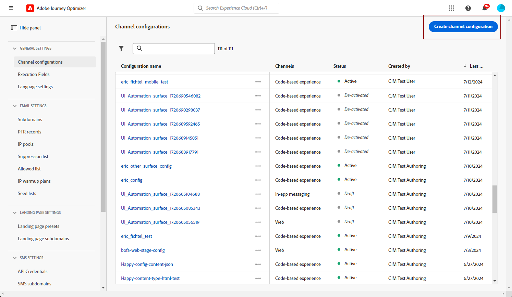
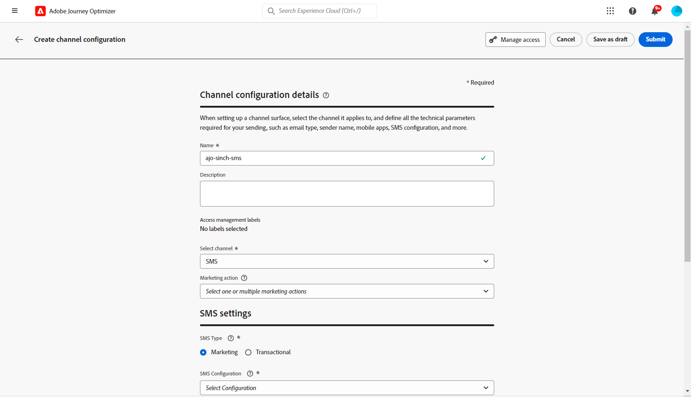
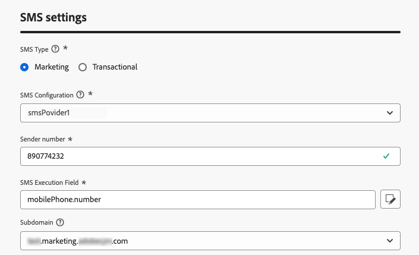
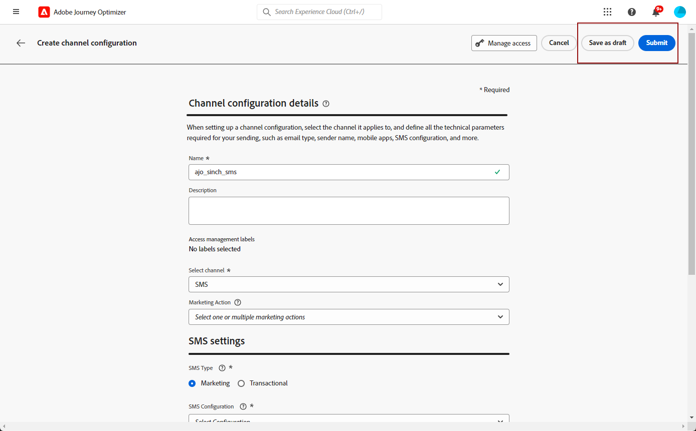
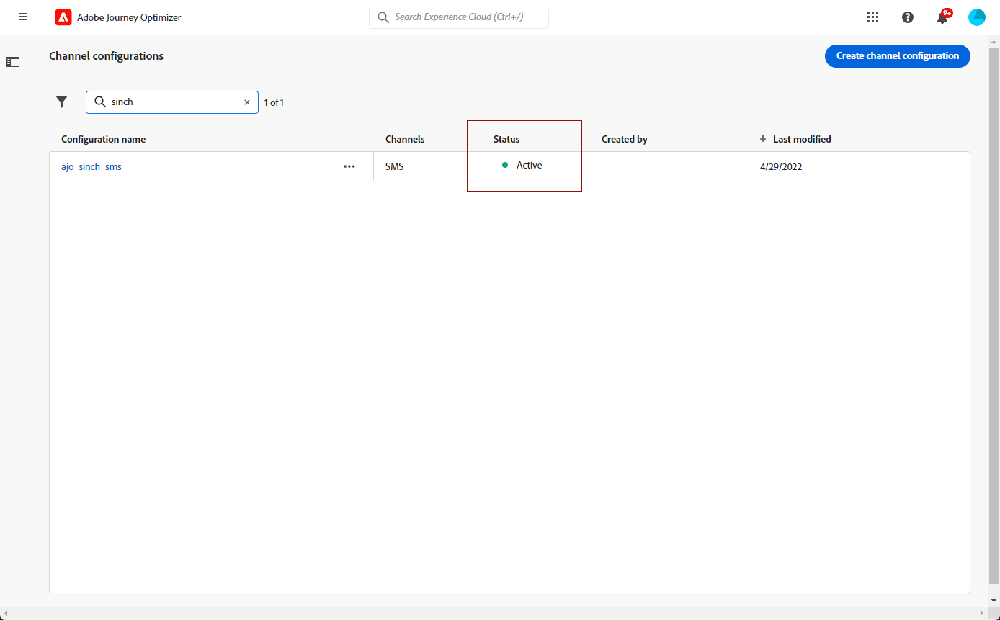

# 建立簡訊/MMS/RCS 設定 {#message-preset-sms}

>[!CONTEXTUALHELP]
>id="ajo_admin_surface_sms_type"
>title="定義訊息類別"
>abstract="選取使用此設定的文字簡訊類型：需要使用者同意之促銷簡訊的行銷型訊息，或非商業簡訊的交易型訊息，例如密碼重設。"
>additional-url="https://experienceleague.adobe.com/docs/journey-optimizer/using/privacy/consent/opt-out.html?lang=zh-Hant#sms-opt-out-management" text="選擇不接收行銷文字簡訊"

設定好SMS/MMS/RCS通道後，您必須建立通道設定，才能從&#x200B;**[!DNL Journey Optimizer]**&#x200B;傳送SMS、RCS和MMS訊息。

若要建立通道設定，請遵循下列步驟：

1. 在左側邊欄中，瀏覽至&#x200B;**[!UICONTROL 管理]** > **[!UICONTROL 管道]**&#x200B;並選取&#x200B;**[!UICONTROL 一般設定]** > **[!UICONTROL 管道設定]**。 按一下&#x200B;**[!UICONTROL 建立通道組態]**&#x200B;按鈕。

   

1. 輸入設定的名稱和說明（選用），然後選取SMS通道。

   

   >[!NOTE]
   >
   > 名稱必須以字母(A-Z)開頭。 它只能包含英數字元。 您也可以使用底線 `_`、點 `.` 和連字號 `-` 字元。

1. 定義&#x200B;**簡訊設定**。

   {width=80%}

   首先，選取將隨設定傳送的&#x200B;**[!UICONTROL 簡訊型別]**： **[!UICONTROL 異動]**&#x200B;或&#x200B;**[!UICONTROL 行銷]**。

   * 選擇促銷文字訊息的&#x200B;**行銷**：這些訊息需要使用者同意。
   * 針對非商業性訊息，例如訂單確認、密碼重設通知或傳遞資訊，請選擇&#x200B;**異動**。

   建立SMS/MMS時，您必須選擇與您為訊息選取的類別相符的有效通道設定。

   >[!CAUTION]
   >
   >**異動**&#x200B;訊息可傳送給取消訂閱行銷通訊的設定檔。 這些訊息只能在特定情境中傳送。

1. 選取&#x200B;**[!UICONTROL SMS設定]**&#x200B;以與設定關聯。

   有關如何設定環境以傳送SMS訊息的詳細資訊，請參閱[本節](#create-api)。

1. 輸入&#x200B;您要用於通訊的&#x200B;**[!UICONTROL 寄件者號碼]**。

1. 如果您想要在SMS訊息中使用URL縮短功能，請從&#x200B;**[!UICONTROL 子網域]**&#x200B;清單中選取專案。

   >[!NOTE]
   >
   >若要能夠選取子網域，請確定您先前已設定至少一個SMS/MMS子網域。 [了解作法](sms-subdomains.md)

1. 在&#x200B;**[!UICONTROL 執行維度]**&#x200B;區段中，使用&#x200B;**[!UICONTROL 簡訊執行欄位]**&#x200B;在設定檔屬性中選取您想要優先使用的電話號碼（如果資料庫中有數個號碼可用）。 [了解更多](../configuration/primary-email-addresses.md#override-execution-address-channel-config)

   >[!NOTE]
   >
   >依預設，[!DNL Journey Optimizer]在沙箱層級使用[一般設定](../configuration/primary-email-addresses.md)中指定的電話號碼。 更新此欄位會覆寫使用此設定的歷程和行銷活動的預設值。

1. 設定完所有引數後，按一下&#x200B;**[!UICONTROL 提交]**&#x200B;確認。 您也可以將頻道設定儲存為草稿，並稍後繼續其設定。

   

1. 建立管道設定後，它就會顯示在狀態為&#x200B;**[!UICONTROL 處理中]**&#x200B;的清單中。

   >[!NOTE]
   >
   >如果檢查不成功，請在[本節](../configuration/channel-surfaces.md)中進一步瞭解可能的失敗原因。

1. 檢查成功後，通道設定會取得&#x200B;**[!UICONTROL 作用中]**&#x200B;狀態。 已準備好用於傳遞訊息。

   

您現在可以使用Journey Optimizer傳送簡訊。
