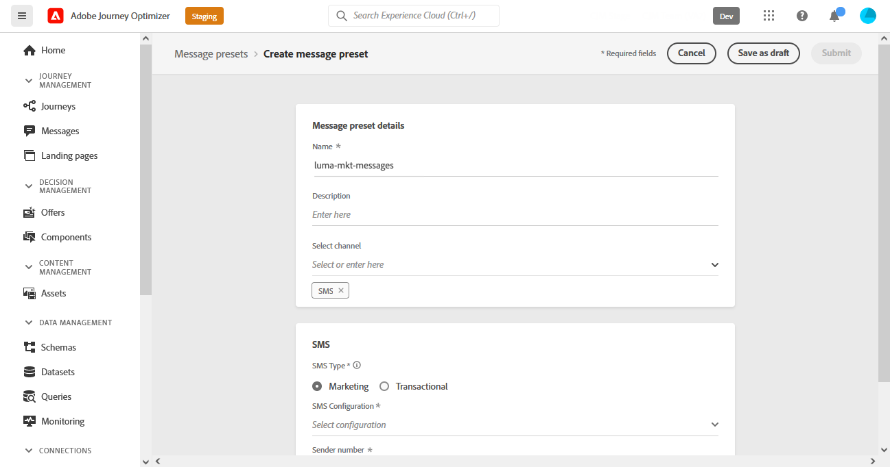

# 設定簡訊頻道 {#sms-configuration}

[!DNL Journey Optimizer] 可讓您建立歷程並傳送訊息給目標對象。

傳送SMS之前，請設定您的執行個體。 您需要 [整合提供者設定](#create-api) 與Journey Optimizer [建立SMS曲面](#message-preset-sms) （即簡訊預設集）。 這些步驟必須由 [Adobe Journey Optimizer系統管理員](../start/path/administrator.md).

## 先決條件{#sms-prerequisites}

Adobe Journey Optimizer目前與第三方提供商（如Sinch和Twilio）整合，後者提供獨立於Adobe Journey Optimizer的簡訊服務。

在SMS設定前，您必須建立帳戶，使其中一個SMS提供者接收API Token和服務ID，以便您建立Adobe Journey Optimizer與適用SMS提供者之間的連線。

您使用簡訊服務將受適用簡訊提供者提供之其他條款和條件所規範。 由於Sinch和Twilio是通過整合提供給Adobe Journey Optimizer用戶的第三方產品，因此，對於與簡訊服務相關的任何問題或查詢，Sinch或Twilio的用戶需要聯繫適用的簡訊提供商以獲得幫助。 Adobe無法控制第三方產品，也不負責。

## 建立新的API憑證 {#create-api}

>[!CONTEXTUALHELP]
>id="ajo_admin_sms_api_header"
>title="使用 Journey Optimizer 設定您的簡訊供應商"
>abstract="選取您的供應商並填寫您的簡訊 API 憑證。"

>[!CONTEXTUALHELP]
>id="ajo_admin_sms_api"
>title="使用 Journey Optimizer 設定您的簡訊供應商"
>abstract="在傳送簡訊之前，您必須將提供者設定和 Journey Optimizer 整合。完成後，您將需要建立一個簡訊表面。這些步驟必須由 Adobe Journey Optimizer 系統管理員執行。"
>additional-url="https://experienceleague.adobe.com/docs/journey-optimizer/using/sms/sms-configuration.html?lang=en#message-preset-sms" text="建立簡訊管道表面"

>[!CONTEXTUALHELP]
>id="ajo_admin_sms_configuration"
>title="選取簡訊供應商設定"
>abstract="選取為您的簡訊供應商設定的 API 憑證。"

若要使用Journey Optimizer設定您的SMS廠商，請遵循下列步驟：

1. 在左側邊欄中，瀏覽至 **[!UICONTROL 管理]** > **[!UICONTROL 管道]** ，然後選取 **[!UICONTROL API憑證]** 功能表。 按一下 **[!UICONTROL 建立新API憑證]** 按鈕。

   

1. 選取 **[!UICONTROL 簡訊供應商]**:

   * **[!DNL Sinch]**

      若要尋找 **[!UICONTROL 服務ID]** 和 **[!UICONTROL API Token]**，從您的Sinch帳戶存取SMS > API功能表。

   * **[!DNL Twilio]**

      若要尋找 **[!UICONTROL 服務ID]** 和 **[!UICONTROL API Token]**，存取「控制台控制面板」頁面的「帳戶資訊」窗格。

1. 輸入 **[!UICONTROL 名稱]** 來取得API憑證。

1. 輸入 **[!UICONTROL 服務ID]** 和 **[!UICONTROL API Token]**.

   

1. 按一下 **[!UICONTROL 提交]** 完成API憑證的設定時。

建立和設定API憑證後，您現在需要為SMS訊息建立通道表面（即訊息預設集）。

## 建立SMS表面 {#message-preset-sms}

>[!CONTEXTUALHELP]
>id="ajo_admin_surface_sms_type"
>title="定義簡訊類別"
>abstract="選取使用此表面的簡訊訊息類型：需要使用者同意的促銷簡訊的行銷訊息，或非商業簡訊的異動訊息，例如密碼重設。"
>additional-url="https://experienceleague.adobe.com/docs/journey-optimizer/using/privacy/consent/opt-out.html#sms-opt-out-management" text="選擇不接收行銷簡訊訊息"

設定SMS通道後，您必須建立通道表面，才能傳送來自 **[!DNL Journey Optimizer]**.

要建立通道曲面，請執行以下步驟：

1. 在左側邊欄中，瀏覽至 **[!UICONTROL 管理]** > **[!UICONTROL 管道]** 選取 **[!UICONTROL 品牌推廣]** > **[!UICONTROL 通道曲面]**. 按一下 **[!UICONTROL 建立通道曲面]** 按鈕。

   

1. 輸入曲面的名稱和說明（可選），然後選取SMS通道。

   

   >[!NOTE]
   >
   > 名稱必須以字母(A-Z)開頭。 它只能包含英數字元。 您也可以使用底線 `_`，點`.` 連字型大小 `-` 字元。

1. 定義 **SMS設定**.

   

   * 選取 **[!UICONTROL SMS類型]** 將與表面一起發送： **[!UICONTROL 交易]** 或 **[!UICONTROL 行銷]**.

      * 選擇 **行銷** 促銷簡訊：這些訊息需要使用者同意。
      * 選擇 **交易** 例如，對於非商業性訊息，例如訂單確認、密碼重設通知或傳送資訊。

      >[!CAUTION]
      >
      >**交易** SMS訊息可傳送給從行銷通訊取消訂閱的設定檔。 這些訊息只能在特定內容中傳送。

      建立SMS訊息時，您必須選擇符合您為訊息選取的類別的有效通道表面。

   * 選取 **[!UICONTROL SMS設定]** 與曲面關聯。

      如需如何設定環境以傳送SMS訊息的詳細資訊，請參閱 [本節](#create-api).

   * 輸入 **[!UICONTROL 寄件者編號]** &#x200B;你想用於溝通。

   * 選取 **[!UICONTROL SMS執行欄位]** ，選擇 **[!UICONTROL 設定檔屬性]** 與設定檔的電話號碼相關聯。

1. 完成所有參數設定後，按一下 **[!UICONTROL 提交]** 確認。 也可以將通道曲面另存為草稿，並稍後恢復其配置。

   

1. 建立通道曲面後，該曲面將顯示在清單中，其中 **[!UICONTROL 處理]** 狀態。

   >[!NOTE]
   >
   >如果檢查未成功，請進一步了解中可能的失敗原因。 [本節](#monitor-channel-surfaces).

1. 檢查成功後，通道曲面將獲取 **[!UICONTROL 作用中]** 狀態。 它已準備好用於傳送訊息。

   

您現在已準備好使用Journey Optimizer傳送SMS訊息。

**相關主題**

* [建立簡訊訊息](create-sms.md)
* [在歷程中新增訊息](../building-journeys/journeys-message.md)
* [在促銷活動中新增訊息](../campaigns/create-campaign.md)

