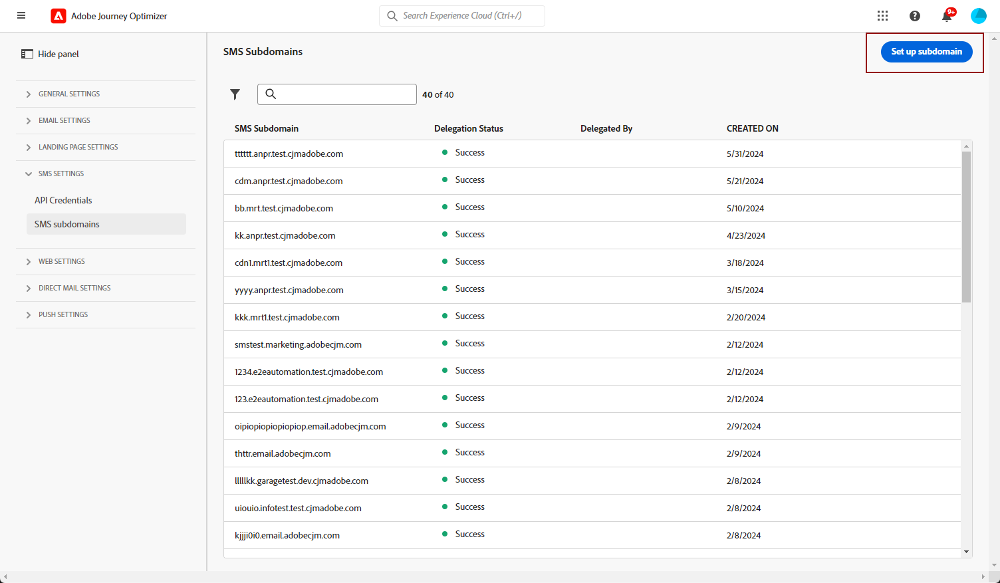

# 設定簡訊子網域 {#sms-mms-subdomains}

>[!CONTEXTUALHELP]
>id="ajo_admin_subdomain_sms_header"
>title="委派 SMS/MMS 子網域"
>abstract="設定文字簡訊 (SMS/MMS) 子網域。您可以使用已委派給 Adobe 的子網域，或設定新的子網域。"

>[!CONTEXTUALHELP]
>id="ajo_admin_subdomain_sms"
>title="委派 SMS/MMS 子網域"
>abstract="您必須設定要用於文字簡訊的子網域，因為您需要此子網域才能建立簡訊設定。您可以使用已委派給 Adobe 的子網域，也可以設定新的子網域。"
>additional-url="https://experienceleague.adobe.com/zh-hant/docs/journey-optimizer/using/channels/sms/configure-sms/sms-configuration-surface" text="建立簡訊設定"

>[!CONTEXTUALHELP]
>id="ajo_admin_config_sms_subdomain"
>title="選取 SMS/MMS 子網域"
>abstract="為了能夠建立簡訊設定，請確保您之前已至少設定一個簡訊子網域，才能從子網域名稱清單中挑選。"
>additional-url="https://experienceleague.adobe.com/zh-hant/docs/journey-optimizer/using/channels/sms/configure-sms/sms-configuration-surface" text="建立簡訊設定"

## 開始使用簡訊子網域 {#gs-sms-mms-subdomains}

若要能夠縮短新增至SMS/MMS訊息的URL，您必須設定在[建立SMS設定](sms-configuration.md#sms-prerequisites)時將選取的子網域。

您可以使用已委派給Adobe的子網域，或設定另一個子網域。 在[本節](../configuration/delegate-subdomain.md)中進一步瞭解將子網域委派至Adobe。

SMS子網域設定是&#x200B;**在所有環境之間共用**。 因此，對SMS子網域所做的任何修改也會影響其他生產沙箱。

若要存取及編輯SMS子網域，您必須對生產沙箱具有&#x200B;**[!UICONTROL 管理SMS子網域]**&#x200B;許可權。 若要了解更多關於權限的資訊，請參閱[此區段](../administration/high-low-permissions.md)。

## 使用現有的子網域 {#sms-use-existing-subdomain}

若要使用已委派給Adobe的子網域，請遵循下列步驟。

1. 瀏覽至&#x200B;**[!UICONTROL 管理]** > **[!UICONTROL 管道]**&#x200B;功能表，並選取&#x200B;**[!UICONTROL 簡訊設定]** > **[!UICONTROL 簡訊子網域]**。

1. 按一下&#x200B;**[!UICONTROL 設定子網域]**。

   

1. 從&#x200B;**[!UICONTROL 組態型別]**&#x200B;區段中選取&#x200B;**[!UICONTROL 使用委派的子網域]**。

   

1. 輸入將顯示在簡訊URL中的前置詞。

   只允許使用英數字元和連字型大小。

   >[!CAUTION]
   >
   >請勿使用`cdn`或`data`首碼，因為這些首碼保留供內部使用。 其他限制或保留的前置詞（例如`dmarc`或`spf`）也應避免。

1. 從清單中選取委派的子網域。

   您無法選取已用作SMS子網域的子網域。

   <!--Capital letters are not allowed in subdomains. TBC by PM-->

   

   <!--Note that you cannot use multiple delegated subdomains of the same parent domain. For example, if 'marketing1.yourcompany.com' is already delegated to Adobe for your SMS messages, you will not be able to use 'marketing2.yourcompany.com'. However, multi-level subdomains being supported for SMS, you may proceed using a subdomain of 'marketing1.yourcompany.com' (such as 'email.marketing1.yourcompany.com'), or a different parent domain.-->

   >[!CAUTION]
   >
   >如果您選取使用[CNAME方法](../configuration/delegate-subdomain.md#cname-subdomain-setup)委派給Adobe的網域，您必須在您的代管平台上建立DNS記錄。 若要產生DNS記錄，此程式與您設定新的SMS子網域時的程式相同。 在[本節](#sms-configure-new-subdomain)中瞭解如何操作。

1. 按一下&#x200B;**[!UICONTROL 提交]**。

1. 提交後，子網域會顯示在狀態為&#x200B;**[!UICONTROL 處理中]**&#x200B;的清單中。 如需子網域狀態的詳細資訊，請參閱[本區段](../configuration/delegate-subdomain.md#access-delegated-subdomains).<!--Same statuses?-->

   您必須等到Adobe執行必要的檢查（最多可能需要&#x200B;**4小時**.<!--Learn more in [this section](../configuration/delegate-subdomain.md#subdomain-validation).-->），才能使用該子網域傳送訊息。

1. 檢查成功後，子網域會取得&#x200B;**[!UICONTROL Success]**&#x200B;狀態。 它已準備好用來建立SMS通道設定。

## 設定新的子網域 {#sms-configure-new-subdomain}

>[!CONTEXTUALHELP]
>id="ajo_admin_sms_subdomain_dns"
>title="產生相符的 DNS 記錄"
>abstract="若要設定新的簡訊子網域，您需要將 Journey Optimizer 介面中顯示的 Adobe 名稱伺服器資訊複製後貼到您的網域託管解決方案中，以產生相符的 DNS 記錄。一旦檢查成功，子網域就準備好可用來建立簡訊設定。"

若要設定新的子網域，請遵循下列步驟。

1. 瀏覽至&#x200B;**[!UICONTROL 管理]** > **[!UICONTROL 管道]**&#x200B;功能表，然後選取&#x200B;**[!UICONTROL 簡訊設定]** > **[!UICONTROL 簡訊子網域]**。

1. 按一下&#x200B;**[!UICONTROL 設定子網域]**。

   

1. 從&#x200B;**[!UICONTROL 組態型別]**&#x200B;區段中選取&#x200B;**[!UICONTROL 新增您自己的網域]**。

   

1. 指定要委派的子網域。

   >[!CAUTION]
   >
   >* 您無法使用現有的SMS子網域。
   >
   >* 子網域中不允許使用大寫字母。

   不允許將無效的子網域委派給Adobe。 請務必輸入貴組織所擁有的有效子網域，例如marketing.yourcompany.com。

   支援（相同父項網域的）多階層子網域。 例如，您可以使用「sms.marketing.yourcompany.com」。

1. 將會顯示要放置在DNS伺服器中的記錄。 複製此記錄或下載CSV檔案，然後導覽至您的網域託管解決方案，以產生相符的DNS記錄。

1. 請確定已在您的網域託管解決方案中產生DNS記錄。 如果所有專案皆已正確設定，請勾選「我確認……」方塊，然後按一下&#x200B;**[!UICONTROL 提交]**。

   

   當您設定新的SMS子網域時，它始終指向CNAME記錄。

1. 提交子網域委派後，子網域會顯示在狀態為&#x200B;**[!UICONTROL 處理中]**&#x200B;的清單中。 如需子網域狀態的詳細資訊，請參閱[本區段](../configuration/delegate-subdomain.md#access-delegated-subdomains).<!--Same statuses?-->

使用子網域傳送SMS訊息之前，您必須先等待Adobe執行所需檢查，這可能需要4小時。<!--Learn more in [this section](#subdomain-validation).-->檢查成功後，子網域會取得&#x200B;**[!UICONTROL Success]**&#x200B;狀態。 它已準備好用來建立SMS通道設定。

請注意，如果您無法在託管解決方案上建立驗證記錄，子網域將會標示為&#x200B;**[!UICONTROL 失敗]**。

## 護欄 {#guardrails}

目前，[!DNL Journey Optimizer]使用者介面不支援在設定SMS子網域後將其刪除或取消委派。

不過，在[!DNL Journey Optimizer]內測試功能時，可能需要建立SMS子網域。 測試完成後，這可能會導致環境雜亂，並包含不必要的設定，因為UI不允許移除或轉派SMS子網域。

以下是一些建議的步驟和考量事項：

<!--As an alternative action, create a new SMS subdomain for future use cases and avoid using the existing one if it is no longer needed.-->

* 作為最佳實務，建議您僅建立必要的元件和設定，以維持整潔的環境。
* 在有業務影響的情況下，請聯絡您的Adobe代表，他們可能會協助移除/取消委派SMS子網域。 [了解更多](#undelegate-subdomain)
* 如需進一步協助，請聯絡Adobe以取得有效管理執行個體的指引。

## 取消委派子網域 {#undelegate-subdomain}

如果您想要解除委派SMS子網域，請聯絡您的Adobe代表，告知您要解除委派的子網域。

如果SMS子網域指向CNAME記錄，您可以從託管解決方案中刪除您為SMS子網域建立的CNAME DNS記錄(但不刪除原始電子郵件子網域（如有）。

>[!NOTE]
>
>SMS子網域可以指向CNAME記錄，因為它是使用[CNAME方法](#sms-use-existing-subdomain)委派給Adobe的[現有子網域](../configuration/delegate-subdomain.md#cname-subdomain-setup)，或是您設定的[新SMS子網域](#sms-configure-new-subdomain)。

Adobe處理您的請求後，未委派網域不再顯示在子網域詳細目錄頁面上。
