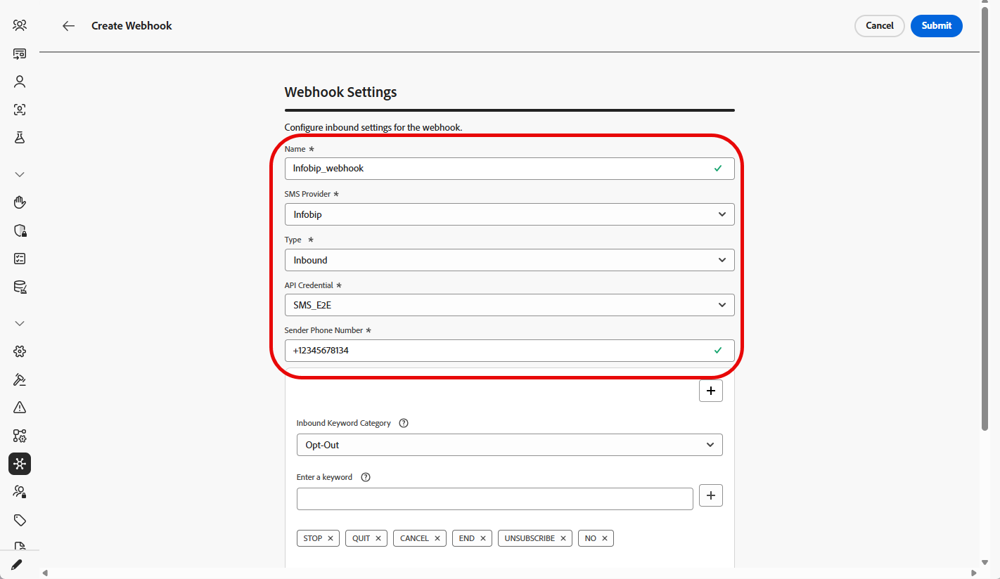
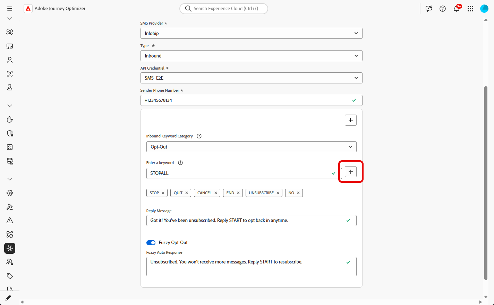
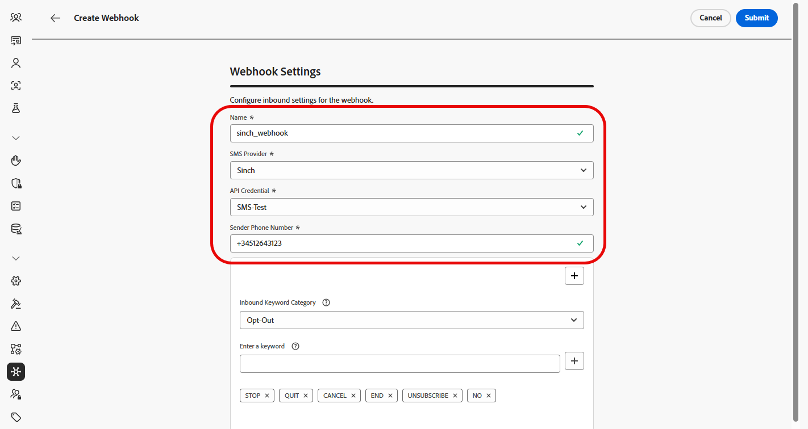

# 建立 Webhook {#webhook}

>[!BEGINSHADEBOX]

如果未提供選擇加入或選擇退出關鍵字，系統會使用標準同意訊息來尊重使用者隱私權。 新增自訂關鍵字會自動覆寫預設值。

**預設關鍵字：**

* **選擇加入**：訂閱，是，取消停止，開始，繼續，繼續，開始
* **選擇退出**：停止、結束、取消、結束、取消訂閱、否
* **說明**：說明

>[!ENDSHADEBOX]

成功建立API認證後，您現在可以設定Webhook擷取傳入回應，以管理選擇加入和選擇退出同意，並接收傳遞報表，包括可用的讀取回條。

設定webhook時，您可以根據要擷取的資料型別定義其用途：

* **[!UICONTROL 傳入]**：如果您想要擷取同意回應（例如加入或退出），並收集使用者偏好設定，請使用此選項。

* **[!UICONTROL 回饋]**：選擇此選項可追蹤傳遞和參與事件（包括讀取回條和使用者互動），以支援報告和分析。

根據您的SMS提供者，瀏覽以下標籤：

>[!BEGINTABS]

>[!TAB 自訂]

1. 在左側邊欄中，瀏覽至&#x200B;**[!UICONTROL 管理]** `>` **[!UICONTROL 管道]**，選取&#x200B;**[!UICONTROL 簡訊設定]**&#x200B;下的&#x200B;**[!UICONTROL 簡訊Webhook]**&#x200B;功能表，然後按一下&#x200B;**[!UICONTROL 建立Webhook]**&#x200B;按鈕。

   {zoomable="yes"}

1. 設定您的Webhook設定，如下所述：

   * **[!UICONTROL 名稱]**：輸入您Webhook的名稱。

   * **[!UICONTROL 選取簡訊供應商]**：自訂。

   * **[!UICONTROL 型別]**：傳入。

   * **[!UICONTROL API認證]**：從下拉式清單中選擇您[先前設定的API認證](sms-configuration-custom.md#api-credential)。

   * **[!UICONTROL 寄件者電話號碼&#x200B;]**：輸入&#x200B;您要用於通訊的寄件者電話號碼。

     {zoomable="yes"}

1. 按一下以新增您的關鍵字類別，然後根據您的SMS提供者進行設定：

   * **[!UICONTROL 傳入關鍵字類別]**：選擇您的關鍵字類別： **[!UICONTROL 選擇加入]**、**[!UICONTROL 選擇退出]**、**[!UICONTROL 雙重選擇加入]**、**[!UICONTROL 說明]**&#x200B;或&#x200B;**[!UICONTROL 自訂]**。

   * **[!UICONTROL 輸入關鍵字]**：輸入將會自動觸發訊息的預設或自訂關鍵字。 按一下以新增多個關鍵字。

     若為&#x200B;**[!UICONTROL 自訂關鍵字]**，請在歷程中針對批次式動作使用非同意相關關鍵字。

   * **[!UICONTROL 回複訊息]**：從下拉式清單中選取自動傳送的自訂回應。

   * **[!UICONTROL 模糊選擇退出]**：啟用此選項，以在偵測到接近符合選擇退出關鍵字時傳送自動回覆。

   {zoomable="yes"}

1. 輸入當傳入訊息不符合任何設定的關鍵字或類別時，自動傳送的&#x200B;**[!UICONTROL 預設回複訊息]**。

1. 按一下&#x200B;**[!UICONTROL 檢視裝載編輯器]**&#x200B;以驗證及自訂您的要求裝載。

   您可以使用設定檔屬性來動態個人化您的裝載，並透過內建的協助程式函式，確保傳送準確資料以供處理和產生回應。

1. 完成Webhook的設定時，請按一下&#x200B;**[!UICONTROL 提交]**。

1. 若要建立&#x200B;**[!UICONTROL 意見]** webhook，請依照上述步驟進行，選取&#x200B;**[!UICONTROL 意見]**&#x200B;作為您的webhook **[!UICONTROL 型別]**。

1. 從&#x200B;**[!UICONTROL Webhooks]**&#x200B;功能表，您可以編輯或刪除現有的Webhook，或存取及複製&#x200B;**[!UICONTROL Webhook URL]**，以便與您的SMS提供者整合。

   {zoomable="yes"}

建立並設定Webhook的設定後，您現在需要建立SMS訊息的[頻道設定](sms-configuration-surface.md)。

設定後，您就可以運用所有立即可用的頻道功能，例如訊息製作、個人化、連結追蹤和報告。

>[!TAB Infobip]

1. 在左側邊欄中，瀏覽至&#x200B;**[!UICONTROL 管理]** `>` **[!UICONTROL 管道]**，選取&#x200B;**[!UICONTROL 簡訊設定]**&#x200B;下的&#x200B;**[!UICONTROL 簡訊Webhook]**&#x200B;功能表，然後按一下&#x200B;**[!UICONTROL 建立Webhook]**&#x200B;按鈕。

   {zoomable="yes"}

1. 設定您的Webhook設定，如下所述：

   * **[!UICONTROL 名稱]**：輸入您Webhook的名稱。

   * **[!UICONTROL 選取SMS供應商]**： Infobip。

   * **[!UICONTROL 型別]**：傳入。

   * **[!UICONTROL API認證]**：從下拉式清單中選擇您[先前設定的API認證](sms-configuration-infobip.md#api-credential)。

   * **[!UICONTROL 寄件者電話號碼&#x200B;]**：輸入&#x200B;您要用於通訊的寄件者電話號碼。

     {zoomable="yes"}

1. 按一下以新增您的關鍵字類別，然後根據您的SMS提供者進行設定：

   * **[!UICONTROL 傳入關鍵字類別]**：選擇您的關鍵字類別： **[!UICONTROL 選擇加入]**、**[!UICONTROL 選擇退出]**、**[!UICONTROL 雙重選擇加入]**、**[!UICONTROL 說明]**&#x200B;或&#x200B;**[!UICONTROL 自訂]**。

   * **[!UICONTROL 輸入關鍵字]**：輸入將會自動觸發訊息的預設或自訂關鍵字。 按一下以新增多個關鍵字。

     若為&#x200B;**[!UICONTROL 自訂關鍵字]**，請在歷程中針對批次式動作使用非同意相關關鍵字。

   * **[!UICONTROL 回複訊息]**：從下拉式清單中選取自動傳送的自訂回應。

   * **[!UICONTROL 模糊選擇退出]**：啟用此選項，以在偵測到接近符合選擇退出關鍵字時傳送自動回覆。

   {zoomable="yes"}

1. 輸入當傳入訊息不符合任何設定的關鍵字或類別時，自動傳送的&#x200B;**[!UICONTROL 預設回複訊息]**。

1. 完成Webhook的設定時，請按一下&#x200B;**[!UICONTROL 提交]**。

1. 若要建立&#x200B;**[!UICONTROL 意見]** webhook，請依照上述步驟進行，選取&#x200B;**[!UICONTROL 意見]**&#x200B;作為您的webhook **[!UICONTROL 型別]**。

1. 從&#x200B;**[!UICONTROL Webhooks]**&#x200B;功能表，您可以編輯或刪除現有的Webhook，或存取及複製&#x200B;**[!UICONTROL Webhook URL]**，以便與您的SMS提供者整合。

   {zoomable="yes"}

在建立並設定Webhook的輸入設定後，您現在需要建立SMS訊息的[頻道設定](sms-configuration-surface.md)。

設定後，您就可以運用所有立即可用的頻道功能，例如訊息製作、個人化、連結追蹤和報告。

>[!TAB Sinch]

1. 在左側邊欄中，瀏覽至&#x200B;**[!UICONTROL 管理]** `>` **[!UICONTROL 管道]**，選取&#x200B;**[!UICONTROL 簡訊設定]**&#x200B;下的&#x200B;**[!UICONTROL 簡訊Webhook]**&#x200B;功能表，然後按一下&#x200B;**[!UICONTROL 建立Webhook]**&#x200B;按鈕。

   {zoomable="yes"}

1. 設定您的Webhook設定，如下所述：

   * **[!UICONTROL 名稱]**：輸入您Webhook的名稱。

   * **[!UICONTROL 選取SMS供應商]**： Sinch。

   * **[!UICONTROL 型別]**：傳入。

   * **[!UICONTROL API認證]**：從下拉式清單中選擇您[先前設定的API認證](sms-configuration-sinch.md#create-api)。

   * **[!UICONTROL 寄件者電話號碼&#x200B;]**：輸入&#x200B;您要用於通訊的寄件者電話號碼。

     {zoomable="yes"}

1. 按一下以新增您的關鍵字類別，然後根據您的SMS提供者進行設定：

   * **[!UICONTROL 傳入關鍵字類別]**：選擇您的關鍵字類別： **[!UICONTROL 選擇加入]**、**[!UICONTROL 選擇退出]**、**[!UICONTROL 雙重選擇加入]**、**[!UICONTROL 說明]**&#x200B;或&#x200B;**[!UICONTROL 自訂]**。

   * **[!UICONTROL 輸入關鍵字]**：輸入將會自動觸發訊息的預設或自訂關鍵字。 按一下以新增多個關鍵字。

     若為&#x200B;**[!UICONTROL 自訂關鍵字]**，請在歷程中針對批次式動作使用非同意相關關鍵字。

   * **[!UICONTROL 回複訊息]**：從下拉式清單中選取自動傳送的自訂回應。

   * **[!UICONTROL 模糊選擇退出]**：啟用此選項，以在偵測到接近符合選擇退出關鍵字時傳送自動回覆。

   {zoomable="yes"}

1. 輸入當傳入訊息不符合任何設定的關鍵字或類別時，自動傳送的&#x200B;**[!UICONTROL 預設回複訊息]**。

1. 完成Webhook的設定時，請按一下&#x200B;**[!UICONTROL 提交]**。

1. 在&#x200B;**[!UICONTROL Webhook]**&#x200B;功能表中，按一下以刪除您的Webhook。

1. 若要修改現有組態，請找到所需的Webhook，然後按一下&#x200B;**[!UICONTROL 編輯]**&#x200B;選項以進行必要的變更。

1. 從您先前提交的&#x200B;**[!UICONTROL Webhook]**&#x200B;存取及複製新的&#x200B;**[!UICONTROL Webhook URL]**。

   {zoomable="yes"}

在建立並設定Webhook的輸入設定後，您現在需要建立SMS訊息的[頻道設定](sms-configuration-surface.md)。

設定後，您就可以運用所有立即可用的頻道功能，例如訊息製作、個人化、連結追蹤和報告。

<!--
>[!TAB Twilio]

1. In the left rail, navigate to **[!UICONTROL Administration]** `>` **[!UICONTROL Channels]**, select the **[!UICONTROL SMS Webhooks]** menu under **[!UICONTROL SMS settings]**, and click the **[!UICONTROL Create Webhook]** button.

    {zoomable="yes"}

1. Configure your Webhook Settings, as detailed below:

    * **[!UICONTROL Name]**: Enter a name for your Webhook.

    * **[!UICONTROL Select SMS vendor]**: Twilio.

    * **[!UICONTROL Type]**: Inbound.

    * **[!UICONTROL API credentials]**: Choose from the drop-down you [previously configured API credentials](sms-configuration-twilio.md#create-api).

    * **[!UICONTROL Sender Phone Number ​]**: Enter the Sender phone number ​you want to use for your communications.
        
1. Click  to add your keywords categories, then, configure them depending on your SMS provider:

    * **[!UICONTROL Inbound Keyword Category]**: Choose your keyword categories either **[!UICONTROL Opt-In]**, **[!UICONTROL Opt-Out]**, **[!UICONTROL Double Opt-In]**, **[!UICONTROL Help]** or **[!UICONTROL Custom]**. 

    * **[!UICONTROL Enter a keyword]**: Enter the default or custom keywords that will automatically trigger your message. Click  to add multiple keywords.

        For **[!UICONTROL Custom keyword]**, use non-consent–related keywords for batch-based actions within a journey.

    * **[!UICONTROL Reply Message]**: Select from the drop-down the custom response that is automatically sent.

    * **[!UICONTROL Fuzzy Opt-out]**: Enable this option to send an automatic reply when a near-match opt-out keyword is detected.

1. Enter a **[!UICONTROL Default Reply Message]** automatically sent when an inbound message does not match any configured keyword or category.

1. Click **[!UICONTROL Submit]** when you finished the configuration of your Webhook.

1. In the **[!UICONTROL Webhooks]** menu, click the  to delete your Webhook.

1. To modify existing configuration, locate the desired Webhook and click the **[!UICONTROL Edit]** option to make the necessary changes.

1. Access and copy your new **[!UICONTROL Webhook URL]** from your previously submitted **[!UICONTROL Webhook]**.

After creating and configuring the inbound settings for the Webhook, you now need to create a [channel configuration](sms-configuration-surface.md) for SMS messages. 

Once configured, you can leverage all out-of-the-box channel capabilities such as message authoring, personalization, link tracking, and reporting.
-->

>[!ENDTABS]

## 作法影片 {#video}

>[!VIDEO](https://video.tv.adobe.com/v/3431625)
