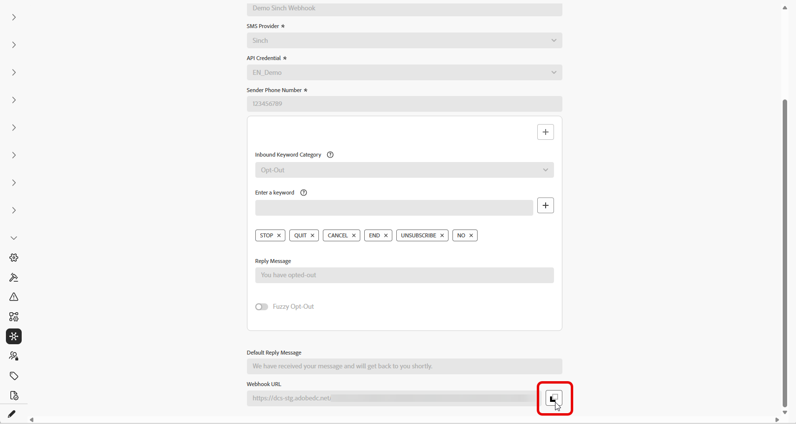

# 建立 Webhook {#webhook}

>[!CONTEXTUALHELP]
>id="ajo_channels_sms_webhook_settings_create"
>title="建立簡訊 Webhook"
>abstract="您可以設定 Webhook 擷取傳入回應，以便管理同意選擇加入和同意選擇退出，並接收傳遞報告，包括讀取回條，若有的話。"

>[!CONTEXTUALHELP]
>id="ajo_admin_sms_webhook_flow_type"
>title="選擇您的 Webhook 類型"
>abstract="設定 Webhook 時，請選擇&#x200B;**傳入**&#x200B;以擷取同意回應和使用者偏好，或選擇&#x200B;**[!UICONTROL 意見回饋]**&#x200B;以追蹤傳遞和參與事件來進行報告和分析。"

>[!BEGINSHADEBOX]

在Journey Optimizer中建立新API認證時，SMS webhook現在可讓您擷取傳入關鍵字和意見回饋事件，例如傳送和錯誤。 由於每個提供者都有不同的功能，因此有不同的指示可啟用Webhook。
有了webhook現在支援自訂提供者，現在可以從任何提供者收集意見回饋和傳入關鍵字集合，以在Journey Optimizer中報告和採取行動。

* **新客戶：**&#x200B;您可以依照這裡的指示正確設定SMS webhook。

* **現有客戶：**&#x200B;您可以從API認證中儲存的資訊移轉至Webhook，而且沒有客戶移轉的時間表。 若現有客戶確實想要移轉至SMS Webhook，則需要依照移轉指南中的紀錄執行移轉步驟。

>[!ENDSHADEBOX]

## 概觀 {#overview}

成功建立API認證後，您現在可以設定Webhook以擷取傳入回應，用於管理選擇加入和選擇退出同意，並接收傳遞報表，包括可用的讀取回條。

設定webhook時，您可以根據要擷取的資料型別定義其用途：

* **傳入**：如果您想要擷取同意回應（例如加入或退出），並收集使用者偏好設定，請使用此選項。

* **回饋**：選擇此選項可追蹤傳遞和參與事件，包括傳遞、傳出錯誤、讀取回條（如果適用），以支援報告和分析。

根據您的提供者，對於需要設定才能成功實作SMS的內容，會有不同的期望：

* **Sinch與Sinch交談**：建立一個webhook，以處理傳入與回饋事件。 不需要任何裝載設定。

* **Infobip**：建立兩個個別的Webhook，一個用於傳入事件，另一個用於意見反應事件。 任一webhook均不需要任何裝載設定。

* **Twilio**：無法使用Webhook。 不支援傳入和意見回饋資料收集。

* **自訂提供者**：建立兩個個別的Webhook，一個用於傳入事件，另一個用於意見反應事件。 兩個Webhook都需要裝載設定才能正常運作。

### 提供者支援 {#provider-support}

>[!NOTE]
>
>唯一支援的webhook格式為JSON。 不支援Webhook的Form-data。

下表顯示哪些提供者支援傳入和意見回饋Webhook，以及是否需要建立裝載：

| 提供者 | 傳入Webhook | Webhook意見反應 | 關鍵字 | 需要建立裝載 | 需要Webhook | 建立裝載 |
| --- | --- | --- | --- | --- | --- | --- |
| Infobip | 可設定 | 可設定 | 可設定 | 非必要 | 必要 | 非必要 |
| Sinch | 可設定 | 可設定 | 可設定 | 非必要 | 不可以。 整合 | 不適用 |
| Sinch對話 | 可設定 | 可設定 | 可設定 | 非必要 | 不可以。 整合 | 不適用 |
| Twilio | 無法使用 | 無法使用 | 無法使用 | 無法使用 | 無法使用 | 不適用 |
| 自訂 | 可設定 | 可設定 | 可設定 | 必要 | 必要 | 必要 |

對於從API憑證移轉至SMS webhook的客戶，移轉路徑的相關資訊可在移轉指南中找到。

## 建立webhook

### 適用於Sinch與Sinch對話 {#create-webhook-sinch}

對於Sinch和Sinch Conversational，請建立單一webhook來處理傳入和意見反應事件。 不需要自訂裝載設定。

1. 在左側邊欄中，瀏覽至&#x200B;**[!UICONTROL 管理]** `>` **[!UICONTROL 管道]**，選取&#x200B;**[!UICONTROL 簡訊設定]**&#x200B;下的&#x200B;**[!UICONTROL 簡訊Webhook]**&#x200B;功能表，然後按一下&#x200B;**[!UICONTROL 建立Webhook]**&#x200B;按鈕。

   

1. 設定您的webhook設定，如下所述：

   * **[!UICONTROL 名稱]**：輸入webhook的名稱。

   * **[!UICONTROL 選取SMS供應商]**： Sinch或Sinch Conversational。

   * **[!UICONTROL API認證]**：從下拉式清單中選擇您[先前設定的API認證](sms-configuration-sinch.md)。

   * **[!UICONTROL 寄件者電話號碼]**：輸入您要用於通訊的寄件者電話號碼。

   

1. 在&#x200B;**[!UICONTROL 輸入關鍵字]**&#x200B;欄位中輸入關鍵字，開始設定輸入關鍵字。 可以新增及移除多個關鍵字。 請注意，關鍵字不區分大小寫。

   

1. 從&#x200B;**[!UICONTROL 傳入關鍵字類別]**&#x200B;下拉式清單中選取關鍵字類別，以設定：

   +++ 選擇加入

   * 啟用經使用者同意選擇加入使用者的關鍵字。 當使用者的訊息符合設定的關鍵字時，其電話號碼會選擇加入以接收SMS訊息。

   * 預設會啟用下列關鍵字：「訂閱」、「是」、「取消停止」、「繼續」、「繼續」和「開始」。 按一下以移除任何預設關鍵字。

   * 使用&#x200B;**[!UICONTROL 回複訊息]**&#x200B;欄位建立當使用者的傳入訊息符合選擇加入關鍵字時，會自動傳送的訊息。

   +++

   +++ 選擇退出

   * 啟用選擇退出使用者並移除同意傳送文字訊息的關鍵字。 當使用者的訊息符合設定的關鍵字時，其電話號碼會選擇退出接收簡訊。

   * 預設會啟用下列關鍵字： Stop、Quit、Cancel、End、Unsubscribe、No。 按一下以移除任何預設關鍵字。

   * 使用&#x200B;**[!UICONTROL 回複訊息]**&#x200B;欄位建立當使用者的傳入訊息符合選擇退出關鍵字時，會自動傳送的訊息。

   * 啟用&#x200B;**[!UICONTROL 模糊邏輯]**&#x200B;以偵測與已設定之選擇退出關鍵字相似的關鍵字。 如果使用者的回應接近但不完全相同，則會傳送在&#x200B;**[!UICONTROL 模糊自動回應]**&#x200B;欄位中輸入的訊息。 通常，此訊息會指出未發生選擇退出，並指定取消訂閱所需的確切關鍵字。

   +++

   +++ 雙重選擇加入

   * 啟用雙重選擇加入要求的關鍵字。 當使用者的訊息符合已設定的關鍵字時，他們在此階段未完全選擇加入。 此兩步驟同意工作流程會要求使用者使用第二個關鍵字確認其選擇加入。

   * 使用&#x200B;**[!UICONTROL 回複訊息]**&#x200B;欄位建立符合雙重選擇加入關鍵字時自動傳送的訊息。 此訊息會指示使用者輸入選擇加入關鍵字，以完成選擇加入程式。

   +++

   +++ 說明

   * 啟用在請求說明時提供標準回應的關鍵字。 當使用者的訊息符合設定的關鍵字時，他們將會收到「說明」回複訊息。

   * 預設會啟用下列關鍵字：「說明」、「資訊」、「資訊」。 按一下以移除任何預設關鍵字。

   * 使用&#x200B;**[!UICONTROL 回複訊息]**&#x200B;欄位建立當使用者的傳入訊息符合Help關鍵字時自動傳送的訊息。

   +++

   +++ 自訂

   * 設定單一自訂關鍵字。 當使用者的訊息符合此關鍵字時，該關鍵字會寫入&#x200B;**[!UICONTROL 訊息意見追蹤]**&#x200B;資料集，以用於報告和建立對象。

   * 建立參照此關鍵字的對象（串流或批次），以用於您的歷程和行銷活動。

   +++

1. 輸入&#x200B;**[!UICONTROL 預設回複訊息]**。 當使用者的回應不符合任何已設定的關鍵字時，會自動傳送此訊息。

   

1. 按一下&#x200B;**[!UICONTROL 提交]**&#x200B;以儲存您的webhook設定。

1. 您可以從&#x200B;**[!UICONTROL Webhooks]**&#x200B;功能表編輯或刪除現有的Webhook。

1. 存取您新建立的Webhook並複製&#x200B;**[!UICONTROL Webhook URL]**。

   

1. 使用您的&#x200B;**[!UICONTROL Webhook URL]**&#x200B;啟用&#x200B;**意見回應**&#x200B;和&#x200B;**傳入**&#x200B;活動以進入Journey Optimizer。

   * 針對簡訊頻道，[在Sinch檔案中瞭解更多](https://community.sinch.com/t5/SMS/How-do-I-assign-a-callback-URL-to-an-SMS-service/ta-p/8414)

   * 針對MMS頻道，[在Sinch檔案中進一步瞭解](https://developers.sinch.com/docs/conversation/getting-started#5-handle-incoming-messages)

   * 對於透過Journey Optimizer直接購買簡訊的客戶，請向Adobe支援提交支援票證。 Adobe帳戶團隊將為您設定webhook URL。
     

如果您的webhook使用附加到現有頻道設定的API認證，webhook將立即生效。 否則，請建立新的頻道設定。

➡️[進一步瞭解通道設定](sms-configuration-surface.md)

### 針對Infobip {#create-webhook-infobip}

針對Infobip，建立兩個個別的Webhook：一個用於意見反應事件，另一個用於傳入事件。

1. 在左側邊欄中，瀏覽至&#x200B;**[!UICONTROL 管理]** `>` **[!UICONTROL 管道]**，選取&#x200B;**[!UICONTROL 簡訊設定]**&#x200B;下的&#x200B;**[!UICONTROL 簡訊Webhook]**&#x200B;功能表，然後按一下&#x200B;**[!UICONTROL 建立Webhook]**&#x200B;按鈕。

   

1. 設定您的webhook設定，如下所述：

   * **[!UICONTROL 名稱]**：輸入webhook的名稱。

   * **[!UICONTROL 選取SMS供應商]**： Infobip。

   * **[!UICONTROL 型別]**：選擇意見反應或傳入。 您需要分別建立這兩個專案，我們從傳入開始。

   * **[!UICONTROL API認證]**：從下拉式清單中選擇您[先前設定的API認證](sms-configuration-infobip.md#api-credential)。

   * **[!UICONTROL 寄件者電話號碼]**：輸入您要用於通訊的寄件者電話號碼。

   

1. 在&#x200B;**[!UICONTROL 輸入關鍵字]**&#x200B;欄位中輸入關鍵字，開始設定輸入關鍵字。 可以新增及移除多個關鍵字。 請注意，關鍵字不區分大小寫。

   

1. 從&#x200B;**[!UICONTROL 傳入關鍵字類別]**&#x200B;下拉式清單中選取關鍵字類別，以設定：

   +++ 選擇加入

   * 啟用經使用者同意選擇加入使用者的關鍵字。 當使用者的訊息符合設定的關鍵字時，其電話號碼會選擇加入以接收SMS訊息。

   * 預設會啟用下列關鍵字：「訂閱」、「是」、「取消停止」、「繼續」、「繼續」和「開始」。 按一下以移除任何預設關鍵字。

   * 使用&#x200B;**[!UICONTROL 回複訊息]**&#x200B;欄位建立當使用者的傳入訊息符合選擇加入關鍵字時，會自動傳送的訊息。

   +++

   +++ 選擇退出

   * 啟用選擇退出使用者並移除同意傳送文字訊息的關鍵字。 當使用者的訊息符合設定的關鍵字時，其電話號碼會選擇退出接收簡訊。

   * 預設會啟用下列關鍵字： Stop、Quit、Cancel、End、Unsubscribe、No。 按一下以移除任何預設關鍵字。

   * 使用&#x200B;**[!UICONTROL 回複訊息]**&#x200B;欄位建立當使用者的傳入訊息符合選擇退出關鍵字時，會自動傳送的訊息。

   * 啟用&#x200B;**[!UICONTROL 模糊邏輯]**&#x200B;以偵測與已設定之選擇退出關鍵字相似的關鍵字。 如果使用者的回應接近但不完全相同，則會傳送在&#x200B;**[!UICONTROL 模糊自動回應]**&#x200B;欄位中輸入的訊息。 通常，此訊息會指出未發生選擇退出，並指定取消訂閱所需的確切關鍵字。

   +++

   +++ 雙重選擇加入

   * 啟用雙重選擇加入要求的關鍵字。 當使用者的訊息符合已設定的關鍵字時，他們在此階段未完全選擇加入。 此兩步驟同意工作流程會要求使用者使用第二個關鍵字確認其選擇加入。

   * 使用&#x200B;**[!UICONTROL 回複訊息]**&#x200B;欄位建立符合雙重選擇加入關鍵字時自動傳送的訊息。 此訊息會指示使用者輸入選擇加入關鍵字，以完成選擇加入程式。

   +++

   +++ 說明

   * 啟用在請求說明時提供標準回應的關鍵字。 當使用者的訊息符合設定的關鍵字時，他們將會收到「說明」回複訊息。

   * 預設會啟用下列關鍵字：「說明」、「資訊」、「資訊」。 按一下以移除任何預設關鍵字。

   * 使用&#x200B;**[!UICONTROL 回複訊息]**&#x200B;欄位建立當使用者的傳入訊息符合Help關鍵字時自動傳送的訊息。

   +++

   +++ 自訂

   * 設定單一自訂關鍵字。 當使用者的訊息符合此關鍵字時，該關鍵字會寫入&#x200B;**[!UICONTROL 訊息意見追蹤]**&#x200B;資料集，以用於報告和建立對象。

   * 建立參照此關鍵字的對象（串流或批次），以用於您的歷程和行銷活動。

   +++

1. 輸入&#x200B;**[!UICONTROL 預設回複訊息]**。 當使用者的回應不符合任何已設定的關鍵字時，會自動傳送此訊息。

   

1. 按一下&#x200B;**[!UICONTROL 提交]**&#x200B;以儲存您的webhook設定。

1. 在&#x200B;**[!UICONTROL Webhooks]**&#x200B;功能表中，您現在需要為Infobip建立&#x200B;**意見回饋** webhook。

1. 設定您的webhook設定，如下所述：

   * **[!UICONTROL 名稱]**：輸入webhook的名稱。

   * **[!UICONTROL 選取SMS供應商]**： Infobip。

   * **[!UICONTROL 型別]**：選擇意見反應。

   

1. 按一下&#x200B;**[!UICONTROL 提交]**&#x200B;以儲存您的意見回饋webhook設定。

1. 您可以從&#x200B;**[!UICONTROL Webhooks]**&#x200B;功能表編輯或刪除現有的Webhook。

1. 存取您新建立的Webhook，並從每個Webhook複製&#x200B;**[!UICONTROL Webhook URL]**。

   

1. 您現在可以使用這些URL來啟用回呼URL，以將意見回饋和傳入事件帶入Journey Optimizer。

如果您的webhook使用附加到現有頻道設定的API認證，webhook將立即生效。 否則，請建立新的頻道設定。

➡️[進一步瞭解通道設定](sms-configuration-surface.md)

### 自訂提供者 {#create-webhook-custom}

針對自訂SMS提供者，建立兩個個別的Webhook：一個用於意見反應事件，另一個用於傳入事件。

1. 在左側邊欄中，瀏覽至&#x200B;**[!UICONTROL 管理]** `>` **[!UICONTROL 管道]**，選取&#x200B;**[!UICONTROL 簡訊設定]**&#x200B;下的&#x200B;**[!UICONTROL 簡訊Webhook]**&#x200B;功能表，然後按一下&#x200B;**[!UICONTROL 建立Webhook]**&#x200B;按鈕。

   

1. 設定您的webhook設定，如下所述：

   * **[!UICONTROL 名稱]**：輸入webhook的名稱。

   * **[!UICONTROL 選取簡訊供應商]**：自訂。

   * **[!UICONTROL 型別]**：選擇意見反應或傳入。 您需要分別建立這兩個專案，我們從傳入開始。

   * **[!UICONTROL API認證]**：從下拉式清單中選擇您[先前設定的API認證](sms-configuration-custom.md)。

   * **[!UICONTROL 寄件者電話號碼]**：輸入您要用於通訊的寄件者電話號碼。

   

1. 在&#x200B;**[!UICONTROL 輸入關鍵字]**&#x200B;欄位中輸入關鍵字，開始設定輸入關鍵字。 可以新增及移除多個關鍵字。 請注意，關鍵字不區分大小寫。

   

1. 從&#x200B;**[!UICONTROL 傳入關鍵字類別]**&#x200B;下拉式清單中選取關鍵字類別，以設定：

   +++ 選擇加入

   * 啟用經使用者同意選擇加入使用者的關鍵字。 當使用者的訊息符合設定的關鍵字時，其電話號碼會選擇加入以接收SMS訊息。

   * 預設會啟用下列關鍵字：「訂閱」、「是」、「取消停止」、「繼續」、「繼續」和「開始」。 按一下以移除任何預設關鍵字。

   * 使用&#x200B;**[!UICONTROL 回複訊息]**&#x200B;欄位建立當使用者的傳入訊息符合選擇加入關鍵字時，會自動傳送的訊息。

   +++

   +++ 選擇退出

   * 啟用選擇退出使用者並移除同意傳送文字訊息的關鍵字。 當使用者的訊息符合設定的關鍵字時，其電話號碼會選擇退出接收簡訊。

   * 預設會啟用下列關鍵字： Stop、Quit、Cancel、End、Unsubscribe、No。 按一下以移除任何預設關鍵字。

   * 使用&#x200B;**[!UICONTROL 回複訊息]**&#x200B;欄位建立當使用者的傳入訊息符合選擇退出關鍵字時，會自動傳送的訊息。

   * 啟用&#x200B;**[!UICONTROL 模糊邏輯]**&#x200B;以偵測與已設定之選擇退出關鍵字相似的關鍵字。 如果使用者的回應接近但不完全相同，則會傳送在&#x200B;**[!UICONTROL 模糊自動回應]**&#x200B;欄位中輸入的訊息。 通常，此訊息會指出未發生選擇退出，並指定取消訂閱所需的確切關鍵字。

   +++

   +++ 雙重選擇加入

   * 啟用雙重選擇加入要求的關鍵字。 當使用者的訊息符合已設定的關鍵字時，他們在此階段未完全選擇加入。 此兩步驟同意工作流程會要求使用者使用第二個關鍵字確認其選擇加入。

   * 使用&#x200B;**[!UICONTROL 回複訊息]**&#x200B;欄位建立符合雙重選擇加入關鍵字時自動傳送的訊息。 此訊息會指示使用者輸入選擇加入關鍵字，以完成選擇加入程式。

   +++

   +++ 說明

   * 啟用在請求說明時提供標準回應的關鍵字。 當使用者的訊息符合設定的關鍵字時，他們將會收到「說明」回複訊息。

   * 預設會啟用下列關鍵字：「說明」、「資訊」、「資訊」。 按一下以移除任何預設關鍵字。

   * 使用&#x200B;**[!UICONTROL 回複訊息]**&#x200B;欄位建立當使用者的傳入訊息符合Help關鍵字時自動傳送的訊息。

   +++

   +++ 自訂

   * 設定單一自訂關鍵字。 當使用者的訊息符合此關鍵字時，該關鍵字會寫入&#x200B;**[!UICONTROL 訊息意見追蹤]**&#x200B;資料集，以用於報告和建立對象。

   * 建立參照此關鍵字的對象（串流或批次），以用於您的歷程和行銷活動。

   +++

1. 輸入&#x200B;**[!UICONTROL 預設回複訊息]**。 當使用者的回應不符合任何已設定的關鍵字時，會自動傳送此訊息。

   

1. 建立與來自提供者的JSON相符的自訂裝載。 請注意，唯一支援的webhook格式為JSON。 不支援Webhook的Form-data。

   傳入webhook需要下列欄位，才能從提供者的webhook接收值：

   * **InboundMessage**：從使用者收到的傳入訊息或關鍵字。
   * **ProfileNumber**：傳送訊息之使用者的電話號碼。
   * **RequestID**：您的SMS提供者提供的唯一識別碼，用於識別特定交易。
   * **OriginTimestamp**：收到訊息時的時間戳記（UTC格式）。
   * **InboundNumber**：用於此Webhook設定的電話號碼。

   +++裝載範例

       &grave;&grave;json
       &lbrace;
       &quot;inboundMessage&quot;： &quot;{{inboundMessage}}&quot;，
       &quot;profileNumber&quot;： &quot;{{profileNumber}}&quot;，
       &quot;requestId&quot;： &quot;{{requestId}}&quot;，
       &quot;originTimestamp&quot;： &quot;{{originTimestamp}}&quot;，
       &quot;inboundNumber&quot;： &quot;{{inboundNumber}}&quot;
       &rbrace;
       「
」   +++

1. 建立JSON檔案時，請按一下&#x200B;**[!UICONTROL 檢視裝載編輯器]**，然後將JSON裝載複製並貼到編輯器並儲存。

   

1. 按一下&#x200B;**[!UICONTROL 提交]**&#x200B;以儲存您的webhook設定。

1. 在&#x200B;**[!UICONTROL Webhooks]**&#x200B;功能表中，您現在需要為自訂提供者建立&#x200B;**意見回饋** webhook。

1. 設定您的webhook設定，如下所述：

   * **[!UICONTROL 名稱]**：輸入webhook的名稱。

   * **[!UICONTROL 選取簡訊供應商]**：自訂。

   * **[!UICONTROL 型別]**：選擇意見反應。

   

1. 從您的提供者建立符合JSON格式的自訂裝載。 請注意，唯一支援的webhook格式為JSON。 不支援Webhook的Form-data。

   意見回饋webhook需要下列欄位來接收來自提供者webhook的值：

   * **使用者端參考**：在承載中傳回的唯一識別碼，以供記錄之用。
   * **代碼**：您的SMS提供者提供的失敗代碼。
   * **狀態**：您的SMS提供者提供的失敗狀態。

   +++裝載範例

       &grave;&grave;json
       &lbrace;
       &quot;clientReference&quot;： &quot;{{client_reference}}&quot;，
       「狀態」： &lbrack;
       &lbrace;
       &quot;代碼&quot;： &quot;{{failureCode}}&quot;，
       &quot;狀態&quot;： &quot;{{feedbackStatus}}&quot;
       &rbrace;
       &rbrack;
       &rbrace;
       「
」   
   +++

1. 按一下「**[!UICONTROL 檢視裝載編輯器]**」，然後將您的JSON裝載複製並貼到編輯器並儲存。

   

1. 按一下&#x200B;**[!UICONTROL 提交]**&#x200B;以儲存您的意見回饋webhook設定。

1. 您可以從&#x200B;**[!UICONTROL Webhooks]**&#x200B;功能表編輯或刪除現有的Webhook。

1. 存取您新建立的Webhook，並從每個Webhook複製&#x200B;**[!UICONTROL Webhook URL]**。

1. 設定簡訊提供者將&#x200B;**意見反應**&#x200B;和&#x200B;**傳入**&#x200B;事件傳送至Journey Optimizer中的這些webhook URL。

   設定指示因SMS提供者而異。 如需設定回撥URL的詳細資訊，請參閱提供者的檔案。

如果您的webhook使用附加到現有頻道設定的API認證，webhook將立即生效。 否則，請建立新的頻道設定。

➡️[進一步瞭解通道設定](sms-configuration-surface.md)
