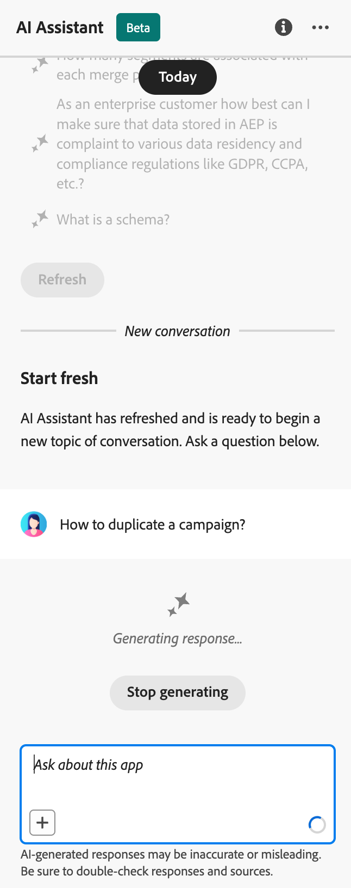
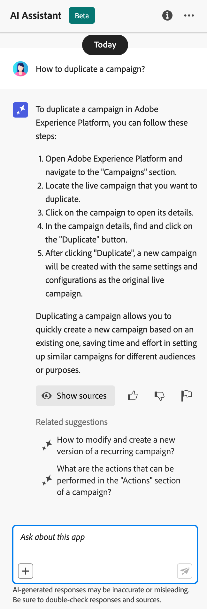

# 使用 AI 助理 {#ai-assistant}

AI 助理是使用者介面功能，可用於導覽和了解 Adobe 概念，並取得您特定環境的操作見解。 它適用於 Adobe Experience Cloud 的多種產品，包括 Adobe Journey Optimizer。

若要存取 AI 助理，請按一下頂端列上的圖示。AI 助理便會顯示在畫面右側區段。

>[!CAUTION]
>
>您必須同意 Adobe Experience Cloud 生成式 AI 使用者準則，然後才能使用 AI 助理。若要了解更多有關此協議的資訊，請參閱[此頁面](https://experienceleague.adobe.com/zh-hant/docs/experience-platform/ai-assistant/home){target="_blank"}。

在Adobe Journey Optimizer中，您可以存取下列使用案例：

* **產品知識** （一般可用性）

  產品知識問題與Adobe概念有關，與Adobe Journey Optimizer的各個方面相關。 產品知識問題的一些範例包括：

   * 一個Adobe Journey Optimizer沙箱中可以有多少個已上線活動？
   * 如何在Adobe Journey Optimizer中設定行銷活動？
   * 如何建立自訂動作以用於Adobe Journey Optimizer歷程？

* 歷程(Beta)中的&#x200B;**營運深入分析**

  操作insight問題與您的組織沙箱中的歷程物件有關。 insight操作問題或提示的一些範例包括：

   * Adobe Journey Optimizer中有多少個即時歷程？
   * 提供所有已排程歷程的清單
   * 過去7天內已建立多少歷程？

  >[!NOTE]
  >
  >您有權向AI助理詢問有關操作深入分析問題的唯一Adobe Journey Optimizer物件是&#x200B;**歷程**。 其中只會包含您目前所在沙箱的資料。

若要提出問題，請在畫面底部的欄位中輸入，然後按Enter鍵。

{width="30%" align="left"}

檢查答案，並使用&#x200B;**顯示來源**&#x200B;按鈕取得產品檔案的直接連結，並瞭解更多資訊。

{width="30%" align="left"}

使用「按讚」和「不滿意」來評價該答案。

若要了解如何使用 AI 助理、查看您可以使用 AI 助理實現的範例目標，以及了解 AI 助理的運作方式，請參閱 [Adobe Experience Platform 文件](https://experienceleague.adobe.com/zh-hant/docs/experience-platform/ai-assistant/home){target="_blank"}。
