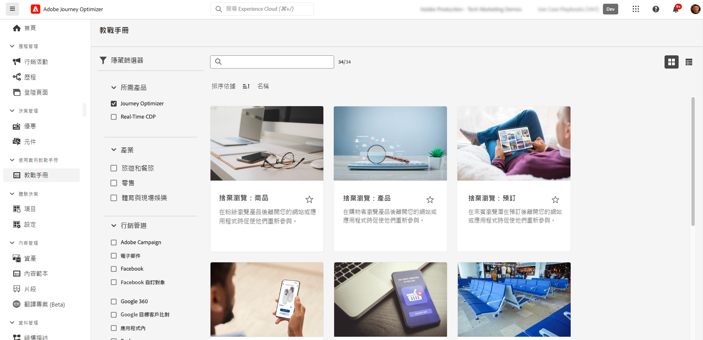

# AI 與智慧功能 {#ai-features}

Adobe Journey Optimizer運用人工智慧和機器學習的強大功能，協助您建立、最佳化和提供卓越的客戶體驗。 從產生個人化內容到預測最佳傳送時間，AI功能可簡化您的工作流程並最大化影響。 使用案例教戰手冊提供預先建立的範本，以快速實施常見行銷情境。

## AI 助理 {#ai-assistant}

AI Assistant是Adobe Journey Optimizer的對話指南。 使用它可立即取得有關產品功能的答案、有關您歷程的營運深入分析，並幫助導覽平台。

### 存取 AI 助理

按一下頂端列中的AI助理圖示，開啟熒幕右側的助理面板。

>[!IMPORTANT]
>
>您必須先同意[Adobe Experience Cloud Generative AI使用者指南](https://experienceleague.adobe.com/zh-hant/docs/experience-platform/ai-assistant/home){target="_blank"}，才能使用AI小幫手。

### AI助理可以做什麼

**產品知識** — 詢問有關Adobe Journey Optimizer功能和概念的問題：

* 「如何在Adobe Journey Optimizer中設定行銷活動？」
* 「如何建立自訂動作以用於歷程？」
* 「一個沙箱中可以有多少個已上線活動？」

**營運深入分析(Beta)** — 取得歷程的即時資訊：

* 「我有多少個即時歷程？」
* 「給我所有已排程歷程的清單」
* 「過去7天內已建立多少歷程？」

>[!NOTE]
>
>操作深入分析目前僅適用於&#x200B;**歷程**，並可反映您目前沙箱的資料。

### 如何使用AI助理

1. 在面板底部的文字欄位中輸入您的問題
2. 按Enter鍵以提交查詢
3. 檢閱AI產生的回應
4. 按一下&#x200B;**顯示來源**&#x200B;以存取相關檔案
5. 使用向上/向下縮圖為回應品質評分

{width="40%" align="left"}

[進一步瞭解Experience Platform中的AI小幫手](https://experienceleague.adobe.com/zh-hant/docs/experience-platform/ai-assistant/home){target="_blank"}

## 歷程最佳化的進階AI代理程式 {#ai-agents}

Adobe Journey Optimizer以AI Assistant的對話功能為基礎，提供專門的AI代理程式，為歷程最佳化和實驗提供深入分析和可操作的建議。

### Journey Agent {#journey-agent}

Journey Agent包含AI助理中的兩項技能：分析和建立。 使用它們來最佳化現有歷程，或從自然語言提示建立新歷程。

+++**需要的許可權**

* **檢視歷程** — 直接在AI助理中檢視歷程的深入分析
* **管理歷程** — 直接在AI助理中建立新的歷程
* **檢視區段** — 檢視對象的深入分析並搜尋現有對象
* **管理區段** — 直接在AI Assistant中建立新對象
* **檢視歷程事件、資料來源和動作** — 建立技能以搜尋歷程事件和自訂動作所需

+++

#### 歷程分析技能 {#journey-analyze-skill}

[歷程分析代理程式](https://experienceleague.adobe.com/zh-hant/docs/experience-cloud-ai/experience-cloud-ai/agents/ajo-agent-analyze){target="_blank"}可協助您透過自然語言分析將歷程效能最佳化：

+++**主要功能**

* **歷程流失分析** — 識別客戶在歷程中流失的位置及原因，偵測脫離模式
* **對象重疊偵測** — 分析多個歷程中的對象重疊，以防止疲勞過度鎖定目標
* **排程衝突偵測** — 識別以相同對象為目標的排程歷程之間的時間衝突
* **營運分析** — 取得提示型分析，例如「顯示所有即時歷程」或「超過X個歷程中使用了哪些對象」

+++

+++**範例提示**

* 「對歷程\[歷程名稱\]執行流失分析」
* 「歷程\[歷程名稱\]是否有任何排程衝突？」
* 「顯示歷程\[歷程名稱\]的對象重疊衝突」
* 「哪些對象用於超過5個歷程？」

+++

#### 歷程建立技能 {#journey-create-skill}

[歷程建立代理程式](https://experienceleague.adobe.com/en/docs/experience-cloud-ai/experience-cloud-ai/agents/ajo-agent-create){target="_blank"}可幫助您從自然語言提示建立歷程，將您的目標轉換為結構化的歷程設定：

+++**主要功能**

* **自然語言歷程建立** — 描述您想要的歷程並自動建立
* **以事件和受眾為基礎的開始** — 建立事件觸發、以受眾為基礎、業務事件或受眾資格歷程
* **條件邏輯** — 根據客戶屬性或行為建置分割路徑
* **多頻道傳訊** — 新增電子郵件、推播和簡訊動作
* **排程** — 設定開始日期與步驟之間的時間

+++

+++**範例提示**

* 「建立歷程，從客戶線上購買並傳送感謝推播通知時開始。」
* 「使用兩星期內的三封電子郵件，從12/20開始建立以我日間徒步旅行者受眾為目標的歷程。」
* 「建立歷程，此歷程從使用者進入我的商店位置開始，並根據他們是否有有效的電子郵件地址進行追蹤。」

+++

### 實驗代理程式 {#experimentation-agent}

[Experimentation Agent](https://experienceleague.adobe.com/zh-hant/docs/experience-cloud-ai/experience-cloud-ai/agents/agent-experiment){target="_blank"}可讓您跨網站、電子郵件、推播訊息和應用程式執行和管理數位實驗的方式，以現代化方式呈現：

+++**主要功能**

* **效能分析** — 清楚瞭解實驗中所發生的情況
* **深入分析產生** — 結果發生的說明
* **機會探索** — 後續動作指南
* **內容分析** — 檢查傳訊元素，瞭解某些處理優於其他處理方式的原因
* **建議產生** — 根據見解建議新的處理或調整

+++

+++**範例提示**

* 「哪些實驗是為了\[行銷活動名稱\]？」
* 「對於我的\[實驗名稱\]，目前採用何種處理方法？」
* 「我們從\[實驗名稱\]中學到了什麼？」
* 「您建議我在完成此實驗後做什麼？」
* 「最近的測試出現了哪些常見模式？」

+++

+++**需要的許可權**

* **檢視實驗** — 檢視AI Assistant中的實驗深入分析
* **管理實驗中繼資料** — 在AI助理中建立新的實驗

**注意：**&#x200B;可使用Journey Optimizer Experimentation Accelerator授權。

+++

### 其他AI代理

**Audience Agent** — 用於跨Adobe Experience Platform的對話式受眾探索和管理，包括重複偵測和大小追蹤。 [進一步瞭解Audience Agent](https://experienceleague.adobe.com/zh-hant/docs/experience-cloud-ai/experience-cloud-ai/agents/audience){target="_blank"}

**Agent Orchestrator** — 協調多個專業代理程式以解決複雜的多步驟行銷挑戰。 Orchestrator會自動決定要涉及的代理程式，並有效率地排序其工作。 [進一步瞭解Agent Orchestrator](https://experienceleague.adobe.com/zh-hant/docs/experience-cloud-ai/experience-cloud-ai/agents/agent-orchestrator){target="_blank"}

## 由AI支援的內容產生 {#content-generation}

使用創作AI建立跨多個管道的內容並加以個人化，可在維持品牌一致性的同時加速內容建立流程。 用於產生內容的AI助理可用於[電子郵件](../email/get-started-email.md)、[推播通知](../push/get-started-push.md)、[簡訊](../sms/get-started-sms.md)和[網頁](../web/get-started-web.md)體驗 — 協助您產生主旨列、內文、影像和完整的訊息變化。

### 主要功能

* **文字產生** — 根據您的品牌語調和目標建立吸引人的復本。 [使用AI產生文字](../content-management/generative-text.md)
* **影像產生** — 使用Adobe Firefly產生自訂影像。 [使用AI產生影像](../content-management/generative-image.md)
* **內容變數** — 產生A/B測試的多個變數。 [使用AI的內容實驗](../content-management/generative-experimentation.md)
* **品牌一致性** — 確保產生的內容符合您的品牌指導方針。 [評估品牌一致性](../content-management/brands-score.md)
* **範本支援** — 善用您現有的電子郵件範本。 [使用內容範本](../content-management/content-templates.md)

### 最佳做法

* **明確** — 提供清晰、詳細的提示，以獲得更好的結果
* **上傳品牌資產** — 使用PDF、影像或ZIP檔案（最多50MB）來維持品牌一致性
* **使用自訂範本** — 使用最多8至10個影像的品牌特定範本
* **提供意見回饋** — 速率輸出以協助改善AI模型
* **檢閱所有內容** — 發佈前請一律檢閱AI產生的內容是否準確

[進一步瞭解AI內容產生](../content-management/gs-generative.md)

## 傳送時間最佳化 {#send-time-optimization}

根據個別客戶行為模式，使用人工智慧來預測傳送每則訊息的最佳時間，最大化參與度。

### 運作方式

傳送時間最佳化會分析歷史參與資料（開啟和點按），以預測每個客戶何時最有可能與您的訊息互動。 系統會在您指定的時間範圍內自動排程交貨。

### 何時使用

| 最適合 | 不建議用於 |
|----------|---------------------|
| 行銷活動和電子報 | 時效性極強的營運訊息（訂單確認、密碼重設） |
| 促銷訊息 | 緊急通知（航班延誤、緊急警報） |
| 教育內容 | 具有特定時間需求的事件型訊息 |
| 參與行銷活動 | |

[深入了解傳送時間最佳化](../building-journeys/send-time-optimization.md)

## 用於決策的 AI 模型 {#ai-decisioning}

建立智慧型排名模型，自動最佳化要向每位客戶顯示的優惠方案，最大化業務目標。

### 模型型別

**自動最佳化** — 從客戶互動學習，以隨著時間自動改善優惠方案效能

**個人化最佳化** — 使用客戶設定檔屬性和行為來預測每個人的最佳優惠方案

### 需求

* 至少有2個具有足夠互動資料的優惠方案：
   * 100個以上的顯示事件
   * 5個以上的點選事件
   * 過去14天內
* 每個組織最多5個AI排名模型

[進一步瞭解用於決策的AI模型](../experience-decisioning/ranking/ai-models.md) | [建立AI排名模型](../experience-decisioning/ranking/create-ai-models.md)

## 使用 AI 的內容實驗 {#experimentation}

**Experiment Accelerator**&#x200B;可協助您使用AI導向的深入分析和建議更快速地執行實驗，更快速地識別成功內容變化。

主要功能：

* 自動產生多個內容變數
* 接收實驗設計的人工智慧建議
* 取得績效趨勢的早期指標
* 加速統計顯著性時間

[深入瞭解Experiment Accelerator](../content-management/experiment-accelerator-gs.md)

## 使用案例教戰手冊 {#playbooks}

使用案例教戰手冊是預先建立的工作流程，可幫助您快速實施常見行銷情境。 每個教戰手冊都包含現成的歷程、訊息、方案和區段。

### 教戰手冊的運作方式

1. **瀏覽** Playbook資料庫以尋找符合您目標的使用案例
2. **啟用**&#x200B;行動手冊以自動產生所有必要的資源
3. **自訂**&#x200B;產生的資產，以符合您的品牌和需求
4. **將**&#x200B;部署至生產環境或在開發沙箱中測試

### 可用的教戰手冊

瀏覽Journey Optimizer教戰手冊，瞭解常見情境，例如：

* 捨棄的購物車復原
* 新客戶的歡迎系列
* 購買後參與
* 生日訊息
* 重新參與行銷活動

+++**先決條件**

* 具有適當許可權的沙箱
* 電子郵件、推播和/或簡訊的頻道設定
* 建立歷程和訊息的使用者許可權

+++

[檢視所有可用的教戰手冊](https://experienceleague.adobe.com/docs/experience-platform/use-case-playbooks/playbooks/playbooks-list.html?lang=zh-Hant){target="_blank"} | [在Experience Platform檔案中進一步瞭解](https://experienceleague.adobe.com/docs/experience-platform/use-case-playbooks/playbooks/overview.html){target="_blank"}

## 其他AI功能 {#additional-capabilities}

### 影像至 HTML 轉換工具

使用AI支援的轉換技術，將靜態影像設計(JPEG、PNG)轉換為可編輯的HTML電子郵件範本。

[進一步瞭解影像至HTML](../email/image-to-html.md)

### 品牌一致性分數

使用AI支援的評分，測量語調、聲音和訊息的一致性，評估內容與品牌指引的符合程度。

[進一步瞭解品牌一致性](../content-management/brands-score.md)

## 常見問題 {#faq}

+++**我需要AI功能的哪些許可權？**

* 用於產生內容的&#x200B;**[AI小幫手](#content-generation)** — 需要[產生內容]許可權
* **[AI小幫手](#ai-assistant)**&#x200B;產品知識 — 需要與Adobe Generative AI使用者指南取得共識
* **[歷程分析代理程式](#journey-agent)** — 需要檢視/管理歷程和檢視/管理區段許可權
* **[歷程建立代理程式](#journey-create-agent)** — 需要管理歷程、檢視歷程事件/資料來源/動作、檢視區段及管理區段許可權
* **[Experimentation Agent](#experimentation-agent)** — 需要檢視實驗和管理實驗中繼資料許可權

所有AI代理程式都需要存取AI助理並同意Adobe Experience Cloud Generative AI使用者指南。

[深入了解權限](../administration/ootb-permissions.md)

+++

+++**AI 產生的內容是否一律正確？**

不可以。 一律檢閱[AI產生的內容](#content-generation)的正確性和品牌適當性。 使用意見回饋工具（拇指朝上/朝下）協助改善模型。

+++

+++**主要限製為何？**

* **[傳送時間最佳化](#send-time-optimization)** — 僅適用於歷程中的電子郵件和推播；需要30天的訓練期間
* **[AI內容產生](#content-generation)** — 不適用於直接郵件、內容卡、LINE或WhatsApp
* **[AI排名模型](#ai-decisioning)** — 每個組織最多5個模型；需要最少互動資料

+++

+++**如何存取這些功能？**

大部分的AI功能都包含在Adobe Journey Optimizer中。 某些功能（如[傳送時間最佳化](#send-time-optimization)或[AI代理程式](#ai-agents)）可能需要Adobe啟用。 如需特定授權和可用功能的詳細資訊，請聯絡您的Adobe代表。

+++
