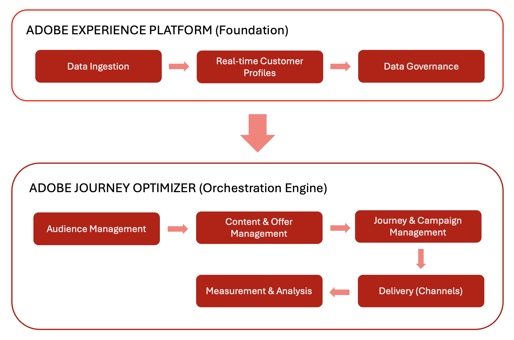
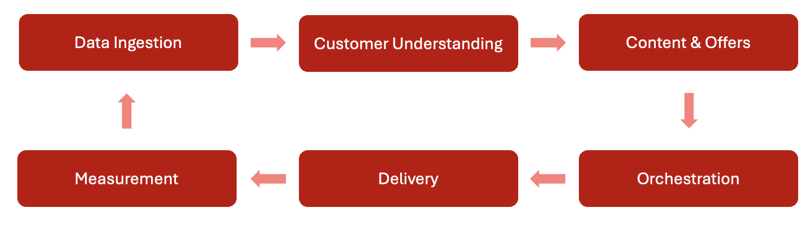
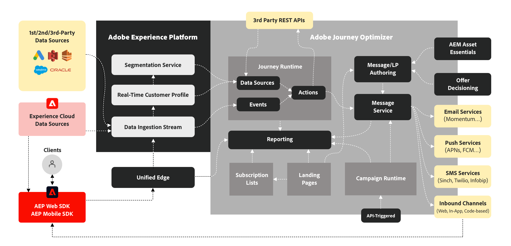

# 架構

## 重要特性：Adobe Journey Optimizer如何整合

Adobe Journey Optimizer (AJO)和Adobe Experience Platform (AEP)共同作業，以啟用大規模資料導向個人化。 此生態系統以持續流動的方式運作，收集、分析和套用資料，以建立個人化的客戶歷程。

### 基礎： Adobe Experience Platform (AEP)

Adobe Experience Platform作為骨幹，讓品牌得以集中客戶資料，並針對個人化體驗加以啟用。

- **資料平台**： AEP是以中央中樞的方式運作，收集、管理及建構客戶資料，以確保系統間的一致性。
- **資料擷取（來源）**：品牌會使用預先建立的聯結器，從各種系統（例如CRM平台、網站、行動應用程式和雲端儲存空間）匯入資料。 例如，Source聯結器會從電子商務平台擷取購買資料。
- **即時客戶個人檔案**：此功能會合併來自多個來源的資料以建立統一的個人檔案。 例如，設定檔結合電子郵件互動和店內購買，以提供客戶的完整檢視。
- **治理層**：此層控制資料存取、隱私權法規遵循和安全性。 它可確保品牌安全地運用客戶資料，同時遵守法規。

### 協調引擎：Adobe Journey Optimizer (AJO)

Adobe Journey Optimizer運用AEP的資料和深入分析，跨不同管道提供智慧型個人化客戶體驗。

- **客戶瞭解**：即時客戶設定檔可針對目標訊息啟用細分受眾。 例如，受眾包含透過購買歷史記錄識別的經常光顧的購物者。
- **內容與選件**：
   - **內容管理**：此功能提供跨管道建立、管理及個人化內容的工具。 例如，您可以為促銷電子郵件標題建置可重複使用的內容片段。
   - **決定管理**：此系統使用即時邏輯，為每個人選取最佳優惠或訊息。 例如，符合資格的客戶可能會根據其瀏覽歷史記錄收到折扣優惠。
- **歷程與行銷活動管理**：此功能會自動執行互動順序（歷程）或排程單次鎖定目標的訊息（行銷活動）。 例如，歷程在產品檢視後觸發後續電子郵件。
- **傳遞（連線）**：
   - **管道**：此功能會透過通訊平台（例如電子郵件、簡訊、推播通知和直接郵件）傳送訊息和優惠方案。
   - **目的地**：此功能會將設定檔和對象資料匯出至外部系統，以進行啟動或分析。 例如，對象資料會傳送至社群媒體平台以進行廣告目標定位。
- **測量與分析**：此功能透過報告追蹤客戶參與度和行銷活動績效。 這些見解有助於持續改進。

## 持續最佳化週期

此生態系統以持續最佳化週期運作。 資料可促進客戶瞭解，進而提供個人化內容和決策的資訊。 這些任務會被協調為歷程、跨管道傳送、測量成效，並隨著時間而精簡。

## 詳細架構

## 隱私權與安全性

Adobe Experience Cloud的隱私權及安全性實務適用於Adobe Journey Optimizer。 這些措施可確保遵守隱私權法規，讓品牌在維持客戶信任的同時，提供個人化體驗。
