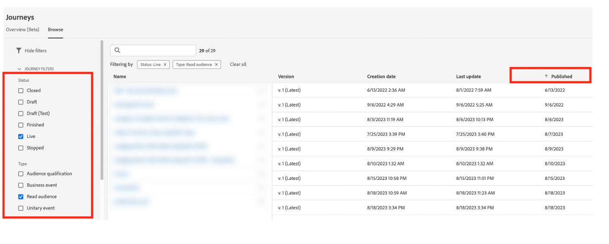

# 最佳做法 {#best-practices}

## 即時使用案例和全通路個人化指引 {#real-time-guidance}

在Identity Service 2.0更新後，即時身分拼接已經進化。

Adobe Journey Optimizer運用Identity Service來合併使用者的設定檔及個人化體驗。 因此，當您建立使用案例時，需要注意服務的一些重要方面。 品牌是指要為個人提供體驗。 身分圖表可讓行銷人員瞭解個人在不同管道中與哪些裝置相關聯。 圖表可以包含代表人員(CRMID)或網頁瀏覽器(ECID)的身分識別。 Identity Service會將這些資訊拼接在一起，以建立人員的「360度檢視」或合併的個人檔案。 這表示當某人瀏覽您的網站然後登入時，該工作階段的所有先前資料都可以與該登入使用者建立關聯。 此動作會以幾個不同的步驟進行：

1. 身分的初始拼接 — 當人員登入時，登入識別碼(CRMID)會與網頁瀏覽器識別碼（網頁或行動應用程式工作階段）相關聯：

   * 這可能需要30分鐘至4小時的時間完成。
   * 通常，此登入事件會產生身分圖表，將CRMID與ECID連結。

1. 初始拼接後，以兩個身分之一傳入的任何資料都將關聯到合併的個人檔案，並可用於在Journey Optimizer即時個人化。 使用最新行為資料更新設定檔最多可能需要1分鐘才能完成。 請參見此[頁面](https://experienceleague.adobe.com/docs/experience-platform/ingestion/streaming/overview.html?lang=zh-Hant)。

在建立使用案例時，請考量下列事項：

1. 品牌想要在放棄30分鐘後重新與網站訪客互動(例如 捨棄的購物車電子郵件)：

   將身分用於資料 — ECID。 如果您想要擷取在過去30分鐘內提供其電子郵件地址/應用程式安裝的全部訪客，則應使用Cookie型身分識別來啟動此歷程(ECID)。 這假設您的電子郵件地址或推播權杖或其他體驗位址已與ECID相關聯。

1. 網路、電子郵件、推播等全通路參與。：

   * 參與時，您的設定檔上必須有可用的通訊地址。 為確保此問題能一致且及時地發生，請確定您的資料與您要使用的身分相關聯。
   * 如果您需要使用新安裝的應用程式或瀏覽器工作階段中的資訊以及已知或登入的資訊，此通訊必須在這些身分拼接發生後傳送。 這可能會因客戶而異，我們鼓勵您至少等待30分鐘，以取得最大數量的設定檔。

## 使用歷程護欄進行縮放 {#scale}

本節將引導您瞭解如何根據以下兩個限制進行縮放：

* Journey Optimizer在歷程畫布中擁有50個活動的護欄。 此護欄旨在協助閱讀、QA和疑難排解。 當您將活動數量限制在10個以內時，歷程中的活動數量將會顯示在歷程畫布的左上角。

* 當您發佈歷程時，Journey Optimizer會自動進行擴充和調整，以確保最大的輸送量和穩定性。 當您在沙箱中一次接近100個即時歷程的里程碑時，您將看到此成就的介面中出現橘色覆蓋和警告符號。 如果您看到此通知，並需要一次將歷程擴充至 100 個即時歷程以上，請建立客戶服務支援服務單，我們將協助您達成目標。

<!--DOCAC-10977

* As you publish journeys, Journey Optimizer automatically scales and adjusts to ensure maximum throughput and stability. As you near the milestone of 500 live journeys at one time in a sandbox, you will see an orange overlay and warning sign appear in the interface on this achievement. If you see this notification and have a need to extend your journeys beyond 500 live journeys at a time, please create a ticket for customer care and we will help you reach your goals.-->

您可採納許多最佳實務，協助您在護欄內有效使用系統。

* 如果您已接近即時歷程的限制，您可以採取的第一個步驟是前往「**歷程**」下的「**概觀**」標籤，檢視過去24小時內有多少歷程處於作用中狀態，且這些歷程具有作用中設定檔。 您可以在此部分中檢查進入和退出歷程的設定檔數量，以確定。

  

* 接下來，在歷程詳細目錄區段中，您可以依狀態=「即時」和型別=「讀取對象」篩選所有歷程。 然後依發佈日期（從最舊到最新）排序。 按一下進入歷程，然後前往排程。 停止所有排程為&#x200B;**執行一次**&#x200B;或&#x200B;**儘快**&#x200B;且早於一天且只有一個動作的即時歷程。

  

* 如果您的&#x200B;**讀取對象**&#x200B;歷程只有一項動作、沒有等待/決定，或最佳化傳送時間，請考慮將其移至Journey Optimizer行銷活動。 行銷活動更適合單一步驟參與。 Campaign和歷程之間的主要差異之一，是您是否認為主動聽取使用者參與以決定下一個步驟並參與另一個動作很重要。
* 若要減少歷程中的活動數，請檢查條件步驟。 在許多情況下，您可以將條件移至區段定義或對象構成。
* 如果在多個歷程（同意檢查、隱藏）中重複相同的條件，請考慮將其移動作為區段定義的一部分。 例如，如果您有多個條件要檢查多個歷程中的「電子郵件地址不是空白」，請將該條件納入區段定義中。
* 如果您的歷程具有數個條件，需要分割對象以檢視每個步驟的數字，請考慮使用Customer Journey Analytics或其他更適合分析的報表解決方案。
* 如果您接近畫布上的節點限制，請考慮使用動態引數或內容來合併動作，以提供適當的內容而非明確的節點。

* 如果您有批次區段(A)的&#x200B;**讀取對象**&#x200B;歷程，而且您在歷程中使用對象串流區段(B)來排除（即執行A-B），請考慮將該邏輯移至分段邏輯，並將排除當做分段邏輯本身的一部分。