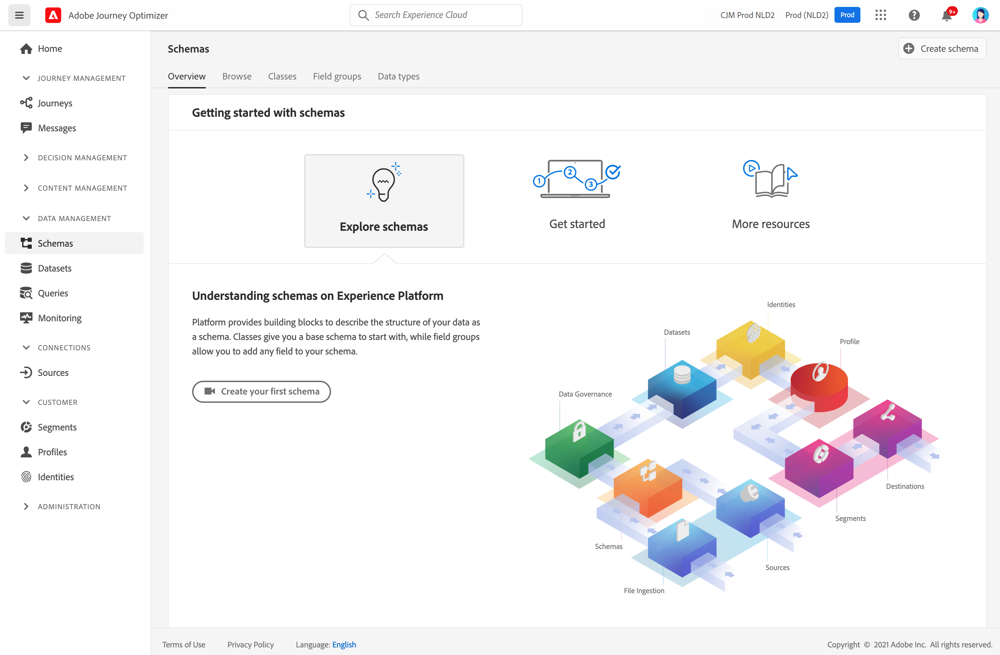

# 開始使用架構 {#schemas-gs}

方案是描述Experience Platform中資料的標準方法，它允許符合方案的所有資料在組織之間重複使用，而不會發生衝突，甚至在多個組織之間共用。

➡️ [瞭解如何建立和配置架構](#video-schema) （視頻）

模式是一組規則，用於表示和驗證資料的結構和格式。 在高級別上，架構提供了真實世界對象（如人）的抽象定義，並概述該對象的每個實例中應包括哪些資料（如名字、姓氏、生日等）。

瞭解如何在 [本文檔](https://experienceleague.adobe.com/docs/experience-platform/xdm/schema/composition.html){target=&quot;_blank&quot;

的 **架構** 工作區 [!DNL Adobe Journey Optimizer] 用戶介面允許您管理體驗資料模型(XDM)資源，包括架構、類、架構欄位組和資料類型。 您可以查看和瀏覽由Adobe提供的核心資源，並為您的組織建立自定義資源和方案。

瞭解如何在中使用架構用戶介面 [本文檔](https://experienceleague.adobe.com/docs/experience-platform/xdm/ui/overview.html){target=&quot;_blank&quot;

使用架構編輯器建立架構的逐步文檔，請參見 [此頁](https://experienceleague.adobe.com/docs/experience-platform/xdm/tutorials/create-schema-ui.html?lang=zh-Hant){target=&quot;_blank&quot;

## How-to視頻{#video-schema}

瞭解如何建立結構、新增欄位群組、建立及設定自訂欄位群組。

>[!VIDEO](https://video.tv.adobe.com/v/334461?quality=12)

**另請參閱**

* [建立模式、資料集和接收資料以添加Journey Optimizer的Test配置檔案](../building-journeys/creating-test-profiles.md)
* [XDM系統概述](https://experienceleague.adobe.com/docs/experience-platform/xdm/home.html?lang=zh-Hant){target=&quot;_blank&quot;
* [資料建模的最佳做法](https://experienceleague.adobe.com/docs/experience-platform/xdm/schema/best-practices.html){target=&quot;_blank&quot;
* [使用架構註冊表API建立架構](https://experienceleague.adobe.com/docs/experience-platform/xdm/tutorials/create-schema-api.html){target=&quot;_blank&quot;
* [使用架構編輯器定義兩個架構之間的關係](https://experienceleague.adobe.com/docs/experience-platform/xdm/tutorials/relationship-ui.html){target=&quot;_blank&quot;
