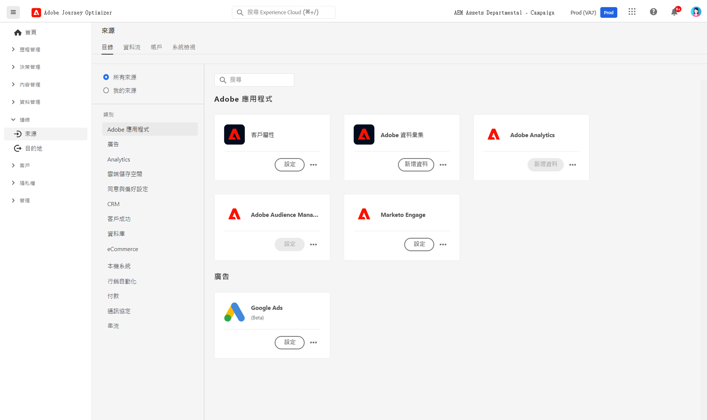

# 開始使用來源連接器 {#sources-gs}

Adobe Journey Optimizer 可讓您從外部來源擷取資料，同時可以使用 Platform 服務來建立、加標籤及增強傳入資料。 您可以從多種來源 (如 Adobe 應用程式、雲端型的儲存空間、資料庫和其他許多來源) 內嵌資料。 

在此影片了解來源連接器，以及如何在 Journey Optimizer 進行設定。

>[!VIDEO](https://video.tv.adobe.com/v/335919?quality=12)

在[Adobe Experience Platform檔案](https://experienceleague.adobe.com/docs/experience-platform/sources/home.html?lang=zh-Hant){target="_blank"}中進一步瞭解如何使用Source聯結器從外部來源擷取資料。
