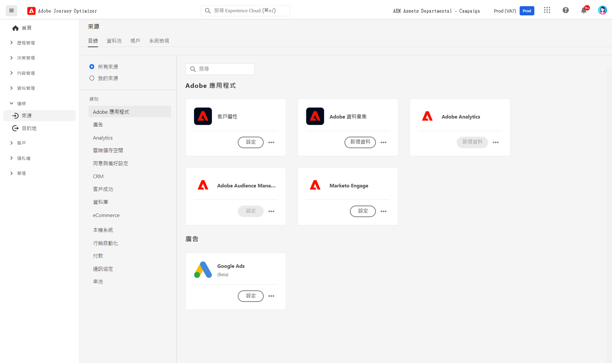

# 開始使用來源連接器 {#sources-gs}

>[!BEGINSHADEBOX]

**在此頁面上：**&#x200B;瞭解來源聯結器是什麼，以及它們如何將您的CRM、雲端儲存空間和資料庫中的資料帶入Adobe Journey Optimizer，讓您能夠支援個人化、資料導向的客戶歷程。

>[!ENDSHADEBOX]

## 什麼是來源？ {#what-is-source}

**來源**&#x200B;是將外部資料帶入 Adobe Journey Optimizer 的連接器。 來源可讓您從已使用的系統 (例如 CRM 平台、雲端儲存空間或資料庫) 匯入客戶資訊，並讓該資料可用於建立個人化的客戶歷程。

請將來源視為 Journey Optimizer 與外部資料系統之間的橋樑。 它們會自動同步資料，讓您一律擁有最新的客戶資訊，以支援行銷活動。

## 來源為何重要 {#why-sources-matter}

在 Journey Optimizer 中建立個人化、資料導向的客戶體驗時，來源至關重要。 原因如下：

* **整合式客戶檢視** - 結合來自多個系統的資料，以檢視每個客戶的完整情況
* **即時個人化** - 使用最新資料在您的歷程中及時傳遞相關訊息
* **自動資料同步** - 保持客戶資訊最新狀態，無需手動匯入資料
* **有效的工作流程** - 連線一次，然後資料會自動流入您的歷程

例如，您可以使用來源從您的電子商務平台匯入購買記錄，然後建立歷程，以根據客戶已購買的商品傳送個人化產品推薦。

## 您可以使用來源做什麼 {#sources-use-cases}

Journey Optimizer 中來源的常見使用案例包括：

* **從 CRM 系統匯入客戶資料** - 從 Salesforce 或 Microsoft Dynamics 等平台同步連絡資訊、偏好設定和參與歷史記錄
* **連線購買資料** - 從電子商務平台匯入訂單歷史記錄和產品偏好設定，以個人化產品建議
* **整合忠誠度方案資料** - 存取點餘額與階層資訊，以獎勵最常參與的客戶
* **同步行為資料** - 匯入網站互動和應用程式使用模式以觸發相關歷程
* **更新輪廓屬性** - 讓客戶輪廓與雲端儲存空間或資料庫中的資料保持最新

## 常見來源類型 {#source-types}

Journey Optimizer 支援各種類型的來源，以便連線至您現有的系統：

**Adobe 應用程式：**
* Adobe Analytics
* Adobe Audience Manager
* Adobe Campaign
* Adobe Commerce

**雲端儲存空間**
* Amazon S3
* Azure Blob 儲存體
* Google Cloud Storage
* SFTP

**資料庫：**
* Amazon Redshift
* Google BigQuery
* Microsoft SQL Server
* MySQL
* PostgreSQL

**CRM 與行銷自動化：**
* Microsoft Dynamics
* Salesforce
* Salesforce Marketing Cloud

➡️請在 [Experience Platform 來源目錄](https://experienceleague.adobe.com/docs/experience-platform/sources/home.html?lang=zh-Hant#sources-catalog){target="_blank"}中，檢視完整清單

## 開始之前 {#prerequisites}

請在設定來源之前，先確定您擁有：

* **合適權限** — 存取 Adobe Experience Platform，即可管理來源
* **來源系統認證** — 您想連線的外部系統驗證詳細資料
* **瞭解資料** — 瞭解您還需要哪些資料欄位，如何把資料對應至 Journey Optimizer 設定檔

➡️瞭解[存取控制和權限](../administration/permissions.md)

## 來源如何運作 {#how-sources-work}

Adobe Journey Optimizer 使用 Adobe Experience Platform 的來源框架。 以下是基本工作流程：

1. **Connect** — 設定外部資料系統的驗證
2. **選取資料** — 選擇想匯入的資料，即可同步處理資料
3. **對應欄位** — 定義外部資料欄位，該如何對應至 Journey Optimizer 設定檔屬性
4. **排程** — 設定自動資料重新整理區間
5. **監視** — 追蹤資料流量，解決任何同步處理問題

一旦完成設定，就會在背景自動執行來源，讓您的客戶資料保持最新狀態，可供歷程使用。

>[!NOTE]
>
>**協調行銷活動的資料擷取** - 對於搭配協調行銷活動使用的檔案式變更資料擷取來源，「`_change_request_type`」欄位為必填項。 支援的值為 `u` (更新插入) 或 `d` (刪除)。 這些值必須為小寫 `u` 和 `d`，而非大寫 `U` 和 `D`。 [詳細瞭解協調行銷活動的護欄和限制](../orchestrated/guardrails.md)

## 了解更多 {#learn-more}

請觀看此影片，瞭解來源連接器，還有如何在 Journey Optimizer 中設定它們：

>[!VIDEO](https://video.tv.adobe.com/v/335919?quality=12)

如需設定和管理來源的詳細資訊，請參閱 [Adobe Experience Platform 來源文件](https://experienceleague.adobe.com/docs/experience-platform/sources/home.html?lang=zh-Hant){target="_blank"}。

## 後續步驟 {#next-steps}

現在您已瞭解來源以及其重要的原因：

* 探索[來源目錄](https://experienceleague.adobe.com/docs/experience-platform/sources/home.html?lang=zh-Hant#sources-catalog){target="_blank"}，尋找您系統的連接器
* 瞭解如何[建立來源連線](https://experienceleague.adobe.com/docs/experience-platform/sources/ui-tutorials/create/overview.html?lang=zh-Hant){target="_blank"}
* 瞭解[資料對應和轉換](https://experienceleague.adobe.com/docs/experience-platform/sources/ui-tutorials/dataflow/overview.html?lang=zh-Hant){target="_blank"}
* 瞭解如何[在歷程中使用匯入的資料](../building-journeys/journey-gs.md)
* 檢閱[開始使用資料管理](../data/gs-data.md)概觀，瞭解來源如何融入 Journey Optimizer 的完整資料設定
