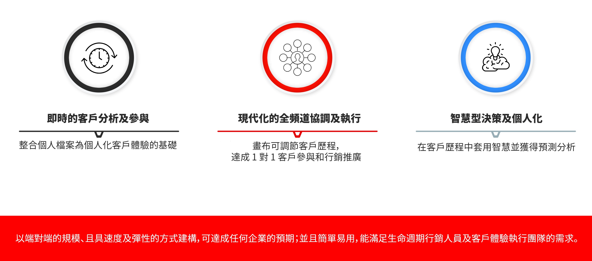
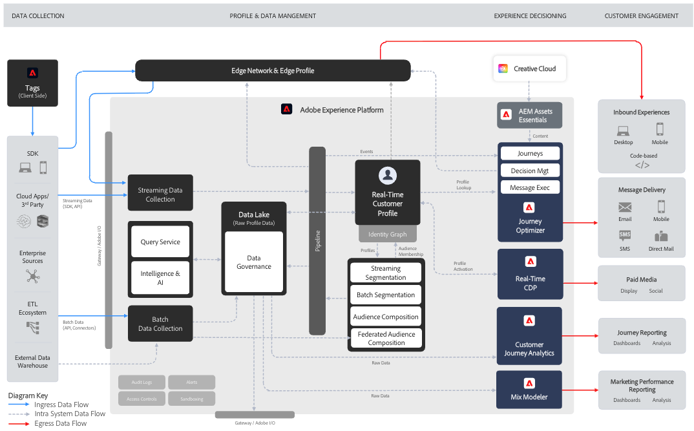
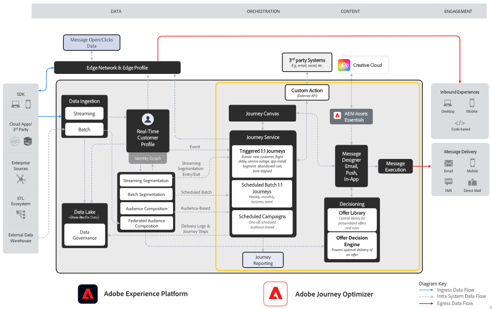

# 開始使用 Journey Optimizer {#cjm-gs}

## 什麼是 [!DNL Adobe Journey Optimizer]？{#about-cjm}

[!DNL Adobe Journey Optimizer] 協助公司向其客戶傳遞連通、情境式和個人化的體驗。客戶歷程是指從第一次接觸直至客戶離開的客戶與品牌互動的整個過程。從認知階段開始，客戶在這個階段瞭解品牌並開始參與。 然後，客戶將進一步與品牌互動、造訪線上和實體網站，並進行購買、傳送訊息或貼文檢視。

[!DNL Adobe Experience Platform] 上內建的原生 [!DNL Adobe Journey Optimizer] 結合並統一即時客戶輪廓、API 優先開放框架、集中式產品建議決策、人工智慧 (AI) 和機器學習 (ML)，以進行個人化和最佳化。Journey Optimizer 可讓品牌在整個客戶歷程中，以規模、速度和彈性的方式，聰明地決定下一個最佳的互動方式。 透過[!DNL Adobe Journey Optimizer]，公司可以在相同應用程式中建立並傳送排程行銷活動 (例如零售商店的每週促銷活動) 和量身打造的個別通訊 (例如忠誠應用程式客戶可能已查看過該項目，且該項目先前無存貨的推播通知)。

➡️ [探索 Journey Optimizer](https://experienceleague.adobe.com/docs/journey-optimizer-learn/tutorials/introduction-to-journey-optimizer/introduction.html?lang=zh-Hant){target="_blank"}（影片）

<!-- Use [!DNL Adobe Journey Optimizer] to build multi-step customer journeys that initiate a sequence of interactions, offers, and messages across channels in real time. This approach ensures customers are engaged at the optimal moments based on their actions and relevant business signals. Learn how to build journeys in [this section](../building-journeys/journey-gs.md).

You can also create audience-based campaigns to send messages.-->

## 使用案例 {#use-cases}

* 行銷人員可使用[!DNL Adobe Journey Optimizer]來傳送個人化通訊和以客群為基礎的批次通訊。 例如，服裝商店通常會向上週購買過產品的所有客戶傳送購買後調查。 由於天氣惡劣，少數貨物出現延誤。 在發現有客戶尚未收到發貨後，服裝店可以將他們排除在定時傳送的客戶滿意度調查之外，而改為向他們傳送一封個人化電子郵件，對延誤表示歉意，並根據客戶過去的購買情況，為其提供產品建議和折扣代碼。

  行銷人員也可以使用應用程式來傳送即時行為型通訊。 例如，同一家零售商可以向當下進入商店停車場的忠誠客戶傳送推播通知，告訴對方符合其尺寸的毛衣已有庫存，以此吸引其進店消費。

* 參與客戶體驗的非行銷人員 (例如營運團隊和客戶支援) 可使用[!DNL Adobe Journey Optimizer]管理各種工作，例如營運通知，甚至監視上架流程。 舉例來說，遊樂園可以是公園訪客下載行動應用程式作為其公園體驗的一部分。 維護人員可使用[!DNL Adobe Journey Optimizer]將因維護而關閉的騎行活動通知公園訪客。

## 主要功能 {#key-capabilities}

[!DNL Adobe Journey Optimizer] 是一款敏捷且可擴充的應用程式，可跨任何應用程式、裝置或頻道，建立及提供個人化、連線且及時的客戶體驗。

主要功能包括：

* **即時客戶分析 &amp; 參與** - 整合式輪廓會融合客戶接觸點上所有來源的即時資料，包括行為、異動、財務和營運資料，以最佳化客戶在其時間內的個人和情境式體驗。

* **現代全通路協調與執行** — 在單一畫布上協調並最佳化1:1客戶參與和行銷推廣的客戶歷程，以協助品牌在客戶生命週期中提供更多價值。 在[!DNL Adobe Journey Optimizer]中設計的客戶歷程可以是動態且以事件為基礎，以協助品牌對即時訊號做出反應，並將這些互動與已排程的行銷活動進行連結，以便針對要傳送客戶的通訊、傳送時間及透過哪些頻道做出正確的決定。

* **智慧型決策與個人化** - 品牌可套用集中式決策，並將人工智慧與機器學習整合至整體客戶體驗中的設定預測性深入分析，讓自動化決策與大規模最佳化體驗更加輕鬆。產品建議决策可透過 [!DNL Adobe Journey Optimizer] 大規模提供跨頻道的集中式產品建議。

>[!NOTE]
>
>* 您環境中可用的元件和功能取決於您的[許可權](../administration/permissions.md)和您的[授權套件](https://helpx.adobe.com/tw/legal/product-descriptions/adobe-journey-optimizer.html){target="_blank"}。 如有任何問題，請聯絡您的 Adobe 客戶成功經理或 Adobe 代表。
>
>* Adobe Experience Cloud 的一般隱私權准則和流程適用於 [!DNL Journey Optimizer]。 [進一步瞭解 Adobe Experience Cloud 隱私權](https://www.adobe.com/tw/privacy/experience-cloud.html){target="_blank"}。

## 架構 {#architecture}

在下圖中了解 [!DNL Adobe Journey Optimizer] 的基礎架構、整合點，以及 [!DNL Journey Optimizer] 和 [!DNL Experience Platform] 之間的關係。

Adobe Experience Platform 是一款功能強大、靈活、開放且集中的資料基礎，可用來收集、標準化、管理、應用 AI 洞察力，並統一資料，以便提供服務周到且內容相關的數位客戶體驗。

{width="70%" zoomable="yes"}

以下四大應用程式都是透過原生方式，建構於體驗平台：Adobe 即時客戶資料平台、Journey Optimizer、客戶歷程分析和 Adobe Mix Modeler。

Journey Optimizer 的核心功能和服務主要是按照 Adobe Experience Platform 的基礎元件運行，其中還包括即時客戶設定檔。雖然 Journey Optimizer 可以順利運行，還可與即時 CDP 和客戶歷程分析互通，但也可以當成獨立應用程式獨立使用。

{width="70%" zoomable="yes"}

### Adobe Journey Optimizer藍圖

數位體驗藍圖提供系統和資料流程架構圖，以協助您更清楚瞭解Adobe Experience Platform和應用程式的整合與實作方式。 藍圖提供系統間和元件資料與內容流程、操作順序和相依性的視覺化表示，以協助告知Adobe Experience Platform和應用程式的使用案例設計和架構。

檢視[Adobe Journey Optimizer Blueprint](https://experienceleague.adobe.com/en/docs/blueprints-learn/architecture/customer-journeys/journey-optimizer/journey-optimizer-overview){target="_blank"}。

>[!MORELIKETHIS]
>
>* [開始的關鍵步驟](quick-start.md)
>* [設計歷程並傳送訊息](../building-journeys/journey-gs.md)
>* [即時報告](../reports/live-report.md)
>* [Journey Optimizer 安全性概觀](https://www.adobe.com/content/dam/cc/en/security/pdfs/AJO_SecurityOverview.pdf) (PDF)
>* [Journey Optimizer產品說明](https://helpx.adobe.com/legal/product-descriptions/adobe-journey-optimizer.htm){target="_blank"}
