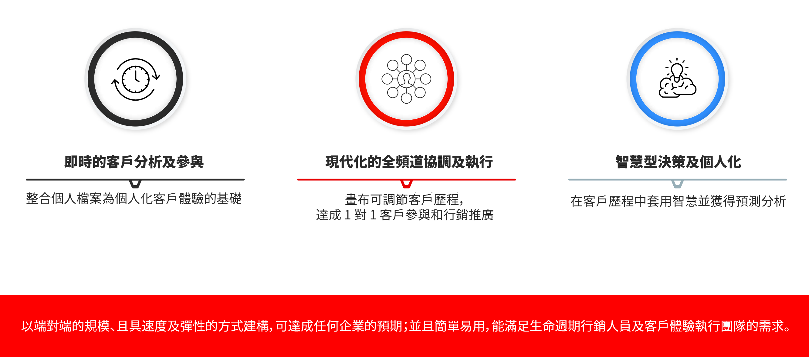

# 開始使用 Journey Optimizer {#cjm-gs}

本頁會介紹Adobe Journey Optimizer：其功能、用途、主要功能，以及它如何融入Adobe Experience Platform架構。 這是新使用者建議使用的起點。

## 什麼是 [!DNL Adobe Journey Optimizer]？{#about-cjm}

[!DNL Adobe Journey Optimizer]是企業應用程式，可跨所有管道和接觸點建立及提供連線、情境式和個人化的客戶體驗。 它原生建置於[!DNL Adobe Experience Platform]，並運用統一的即時客戶設定檔、API優先的開放架構、集中式優惠決定和AI/ML功能。 Journey Optimizer可讓品牌從單一應用程式大規模協調排程行銷活動和即時事件觸發的通訊。 如此一來，有意義的品牌體驗就能提升客戶忠誠度和終身價值。

本指南適用於Journey Optimizer的新手行銷從業人員、營運團隊及管理員。

➡️ [探索 Journey Optimizer](https://experienceleague.adobe.com/docs/journey-optimizer-learn/tutorials/introduction-to-journey-optimizer/introduction.html?lang=zh-Hant){target="_blank"}（影片）

<!--
 Use [!DNL Adobe Journey Optimizer] to build multi-step customer journeys that initiate a sequence of interactions, offers, and messages across channels in real time. This approach ensures customers are engaged at the optimal moments based on their actions and relevant business signals. Learn how to build journeys in [this section](../building-journeys/journey-gs.md).

You can also create audience-based campaigns to send messages.
-->

## 使用案例 {#use-cases}

這些範例說明Journey Optimizer的功能如何跨不同角色、產業和管道搭配運作。

### 延遲出貨復原 {#uc-delayed-shipment}

**角色：**&#x200B;行銷人員| **核心功能：** [統一設定檔+對象排除](../audience/get-started-profiles.md)

服裝商店通常會向上週購買過產品的所有客戶傳送購買後調查。 由於天氣惡劣，少數貨物出現延誤。 在發現有客戶尚未收到發貨後，服裝店可以將他們排除在定時傳送的客戶滿意度調查之外，而改為向他們傳送一封個人化電子郵件，對延誤表示歉意，並根據客戶過去的購買情況，為其提供產品建議和折扣代碼。

[開始使用行銷活動](../campaigns/get-started-with-campaigns.md)

### 即時店內參與 {#uc-instore}

**角色：**&#x200B;行銷人員| **核心功能：** [地理圍欄觸發+推播](../push/get-started-push.md)

同一retailer可以傳送推播通知，告訴對方符合客戶尺寸的毛衣已有庫存，以此吸引即時進入商店停車場的忠實客戶。

[開始使用推播通知](../push/get-started-push.md)

### 購物車放棄復原 {#uc-cart}

**角色：**&#x200B;行銷人員| **核心功能：** [事件觸發的多步驟歷程](../building-journeys/journey-gs.md)

當客戶將商品新增到線上購物車但沒有完成購買就離開時，Journey Optimizer會即時偵測事件並自動開始復原歷程。 客戶會收到個人化電子郵件，提醒他們留意的專案。 如果他們沒有在24小時內點進，則會傳送後續推播通知 — 根據瀏覽記錄和忠誠度狀態進行個人化。

[建立您的第一個歷程](../building-journeys/journey-gs.md)

### 串流服務歡迎系列 {#uc-welcome}

**角色：**&#x200B;行銷人員| **核心功能：** [事件觸發的歡迎歷程](../building-journeys/journey-gs.md)

當客戶訂閱串流服務時，Journey Optimizer會偵測註冊事件並立即開始多步驟歡迎歷程。 客戶會收到一封歡迎電子郵件，鼓勵他們第一次開啟應用程式。 如果48小時內未偵測到登入活動，則會傳送後續推播通知，其中包含根據註冊期間使用者宣告的興趣提供個人化內容建議，從第一天起，將被動訂閱者轉變為主動參與的使用者。

[建立您的第一個歷程](../building-journeys/journey-gs.md)

### 含指示的預訂提醒 {#uc-reservation}

**角色：**&#x200B;行銷人員| **核心功能：** [已排程+位置感知訊息](../campaigns/get-started-with-campaigns.md)

旅館業品牌在每位客人預訂前的一小時及時傳送提醒。 通知包括來賓名稱、預訂時間，以及基於地點的地點地點地點導向 — 由客戶設定檔和預訂資料自動組合，行銷團隊無需手動操作。

[開始使用行銷活動](../campaigns/get-started-with-campaigns.md)

### 主動式服務中斷通知 {#uc-outage}

**角色：**&#x200B;操作| **核心功能：** [大規模自動選取對象](../audience/about-audiences.md)

當服務中斷發生時，Journey Optimizer會根據其帳戶資料和使用模式，自動識別受影響的客戶。 這些客戶會收到主動通知，確認問題並概述後續步驟，將潛在的負面體驗轉變為大規模提供的透明和信任時刻。

[建立您的第一個歷程](../building-journeys/journey-gs.md)

### AI支援的促銷活動 {#uc-ai-campaign}

**角色：**&#x200B;行銷人員| **核心功能：** [AI內容產生+實驗](ai-features.md)

規劃產品推出的零售品牌會使用Journey Optimizer的AI助理，在幾分鐘內產生多個主旨行與正文變化（以自然語言提示及其上傳的品牌指導方針為指引）。 內建內容實驗會自動在初始受眾範例中識別表現最佳的變體。 成功訊息隨後會部署到其餘的收件者，無需額外的撰稿工作即可最大化參與度。

[探索AI和智慧型功能](ai-features.md) | [瞭解內容實驗](../content-management/experiment-accelerator-gs.md)

### 透過行動應用程式維護警報 {#uc-maintenance}

**角色：**&#x200B;操作| **核心功能：** [非行銷歷程協調](../building-journeys/journey-gs.md)

非行銷人員（例如營運團隊和客戶支援）可以使用[!DNL Adobe Journey Optimizer]來管理營運通知或監視上線流程。 例如，遊樂園：訪客下載行動應用程式作為其體驗的一部分：維護人員可以使用Journey Optimizer將因維護而關閉的騎行活動通知公園訪客。

[建立您的第一個歷程](../building-journeys/journey-gs.md)

## 主要功能 {#key-capabilities}

[!DNL Adobe Journey Optimizer] 是一款敏捷且可擴充的應用程式，可跨任何應用程式、裝置或頻道，建立及提供個人化、連線且及時的客戶體驗。

主要功能包括：

### Real-time Customer Insights &amp; Engagement

整合式設定檔會融合客戶接觸點上所有來源的即時資料，包括行為、異動、財務和營運資料，以最佳化客戶在其時間內的個人和情境式體驗。 [瞭解設定檔與對象](../audience/get-started-profiles.md)

### 現代全通路協調與執行

在單一畫布上協調並最佳化1:1客戶參與和行銷推廣的客戶歷程，以協助品牌在客戶生命週期中提供更多價值。 在[!DNL Adobe Journey Optimizer]中設計的客戶歷程可以是動態且以事件為基礎，以協助品牌對即時訊號做出反應，並將這些互動與已排程的行銷活動進行連結，以便針對要傳送客戶的通訊、傳送時間及透過哪些頻道做出正確的決定。 內嵌式內容建立工具（包括拖放式視覺化設計工具、可重複使用的範本、內容片段及個人化編輯器）可讓團隊直接在同一個工作流程中為每個管道製作、個人化及管理訊息。 [建立您的第一個歷程](../building-journeys/journey-gs.md) | [設計您的內容](../../rp_landing_pages/content-management-landing-page.md)

### 智慧型決策與Personalization

品牌可套用集中決定，並整合人工智慧和機器學習，以在客戶體驗中設定預測性深入分析，更輕鬆自動化決策並大規模最佳化體驗。 決策可透過[!DNL Adobe Journey Optimizer]大規模提供跨頻道的集中式優惠。 [探索Offer Decisioning](../offers/get-started/starting-offer-decisioning.md) | [探索AI功能](ai-features.md)

## 可用性與授權 {#availability}

本檔案涵蓋Journey Optimizer的最新版本，除非另有說明，否則同時適用於B2C和B2B edition使用者。 目前環境可用元件和功能取決於[使用權限](../administration/permissions.md)，還有您的[授權封裝](https://helpx.adobe.com/tw/legal/product-descriptions/adobe-journey-optimizer.html){target="_blank"}。如有任何問題，請聯絡您的 Adobe 客戶成功經理或 Adobe 代表。

Adobe Experience Cloud 的一般隱私權准則和流程適用於 [!DNL Journey Optimizer]。 [進一步瞭解 Adobe Experience Cloud 隱私權](https://www.adobe.com/tw/privacy/experience-cloud.html){target="_blank"}。

## 架構 {#architecture}

Journey Optimizer是以原生方式建置在Adobe Experience Platform上，可共用其資料基礎、身分圖表和治理服務 — 如需這些系統如何搭配運作的詳細逐步解說，請參閱[瞭解Journey Optimizer](understanding-ajo.md)。

>[!MORELIKETHIS]
>
>* [開始的關鍵步驟](quick-start.md) — 適用於管理員、行銷人員和資料工程師的角色式快速入門手冊。
>* [開始使用資料管理](../data/gs-data.md) — 瞭解如何在Journey Optimizer中擷取、統一及啟用資料。
>* [設計歷程並傳送訊息](../building-journeys/journey-gs.md) — 建立您的第一個客戶歷程並設定頻道動作。
>* [即時報告](../reports/live-report.md) — 即時監視行銷活動和歷程績效。
>* [Journey Optimizer簡介教學課程](https://experienceleague.adobe.com/zh-hant/docs/journey-optimizer-learn/tutorials/introduction-to-journey-optimizer/introduction){target="_blank"} — 核心Journey Optimizer概念的引導式影片逐步解說。
>* [Journey Optimizer安全性概覽](https://www.adobe.com/content/dam/cc/en/security/pdfs/AJO_SecurityOverview.pdf) (PDF) — 安全性架構、資料保護和法規遵循詳細資料。
>* [Journey Optimizer產品說明](https://helpx.adobe.com/tw/legal/product-descriptions/adobe-journey-optimizer.html){target="_blank"} — 正式授權條款與版本功能細目。
