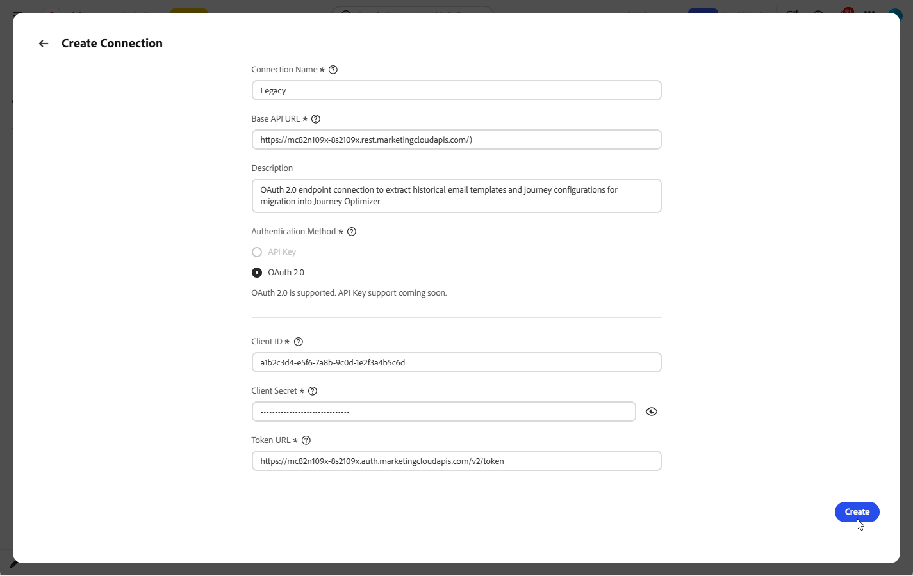
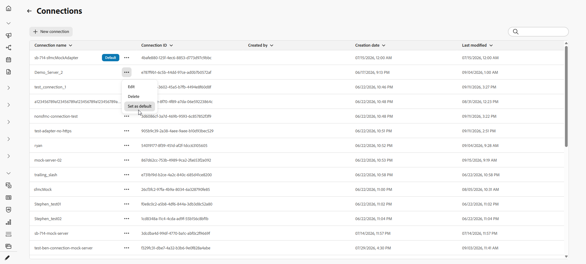
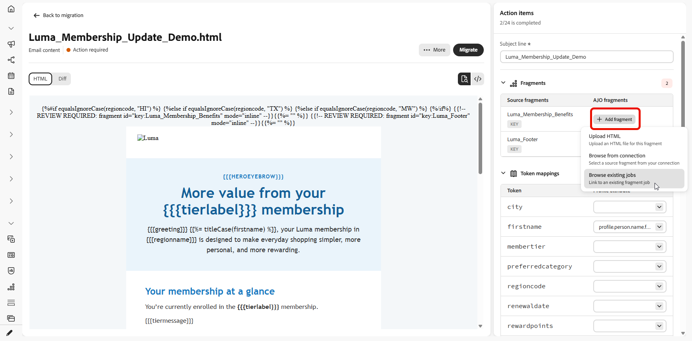
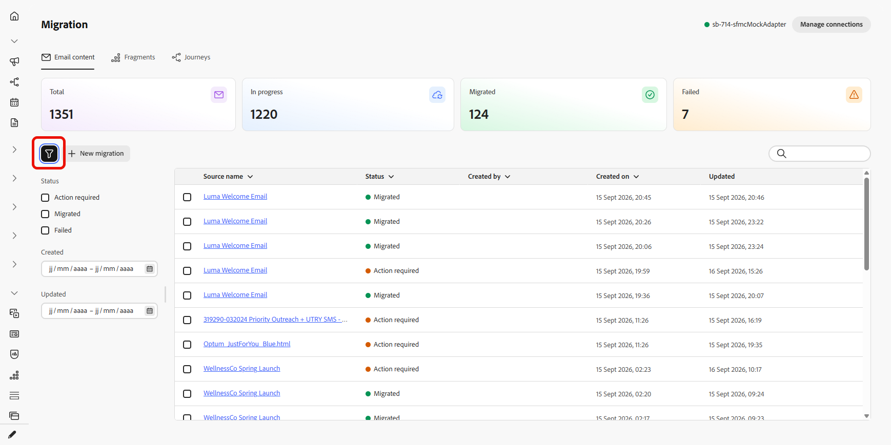

# 移轉內容和歷程 {#migrate-content-and-journeys}

>[!AVAILABILITY]
>
>此功能僅適用於部分組織 (限額推出)。 若想取得存取權，請聯絡您的 Adobe 代表。

如果您從另一個行銷平台移至[!DNL Journey Optimizer]，您不必從空白顯示窗開始。 Journey Optimizer包含專用工作區，可匯入您現有的電子郵件內容和歷程。 它會將其轉換為[!DNL Journey Optimizer]內容範本和歷程，以便您可以擷取離開的位置，而不是從頭開始重建所有內容。

若要將您的內容和歷程移轉至Journey Optimizer，您需要下列許可權：管理行銷活動、管理歷程、管理訊息、管理區段、管理程式庫專案、檢視和管理沙箱，以及管理AJO整合設定。 [進一步瞭解角色和許可權](../administration/permissions.md)

您可以直接從[!DNL Journey Optimizer]首頁存取此工作區。

## 設定連線 {#set-up-a-connection}

>[!CONTEXTUALHELP]
>id="ajo_migration_connection_name"
>title="連線名稱"
>abstract="識別來源系統的說明性名稱 (例如「Marketing-Automation-Prod」)。 開頭必須是字母，並且只能包含英數字元、底線或連字號 (4 至 50 個字元)。"

>[!CONTEXTUALHELP]
>id="ajo_migration_base_api_url"
>title="基本API URL"
>abstract="API 的根 URL，不含資源路徑或查詢字串，例如 https://api.example.com。"

>[!CONTEXTUALHELP]
>id="ajo_migration_authentication_method"
>title="選擇驗證方法"
>abstract="API 金鑰會隨每個請求傳送單一認證，而 OAuth 2.0 則會使用權杖型通訊協定，該通訊協定更適合企業和第三方 API。"

>[!CONTEXTUALHELP]
>id="ajo_migration_client_id"
>title="用戶端 ID"
>abstract="您的應用程式的公用識別碼，它會在您向授權伺服器註冊時核發。"

>[!CONTEXTUALHELP]
>id="ajo_migration_client_secret"
>title="使用者端密碼"
>abstract="只有應用程式和授權伺服器才知道的機密認證。 切勿在用戶端程式碼中公開。"

>[!CONTEXTUALHELP]
>id="ajo_migration_token_url"
>title="權杖 URL"
>abstract="為用戶端認證流程核發存取權杖的授權伺服器端點，通常以 /oauth/token 或 /token 結尾。"

>[!NOTE]
>
>如果您上傳HTML檔案或熒幕擷取畫面，而非透過API匯入，則不需要連線。

若要透過API匯入內容或歷程，請先將[!DNL Journey Optimizer]連線至您的來源平台：

1. 在工作區中，選取&#x200B;**[!UICONTROL 管理連線]**。

   

1. 按一下&#x200B;**[!UICONTROL 新連線]**。

   ![使用[新連線]按鈕標示的[管理連線]視窗](assets/onboarding-hub-1.png)

1. 請填寫以下詳細資料：

   * **[!UICONTROL 連線名稱]**：識別來源系統的名稱，例如`Marketing-Automation-Prod`。 名稱必須以字母開頭，並且只能包含字母、數字、底線或連字型大小，長度介於4到50個字元之間。
   * **[!UICONTROL 基本API URL]**：來源系統API的根URL，不含任何資源路徑或查詢字串，例如`https://api.example.com`。
   * **[!UICONTROL 描述]**：可協助您和其他使用者識別此連線用途的可選內容。
   * **[!UICONTROL 驗證方法]**： [!DNL Journey Optimizer]如何驗證來源系統。 選擇&#x200B;**API金鑰**&#x200B;以傳送每個要求的單一認證。 選擇&#x200B;**OAuth 2.0**&#x200B;以使用更適合企業與協力廠商API的權杖型通訊協定。
   * **[!UICONTROL 使用者端識別碼]**：您在授權伺服器註冊應用程式時，指派給應用程式的公用識別碼。 OAuth 2.0連線的必要專案。
   * **[!UICONTROL 使用者端密碼]**：與您使用者端識別碼相關聯的機密認證。 請保密，因為只有您的應用程式和授權伺服器才知道。 OAuth 2.0連線的必要專案。
   * **[!UICONTROL 權杖URL]**：發行使用者端認證流程存取權杖的授權伺服器端點，通常以`/oauth/token`或`/token`結尾。 OAuth 2.0連線的必要專案。

     

1. 選取「**[!UICONTROL 建立]**」。

1. 設定連線後，請使用進階功能表將其刪除，或標示為預設值，以便在您下次匯入內容或歷程時預先選取。

   

## 匯入電子郵件內容 {#import-email-content}

當您擁有內容的來源（HTML檔案或來源平台的連線）後，請將其匯入工作區以將其轉換為[!DNL Journey Optimizer]內容範本。

1. 從&#x200B;**[!UICONTROL 電子郵件內容]**&#x200B;索引標籤，選擇您要如何匯入電子郵件內容：

   * **[!UICONTROL 上傳HTML]**：從電腦中選取一或多個HTML電子郵件檔案。

   * **[!UICONTROL 從連線瀏覽]**：直接從您連線的行銷平台瀏覽及選取電子郵件，不需要手動匯出及上傳檔案。

   

1. 如需HTML上傳，請瀏覽您的檔案或將其拖放至上傳區域。 按一下&#x200B;**[!UICONTROL 上傳]**。

   檔案必須是`.html`或`.htm`格式，而且不能超過10 MB。

   電子郵件內容的

1. 若要從連線匯入，請從[電子郵件]清單中選擇，然後按一下[匯入]。**&#x200B;**

1. 存取您匯入的電子郵件，並檢閱匯入的HTML。

1. 新增您的&#x200B;**[!UICONTROL 主旨列]**，並將每個個人化預留位置對應至對應的設定檔屬性。

   工作區會自動將來源指令碼語法轉換為Handlebars語法。 如需支援的運運算元清單，請參閱[運運算元](https://experienceleague.adobe.com/en/docs/journey-optimizer/using/content-management/personalization/functions/operators)。

   

   >[!NOTE]
   >
   >某些來源日期權杖會自動對應，而不會顯示為要對應的個人化預留位置。 權杖探索和對應也已改善，以更準確。

1. 如果電子郵件參考任何內容區塊，請將其解析為片段。 請參閱[匯入片段](#import-fragments)。

1. 選取要上傳電子郵件影像至[!DNL Experience Manager Assets]的資料夾，然後按一下&#x200B;**[!UICONTROL 上傳資產]**。

   

1. 電子郵件準備就緒後，請選取&#x200B;**[!UICONTROL 移轉]**，然後選取&#x200B;**檢視電子郵件**&#x200B;以開啟新的內容範本。

   已完成電子郵件的

您的內容範本現在可在[!DNL Journey Optimizer]中使用，並準備用於您的歷程。

➡️ [進一步瞭解內容範本](../content-management/use-content-templates.md)

## 匯入片段 {#import-fragments}

片段是電子郵件中可重複使用的建置區塊，例如頁首、頁尾或促銷區塊，您只需建置一次，即可在多封電子郵件中重複使用，以達到一致性和加快編寫速度。 當您移轉電子郵件時，[!DNL Journey Optimizer]會識別其參考的任何內容區塊，並將其顯示為行動專案，以便您可與電子郵件一併移轉。

1. 從&#x200B;**[!UICONTROL 片段]**&#x200B;索引標籤，選擇您要如何匯入片段：

   * **[!UICONTROL 上傳HTML]**：從您的電腦中選取一或多個HTML片段檔案。

   * **[!UICONTROL 從連線瀏覽]**：直接從您連線的行銷平台瀏覽及選取片段，不需要手動匯出及上傳檔案。

   

1. 您也可以在移轉電子郵件時匯入片段。 當它移轉電子郵件時，[!DNL Journey Optimizer]會掃描它、識別任何參考的內容區塊，並在電子郵件上顯示為片段動作專案，因此您可以在不離開電子郵件移轉流程的情況下解析它們。

   

1. 若要從連線匯入，請從[片段]清單中選擇，然後按一下[匯入]。**&#x200B;**

1. 開啟您匯入的片段並解析其剩餘的動作專案，例如，資產或對應的設定檔屬性。

   

1. 您的片段準備就緒後，請選取&#x200B;**[!UICONTROL 移轉]**，然後選取&#x200B;**檢視片段**&#x200B;以開啟。

## 匯入歷程 {#import-journeys}

透過匯入歷程流程的熒幕擷圖或連線到您的來源平台來重新建立您的歷程。 歷程會準備為可編輯的草稿，您可以在視覺畫布上檢閱草稿再進行移轉，這樣您就能夠獲得先需要您輸入的所有內容的引導式檢查清單，而不是盲目移轉。

1. 從&#x200B;**[!UICONTROL 歷程]**&#x200B;索引標籤，選擇您要如何匯入歷程：

   * **[!UICONTROL 上傳熒幕擷取畫面]**：從電腦中選取一或多個歷程熒幕擷取畫面。

   * **[!UICONTROL 從連線瀏覽]**：直接從您連線的行銷平台瀏覽並選取歷程，不需要手動匯出並上傳熒幕擷取畫面。

   

1. 若要上傳熒幕擷圖，請瀏覽您的檔案或將其拖放到上傳區域。 按一下&#x200B;**[!UICONTROL 上傳]**。

   檔案必須是.png、.jpg、.gif、.webp格式，而且不能大於5 MB。

   

1. 若要從連線匯入，請從歷程清單中選擇，然後按一下[匯入]。**&#x200B;**

1. 開啟歷程以在互動式畫布上預覽。 完整歷程會呈現為節點和邊緣畫布，而需要注意的節點會內嵌標籤。

1. 從&#x200B;**[!UICONTROL 動作專案]**&#x200B;面板，在移轉前先解析每個專案。 面板標題會顯示總計中已解析專案的即時計數，選取行動專案會醒目顯示畫布上的相符節點。 行動專案包括：

   * **[!UICONTROL 歷程名稱]**：在移轉前設定歷程名稱。
   * **[!UICONTROL 內容範本]**：請為需要範本的歷程動作選取適當的內容範本。 電子郵件範本在選取時就會經過驗證，而任何驗證問題都會直接顯示在行動專案上。
   * **[!UICONTROL 頻道設定]**：選取電子郵件和簡訊等頻道所需的設定。
   * **[!UICONTROL 對象區段]**：將來源對象對應至適當的[!DNL Journey Optimizer]對象。

   

1. 解析每個動作專案後，請選取&#x200B;**[!UICONTROL 移轉]**。

   [!DNL Journey Optimizer]對歷程執行最終檢查，重新驗證電子郵件範本並確認歷程名稱已設定。 任何遺失或無效的資訊會封鎖移轉，並內嵌於相關動作專案上。 檢查通過後，確認步驟會防止意外移轉，然後頁面會反映處理狀態。

1. 如果您不再需要歷程移轉，請從歷程清單或開啟歷程內的功能表將其刪除。

   

您的歷程現在可在[!DNL Journey Optimizer]中使用，您可以在其中檢閱畫布、進行任何最終調整，以及在準備好上線時啟用它。 選取&#x200B;**[!UICONTROL 檢視歷程]**&#x200B;以直接在[!DNL Journey Optimizer]中開啟移轉的歷程。 如果移轉完成，但無法套用某些動作專案，系統會告知您確切的數量，並指向[!DNL Journey Optimizer]以完成這些專案。

➡️ [進一步瞭解歷程建立](../building-journeys/journey-gs.md)

## 追蹤移轉 {#track-migration-progress}

工作區概觀可協助您追蹤已匯入的每封電子郵件或歷程，並快速找到仍在等待動作的電子郵件或歷程。 畫面頂端的一組KPI讓您一目瞭然地瞭解每種狀態的專案計數：

* **總計**：匯入工作區中的專案總數。
* **進行中**：在移轉之前，仍在稽核或對映的專案。
* **已移轉**：已成功轉換且可在[!DNL Journey Optimizer]中使用的專案。
* **失敗**：無法移轉且需要注意的專案。

一組篩選器可讓您縮小匯入內容的清單，以便聚焦於特定子集，而非捲動每個專案。 結合下列一或多個篩選器，以找出您要尋找的內容：

* **[!UICONTROL 需要動作]**：專案有未解析的動作專案，需要您的輸入才能移轉。
* **[!UICONTROL 正在處理]**：專案目前正在移轉。
* **[!UICONTROL 已移轉]**：專案已成功移轉，可在[!DNL Journey Optimizer]中使用。
* **[!UICONTROL 失敗]**：移轉無法完成，需要注意。

{{$include /help/_includes/do-not-localize/start/ai-augmented-migrate-content-and-journeys.md}}
