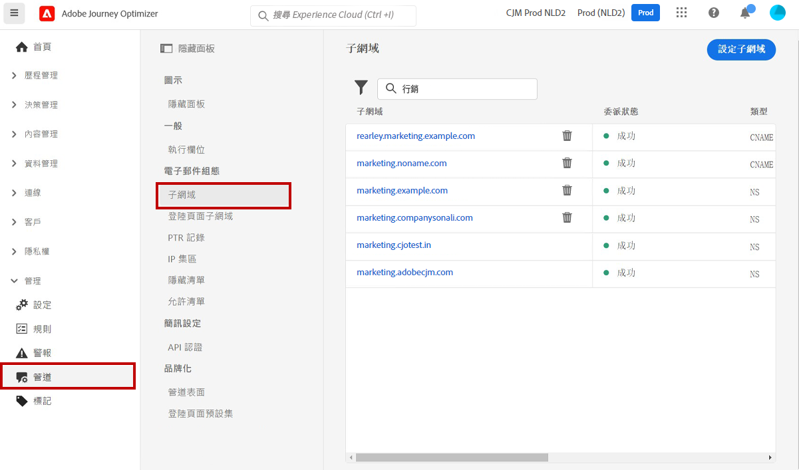
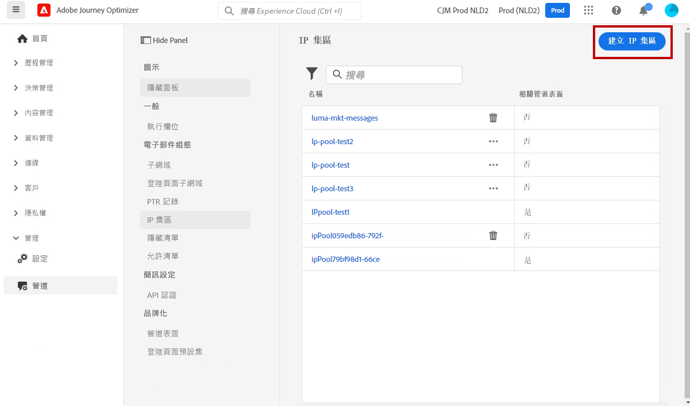
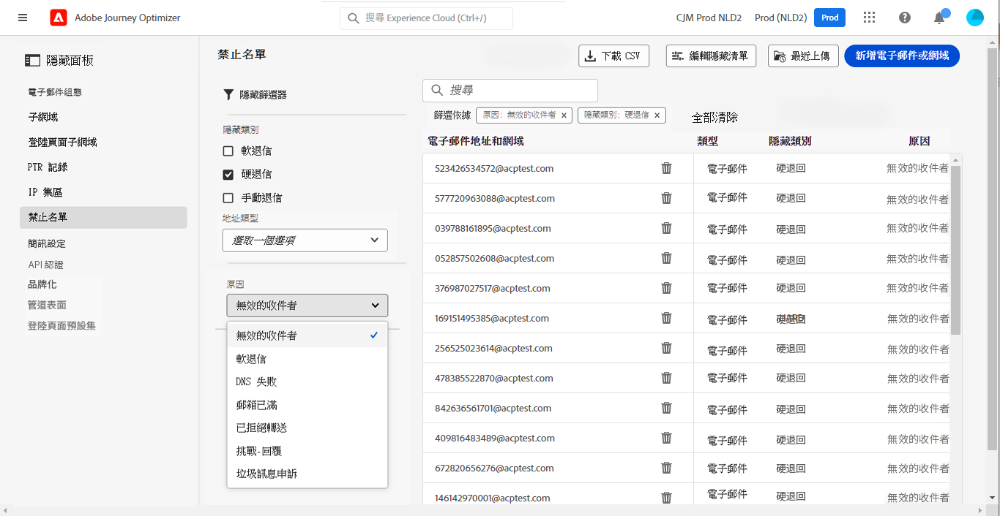

# 系統管理員快速入門 {#get-started-sys-admins}

開始使用[!DNL Adobe Journey Optimizer]之前，準備您的環境需執行數個步驟。 您必須執行這些步驟，[資料工程師](data-engineer.md)和[行銷人員](marketer.md)才能開始使用[!DNL Adobe Journey Optimizer]。

身為&#x200B;**系統管理員**，您必須&#x200B;**了解角色並指派權限**，可用於沙箱管理和管道設定。 您也需要設定沙箱，並針對可用的角色進行管理。 然後，您就可以將專案團隊成員指派給角色。 當[資料工程師](data-engineer.md)設定資料結構描述和來源，以及[開發人員](developer.md)實作技術整合時，您可以確保適當的人員可以存取適當的功能。

這些功能可由具有存取權限產品的&#x200B;**[!UICONTROL 產品系統管理員]**&#x200B;加以管理。[進一步了解權限](../../administration/permissions.md){target="_blank"}。

## 設定存取權和許可權

請依照下列步驟設定存取管理：

1. **建立沙箱**&#x200B;以將執行個體分區到獨立的虛擬環境中。 在[!DNL Journey Optimizer]中建立的&#x200B;**沙箱**。在[沙箱](../../administration/sandboxes.md)一節中了解更多資訊。

   >[!NOTE]
   >作為&#x200B;**系統管理員**，如果您無法在[!DNL Journey Optimizer]中找到&#x200B;**[!UICONTROL 沙箱]**&#x200B;選單，就必須更新您的權限。 請到[本頁面](../../administration/permissions.md#edit-product-profile)了解如何更新您的角色。

1. **了解角色**。 角色是一組統一權限，可讓使用者存取介面中的特定功能或物件。 請到[立即可用的角色](../../administration/ootb-product-profiles.md)區段中了解更多 。

1. 針對角色&#x200B;**設定權限**，包括&#x200B;**沙箱**，並將團隊成員指派至不同的角色，以授予其存取權。 權限是統一權限，允許您定義分配給&#x200B;**[!UICONTROL 角色]**&#x200B;的授權。每個權限都是透過功能 (例如歷程或產品建議) 收集而得，這些功能代表 [!DNL Journey Optimizer] 中的不同功能或物件。在[權限層級](../../administration/high-low-permissions.md)一節中了解更多 。

1. **使用物件層級存取控制** （選擇性）。 將存取標籤套用至歷程、行銷活動和管道設定等物件，以控制哪些使用者可以存取特定資源。 深入瞭解[物件層級存取控制(OLAC)](../../administration/object-based-access.md)。

此外，您必須將需要存取 Assets Essentials 的使用者新增至 **Assets Essentials 消費者使用者**&#x200B;或/和 **Assets Essentials 使用者**&#x200B;角色。 [如需詳細資訊，請參閱 Assets Essentials 文件](https://experienceleague.adobe.com/docs/experience-manager-assets-essentials/help/deploy-administer.html?lang=zh-Hant){target="_blank"}。

首次存取 [!DNL Journey Optimizer] 系統時，會佈建生產沙箱，並根據您的合約分配特定數量的 IP。

## 設定頻道和訊息

若要讓[行銷人員](marketer.md)能夠建立和傳送訊息，請存取&#x200B;**管理**&#x200B;功能表。 瀏覽&#x200B;**[!UICONTROL 頻道]**&#x200B;功能表以設定頻道設定。

>[!NOTE]
>作為&#x200B;**系統管理員**，如果您在 [!DNL Journey Optimizer] 中看不到&#x200B;**[!UICONTROL 頻道]**&#x200B;功能表，請在[權限](../../administration/permissions.md){target="_blank"}產品中更新您的權限。

請依照下列步驟操作：

1. **設定頻道設定**。 定義電子郵件、簡訊、推播通知和其他通道所需的所有技術引數：

   * 在&#x200B;**和Adobe Experience Platform資料彙集中定義**&#x200B;推播通知設定[!DNL Adobe Experience Platform]。 [了解更多](../../push/push-gs.md)

   * 建立&#x200B;**管道設定**，以設定電子郵件、簡訊、推播、應用程式內、網頁和其他管道所需的所有技術引數。 [了解更多](../../configuration/channel-surfaces.md)

   * 設定&#x200B;**簡訊頻道**&#x200B;以設定簡訊所需的所有技術引數。 [了解更多](../../sms/sms-configuration.md)

   * 管理將電子郵件地址傳送至禁止名單前執行&#x200B;**重試**&#x200B;的天數。[了解更多](../../configuration/manage-suppression-list.md)

1. **委派子網域**：若要在 Journey Optimizer 中使用任何新子網域，第一步是將其委派。 [了解更多](../../configuration/about-subdomain-delegation.md)

   

1. **建立 IP 集區**：將與您執行個體佈建的 IP 位址分組，以改善電子郵件傳遞能力和信譽。 [了解更多](../../configuration/ip-pools.md)

   

1. **管理隱藏和允許的清單**：透過隱藏和允許清單改善您的傳遞能力

   * [禁止名單](../../reports/suppression-list.md)包含您要從傳送中排除的電子郵件地址，因為傳送給這些聯絡人可能會損害您的傳送信譽和傳送率。 您可以監控自動排除而無法傳送歷程的所有電子郵件地址，例如無效地址、持續暫時性退信且可能對電子郵件信譽造成負面影響的地址，以及對您的其中一封電子郵件發出某種垃圾郵件投訴的收件者。 了解如何管理[禁止名單](../../configuration/manage-suppression-list.md)和[重試](../../configuration/retries.md)。

   

   * 此[允許清單](../../configuration/allow-list.md)可讓您指定個別電子郵件地址或網域，這些地址或網域將是唯一獲授權接收您從特定沙箱傳送之電子郵件的收件者或網域。 此舉可防止您在測試環境中意外傳送電子郵件至真實的客戶地址。 了解如何[啟用允許的清單](../../configuration/allow-list.md)。

   請在此頁面](../../reports/deliverability.md)進一步了解[!DNL Adobe Journey Optimizer] [的傳遞能力管理。

## 其他功能

隨著貴組織的需求增加，請考慮下列進階功能：

* **同意原則**：如果您的組織已購買Healthcare Shield或Privacy and Security Shield，請建立同意原則以尊重各管道的客戶偏好設定。 [了解更多](../../action/consent.md)

* **資料治理原則**：套用資料使用標籤和原則來控制如何在行銷動作中使用資料。 [了解更多](../../action/action-privacy.md)

* **IP熱身計畫**：逐步增加電子郵件傳送量，以建立電子郵件提供者的寄件者信譽。 [了解更多](../../configuration/ip-warmup-gs.md)

## 與其他角色共同作業

您的管理工作可讓所有團隊獲得成功：

* **支援[資料工程師](data-engineer.md)**：授與資料管理的許可權、核准沙箱存取權，以及協調資料保留原則

* **啟用[開發人員](developer.md)**：提供API認證、設定沙箱環境以進行測試，以及核准通道設定

* **啟用[行銷人員](marketer.md)**：指派適當的許可權以建立歷程和行銷活動、設定他們將使用的管道並支援測試環境

## 保持最新狀態

跟上最新的Journey Optimizer平台更新和管理變更：

* **[發行說明](../../rn/release-notes.md)**：檢閱每月發行的新功能、平台更新、安全性修補程式和組態變更
* **[檔案更新](../../rn/documentation-updates.md)**：追蹤設定指南、許可權更新及新管理功能的最近變更
* **產品通知**：啟用您[Adobe Experience Cloud設定檔](https://experience.adobe.com/preferences){target="_blank"}中的通知，以接收有關下列專案的嚴重警示：
   * 系統維護時段和排程的停機時間
   * 安全性更新和修補程式
   * 新的管理功能和許可權變更
   * 授權和權益更新
   * 重要產品公告

  若要啟用通知，請按一下Adobe Experience Cloud右上角的設定檔圖示，前往&#x200B;**偏好設定>通知**，然後設定您的Journey Optimizer通知偏好設定。 作為管理員，您應該啟用所有重要的系統通知。

## 後續步驟

設定環境後：

1. **驗證安裝程式**：確認所有團隊成員都可以存取其必要的功能
2. **監視使用狀況**：使用管理儀表板追蹤系統使用狀況並識別問題
3. **維護許可權**：隨著團隊角色的演化，定期檢閱和更新許可權
