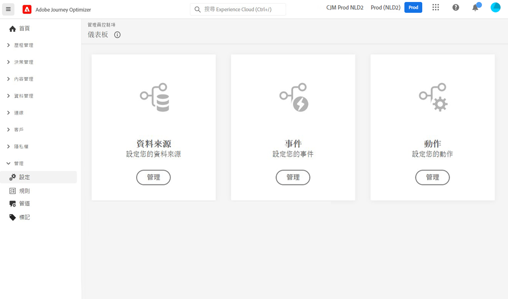

# 資料工程師快速入門 {#data-engineer}

作為&#x200B;**Adobe Journey Optimizer資料工程師**，您可以準備並維護客戶設定檔資料，以支援[!DNL Journey Optimizer]安排的體驗，為結構描述中的客戶和業務資料建立模型，並設定來源聯結器以擷取資料。 當[系統管理員](administrator.md)授與您存取權限並準備好您的環境，您就可以開始使用[!DNL Adobe Journey Optimizer]。

>[!NOTE]
>
>若要深入瞭解&#x200B;**資料攝取**&#x200B;相關資訊，請參閱 [Adobe Experience Platform 文件](https://experienceleague.adobe.com/docs/experience-platform/ingestion/home.html?lang=zh-Hant){target="_blank"}。

## 基本資料設定步驟

請依照下列步驟為Journey Optimizer設定資料基礎：

1. **建立識別名稱空間**。 在 Adobe[!DNL Journey Optimizer]，**身分識別** 連結跨裝置和管道的消費者，結果會是身分識別圖表。 連結的身分圖表可依據您所有業務接觸點的互動，來個人化體驗。 請[在此頁面](../../audience/get-started-identity.md)進一步了解身分識別與身分識別命名空間。

   此外，請設定&#x200B;**補充識別碼**，以啟用相同的設定檔，以根據次要識別碼（例如訂單ID或預訂ID）輸入多個歷程執行個體。 瞭解[補充識別碼](../../building-journeys/supplemental-identifier.md)。

1. **建立結構描述**&#x200B;並為設定檔啟用它們。 結構描述是一組規則，足以代表並驗證資料的結構和格式。 從高層面來說，結構描述會提供真實物件 (例如個人) 等抽象定義，還會概述應加入物件的每個執行個體資料 (例如名字、姓氏、生日等)。

   * 對於標準歷程與行銷活動：使用[XDM結構描述](../../data/get-started-schemas.md)
   * 針對協調的行銷活動：建立[關聯式結構描述](../../orchestrated/gs-schemas.md)以啟用多實體細分

1. **建立資料集**&#x200B;並為設定檔啟用這些資料集。 資料集是資料集合的儲存和管理結構，通常是包含方案 (欄) 和欄位 (列) 的表格。 資料集也包含中繼資料，可說明其儲存資料的各個層面。 建立資料集後，您可以將資料集對應至現有結構並新增資料。 請[在此頁面](../../data/get-started-datasets.md)深入了解資料集。

   對於進階案例，請準備&#x200B;**個資料集以進行執行階段查詢**，以使用記錄資料集中的即時資料來豐富歷程執行。 瞭解[資料集查詢](../../building-journeys/dataset-lookup.md)。

1. **設定來源聯結器**。 Adobe Journey Optimizer 讓您可以從外部來源擷取資料，同時可以使用 Platform 服務來建立、加標籤，同時強化傳入資料。您可以從多種來源 (如 Adobe 應用程式、雲端型的儲存空間、資料庫和其他許多來源) 擷取資料。 請[在此頁面](../get-started-sources.md)深入了解來源連接器。

1. **建立測試輪廓**。使用[測試模式](../../building-journeys/testing-the-journey.md)在傳送前於歷程中[預覽和測試訊息](../../content-management/preview-test.md)。 建立測試輪廓的步驟已[在此頁面](../../audience/creating-test-profiles.md)詳細說明。

1. **設定計算屬性** （選擇性）。 從設定檔資料建立衍生屬性，以簡化細分和個人化。 計算屬性會自動計算複雜量度，例如「過去90天內的總購買」或「平均訂單值」。 瞭解[計算屬性](../../audience/computed-attributes.md)。

此外，若要在歷程中傳送訊息，您必須設定&#x200B;**[!UICONTROL 資料來源]**、**[!UICONTROL 事件]**&#x200B;和&#x200B;**[!UICONTROL 動作]**。 請參閱[本節](../../configuration/about-data-sources-events-actions.md)以了解更多資訊。

* **資料來源**&#x200B;設定可讓您定義系統連線，以擷取將用於歷程的其他資訊。[在此章節](../../datasource/about-data-sources.md)深入瞭解資料來源相關內容。

* **事件**&#x200B;可讓您一直觸發歷程，以即時傳送訊息給流入歷程的個人。 在事件設定中，您會設定歷程中預期的事件。 會依照 Adobe Experience Data Model (XDM)，對傳入事件的資料進行標準化。事件來自串流擷取 API，適用於驗證和未驗證的事件 (例如 Adobe Mobile SDK 事件)。[在此章節](../../event/about-events.md)深入瞭解事件相關內容。

* [!DNL Journey Optimizer] 隨附內建訊息功能：您可以在歷程中建立訊息，並設計內容。 如果您使用第三方系統來傳送訊息，例如 Adobe Campaign，請建立&#x200B;**自訂動作**。在本節[中進一步瞭解動作](../../action/action.md)。

## 監視和分析歷程資料

歷程執行後，您可以在Data Lake中查詢歷程步驟事件，以監控效能、疑難排解問題並分析客戶行為。 使用SQL查詢來分析：

* 設定檔輸入與退出模式
* 錯誤率和捨棄原因
* 讀取對象匯出工作績效
* 自訂動作效能量度
* 歷程執行個體狀態和瓶頸

探索歷程分析[的現成可用](../../reports/query-examples.md)查詢範例，以開始進行資料分析和疑難排解。

## 保持最新狀態

跟上最新的Journey Optimizer功能和改進專案：

* **[發行說明](../../rn/release-notes.md)**：檢閱每月發行的新功能、增強功能和修正
* **[檔案更新](../../rn/documentation-updates.md)**：追蹤檔案最近的變更，包括新頁面和更新的內容
* **產品通知**：啟用您[Adobe Experience Cloud設定檔](https://experience.adobe.com/preferences){target="_blank"}中的通知，以接收有關下列專案的警示：
   * 新產品發行與功能
   * 維護時段和系統更新
   * 重要公告和變更

  若要啟用通知，請按一下Adobe Experience Cloud右上角的設定檔圖示，前往&#x200B;**偏好設定>通知**，然後設定您的Journey Optimizer通知偏好設定。
