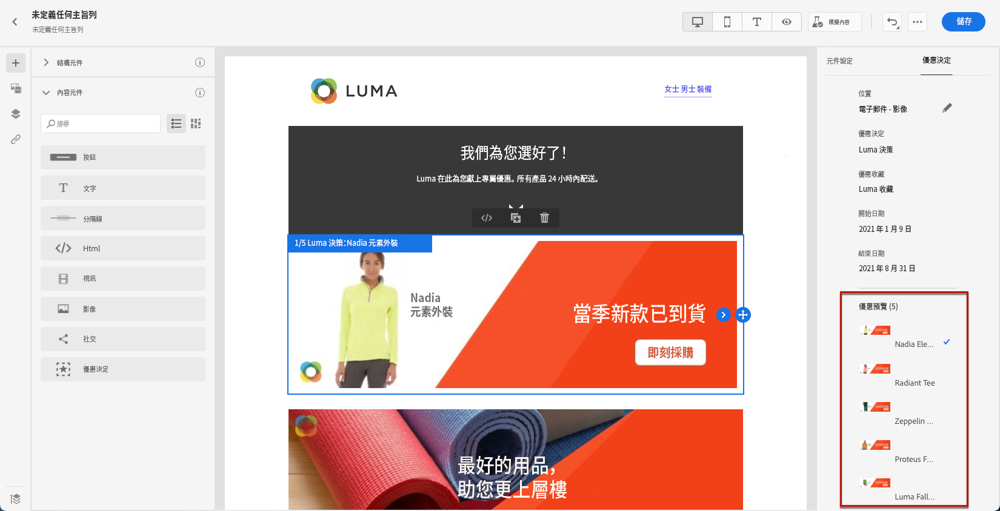
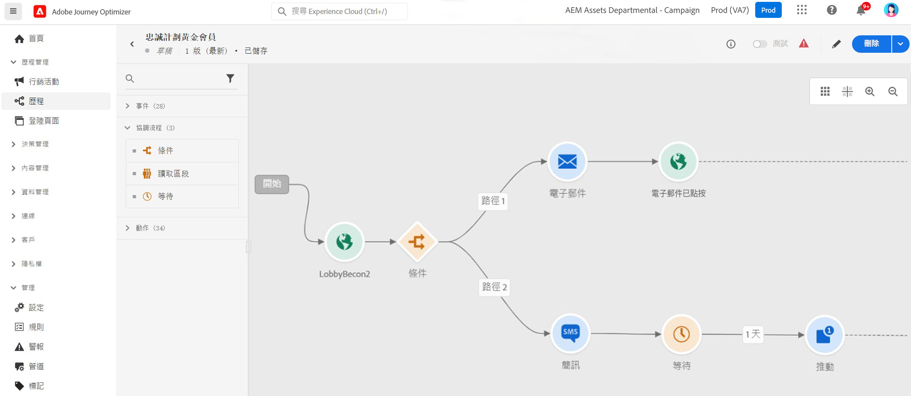

# 行銷人員快速入門 {#get-started-marketers}

您身為&#x200B;**行銷人員**&#x200B;或&#x200B;**商務從業人員**，設計客戶歷程以為客戶提供個人情境式體驗。 您可以建立並管理這些個人化歷程的所有不同元件，包括電子郵件和推播訊息、優惠和決定元件，以智慧地個人化訊息內容。 Journey Optimizer提供統一的使用者體驗，您可在同一處實作完整的端對端使用案例。 一旦[系統管理員](administrator.md)及[資料工程師](data-engineer.md)授予您存取權限並準備好您的環境，您就可以開始使用[!DNL Adobe Journey Optimizer]。

## 開始使用基本功能

Journey Optimizer可在單一應用程式中，整合即時客戶分析、現代全通路協調和智慧型決策。 跨電子郵件、簡訊、推播、應用程式內、網路、內容卡等建立個人化、連線的客戶體驗。

Journey Optimizer提供兩種強大的協調方法：

* **歷程**：即時、一對一的互動，每個客戶以自己的步調前進，由行為或事件觸發
* **協調的行銷活動**：大規模複雜的多步驟批次行銷活動，對象透過工作流程一起進行進度，非常適合品牌啟動的行銷活動，例如季節性促銷活動、產品推出或帳戶型通訊

請與您的[管理員](administrator.md)合作以取得存取權，並與[資料工程師](data-engineer.md)合作以設定對象、資料和關聯式結構描述以進行進階分段。

請依照下列核心步驟開始建立體驗：

1. **建立客群**。透過區段定義、上傳CSV檔案或使用對象組合來建立對象。 Journey Optimizer提供多種方法來鎖定合適的客戶。 深入瞭解[對象](../../audience/about-audiences.md)和[建立區段定義](../../audience/creating-a-segment-definition.md)。

1. **設計內容**。 跨所有通道建立吸引人的訊息，包括電子郵件、簡訊、推播、應用程式內、網頁和內容卡：
   * 根據您的品牌方針，使用&#x200B;**AI小幫手**&#x200B;產生電子郵件內容、主旨行以及影像。 [瞭解AI內容產生](../../content-management/gs-generative.md)
   * **使用客戶資料、動態內容和條件式邏輯個人化訊息**。 [了解個人化](../../personalization/personalize.md)
   * **反複處理內容資料**&#x200B;以顯示事件、自訂動作和資料集查詢的動態清單。 [瞭解如何疊代內容資料](../../personalization/iterate-contextual-data.md)
   * 建立可重複使用的&#x200B;**內容範本**&#x200B;和&#x200B;**片段**，以維持品牌一致性。 [使用範本](../../content-management/content-templates.md)
   * 在行動應用程式和網站中傳遞持續性、非侵入性的&#x200B;**內容卡**。 與推播通知不同，內容卡保持可見直到被取消。 [瞭解內容卡](../../content-card/create-content-card.md)
   * 使用&#x200B;**Adobe Experience Manager Assets**&#x200B;整合來管理資產。 [瞭解資產](../../integrations/assets.md)

   

1. **新增優惠方案與決策**。 使用AI支援的決策，在適當的時間為每位客戶提供最佳優惠方案。 瞭解[決策管理](../../offers/get-started/starting-offer-decisioning.md)和[體驗決策](../../experience-decisioning/gs-experience-decisioning.md)。

   

1. **測試及驗證**。 傳送前預覽和測試內容：
   * 使用&#x200B;**測試設定檔**&#x200B;來預覽個人化並檢查跨裝置轉譯
   * 使用CSV/JSON檔案中的&#x200B;**範例資料**&#x200B;進行測試
   * 在常用的電子郵件使用者端預覽&#x200B;**電子郵件呈現**
   * 執行&#x200B;**A/B測試和實驗**&#x200B;以最佳化內容變化。 使用多臂吃角子老虎機實驗，自動分配更多流量以即時贏得變數。 [瞭解實驗](../../content-management/content-experiment.md)
   * 為行銷活動和歷程設定&#x200B;**核准工作流程** （需要額外的授權）。 [瞭解核准](../../test-approve/gs-approval.md)

   瞭解如何[測試及驗證訊息](../../content-management/preview-test.md)。

1. **建置客戶歷程**。 使用歷程畫布建立即時、個人化的體驗：

   * 觸發包含&#x200B;**個事件** （客戶動作）或&#x200B;**對象** （批次傳送）的歷程
   * 新增&#x200B;**條件**&#x200B;以根據客戶資料建立個人化路徑
   * 使用&#x200B;**等待活動**&#x200B;來建立訊息間的完美時程
   * 在一個歷程中跨&#x200B;**多個管道**&#x200B;傳送訊息
   * 套用&#x200B;**A/B測試**&#x200B;並最佳化傳送時間，以最大化參與程度
   * 使用&#x200B;**資料集查詢**，透過Adobe Experience Platform的即時資料擴充歷程。 [瞭解資料集查詢](../../building-journeys/dataset-lookup.md)
   * 運用&#x200B;**補充識別碼**，允許相同的設定檔輸入多個歷程執行個體（例如，不同的訂單或預訂）。 [瞭解補充識別碼](../../building-journeys/supplemental-identifier.md)

   

   瞭解如何[設計和執行歷程](../../building-journeys/journey-gs.md)並探索[歷程使用案例](../../building-journeys/jo-use-cases.md)。 瞭解[登入/退出條件](../../building-journeys/entry-exit-criteria-guide.md)以控制設定檔流程。

1. **啟動協調的行銷活動**。 使用視覺畫布大規模設計複雜的多步驟批次行銷活動：

   * 使用關聯式查詢立即建立&#x200B;**隨選受眾**，將客戶資料與帳戶、購買、訂閱和其他實體連線
   * 建立&#x200B;**多實體區段**&#x200B;以精確鎖定目標（例如「訂閱將於30天後到期的客戶」或「最近購買高價值物品的客戶」）
   * 在啟動之前，以正確的對象計數取得&#x200B;**預先傳送可見度**
   * 針對季節性促銷活動、產品啟動、忠誠度優惠方案或帳戶式行銷，設計&#x200B;**多步驟工作流程**
   * 排程行銷活動，以立即、在特定時間或定期排程（每日、每週、每月）執行
   * 在&#x200B;**批次模式**&#x200B;中處理對象，其中所有設定檔一起透過工作流程進行進度

   瞭解如何[開始使用協調的行銷活動](../../orchestrated/gs-orchestrated-campaigns.md)，並瞭解何時[使用行銷活動與歷程](../../orchestrated/orchestrated-campaigns-faq.md)。

1. **監視和最佳化**。 追蹤效能並隨著時間改善結果：
   * 監視&#x200B;**即時歷程**&#x200B;效能並找出瓶頸
   * 分析&#x200B;**訊息傳遞**&#x200B;率和參與量度
   * 使用&#x200B;**報告儀表板**&#x200B;與Customer Journey Analytics整合
   * 追蹤&#x200B;**轉換**&#x200B;和業務影響
   * 使用衝突管理規則管理&#x200B;**訊息頻率和優先順序**&#x200B;以防止過度通訊。 [瞭解衝突管理](../../conflict-prioritization/gs-conflict-prioritization.md)

   瞭解如何[監視效能](../../reports/report-gs-cja.md)。

## 成功的最佳實務

### 內容建立

* **從範本開始**：使用預先建立的範本和內容片段來加速建立並維持一致性
* **及早測試，經常測試**：一律預覽跨裝置的內容，並使用測試設定檔來驗證個人化
* **明智地運用AI**：使用AI助理處理初始草稿和變體，但一律檢閱並調整您的品牌語調
* **保持簡潔**：簡潔、簡明的訊息與強大的行動號召比複雜的版面效果更好

### 歷程設計

* **定義明確的目標**：先建立成功量度，再建立您的歷程
* **對應客戶體驗**：在實施前將整個歷程視覺化
* **策略性地使用等候活動**：在傳送後續追蹤前，讓客戶有時間參與
* **規劃退出策略**：定義客戶應該退出歷程的時機和原因
* **在草稿模式中測試**：在啟用之前使用試執行驗證歷程邏輯

[瞭解歷程最佳實務](../../building-journeys/entry-exit-criteria-guide.md#best-practices)

### 行銷活動協調

* **選擇正確的方法**：將歷程用於即時行為觸發的體驗；將協調的行銷活動用於排程的批次行銷活動
* **定義明確的行銷活動目標**：在設計多步驟工作流程之前建立目標
* **從試驗對象開始**：在縮放之前驗證計數和分段邏輯
* **運用關聯式資料**：使用多實體區段，將客戶資料與帳戶、購買、訂閱連結起來，以進行精確定位
* **讓分段保持簡單**：使用明確且可維護的規則來最佳化效能和透明度
* **使用一致的命名**：透過明確的命名慣例，讓行銷活動管理更容易

### 對象目標定位

* **仔細細分**：根據明確條件建立特定、可操作的對象區段
* **定期重新整理**：設定適當的評估排程，確保對象保持最新狀態
* **平衡大小與精確度**：目標對象足夠大，具有統計顯著性，但足夠具體，具有關聯性
* **使用擴充屬性**：利用運算屬性和擴充資料進行更深入的個人化

### 頻率管理

* **尊重客戶喜好設定**：尊重選擇退出與通訊喜好設定
* **設定頻率上限**：使用規則集防止跨管道的訊息疲勞
* **協調行銷活動**：使用衝突管理以確保客戶在正確的時間收到正確的訊息
* **監視參與**：觀察疲勞跡象（開放率下降、取消訂閱數增加）

[瞭解頻率限定](../../conflict-prioritization/channel-capping.md)

## 探索使用案例

從示範Journey Optimizer功能的實務範例學習：

**歷程使用案例** （即時、一對一）：

* **歡迎系列**：透過個人化的多步驟歷程來吸引新客戶。 [檢視使用案例](https://experienceleague.adobe.com/zh-hant/docs/journey-optimizer-learn/tutorials/use-cases/customer-onboarding)
* **放棄的購物車復原**：重新與將商品留在購物車中的客戶互動。 [檢視使用案例](https://experienceleague.adobe.com/zh-hant/docs/journey-optimizer-learn/tutorials/use-cases/abandoned-cart)
* **事件導向訊息**：即時回應客戶動作
* **生日行銷活動**：傳送由設定檔日期觸發的個人化生日訊息
* **產品建議**：根據瀏覽和購買記錄建議相關產品

**協調的行銷活動使用案例** （批次、一對多）：

* **季節性促銷活動**：跨客戶區段啟動協調的行銷活動（例如，假日銷售、開學回訪）
* **產品啟動**：透過循序傳訊向目標對象宣告新產品
* **忠誠計畫優惠方案**：根據購買歷程紀錄提供階層優惠方案以獎勵高價值客戶
* **以帳戶為基礎的行銷**：目標帳戶具有特定特性及相關連絡人
* **訂閱續約**：使用多實體查詢，與訂閱即將到期的客戶聯絡
* **重新參與行銷活動**：以批次模式重新贏回具有目標優惠方案的閒置客戶。 [檢視使用案例](https://experienceleague.adobe.com/zh-hant/docs/experience-platform/rtcdp/use-cases/personalization-insights-engagement/use-cases-luma)

**歷程模式：**

* [傳送訊息給訂閱者](../../building-journeys/message-to-subscribers-uc.md)： Target訂閱清單包含個人化內容
* [多頻道傳訊](../../building-journeys/journeys-uc.md)：結合電子郵件和推播與回應事件
* [僅限工作日的電子郵件](../../building-journeys/weekday-email-uc.md)：使用以時間為基礎的條件排程通訊

瀏覽完整的[歷程使用案例庫](../../building-journeys/jo-use-cases.md)，並深入瞭解[協調的行銷活動](../../orchestrated/gs-orchestrated-campaigns.md)。

## 與其他角色共同作業

您的行銷工作連結到其他團隊：

* **與[資料工程師合作](data-engineer.md)**：要求新的計算屬性、協調關聯式結構描述以協調協調行銷活動、提供對象品質的意見回饋，以及符合進階分段的多實體資料需求
* **與[開發人員合作](developer.md)**：調整事件觸發程式、測試行動實作，以及驗證追蹤
* **與[管理員合作](administrator.md)**：要求通道設定、確認協調行銷活動的授權存取、報告許可權問題，以及協調新功能啟用

## 保持最新狀態

跟上最新的Journey Optimizer功能和行銷特色：

* **[發行說明](../../rn/release-notes.md)**：檢閱每月發行的新功能、管道更新和增強功能
* **[檔案更新](../../rn/documentation-updates.md)**：追蹤最近的變更，包括新的使用案例、最佳實務和功能檔案
* **[產品通知](../../rn/releases.md#staying-informed)**：瞭解如何訂閱電子郵件和產品內通知，以瞭解Journey Optimizer更新內容，包括新頻道、即將推出的功能以及重要的行銷活動公告

## 後續步驟

1. **從小處開始**：建立簡單的歡迎歷程或單一訊息行銷活動以學習平台
2. **利用AI**：使用AI助理提出問題並加速內容建立
3. **加入社群**：與[Experience League社群中的其他Journey Optimizer使用者連結](https://experienceleaguecommunities.adobe.com/t5/journey-optimizer/ct-p/journey-optimizer){target="_blank"}
4. **探索教學課程**：觀看[Experience League](https://experienceleague.adobe.com/docs/journey-optimizer-learn/tutorials/overview.html?lang=zh-Hant){target="_blank"}上的逐步影片
