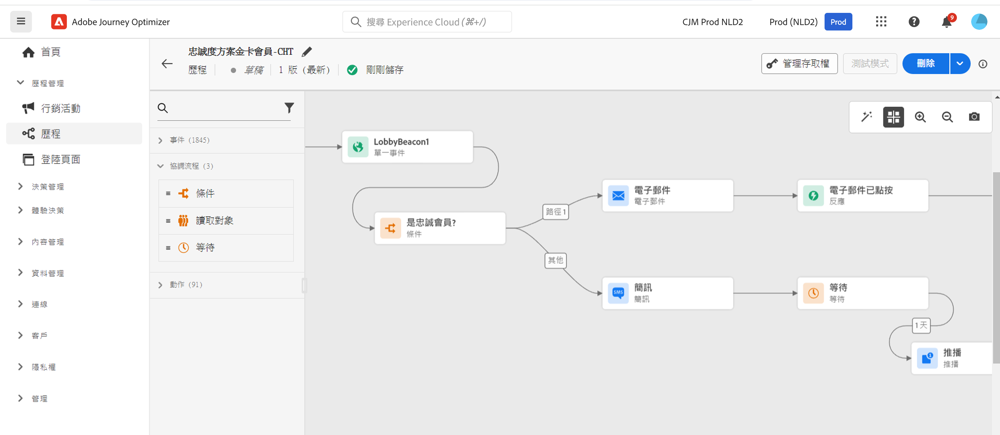

# 行銷人員快速入門 {#get-started-marketers}

身為&#x200B;**行銷人員**&#x200B;或&#x200B;**歷程從業者**，您必須負責建立優惠方案及歷程以及設計內容。 一旦[系統管理員](administrator.md)及[資料工程師](data-engineer.md)授予您存取權限並準備好您的環境，您就可以開始使用[!DNL Adobe Journey Optimizer]。

請參閱下列章節，以設定您的第一個歷程、新增產品建議及資產並傳送訊息：

1. **建立客群**。Journey Optimizer 可讓您直接從&#x200B;**客群**&#x200B;選單，透過區段定義建立客群，並將其善用於歷程之中。 請[在此頁面](../../audience/about-audiences.md)了解更多有關客群的資訊。 [在此範例中](../../audience/creating-a-segment-definition.md)探索如何建置區段定義。

1. **新增個人化及動態內容**。 利用 Journey Optimizer 個人化及動態內容功能，使您的訊息能與客群相符合。 深入瞭解[個人化](../../personalization/personalize.md)及[動態內容](../../personalization/get-started-dynamic-content.md)。

   

1. **建立及管理資產**。[!DNL Adobe Experience Manager Assets]提供了可用於填入訊息的單一、集中式資產存放庫。請參閱[本節](../../integrations/assets.md)。

1. **新增產品建議**。使用 [!DNL Journey Optimizer] 可在適當的時間為所有接觸點的客戶提供最佳產品建議和體驗。設計完成後，透過個人化產品建議目標定位客群。[在此章節](../../offers/get-started/starting-offer-decisioning.md)深入瞭解決策管理相關內容。

   

1. **測試及驗證**。 一旦完成定義內容，您就可以使用測試設定檔，或從 CSV / JSON 檔案上傳的範例那邊輸入資料，或可手動新增，以便預覽內容。

   如果您已插入[個人化內容](../../personalization/personalize.md)，就可以使用測試設定檔資料，檢查內容在訊息中的顯示方式。此外，利用您的 **Litmus** 帳戶登入，即可在&#x200B;**常見電子郵件用戶端[!DNL Journey Optimizer]立即預覽**&#x200B;電子郵件呈現。 您可以確保電子郵件內容都能看起來不錯，並且在每個收件匣中都正常運作。 [在本節](../../content-management/preview-test.md)深入瞭解如何測試與驗證訊息。 

1. **設計客戶歷程**&#x200B;提供個人化的情境式體驗。 [!DNL Journey Optimizer]可讓您利用儲存在事件或資料來源中的情境資料，建立即時協調流程使用案例。設計由下列功能提供支援的多步驟進階案例：

   * 傳送在收到事件時觸發的即時&#x200B;**單一傳遞**，或使用 Adobe Experience Platform 客群&#x200B;**批次**&#x200B;傳遞。

   * 利用來自事件的&#x200B;**情境資料** 、來自 Adobe Experience Platform 的資訊，或來自協力廠商 API 服務的資料。

   * 如果您使用第三方系統來傳送訊息，請使用&#x200B;**內建頻道動作** (電子郵件、簡訊、推播、應用程式內) 傳送 [!DNL Journey Optimizer] 中設計的訊息或建立&#x200B;**自訂動作**。

   * 使用&#x200B;**歷程設計工具**，建置多步驟使用案例：輕鬆拖放進入事件或讀取客群活動、新增條件及傳送個人化訊息。

   

   [在本節](../../building-journeys/journey-gs.md)深入瞭解如何設計與執行歷程

1. **監控訊息及歷程**。為確保您的訊息成功執行、傳送及傳遞，[!DNL Journey Optimizer]提供可監控目前發佈及觸發之訊息的功能。 [在本節](../../reports/report-gs-cja.md)深入瞭解如何監控效能。
