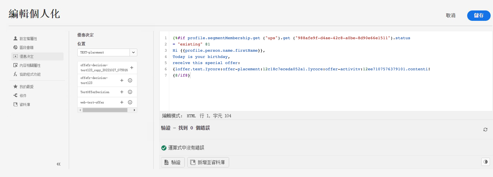

# 面向營銷人員的入門 {#get-started-marketers}

作為 **營銷商** 或 **行程練習者**，您負責建立消息、優惠和旅程。 你可以開始使用 [!DNL Adobe Journey Optimizer] 一次 [系統管理員](administrator.md) 和 [資料工程師](data-engineer.md) 授予您訪問權限並準備您的環境。

請參閱以下部分以設定您的首次行程、添加優惠和資產以及發送消息：

1. **建立區段**. Journey Optimizer允許您直接從 **段** 把菜單和它們融入你的旅程。  瞭解有關網段的詳細資訊 [此頁](../../segment/about-segments.md)。 瞭解如何構建段 [在這個樣本中](../../segment/creating-a-segment.md)。

1. **建立訊息**. 瞭解如何在Journey Optimizer建立電子郵件和推送通知 [此頁](../../messages/create-message.md)。

   

1. **新增個人化**. 利用Journey Optimizer個性化功能，將您的消息適應您的受眾。 瞭解有關個性化的更多資訊 [此部分](../../personalization/personalize.md)。

   

1. **建立和管理資產**。 [!DNL Adobe Experience Manager Assets Essentials] 提供單個集中的資產儲存庫，您可以使用它來填充郵件。 請參閱[本節](../../messages/assets-essentials.md).

1. **新增優惠方案**. 使用 [!DNL Journey Optimizer] 可在適當的時間為所有接觸點的客戶提供最佳優惠和體驗。設計完成後，透過個人化優惠目標定位對象。瞭解有關決策管理的更多資訊 [此部分](../../offers/get-started/starting-offer-decisioning.md)。

   

1. **Test並驗證您的消息**。 定義消息內容後，可以使用test配置檔案預覽和test它。 如果插入 [個性化內容](../../personalization/personalize.md)，您將能夠利用test配置檔案資料檢查此內容在消息中的顯示方式。 另外，利用 **斜石** 帳戶 [!DNL Journey Optimizer] 立即預覽 **電子郵件呈現** 常用電子郵件客戶端。 然後，您可以確保電子郵件內容看起來非常出色，並且在每個收件箱中都能正常工作。 瞭解如何test和驗證您的郵件 [此部分](../../messages/preview.md)。

1. **設計客戶旅程** 提供個性化的背景體驗。 [!DNL Journey Optimizer] 允許您利用事件或資料源中儲存的上下文資料構建即時業務流程使用案例。 設計由以下功能支援的多步高級方案：

   * 即時發送 **單一消息** 接收事件時觸發，或 **批** 使用Adobe Experience Platform段。

   * 利用 **上下文資料** 來自事件、來自Adobe Experience Platform的資訊或來自第三方API服務的資料。

   * 使用 **內置操作** 發送設計為 [!DNL Journey Optimizer] 建立 **自定義操作** 使用第三方系統發送消息。

   * 使用 **旅程設計師**，構建多步使用案例：輕鬆拖放條目事件或讀取段活動、添加條件和發送個性化消息。

   

   瞭解如何設計和執行行程 [此部分](../../building-journeys/journey-gs.md)

1. **監視消息和行程**。 為確保成功執行、發送和傳遞您的消息， [!DNL Journey Optimizer] 提供了監視當前發佈和觸發的消息的功能。 瞭解如何監視效能 [此部分](../../messages/message-monitoring.md)。
