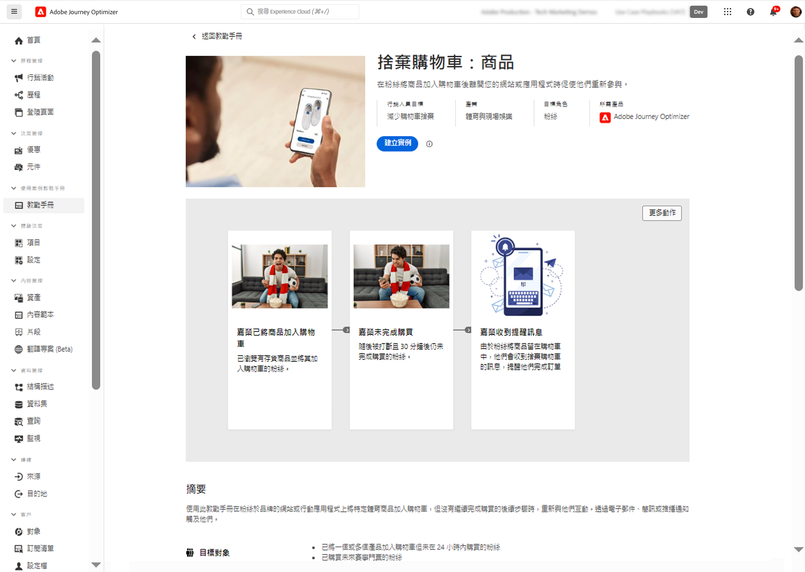

# 使用案例教戰手冊 {#playbooks}

>[!PREREQUISITES]
>
>使用案例教戰手冊在使用之前，需要進行下列設定步驟。每個步驟的詳細資訊，請參閱使用案例教戰手冊文件的[開始使用](https://experienceleague.adobe.com/docs/experience-platform/use-case-playbooks/playbooks/get-started.html?lang=zh-Hant){target="_blank"}頁面。
>
>* 建立沙箱
>* 設定使用者權限
>* 為電子郵件、推播和簡訊通知設定 Journey Optimizer 管道表面

使用案例教戰手冊是預先定義的工作流程，用於處理您可以使用 Adobe Experience Platform和 Journey Optimizer 執行的常見使用案例。

{width="85%"}

每個教戰手冊都提供全面的概觀，包括加以實施所需的意圖、目標、目標角色和資源。 此外，每個教戰手冊中都提供心智圖，以視覺化方式呈現與教戰手冊相關的實際客戶接觸點。

{width="85%"}

若要存取教戰手冊，請瀏覽至位於左側導覽邊欄的&#x200B;**[!UICONTROL 教戰手冊]**&#x200B;功能表。此資料庫包含數個使用 Adobe Journey Optimizer 實施的教戰手冊。若要輕鬆加以存取，請使用搜尋列旁的篩選器。完整的 Journey Optimizer 教戰手冊清單可在[使用案例教戰手冊文件](https://experienceleague.adobe.com/docs/experience-platform/use-case-playbooks/playbooks/playbooks-list.html?lang=zh-Hant){target="_blank"}找到。

{width="85%"}

選擇最適合您需求的教戰手冊後，就可加以啟用。這會建立教戰手冊執行個體，並自動產生所需資源以支援特定使用案例。資源包括歷程、訊息等 Journey Optimizer 資產，以及結構描述或區段等 Adobe Experience Platform 資產。

>[!NOTE]
>
>這些物件的目的是協助您了解實施特定使用案例所需的所有資源。其不包含任何資料，且建立於開發沙箱上。

若要實施使用案例，您可以瀏覽至每個物件以依照需求來調整。您也可以在團隊中分享教戰手冊執行個體頁面URL，以在實施使用案例時共同作業。

此外，您可以將教戰手冊資產匯入其他沙箱。 這樣做可在您已設定自己的結構描述、欄位和欄位群組時，讓產生的資產與現有資產趨於一致，並確保其與您的資料相容。[使用案例教戰手冊文件](https://experienceleague.adobe.com/docs/experience-platform/use-case-playbooks/playbooks/data-awareness.html?lang=zh-Hant){target="_blank"}詳細說明這些步驟。
