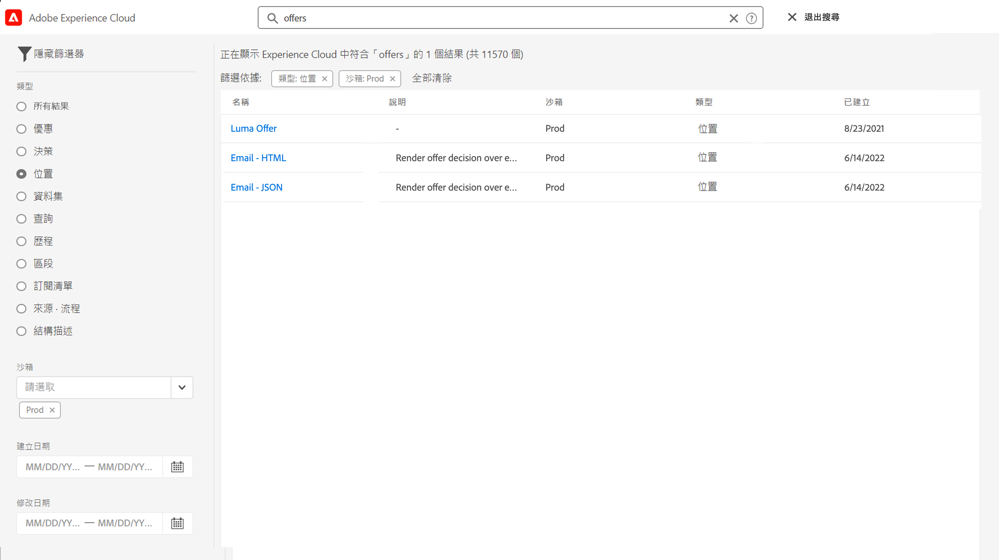

# 搜尋、篩選、整理 {#search-filter-organize}

## 搜尋 {#unified-search}

在 Adobe Journey Optimizer 介面的任意處，利用頂端列中央的 Unified Adobe Experience Cloud 搜尋功能，在您的沙箱尋找資產、歷程、資料集等等。 

開始輸入內容以顯示排名最前的結果。有關輸入關鍵字的說明文章也會顯示在結果中。

請按下 **Enter** 以存取所有結果，並按業務對象進行篩選。

## 篩選清單 {#filter-lists}

在大部分清單中使用搜尋列來尋找特定項目並定義篩選條件。

按一下清單左上方的篩選圖示，即可存取篩選器。篩選選單可讓您根據不同條件篩選顯示的元素：您可選擇僅顯示特定類型或狀態的元素、您建立的元素，或最近 30 天修改的元素。 選項會因內容而異。

此外，您也可利用統一標籤來篩選清單，視指派至物件的標籤而定。 目前，標籤可供歷程與行銷活動使用。 [了解如何使用標籤](#tags)

>[!NOTE]
>
>請注意，顯示的欄可使用清單右上角的設定按鈕進行個人化。系統會為每位使用者儲存個人化設定。

您可以對清單的每一元素執行基本動作。例如，您可以複製或刪除項目。

## 使用統一標籤 {#tags}

>[!CONTEXTUALHELP]
>id="ajo_campaigns_tags"
>title="標記"
>abstract="您可以利用此欄位為您的行銷活動指派 Adobe Experience Platform 統一標籤。這可讓您輕鬆分類，並改進行銷活動清單的搜尋。 "

利用 Adobe Experience Platform [統一標籤](https://experienceleague.adobe.com/docs/experience-platform/administrative-tags/overview.html?lang=zh-Hant)，您可以輕鬆將 Journey Optimizer 物件分類，進而改善清單的搜尋。

在 Journey Optimizer 中，將有意義的標籤新增至客群，可讓您稍後篩選並搜尋客群，以便更輕鬆找到客群。 另外還可將標籤用於可搜尋的相關資料夾中，方便組織客群、建立個人化產品建議和體驗，同時可應用到體驗決定規則中。

### 新增標籤至物件 {#add-tags}

**[!UICONTROL 標籤]**&#x200B;欄位可讓您定義物件的標籤。標籤可用於下列物件：

* [行銷活動](../campaigns/create-campaign.md)
* [決定項目](../experience-decisioning/items.md)
* [片段](../content-management/fragments.md)
* [歷程](../building-journeys/journey-properties.md)
* [登陸頁面](../landing-pages/create-lp.md)
* [訂閱清單](../landing-pages/subscription-list.md)
* [範本](../content-management/content-templates.md)
* [頻道設定](../configuration/channel-surfaces.md#channel-config-tags)

您可選取現有標籤或建立新標籤。若要執行此操作，請遵循下列步驟。

1. 開始輸入所需標籤的名稱，然後從清單選取該名稱。 

   

   >[!NOTE]
   >
   > 標籤不用區分大小寫。

1. 如果無法使用您想搜尋的標籤，就請按一下&#x200B;**[!UICONTROL 建立「」]**，即可定義新物件，系統會自動將它加入目前的物件中，也可供其他物件使用。

   

1. 所選或建立的標籤清單會顯示在&#x200B;**[!UICONTROL 標籤]**&#x200B;欄位下方。您可視需要定義任意數量的標籤。

>[!NOTE]
> 
> 如果您複製或建立新版本標籤，則會保留標籤。

### 依標籤篩選 {#filter-on-tags}

每個物件清單都會顯示專屬欄，讓您輕鬆地將標籤視覺化。

利用篩選器也可僅顯示具特定標籤的物件。

您可從任何類型的歷程或行銷活動 (即時、草稿等等) 新增或移除標籤。 若要這麼做，請按一下物件旁的&#x200B;**[!UICONTROL 更多動作]**&#x200B;圖示，然後選取&#x200B;**[!UICONTROL 編輯標籤]**。

### 管理標籤 {#manage-tags}

管理員可利用&#x200B;**[!UICONTROL 管理]**&#x200B;下方的&#x200B;**[!UICONTROL 標籤]**&#x200B;選單來刪除標籤，並依類別進行管理。請參閱[統一標籤文件](https://experienceleague.adobe.com/docs/experience-platform/administrative-tags/ui/managing-tags.html?lang=zh-Hant)，深入了解標籤管理。

>[!NOTE]
>
> 若標籤直接從 Journey Optimizer **[!UICONTROL 標籤]**&#x200B;欄位建立，則會自動新增至內建的「未分類」類別。
