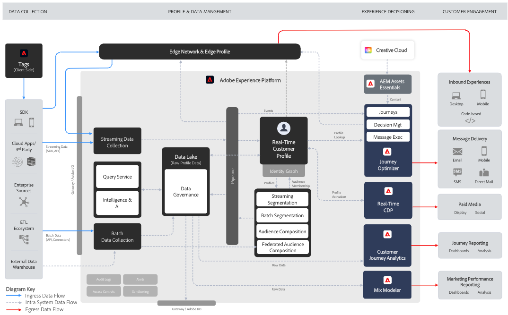

# 瞭解Journey Optimizer {#understanding-ajo}

此頁面說明Adobe Experience Platform和Journey Optimizer如何共同運作，涵蓋持續的資料對體驗週期、主要功能領域、架構詳細資料和整合點。

Adobe Journey Optimizer和Adobe Experience Platform共同啟用大規模資料導向個人化。 此頁面說明這些系統如何運作，以及其主要功能區域如何結合，以提供卓越的客戶體驗。 [瞭解重要功能](get-started.md) | [探索重要術語](terminology.md)

## Journey Optimizer的運作方式 {#how-it-works}

沒有統一的資料基礎，品牌就不得不依賴多個管道專用工具，因此很難維持每個客戶的一致檢視或即時對其行為採取行動。 Journey Optimizer可透過在Adobe Experience Platform上建立架構，將客戶資料、內容建立和Journey Orchestration連結在單一連續系統中，藉此解決此問題。 其結果是有意義的品牌體驗，可提升客戶忠誠度和終身價值。

Adobe Journey Optimizer是以持續流程運作，收集、分析和套用資料以建立個人化的客戶歷程。

### Adobe Experience Platform：基礎 {#aep-foundation}

Adobe Experience Platform作為骨幹，讓品牌得以集中客戶資料，並針對個人化體驗加以啟用：

* **資料平台** — 用於收集、管理和建構客戶資料的中央樞紐，以確保跨系統的一致性。 [了解結構描述和資料集](../data/get-started-schemas.md)
* **資料擷取（來源）** — 使用預先建立的聯結器從CRM平台、網站、行動應用程式和雲端儲存空間匯入資料。 [探索資料來源](get-started-sources.md)
* **即時客戶設定檔** — 合併來自多個來源的資料（電子郵件互動、店內購買、網頁行為），以建立統一的設定檔。 [瞭解設定檔](../audience/get-started-profiles.md)
* **治理層** — 在遵守法規的同時，管理資料存取、隱私權法規遵循和安全性。 [檢視隱私權檔案](../privacy/get-started-privacy.md)

### Adobe Journey Optimizer：協調引擎 {#ajo-orchestration}

Adobe Journey Optimizer套用Adobe Experience Platform的資料和深入分析，提供智慧型、個人化的客戶體驗：

* **客戶瞭解** — 即時客戶設定檔可針對目標訊息啟用細分受眾。 [建立客群](../audience/about-audiences.md)
* **內容與選件** — 內建的視覺化設計工具、可重複使用的範本，以及集中式資產庫，讓團隊不需離開平台，即可針對任何管道製作與個人化訊息。 動態個人化會根據客戶屬性、行為和內容來調整內容。 即時決策邏輯接著會為每個個人選取最佳選件。 [設計內容](../../rp_landing_pages/content-management-landing-page.md) | [管理資產](../integrations/assets.md) | [管理優惠方案](../offers/get-started/starting-offer-decisioning.md)
* **歷程與行銷活動管理** — 自動化互動順序（歷程）或排程單次鎖定目標的訊息（行銷活動）。 [建立歷程](../building-journeys/journey-gs.md) | [建立行銷活動](../campaigns/get-started-with-campaigns.md)
* **傳遞（連線）** — 透過電子郵件、簡訊、推播通知和直接郵件等通道傳遞訊息；將資料匯出至外部系統。 [設定管道](../configuration/get-started-configuration.md)
* **測量與分析** — 透過報告追蹤客戶參與度和行銷活動績效，以持續改進。 [檢視報告](../reports/campaign-global-report-cja.md)

### 持續最佳化週期 {#optimization-cycle}

此生態系統以持續最佳化週期運作。 資料可促進客戶瞭解，進而提供個人化內容和決策的資訊。 這些任務會被協調為歷程、跨管道傳送、測量成效，並隨著時間而精簡。

## 主要功能領域 {#functional-areas}

Journey Optimizer包含七個重要功能區域，可順暢地搭配運作：

| 功能區域 | 目的 | 重要活動 |
|-----------------|---------|----------------|
| **資料管理** | 組織客戶資料 | 定義結構描述、建立資料集，從各種系統匯入資料。 [了解更多](../data/get-started-schemas.md) |
| **客戶管理** | 瞭解您的客戶 | 建立統一的設定檔、解析身分、建立對象。 [了解更多](../audience/get-started-profiles.md) |
| **內容管理** | 建立個人化訊息 | 設計電子郵件、管理資產、建立範本和片段、個人化內容。 [了解更多](../../rp_landing_pages/content-management-landing-page.md) |
| **決定管理** | 即時選取最佳優惠方案 | 管理優惠資料庫、定義規則、套用限制、建立排名邏輯。 [了解更多](../offers/get-started/starting-offer-decisioning.md) |
| **歷程管理** | 設計自動化的客戶體驗 | 使用視覺化設計工具建立歷程、設定觸發器、新增條件和等待步驟。 [了解更多](../building-journeys/journey-gs.md) |
| **連線** | 連線資料來源和管道 | 設定來源聯結器、設定通道、連線至外部平台。 [了解更多](../configuration/get-started-configuration.md) |
| **管理與隱私** | 控制項設定與法規遵循 | 管理使用者、設定沙箱、設定頻道、處理隱私權請求。 [了解更多](../administration/permissions.md) |

### 這些區域如何共同運作 {#working-together}

這些功能區域會以連續的週期運作：

1. **資料擷取** — 資料流入Adobe Experience Platform，由資料管理建構
2. **客戶瞭解** — 即時客戶設定檔可統一資料；客戶管理會建立對象
3. **內容與優惠策略** — 內容管理建立訊息；決定管理定義優惠邏輯
4. **協調流程** - Journey Management會使用客戶資料、內容和決定，對應跨管道的互動
5. **傳遞** — 連線可促進透過通道傳遞訊息，或與外部系統共用資料
6. **測量** — 效能資料摘要深入分析以調整對象、內容、決定和歷程
7. **治理** — 管理和隱私權控制可確保整個過程中的合規性

## 架構詳細資料 {#architecture-details}

Journey Optimizer是原生建置在Adobe Experience Platform上的四個應用程式之一，另外還有Real-Time CDP、Customer Journey Analytics和Adobe Mix Modeler。 共用AEP的核心服務 — 即時客戶個人檔案、身分圖表、資料控管和查詢服務 — 因此可存取統一的客戶資料基礎，而不需要個別的整合。 Journey Optimizer可作為獨立應用程式操作，或與其他AEP原生應用程式相互操作。

如需深入瞭解技術架構，包括整合模式、必要條件和系統資料流程，請參閱[Adobe Journey Optimizer藍圖](https://experienceleague.adobe.com/zh-hant/docs/blueprints-learn/architecture/architecture-diagrams/customer-journeys/journey-optimizer/journey-optimizer-overview){target="_blank"}。 如需實作考量，[檢閱護欄和限制](guardrails.md)。

## 隱私權與安全性 {#privacy-security}

Adobe Experience Cloud的隱私權及安全性實務適用於Adobe Journey Optimizer。 這些措施可確保遵守GDPR等隱私權法規，讓您在維持客戶信任的同時，提供個人化體驗。 [進一步瞭解Journey Optimizer的隱私權](../privacy/get-started-privacy.md)
