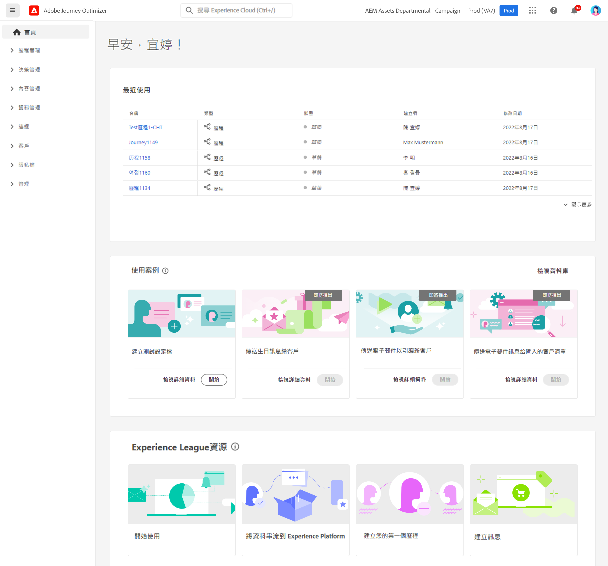
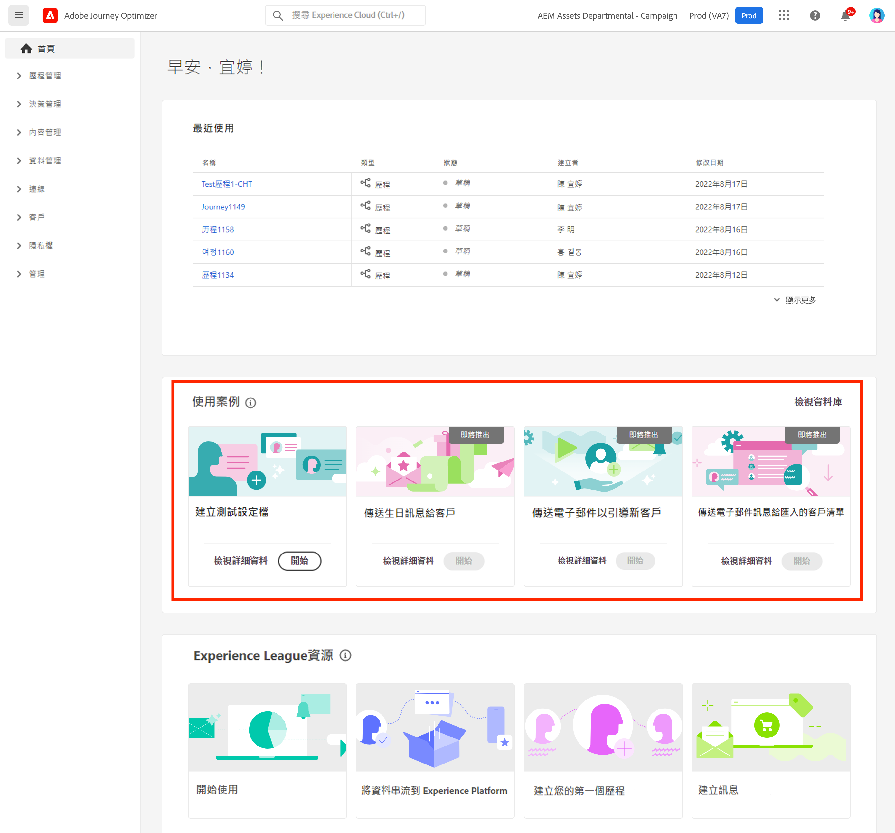
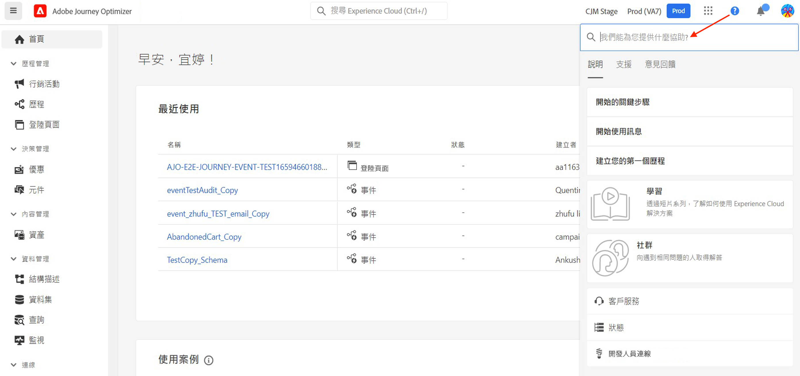
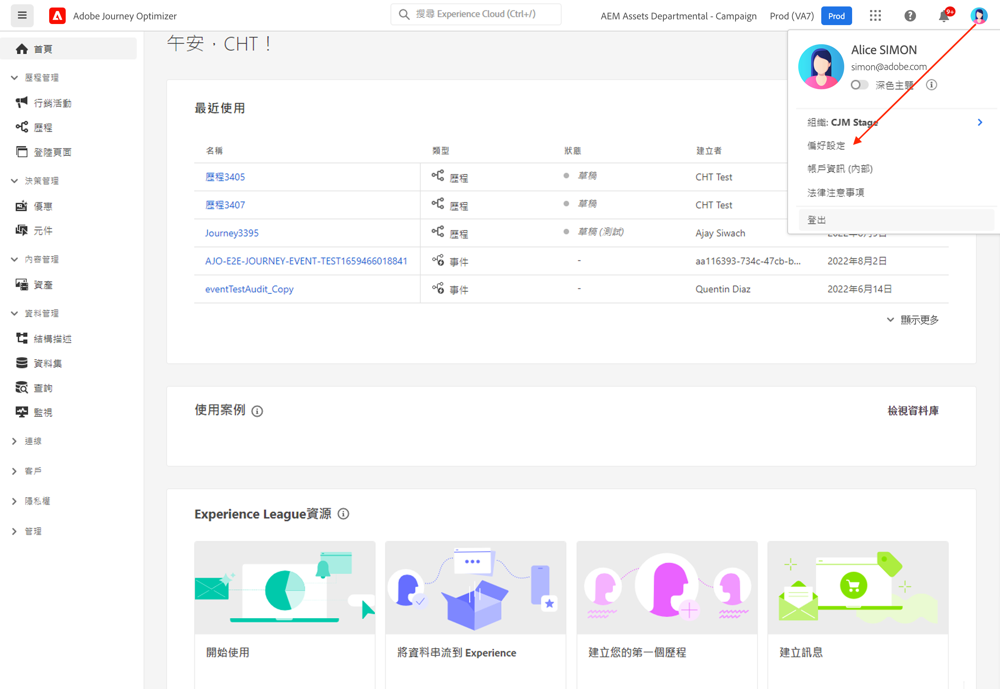
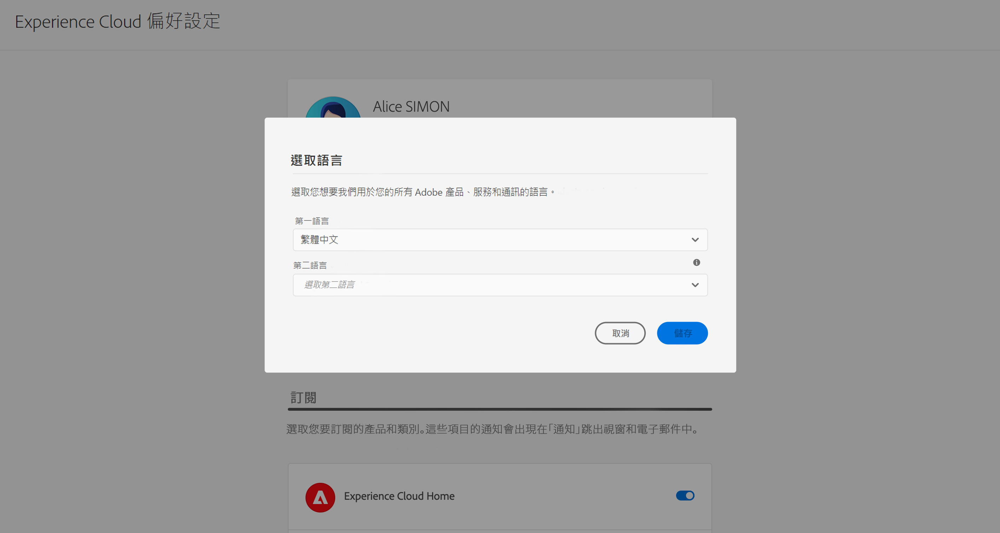

# 使用者介面 {#cjm-user-interface}

若要存取 [!DNL Adobe Journey Optimizer]，請使用 Adobe ID 連線至 [Adobe Experience Cloud](https://experience.adobe.com)，然後選取 [!DNL Journey Optimizer]。

瀏覽使用者介面時的重要概念與 Adobe Experience Platform 相同。如需詳細資訊，請參閱 [Adobe Experience Platform 文件](https://experienceleague.adobe.com/docs/experience-platform/landing/platform-ui/ui-guide.html?lang=zh-Hant#adobe-experience-platform-ui-guide){target="_blank"}。

>[!NOTE]
>
>* 您的環境可用元件和功能取決於您的[權限](../administration/permissions.md)以及您的[授權套件](https://helpx.adobe.com/tw/legal/product-descriptions/adobe-journey-optimizer.html){target="_blank"}。 如有任何問題，請聯絡您的 Adobe 客戶成功經理或 Adobe 代表。
>
>* 本文件將經常更新，以反應此產品使用者介面的最新變更。不過，有些螢幕擷取畫面可能會與使用者介面稍有不同。
>

## 左側導覽 {#left-nav}

瀏覽左側連結來存取[!DNL Journey Optimizer]功能。

>[!NOTE]
>
>可用功能可能會視您的權限與授權合約而有所不同。

您可以在下方左側導覽找到完整的服務與功能清單，以及相關協助頁面的連結。

### 首頁 {#left-nav-home}

[!DNL Journey Optimizer] 首頁包含要啟動的主要連結和資源。

**[!UICONTROL 最近]**&#x200B;清單提供最近建立事件與歷程的捷徑。 此清單顯示其建立和修改日期和狀態。

瀏覽產品內使用案例，以開始建立資源與訊息。 [了解更多](#in-product-use-cases)。

使用首頁底部的連結來了解如何開始使用 [!DNL Journey Optimizer]。 [了解更多](#find-help-and-support)。

### [!UICONTROL 歷程管理] {#left-nav-journey}

從此區段建立行銷活動與歷程。

* **[!UICONTROL 行銷活動]** - 建立、設定及協調行銷活動，使用各種管道將一次性內容傳送給特定客群。 [了解更多](../campaigns/get-started-with-campaigns.md)

* **[!UICONTROL 歷程]** - 建立、設定及協調客戶歷程：結合事件、協調及動作活動，以建立多步驟跨頻道案例。 [了解更多](../building-journeys/journey-gs.md#jo-build)

* **[!UICONTROL 報告]** - Journey Optimizer 報告功能現已完全整合入 Customer Journey Analytics 功能，可跨越兩大平台，將報告標準化，改善資料一致性，提升可靠性。 Journey Optimizer 與 Customer Journey Analytics 之間能緊密整合，讓您可以更清楚地檢視效能量度，讓使用者能做出更明智的決策。[了解更多](../reports/report-gs-cja.md)

### [!UICONTROL 決策管理] {#left-nav-decision}

從此區段建立產品建議與元件。

* **[!UICONTROL 訂閱詳情]** - 從此功能表存取您最近的資源和資料集。使用此區段建立產品建議。[了解更多](../offers/offer-library/creating-personalized-offers.md)

* **[!UICONTROL 元件]** - 建立位置、規則和標記。 [了解更多](../offers/offer-library/key-steps.md)

### [!UICONTROL 內容管理] {#left-nav-content}

從此區段建立和管理內容。

* **[!UICONTROL 資產]** - [!DNL Adobe Experience Manager Assets]為資產集中存放庫，可用來填入訊息。[了解更多](../integrations/assets.md)

* **[!UICONTROL 內容範本]** - 為了加快並改善設計流程，請建立獨立範本，以在 Journey Optimizer 行銷活動與歷程中輕鬆重複使用自訂內容。 [了解更多](../content-management/content-templates.md)

* **[!UICONTROL 片段]** - 建立和管理片段，以順利進行電子郵件設計流程：預先建立自訂內容區塊，用於快速組合電子郵件內容。 [了解更多](../content-management/fragments.md)

* **[!UICONTROL 登陸頁面]** - 建立、設計、測試和發佈登陸頁面：將使用者連結傳送至線上表單，使用者可以在其中選擇加入或選擇退出接收您的通訊，或訂閱特定服務。 [了解更多](../landing-pages/get-started-lp.md)

### [!UICONTROL 資料管理] {#left-nav-data}

從此區段管理資料。

* **[!UICONTROL 結構描述]** - 使用 Adobe Experience Platform 在「方案編輯器」這個互動式視覺畫布中建立和管理體驗資料模型 (XDM) 方案。[了解更多](../data/get-started-schemas.md)

* **[!UICONTROL 資料集]** - 所有內嵌至 Adobe Experience Platform 的資料都會以資料集的形式保留在資料湖中。資料集是資料集合的儲存和管理結構，通常是包含方案 (欄) 和欄 (列) 的表格。 [進一步了解](../data/get-started-datasets.md)

* **[!UICONTROL 查詢]** - 使用 Adobe Experience Platform 查詢服務來寫入和執行查詢、檢視以前執行的查詢，以及存取由您組織內的使用者儲存的查詢。[了解更多](../data/get-started-queries.md)

* **[!UICONTROL 監視]** - 使用此功能表在 Adobe Experience Platform 使用者介面中監視資料擷取。在 [Adobe Experience Platform 文件](https://experienceleague.adobe.com/docs/experience-platform/ingestion/quality/monitor-data-ingestion.html?lang=zh-Hant){target="_blank"}中了解更多詳細資訊。

### [!UICONTROL 連線] {#left-nav-connections}

從此區段管理與其他應用程式和雲端的資料連線。

* **[!UICONTROL 來源]** - 使用此功能表從多種來源 (例如 Adobe 應用程式、雲端儲存、資料庫等) 擷取資料。 您可以建構、加標籤和增強傳入資料。 [了解更多](get-started-sources.md)

* **[!UICONTROL 目的地]** - 使用此功能表與雲端儲存空間位置建立即時連線，以匯出資料集的內容。 [了解更多](../data/export-datasets.md)

### [!UICONTROL 客戶] {#left-nav-customers}

從此區段管理客群與輪廓資料。

* **[!UICONTROL 客群]** - 建立和管理 Experience Platform 客群，並將其用於歷程之中。 [了解更多](../audience/about-audiences.md)

* **[!UICONTROL 訂閱清單]** - 在 [!DNL Journey Optimizer] 中，選擇加入訂閱服務的客戶均會收集到訂閱清單中。 [了解更多](../landing-pages/subscription-list.md)

* **[!UICONTROL 輪廓]** - 即時客戶輪廓可為個別客戶建立整體檢視，並結合來自多個頻道的資料，包括線上、離線、CRM 和第三方資料。[了解更多](../audience/get-started-profiles.md)

* **[!UICONTROL 識別]** - Adobe Experience Platform 身分服務透過 Adobe Experience Platform 的身分圖表，管理跨裝置、跨頻道及幾乎即時的客戶身分識別。[了解更多](../audience/get-started-identity.md)

### [!UICONTROL 隱私權] {#left-nav-privacy}

從此區段控制隱私權管理與請求。

* **[!UICONTROL 原則]** - Adobe Experience Platform 可讓您為欄位加上標籤，並為每個頻道建立行銷動作。 然後，您會定義連結至標籤和行銷動作的治理政策。[了解更多](../action/action-privacy.md)

* **[!UICONTROL 請求]** - 在 Adobe Experience Platform Privacy Service 中管理隱私權請求。 其提供 RESTful API 與使用者介面，幫助您管理客戶資料請求。 [了解更多](../privacy/requests.md)

* **[!UICONTROL 稽核]** - 瀏覽至此區段以檢查活動記錄。 [了解更多](../privacy/audit-logs.md)

* **[!UICONTROL 資料生命週期]** — 此區段可讓您設定和排程資料生命週期作業，確保記錄得到正確維護。 [了解更多](../privacy/data-hygiene.md)

### [!UICONTROL 管理] {#left-nav-admin}

* **[!UICONTROL 設定]** - 使用此選單來設定[事件](../event/about-events.md)、[資料來源](../datasource/about-data-sources.md)和[動作](../action/action.md) ，以用於您的歷程。

  您也可以存取&#x200B;**報告**&#x200B;區段來設定行銷活動實驗的報告。[了解更多](../reports/reporting-configuration.md)

* **[!UICONTROL 業務規則]** - 使用此部分來建立跨通路業務規則，以控制使用者接收訊息或進入歷程的頻率。 [了解更多](../conflict-prioritization/rule-sets.md)

* **[!UICONTROL 警報]** - 使用者介面可讓您根據 Adobe Experience Platform 可檢視性深入解析顯示的指標查看收到警報的歷史記錄。UI 也可讓您檢視、啟用和停用可用的警報規則。 [了解更多](../reports/alerts.md)

* **[!UICONTROL 沙箱]** - Adobe Experience 平台提供的沙箱可將單一執行個體分割成個別的虛擬環境，以利開發及改進數位體驗應用程式。此外， [!DNL Journey Optimizer] 可讓您使用封裝匯出和匯入功能，在多個沙箱之間複製物件，例如歷程、內容範本或片段。 [了解更多](../administration/sandboxes.md)

* **[!UICONTROL 管道]** - 使用此區段來設定管道，包括子網域、設定和傳遞能力設定。 [了解更多](../configuration/get-started-configuration.md)

* **[!UICONTROL 標籤]** - 利用統一標籤，您可以輕鬆分類歷程與行銷活動，進而改進清單的搜尋結果。[進一步了解](../start/search-filter-categorize.md#work-with-unified-tags)

## 產品內使用案例 {#in-product-uc}

從 [!DNL Adobe Journey Optimizer] 首頁、產品使用案例可以快速輸入，以建立測試輪廓或第一個客戶歷程。

+++ **可用的使用案例**

可用的使用案例包括：

* **建立測試輪廓**，以使用我們的 CSV 範本建立測試輪廓，以測試個人化訊息和歷程。在[本頁面](../audience/creating-test-profiles.md#use-case-1)瞭解如何實施此使用案例。
* **傳送生日訊息給客戶**，以自動傳送電子郵件祝賀客戶生日。(即將推出)
* **傳送電子郵件以吸引新客戶**，輕鬆傳送最多兩封電子郵件來歡迎新註冊的客戶。(即將推出)
* **傳送推播訊息至匯入的客戶清單**，以快速將推播通知傳送至從 CSV 檔案匯入的客戶清單。(即將推出)

+++

若要深入了解每個使用案例，請按一下&#x200B;**[!UICONTROL 檢視詳情]**&#x200B;連結。

若要執行使用案例，請按一下&#x200B;**[!UICONTROL 開始]**&#x200B;按鈕。

您可以從&#x200B;**[!UICONTROL 檢視資料庫]**&#x200B;按鈕存取已執行的使用案例。

## 尋找說明與支援 {#find-help}

從首頁的下半頁面存取 Adobe Journey Optimizer 重要說明頁面。

使用&#x200B;**說明**&#x200B;圖示來存取說明頁面、聯絡支援人員並分享意見。 您可以從搜尋欄位搜尋說明文章和影片。

在每個頁面中，使用內容說明按鈕來深入了解功能，並瀏覽至 **[!DNL Adobe Experience League]** 文件。

## AI 助理 {#ai-assistant}

AI 助理是使用者介面功能，可用於導覽和了解 Adobe 概念，並取得您特定環境的操作見解。 它適用於 Adobe Experience Cloud 的多種產品，包括 Adobe Journey Optimizer。

若要存取 AI 助理，請按一下頂端列上的圖示。AI 助理便會顯示在畫面右側區段。

[可在此頁面](ai-assistant.md)上，瞭解如何存取並使用 AI 助理。

## 語言偏好設定 {#language-pref}

使用者介面提供下列語言版本：

* 英文
* 法文
* 德文
* 義大利文
* 西班牙文
* 葡萄牙文 (巴西)
* 日文
* 韓文
* 繁體中文
* 簡體中文

您的預設介面語言是由使用者輪廓中指定的偏好語言所決定。

+++ **如何變更語言**

若想變更語言，請遵循下列步驟：

1. 按一下右上角頭像處的&#x200B;**「偏好設定」**。
   
1. 然後按一下您電子郵件地址下方顯示的語言
1. 選擇您偏好的語言，然後按一下 **「儲存」**。若您使用的元件未當地化為您的母語，您可選取第二種語言。
   

+++

## 了解更多 {#more}

從 [!DNL Journey Optimizer] 開始？ 有經驗的使用者遇到特定問題？ 公司的執行個體管理員？ [採取自訂路徑，更快達成目標](quick-start.md)！

<!--CONTEXTUAL HELP TO DISPATCH IN DOCS ONCE FEATURE LIVE-->

<!--ORCHESTRATED CAMPAIGNS - Overview page-->

<!--OVERVIEW TAB ORCHESTRATED CAMPAIGNS SKU only-->

>[!CONTEXTUALHELP]
>id="ajo_oc_campaign_ovv_1"
>title="行銷活動協調"
>abstract="分割、合併、擴充並操控相關資料集，以便定義您的客群"

>[!CONTEXTUALHELP]
>id="ajo_oc_campaign_ovv_2"
>title="善用多實體資料"
>abstract="瞭解協調的行銷活動如何運用關聯式資料集，讓資料更為豐富，以便進行細分和個人化"

>[!CONTEXTUALHELP]
>id="ajo_oc_campaign_ovv_3"
>title="臨時細分和確切計算"
>abstract="使用確切計算，逐步建立區段"

>[!CONTEXTUALHELP]
>id="ajo_oc_campaign_ovv_4"
>title="可用頻道"
>abstract="電子郵件、簡訊、推播通知、直接郵件"

<!--OVERVIEW TAB ORCHESTRATED CAMPAIGNS + JOURNEYS SKU -->

>[!CONTEXTUALHELP]
>id="ajo_oc_jo_camppaign_ovv_1"
>title="建立並傳送行銷活動的引導式 UI"
>abstract="透過頻道設定單一或許多動作，選擇客群，設定內容，定義排程，接著一切就緒，您就可以傳送資料"

>[!CONTEXTUALHELP]
>id="ajo_oc_jo_camppaign_ovv_2"
>title="可用頻道"
>abstract="電子郵件、簡訊、推播通知、應用程式內、網頁、程式碼型體驗"

<!--OVERVIEW TAB ORCHESTRATED CAMPAIGNS - API triggered tab -->

>[!CONTEXTUALHELP]
>id="ajo_oc_api_camppaign_ovv_1"
>title="由交易 API 觸發的行銷活動"
>abstract="透過 API 呼叫觸發即時訊息"

>[!CONTEXTUALHELP]
>id="ajo_oc_api_camppaign_ovv_2"
>title="行銷訊息"
>abstract="促銷內容（需選擇加入，遵守商業規則）"

>[!CONTEXTUALHELP]
>id="ajo_oc_api_camppaign_ovv_3"
>title="交易型訊息"
>abstract="服務相關內容（確認、警示則不受到行銷同意約束）"

>[!CONTEXTUALHELP]
>id="ajo_oc_api_camppaign_ovv_4"
>title="可用頻道"
>abstract="電子郵件、簡訊、推播通知"

<!--APPROVAL POLICIES-->

>[!CONTEXTUALHELP]
>id="ajo_campaigns_edit_disabled"
>title="編輯已停用"
>abstract="編輯已停用 (行銷活動)"

>[!CONTEXTUALHELP]
>id="ajo_journey_edit_disabled"
>title="編輯已停用"
>abstract="編輯已停用 (歷程)"

>[!CONTEXTUALHELP]
>id="ajo_approval_policy_approval_status"
>title="核准狀態"
>abstract="核准狀態"

>[!CONTEXTUALHELP]
>id="ajo_campaigns_approve"
>title="核准"
>abstract="核准 (行銷活動)"

>[!CONTEXTUALHELP]
>id="ajo_journey_approve"
>title="核准"
>abstract="核准 (歷程)"

>[!CONTEXTUALHELP]
>id="ajo_journey_simulation"
>title="模擬您的歷程"
>abstract="歷程模擬可讓您驗證您的歷程，並在啟動歷程之前查看執行績效。此模擬會使用經過訓練的模型資料在整個歷程中提供數據，以便了解該歷程在真實狀況下的表現績效。"