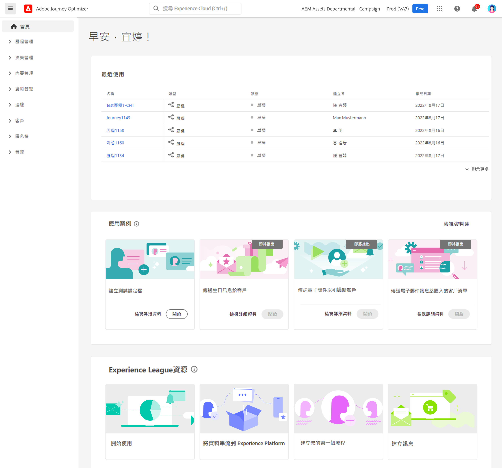
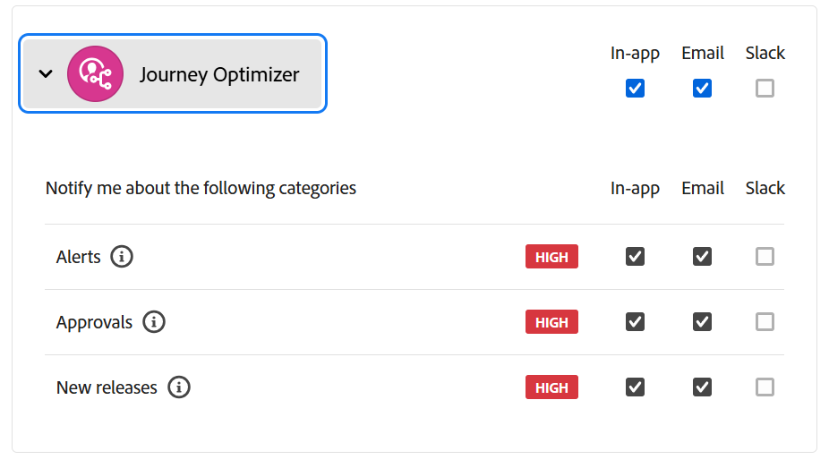

# 瀏覽介面 {#user-interface}

若要存取 Adobe Journey Optimizer，請使用您的 Adobe ID 登入 [Adobe Experience Cloud](https://experience.adobe.com)，然後選取 [!DNL Journey Optimizer]。

>[!NOTE]
>
>* 您的環境可用元件和功能取決於您的[權限](../administration/permissions.md)和[授權套件](https://helpx.adobe.com/tw/legal/product-descriptions/adobe-journey-optimizer.html){target="_blank"}。
>* 本文件將經常更新。有些螢幕擷取畫面可能會與您的介面稍有不同。

## 快速導覽 {#quick-tour}

Journey Optimizer 介面包含四個主要區域：

1. **左側導覽** - 存取按功能整理的所有功能和特性
2. **頂端列** - 通用搜尋、說明、通知和設定
3. **首頁** - 快速存取最近的項目和有用的資源
4. **主要工作區** - 您在這裡建立和管理內容

**秘訣：**&#x200B;新使用者可以從&#x200B;**首頁**&#x200B;頁面開始，存取最近的專案和使用案例，或使用頂端列中的&#x200B;**說明**&#x200B;圖示取得內容指引。

## 頂端列功能 {#top-bar}

### 通用搜尋 {#search}

使用搜尋圖示快速尋找 Journey Optimizer 中的歷程、行銷活動、資產和其他物件。輸入關鍵字以檢視來自平台所有區域的相關結果。 [進一步瞭解通用搜尋](search-filter-categorize.md#unified-search)。

### 說明與支援 {#help}

按一下&#x200B;**說明**&#x200B;圖示以：

* 搜尋說明文章和影片
* 存取目前頁面的內容說明
* 聯絡 Adobe 支援
* 分享意見回饋

內容說明會顯示與您檢視的畫面相關的指引，並直接連結至對應的檔案，因此您不需要離開工作流程即可取得正確的資訊。

#### 支援票證准則 {#support-ticket-guidelines}

聯絡Adobe支援時，請包含下列專案以加速根本原因分析和解決：

* **環境詳細資料** — 沙箱名稱、組織ID和產品區域（例如歷程、行銷活動、決策）
* **影響層級** — 問題的嚴重性（例如，生產遭到封鎖、功能有限、裝飾）
* **復寫步驟** — 清除、逐步指示以重現問題
* **記錄檔或熒幕擷取畫面** — 說明問題的相關錯誤訊息、請求ID或熒幕擷取畫面
* **相關ID** — 歷程ID、行銷活動ID、對象ID或與問題相關的其他物件識別碼

### 通知 {#in-product-uc}

啟用產品內通知和電子郵件通知，以隨時掌握以下資訊：

* **警示** - 系統故障和效能問題
* **核准** - 需要您檢閱的請求
* **新版本** - 產品更新與新功能

要設定通知：

1. 按一下設定檔圖示，選取&#x200B;**[!UICONTROL 偏好設定]**
2. 在&#x200B;**[!UICONTROL 通知]**&#x200B;下，尋找 **[!UICONTROL Journey Optimizer]**
3. 啟用您想接收的通知類型

{width="60%" align="center"}

### 語言偏好設定 {#language}

此介面有提供以下語言版本：英文、法文、德文、義大利文、西班牙文、巴西葡萄牙文、日文、韓文、繁體中文和簡體中文。

若要變更您的語言：

1. 按一下設定檔選單中的&#x200B;**[!UICONTROL 偏好設定]**
2. 選取您偏好的語言
3. 可選擇第二種語言作為備用語言
4. 按一下&#x200B;**儲存**

提供鍵盤快速鍵和協助工具功能。 [了解更多](accessibility.md)

## 首頁 {#home-page}

首頁提供以下資訊：

* **最近項目**：指向近期建立事件、歷程、行銷活動和其他物件等捷徑
* **使用案例**：預設場景可協助您開始使用 (建立測試輪廓、傳送生日賀詞簡訊等)。
* **資源**：文件、教學課程和已支援的連結

### 使用案例和快速入門工作流程 {#use-cases}

快速入門工作流程可協助您完成日常工作：

* **建立測試設定檔**：使用 CSV 範本，產生測試設定檔
* **傳送生日賀詞簡訊**：自動傳送生日賀詞電子郵件（即將推出）
* **引導新客戶**：新客戶迎賓系列（即將推出）
* **傳送推播至已匯入清單**：來自 CSV 資料的快速推播通知（即將推出）

按一下&#x200B;**[!UICONTROL 檢視詳細資料]**，以便深入瞭解所有使用案例，或可按一下&#x200B;**[!UICONTROL 開始]**，就能開始。

## 左側導覽 {#left-nav}

左側導覽會將 Journey Optimizer 功能按功能類別整理。可用的選單項目取決於您的權限和授權。

| 區域 | 目的 |
|---------|---------|
| 歷程管理 | 行銷活動、歷程、報告 |
| 決策管理 | 選件與個人化 |
| 內容管理 | Assets、範本、片段、登陸頁面 |
| 資料管理 | 結構描述、資料集、查詢 |
| 連線 | 來源和目的地 |
| 客戶 | 對象、設定檔、身分 |
| 隱私權 | 原則、請求、稽核 |
| 管理 | 設定、頻道、沙箱 |

### 主要區段 {#main-sections}

**首頁** - 快速存取最近建立的項目和有用資源的起點

**歷程管理** - 建立和管理客戶體驗

* **行銷活動** - 建立針對特定客群的一次性或排程訊息。[開始使用行銷活動](../campaigns/get-started-with-campaigns.md)
* **歷程** - 建立多步驟、跨管道的客戶體驗。[建立您的第一個歷程](../building-journeys/journey-gs.md)
* **報告** - 使用整合的 Customer Journey Analytics 報告分析績效。[檢視報告文件](../reports/campaign-global-report-cja.md)

**決策管理** - 管理個人化產品建議。[了解決策管理](../offers/get-started/starting-offer-decisioning.md)

* **產品建議** - 建立和管理個人化產品建議
* **元件** - 為產品建議設定位置、規則和標籤

**內容管理** - 建立和整理內容

* **資產** - 影像和媒體的集中式存放庫。[管理資產](../integrations/assets.md)
* **內容範本** - 行銷活動和歷程的可重複使用訊息範本。[建立範本](../content-management/content-templates.md)
* **片段** - 可用於多個訊息的內容區塊。[使用片段](../content-management/fragments.md)
* **登陸頁面** - 訂閱和偏好設定的網頁表單。[設計登陸頁面](../landing-pages/get-started-lp.md)
* **使用案例教戰手冊** - 為常見行銷案例預先建立工作流程。[探索教戰手冊](ai-features.md#playbooks)

**資料管理** - 管理您的資料基礎。[了解結構描述和資料集](../data/get-started-schemas.md)

* **結構描述** - 定義資料結構
* **資料集** - 儲存和管理資料集合
* **查詢** - 寫入並執行查詢
* **監視** - 追蹤資料擷取

**連線** - 與其他系統整合

* **來源** - 從外部系統擷取資料。[設定來源](get-started-sources.md)
* **目的地** - 將資料匯出至雲端儲存空間。[設定目的地](../data/export-datasets.md)

**客戶** - 管理客群和輪廓

* **客群** - 建立和管理客戶區段。[使用客群](../audience/about-audiences.md)
* **訂閱清單** - 管理選擇加入清單。[管理訂閱](../landing-pages/subscription-list.md)
* **輪廓** - 檢視統一客戶輪廓。[探索輪廓](../audience/get-started-profiles.md)
* **身分** - 管理身分解析。[了解身分](../audience/get-started-identity.md)

**隱私權** - 控制隱私權與合規性。[隱私權概觀](../privacy/get-started-privacy.md)

* **原則** - 定義資料治理原則
* **請求** - 處理隱私權請求 (GDPR、CCPA)
* **稽核** — 檢閱活動記錄。[檢視稽核記錄](../privacy/audit-logs.md)
* **資料生命週期** - 設定資料保留

**管理** - 設定系統設定。[存取控制概觀](../administration/permissions-overview.md)

* **設定** - 設定事件、資料來源和動作。[設定管道](../configuration/get-started-configuration.md)
* **業務規則** - 控制訊息頻率和歷程項目。[設定業務規則](../conflict-prioritization/rule-sets.md)
* **警示** - 檢視和管理系統警示。[監視警示](../reports/alerts.md)
* **沙箱** - 管理環境並在沙箱之間複製物件。[使用沙箱](../administration/sandboxes.md)
* **管道** - 設定管道設定和傳遞能力。[設定管道設定](../configuration/channel-surfaces.md) | [開始使用設定](../configuration/get-started-configuration.md)
* **標籤** - 整理內容並將其分類。[使用統一標籤](search-filter-categorize.md#tags)

## AI 助理 {#ai-assistant}

AI 助理有提供立即說明、運作洞察。 按一下頂端列中的 AI 助理圖示，以便：

* 取得產品功能相關解答
* 收到有關歷程的運作洞察
* 導覽概念和典範實務

[深入了解 AI 助理](ai-features.md#ai-assistant)

## 相關主題 {#related-topics}

* [依角色選擇合適學習路徑](quick-start.md)
* [搜尋、篩選並分類內容](search-filter-categorize.md)
* [瞭解 Journey Optimizer 的運作方式](understanding-ajo.md)
* [協助工具功能](accessibility.md)

<!--CONTEXTUAL HELP TO DISPATCH IN DOCS ONCE FEATURE LIVE-->

<!--ORCHESTRATED CAMPAIGNS - Overview page-->

<!--OVERVIEW TAB ORCHESTRATED CAMPAIGNS SKU only-->

>[!CONTEXTUALHELP]
>id="ajo_oc_campaign_ovv_1"
>title="行銷活動協調"
>abstract="分割、合併、擴充並操控相關資料集，以便定義您的客群"

>[!CONTEXTUALHELP]
>id="ajo_oc_campaign_ovv_2"
>title="善用多實體資料"
>abstract="了解協調的行銷活動如何運用相關資料集進行資料擴充，以便進行細分及個人化"

>[!CONTEXTUALHELP]
>id="ajo_oc_campaign_ovv_3"
>title="臨時細分和確切計算"
>abstract="使用確切計算，逐步建立區段"

>[!CONTEXTUALHELP]
>id="ajo_oc_campaign_ovv_4"
>title="可用頻道"
>abstract="電子郵件、簡訊、推播通知、直接郵件"

<!--OVERVIEW TAB ORCHESTRATED CAMPAIGNS + JOURNEYS SKU -->

>[!CONTEXTUALHELP]
>id="ajo_oc_jo_campaign_ovv_1"
>title="建立並傳送行銷活動的引導式 UI"
>abstract="設定一個管道的單一或多個動作，選擇客群，設定內容，決定排程，然後即可準備傳送"

>[!CONTEXTUALHELP]
>id="ajo_oc_jo_campaign_ovv_2"
>title="可用頻道"
>abstract="電子郵件、簡訊、推播通知、應用程式內、網頁、程式碼型體驗"

<!--OVERVIEW TAB ORCHESTRATED CAMPAIGNS - API triggered tab -->

>[!CONTEXTUALHELP]
>id="ajo_oc_api_campaign_ovv_1"
>title="交易型 API 觸發的行銷活動"
>abstract="透過 API 呼叫觸發即時訊息"

>[!CONTEXTUALHELP]
>id="ajo_oc_api_campaign_ovv_2"
>title="行銷訊息"
>abstract="促銷內容（需選擇加入，遵守商業規則）"

>[!CONTEXTUALHELP]
>id="ajo_oc_api_campaign_ovv_3"
>title="交易型訊息"
>abstract="服務相關內容（確認、警示則不受到行銷同意約束）"

>[!CONTEXTUALHELP]
>id="ajo_oc_api_campaign_ovv_4"
>title="可用頻道"
>abstract="電子郵件、簡訊、推播通知"

<!--APPROVAL POLICIES-->

>[!CONTEXTUALHELP]
>id="ajo_campaigns_edit_disabled"
>title="編輯已停用"
>abstract="編輯已停用 (行銷活動)"

>[!CONTEXTUALHELP]
>id="ajo_journey_edit_disabled"
>title="編輯已停用"
>abstract="編輯已停用 (歷程)"

>[!CONTEXTUALHELP]
>id="ajo_approval_policy_approval_status"
>title="核准狀態"
>abstract="核准狀態"

>[!CONTEXTUALHELP]
>id="ajo_campaigns_approve"
>title="核准"
>abstract="核准 (行銷活動)"

>[!CONTEXTUALHELP]
>id="ajo_journey_approve"
>title="核准"
>abstract="核准 (歷程)"

>[!CONTEXTUALHELP]
>id="ajo_journey_simulation"
>title="模擬您的歷程"
>abstract="歷程模擬可讓您驗證您的歷程，並在啟動歷程之前查看執行績效。此模擬會使用經過訓練的模型資料在整個歷程中提供數據，以便了解該歷程在真實狀況下的表現績效。"

<!-- WEBHOOKS -->

>[!CONTEXTUALHELP]
>id="ajo_channels_feedback_webhook_settings"
>title="啟用 Webhook"
>abstract="啟用 Webhook 以接收有關訊息執行狀態的即時回饋。在啟用此選項之前，請確定您已在&#x200B;**管理**/**頻道**/**回饋 Webhook** 選單中設定 Webhook。"

>[!CONTEXTUALHELP]
>id="ajo_channels_feedback_webhook_settings_create"
>title="回饋 Webhook"
>abstract="意見回饋 Webhook 可讓您接收透過交易型 API 觸發的行銷活動傳送之訊息執行狀態的即時回饋。每個組織 + 沙箱組合只允許一個 Webhook 設定。"

>[!CONTEXTUALHELP]
>id="ajo_channels_feedback_webhook_settings_configuration"
>title="基本設定"
>abstract="在此區段中，輸入說明性名稱以識別 Webhook 並選取此 Webhook 應接收意見回饋 (電子郵件和/或簡訊) 的頻道。在 Webhook URL 欄位中，提供必須傳送意見回饋事件的 HTTPS 端點。"

>[!CONTEXTUALHELP]
>id="ajo_channels_feedback_webhook_settings_authentication"
>title="Authentication"
>abstract="如果您的端點需要 JWT 驗證，請從清單中選取 **JWT 驗證**，並提供必要的詳細資料。"

>[!CONTEXTUALHELP]
>id="ajo_channels_feedback_webhook_settings_header_parameters"
>title="標頭參數"
>abstract="在此區段中，您可以設定隨每個 Webhook 請求傳送的其他自訂標頭。"

>[!CONTEXTUALHELP]
>id="ajo_orchestration_incrementalquery"
>title="增量查詢"
>abstract="增量查詢是一種目標定位活動，每當協調的行銷活動執行時，就會執行資料庫查詢。 它只會傳回新記錄，並排除先前執行中已包含的任何人，因此您可以避免重新鎖定相同人員或重新匯出相同列。"

>[!CONTEXTUALHELP]
>id="ajo_orchestration_incrementalquery_processeddata"
>title="已處理的資料"
>abstract="在處理資料底下，選擇如何排除先前執行中的記錄。 透過排除先前執行的結果，活動會保留先前執行中傳回的記錄清單；每次執行都會排除這些記錄，並只傳回新記錄。 透過使用日期欄位選項，活動使用所選的日期欄位而不是追蹤個別ID，並且每次執行只傳回日期在最後一次執行之後的列。"

>[!CONTEXTUALHELP]
>id="ajo_orchestration_incrementalquery_history"
>title="歷史記錄（天）"
>abstract="此設定控制該清單的保留時間。 0值表示無限期保留；不會移除任何記錄。"

>[!CONTEXTUALHELP]
>id="ajo_inbox_location"
>title="頁面上的位置"
>abstract="。"

>[!CONTEXTUALHELP]
>id="ajo_inbox_app_id"
>title="應用程式 ID"
>abstract="。"

>[!CONTEXTUALHELP]
>id="ajo_inbox_location"
>title="應用程式內的位置或路徑"
>abstract="。"
