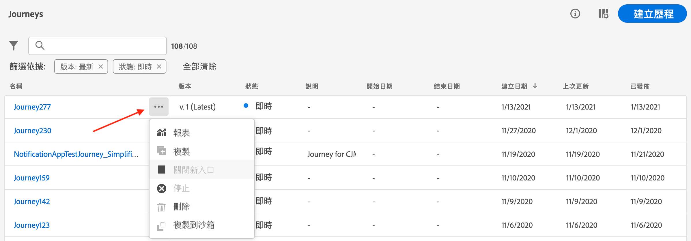

# 使用者介面 {#cjm-user-interface}

連線至 [Adobe Experience Cloud](http://experience.adobe.com) 並瀏覽 [!DNL Journey Optimizer].

瀏覽使用者介面時，Adobe Experience Platform有常見的重要概念。 請參閱 [Adobe Experience Platform檔案](https://experienceleague.adobe.com/docs/experience-platform/landing/platform-ui/ui-guide.html#adobe-experience-platform-ui-guide){target=&quot;_blank&quot;}以取得詳細資訊。

使用者介面中可用的元件和功能視您的 [權限](../administration/permissions.md) 和 [授權套件](https://helpx.adobe.com/legal/product-descriptions/adobe-journey-optimizer.html){target=&quot;_blank&quot;}。 如有任何問題，請洽詢您的Adobe客戶成功經理。

>[!NOTE]
>
>本檔案會經常更新，以反映產品使用者介面的最新變更。 不過，有些螢幕擷取畫面可能會與您的使用者介面稍有不同。

## 左側導覽 {#left-nav}

瀏覽左側的連結以存取 [!DNL Journey Optimizer] 功能。

>[!NOTE]
>
>可用的功能可能會因您的權限和授權合約而異。

您可以在左側導覽中找到完整的服務和功能清單，以及相關說明頁面的連結。

**首頁**

[!DNL Journey Optimizer] 首頁包含要開始的關鍵連結和資源。 此 **[!UICONTROL Recents]** 清單提供最近建立之事件和歷程的捷徑。 此清單顯示其建立和修改日期與狀態。

**[!UICONTROL JOURNEY MANAGEMENT]**

* **[!UICONTROL Journeys]**  — 建立、設定和協調您的客戶歷程。 [深入了解](../building-journeys/journey-gs.md#jo-build)

* **[!UICONTROL Landing pages]**  — 建立、設計、測試和發佈登錄頁面。 [深入了解](../landing-pages/get-started-lp.md)

**[!UICONTROL DECISION MANAGEMENT]**

* **[!UICONTROL Offers]**  — 從此功能表存取最近的來源和資料集。 使用此區段來建立新選件。 [深入了解](../offers/offer-library/creating-personalized-offers.md)

* **[!UICONTROL Components]**  — 建立版位、規則和標籤。 [深入了解](../offers/offer-library/key-steps.md)

**[!UICONTROL CONTENT MANAGEMENT]**

* **[!UICONTROL Assets]** - [!DNL Adobe Experience Manager Assets Essentials] 是資產的集中存放庫，您可以用來填入訊息。 [深入了解](../email/assets-essentials.md)

**[!UICONTROL DATA MANAGEMENT]**

* **[!UICONTROL Schemas]**  — 使用Adobe Experience Platform在稱為結構編輯器的互動式視覺畫布中，建立及管理Experience Data Model(XDM)結構。 [深入了解](../data/get-started-schemas.md)

* **[!UICONTROL Datasets]**  — 所有擷取至Adobe Experience Platform的資料都會以資料集形式保存在Data Lake中。 資料集是資料集合（通常為表格）的儲存和管理結構，其中包含結構（欄）和欄位（列）。 [深入了解](../data/get-started-datasets.md)

* **[!UICONTROL Queries]**  — 使用Adobe Experience Platform Query Service來撰寫和執行查詢、檢視先前執行的查詢，以及存取組織內使用者儲存的查詢。 [深入了解](../data/get-started-queries.md)

* **[!UICONTROL Monitoring]**  — 使用此功能表監控Adobe Experience Platform使用者介面中的資料擷取。 [深入了解](https://experienceleague.adobe.com/docs/experience-platform/ingestion/quality/monitor-data-ingestion.html){target=&quot;_blank&quot;}

**[!UICONTROL CONNECTIONS]**

* **[!UICONTROL Sources]**  — 使用此功能表來內嵌來自各種來源的資料（例如Adobe應用程式、雲端儲存、資料庫等），以及結構、標籤和增強傳入的資料。 [深入了解](get-started-sources.md)

**[!UICONTROL CUSTOMER]**

* **[!UICONTROL Segments]**  — 建立和管理Experience Platform區段定義，並將其運用於您的歷程中。 [深入了解](../segment/about-segments.md)

* **[!UICONTROL Profiles]**  — 即時客戶設定檔可建立個別客戶的全方位檢視，結合來自多個管道的資料，包括線上、離線、CRM和協力廠商資料。 [深入了解](../segment/get-started-profiles.md)

* **[!UICONTROL Identities]** - Adobe Experience Platform Identity Service可在Adobe Experience Platform內稱為身分圖表的資料中，管理客戶的跨裝置、跨管道和近乎即時身分識別。 [深入了解](../segment/get-started-identity.md)

**[!UICONTROL ADMINISTRATION]**

* **[!UICONTROL Journey Administration]**  — 使用此功能表來設定 [事件](../event/about-events.md), [資料來源](../datasource/about-data-sources.md) 和 [動作](../action/action.md) 以用於您的歷程。

* **[!UICONTROL Sandboxes]** - Adobe Experience Platform提供的沙箱可將單一執行個體分割成個別的虛擬環境，以協助開發及改進數位體驗應用程式。 [深入了解](../administration/sandboxes.md)

* **[!UICONTROL Alerts]**  — 使用者介面可讓您根據Adobe Experience Platform可觀察性深入分析揭示的量度，檢視收到警報的歷史記錄。 UI也可讓您檢視、啟用和停用可用的警報規則。 [深入了解](https://experienceleague.adobe.com/docs/experience-platform/observability/alerts/overview.html){target=&quot;_blank&quot;}

## 產品內使用案例 {#in-product-uc}

運用 [!DNL Adobe Journey Optimizer] 從首頁使用案例，並提供一些快速輸入項目以建立客戶歷程。

可用的使用案例包括：

* **建立測試設定檔**，使用我們的CSV範本建立測試設定檔，以測試個人化訊息和歷程。 了解如何實作此使用案例 [本頁](../segment/creating-test-profiles.md#use-case-1).
* **傳送生日訊息給客戶**，自動傳送電子郵件，祝您的客戶生日前後順利。 （即將推出）
* **向上線新客戶發送電子郵件**，輕鬆傳送最多兩封電子郵件以歡迎您新註冊的客戶。 （即將推出）
* **傳送推送訊息至匯入的客戶清單**，快速將推播通知傳送至從CSV檔案匯入的客戶清單。 （即將推出）

按一下 **[!UICONTROL View details]** 以深入了解每個使用案例。

按一下 **[!UICONTROL Begin]** 按鈕以開始使用案例。

您可以從 **[!UICONTROL View use case library]** 按鈕。

## 協助工具{#accessibility}

中的協助工具功能 [!DNL Adobe Journey Optimizer] 繼承自Adobe Experience Platform:

* 鍵盤協助工具
* 顏色對比
* 驗證必填欄位

[深入了解](https://experienceleague.adobe.com/docs/experience-platform/accessibility/features.html)Adobe Experience Platform檔案中的{target=&quot;_blank&quot;}。

您可以在 [!DNL Journey Optimizer]:

| 動作 | 快速鍵 |
| --- | --- |
| 在使用者介面元素、區段和功能表群組之間移動 | 標籤 |
| 在使用者介面元素、區段和功能表群組之間向後移動 | Shift + Tab |
| 在區段內移動以將焦點設定為個別元素 | 箭頭 |
| 選取或清除焦點中的元素 | 輸入或空格鍵 |
| 取消選擇、折疊窗格或關閉對話框 | Esc |

[深入了解](https://experienceleague.adobe.com/docs/experience-platform/accessibility/custom.html)Adobe Experience Platform檔案中的{target=&quot;_blank&quot;}。

您可以在Journey Optimizer的特定部分使用下列捷徑：

<table>
  <thead>
    <tr>
      <th>介面元素</th>
      <th>動作</th>
      <th>快速鍵</th>
    </tr>
  </thead>
  <tr>
    <td>歷程、動作、資料來源或事件清單</td>
    <td>建立歷程、動作、資料來源或事件</td>
    <td>C</td>
  </tr>
  <tr>
    <td rowspan="3">草稿狀態的歷程畫布</td>
    <td>從左側浮動視窗的第一個可用位置（從上到下）新增活動</td>
    <td>連按兩下活動</td>
  </tr>
  <tr>
    <td>選取所有活動</td>
    <td>Ctrl + A(Windows) Command + A(Mac)</td>
  </tr>
  <tr>
    <td>刪除選取的活動</td>
    <td>刪除或退格，然後輸入以確認刪除</td>
  </tr>
  <tr>
  <td rowspan="3">

這些元素的配置窗格：

<ul>
  <li>歷程中的活動</li>
  <li>事件</li>
  <li>資料來源</li>
  <li>動作</li>
</ul>

</td>
    <td>移至下一個要設定的欄位</td>
    <td>標籤</td>
  </tr>
  <tr>
    <td>儲存變更並關閉設定窗格</td>
    <td>輸入</td>
  </tr>
  <tr>
    <td>放棄更改並關閉配置窗格</td>
    <td>Esc</td>
  </tr>
  <tr>
    <td rowspan="4">在測試模式中的歷程</td>
    <td>啟用或禁用測試模式</td>
    <td>T</td>
  </tr>
  <tr>
    <td>觸發事件型歷程中的事件</td>
    <td>E</td>
  </tr>
  <tr>
    <td>

在以區段為基礎的歷程中觸發事件，其 **[!UICONTROL Single profile at a time]** 選項

</td>
    <td>P</td>
  </tr>
  <tr>
    <td>顯示測試記錄</td>
    <td>L</td>
  </tr>
<!-- //Ajouter ce raccourci quand il marchera (actuellement, le raccourci Ctrl/Cmd+F du navigateur a priorité sur celui de AJO).//
  <tr>
    <td>Page with a search bar</td>
    <td>Select the search bar</td>
    <td>Ctrl/Command + F</td>
  </tr>
-->
  <tr>
    <td>文字欄位</td>
    <td>選取所選欄位中的所有文字</td>
    <td>Ctrl + A(Windows) Command + A(Mac)</td>
  </tr>
  <tr>
    <td rowspan="2">快顯視窗</td>
    <td>儲存變更或確認動作</td>
    <td>輸入</td>
  </tr>
  <tr>
    <td>關閉視窗</td>
    <td>Esc</td>
  </tr>
  <tr>
    <td>簡單運算式編輯器</td>
    <td>選取並新增欄位</td>
    <td>按兩下欄位</td>
  </tr>
  <tr>
    <td>瀏覽XDM欄位</td>
    <td>選取節點的所有欄位</td>
    <td>選擇父節點</td>
  </tr>
  <tr>
    <td>裝載預覽</td>
    <td>選取裝載</td>
    <td>Ctrl + A(Windows) Command + A(Mac)</td>
  </tr>
</table>

## 尋找說明和支援 {#find-help}

從首頁的下半部存取Adobe Journey Optimizer重要說明頁面。

使用 **說明** 圖示來存取說明頁面、聯絡支援並分享意見。 您可以從搜尋欄位搜尋說明文章和影片。

## 受支援的瀏覽器 {#browsers}

Adobe [!DNL Journey Optimizer] 介面在最新版Google Chrome中可以最佳運作。 您在舊版或其他瀏覽器上使用某些功能時可能遇到問題。

## 語言偏好設定 {#language-pref}

使用者介面目前提供下列語言：

* 英文
* 法文
* 德文
* 義大利文
* 西班牙文
* 葡萄牙文（巴西）
* 日文
* 韓文

您的預設介面語言由使用者設定檔中指定的偏好語言決定。

若要變更您的語言：

* 按一下 **偏好設定** 從你的頭像，在右上角。
   
* 然後按一下您電子郵件地址下方顯示的語言
* 選取您偏好的語言，然後按一下 **儲存**. 您可以選取第二種語言，以備您使用的元件未以第一種語言本地化時使用。
   

## 搜尋{#unified-search}

從Adobe Journey Optimizer介面的任何位置，都可在頂端列中央使用統一的Adobe Experience Cloud搜尋功能，在沙箱中尋找資產、歷程、資料集等。

開始輸入內容以顯示排名最前的結果。 輸入關鍵字的相關說明文章也會顯示在結果中。

Press **輸入** 訪問所有結果並按業務對象進行篩選。

## 篩選清單{#filter-lists}

在大多數清單中，搜尋列可讓您搜尋特定項目並選取篩選條件。

您可以按一下清單左上方的篩選圖示來存取篩選器。 篩選功能表可讓您根據不同的准則篩選顯示的元素。 您可以選擇只顯示某種類型或狀態的元素、您建立的元素，或最近30天修改的元素。 選項會因內容而異。

在歷程清單中，您可以根據歷程的狀態、類型和版本，從 **[!UICONTROL Status and version filters]**. 類型可以是： **[!UICONTROL Unitary event]**, **[!UICONTROL Segment qualification]**, **[!UICONTROL Read segment]**, **[!UICONTROL Business event]** 或 **[!UICONTROL Burst]**. 您可以選擇只顯示使用 **[!UICONTROL Activity filters]** 和 **[!UICONTROL Data filters]**. 此 **[!UICONTROL Publication filters]** 可讓您選取出版日期或使用者。 例如，您可以選擇顯示昨天發佈之即時歷程的最新版本。 [深入了解](../building-journeys/using-the-journey-designer.md).

>[!NOTE]
>
>請注意，顯示的欄可使用清單右上角的設定按鈕進行個人化。 系統會為每位使用者儲存個人化內容。

使用 **[!UICONTROL Last update]** 和 **[!UICONTROL Last update by]** 欄，以檢查歷程的上次更新發生的時間，以及儲存者。

在「事件」、「資料來源」和「動作」設定窗格中， **[!UICONTROL Used in]** 欄位會顯示使用該特定事件、欄位群組或動作的歷程次數。 您可以按一下 **[!UICONTROL View journeys]** 按鈕以顯示對應歷程的清單。

在清單中，您可以對每個元素執行基本動作。 例如，您可以複製或刪除項目。

