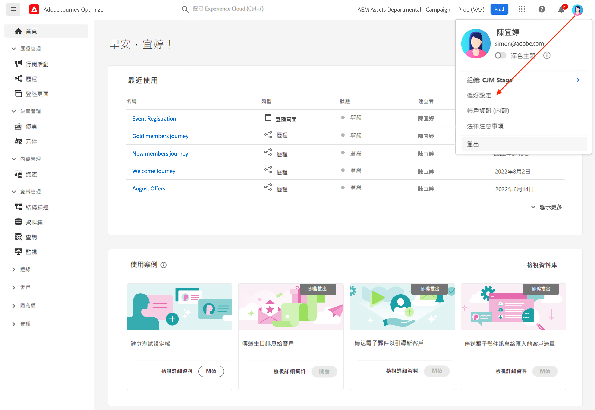

# 使用者介面 {#cjm-user-interface}

若要存取 [!DNL Adobe Journey Optimizer]，請使用 Adobe ID 連線至 [Adobe Experience Cloud](https://experience.adobe.com)，然後選取 [!DNL Journey Optimizer]。

瀏覽使用者介面時的重要概念與 Adobe Experience Platform 相同。如需詳細資訊，請參閱 [Adobe Experience Platform 文件](https://experienceleague.adobe.com/docs/experience-platform/landing/platform-ui/ui-guide.html?lang=zh-Hant#adobe-experience-platform-ui-guide)。{target="_blank"}

可用的使用者介面元件及功能取決於您的[權限](../administration/permissions.md)和[授權套件](https://helpx.adobe.com/tw/legal/product-descriptions/adobe-journey-optimizer.html){target="_blank"}。如有任何問題，請聯絡您的 Adobe 客戶成功經理。

>[!NOTE]
>
>本文件將經常更新，以反應此產品使用者介面的最新變更。不過，有些螢幕擷取畫面可能會與使用者介面稍有不同。

## 左側導覽 {#left-nav}

瀏覽左側連結來存取[!DNL Journey Optimizer]功能。

>[!NOTE]
>
>可用功能可能會視您的權限與授權合約而有所不同。

您可以在下方左側導覽找到完整的服務與功能清單，以及相關協助頁面的連結。

### 首頁 {#left-nav-home}

[!DNL Journey Optimizer] 首頁包含要啟動的主要連結和資源。

**[!UICONTROL 最近]**&#x200B;清單提供最近建立事件與歷程的捷徑。 此清單顯示其建立和修改日期和狀態。

瀏覽產品內使用案例，以開始建立資源與訊息。 [了解更多](#in-product-use-cases)。

使用首頁底部的連結來了解如何開始使用 [!DNL Journey Optimizer]。 [了解更多](#find-help-and-support)。

### [!UICONTROL 歷程管理] {#left-nav-journey}

從此區段建立行銷活動與歷程。

* **[!UICONTROL 行銷活動]** - 建立、設定及協調行銷活動，使用各種管道將一次性內容傳送給特定客群。 [了解更多](../campaigns/get-started-with-campaigns.md)

* **[!UICONTROL 歷程]** - 建立、設定及協調客戶歷程：結合事件、協調及動作活動，以建立多步驟跨頻道案例。 [了解更多](../building-journeys/journey-gs.md#jo-build)

* **[!UICONTROL 登陸頁面]** - 建立、設計、測試和發佈登陸頁面：將使用者連結傳送至線上表單，使用者可以在其中選擇加入或選擇退出接收您的通訊，或訂閱特定服務。 [了解更多](../landing-pages/get-started-lp.md)

### [!UICONTROL 決策管理] {#left-nav-offers}

從此區段建立優惠與元件。

* **[!UICONTROL 訂閱詳情]** - 從此功能表存取您最近的資源和資料集。使用此區段建立優惠。[了解更多](../offers/offer-library/creating-personalized-offers.md)

* **[!UICONTROL 元件]** - 建立位置、規則和標記。 [了解更多](../offers/offer-library/key-steps.md)

### [!UICONTROL 內容管理] {#left-nav-content}

從此區段建立和管理內容。

* **[!UICONTROL 資產]** - [!DNL Adobe Experience Manager Assets]為資產集中存放庫，可用來填入訊息。[了解更多](../content-management/assets.md)

* **[!UICONTROL 內容範本]** - 為了加快並改善設計流程，請建立獨立範本，以在 Journey Optimizer 行銷活動與歷程中輕鬆重複使用自訂內容。 [了解更多](../content-management/content-templates.md)

* **[!UICONTROL 片段]** - 建立和管理片段，以順利進行電子郵件設計流程：預先建立自訂內容區塊，用於快速組合電子郵件內容。 [了解更多](../content-management/fragments.md)

### [!UICONTROL 資料管理] {#left-nav-data}

從此區段管理資料。

* **[!UICONTROL 結構描述]** - 使用 Adobe Experience Platform 在「方案編輯器」這個互動式視覺畫布中建立和管理體驗資料模型 (XDM) 方案。[了解更多](../data/get-started-schemas.md)

* **[!UICONTROL 資料集]** - 所有內嵌至 Adobe Experience Platform 的資料都會以資料集的形式保留在資料湖中。資料集是資料集合的儲存和管理結構，通常是包含方案 (欄) 和欄 (列) 的表格。 [進一步了解](../data/get-started-datasets.md)

* **[!UICONTROL 查詢]** - 使用 Adobe Experience Platform 查詢服務來寫入和執行查詢、檢視以前執行的查詢，以及存取由您組織內的使用者儲存的查詢。[了解更多](../data/get-started-queries.md)

* **[!UICONTROL 監視]** - 使用此功能表在 Adobe Experience Platform 使用者介面中監視資料擷取。透過 [Adobe Experience Platform 文件](https://experienceleague.adobe.com/docs/experience-platform/ingestion/quality/monitor-data-ingestion.html?lang=zh-Hant){target="_blank"}了解更多

### [!UICONTROL 連線] {#left-nav-connections}

從此區段管理與其他應用程式和雲端的資料連線。

* **[!UICONTROL 來源]** - 使用此功能表從多種來源 (例如 Adobe 應用程式、雲端儲存、資料庫等) 擷取資料。 您可以建構、加標籤和增強傳入資料。 [了解更多](get-started-sources.md)

* **[!UICONTROL 目的地]** - 使用此功能表與雲端儲存空間位置建立即時連線，以匯出資料集的內容。 [了解更多](../data/export-datasets.md)

### [!UICONTROL 客戶] {#left-nav-customers}

從此區段管理客群與輪廓資料。

* **[!UICONTROL 客群]** - 建立和管理 Experience Platform 客群，並將其用於歷程之中。 [了解更多](../audience/about-audiences.md)

* **[!UICONTROL 訂閱清單]** - 在 [!DNL Journey Optimizer] 中，選擇加入訂閱服務的客戶均會收集到訂閱清單中。 [了解更多](../landing-pages/subscription-list.md)

* **[!UICONTROL 輪廓]** - 即時客戶輪廓可為個別客戶建立整體檢視，並結合來自多個頻道的資料，包括線上、離線、CRM 和第三方資料。[了解更多](../audience/get-started-profiles.md)

* **[!UICONTROL 識別]** - Adobe Experience Platform 身分服務透過 Adobe Experience Platform 的身分圖表，管理跨裝置、跨頻道及幾乎即時的客戶身分識別。[了解更多](../audience/get-started-identity.md)

### [!UICONTROL 隱私權] {#left-nav-privacy}

從此區段控制隱私權管理與請求。

* **[!UICONTROL 原則]** - Adobe Experience Platform 可讓您為欄位加上標籤，並為每個頻道建立行銷動作。 然後，您會定義連結至標籤和行銷動作的治理政策。[了解更多](../action/action-privacy.md)

* **[!UICONTROL 請求]** - 在 Adobe Experience Platform Privacy Service 中管理隱私權請求。 其提供 RESTful API 與使用者介面，幫助您管理客戶資料請求。 [了解更多](../privacy/requests.md)

* **[!UICONTROL 稽核]** - 瀏覽至此區段以檢查活動記錄。 [了解更多](../privacy/audit-logs.md)

* **[!UICONTROL 資料檢疫]** - 此區段可讓您設定和排程資料檢疫作業，確保記錄得到正確維護。 [了解更多](../privacy/data-hygiene.md)

### [!UICONTROL 管理] {#left-nav-admin}

* **[!UICONTROL 設定]** - 使用此選單來設定[事件](../event/about-events.md)、[資料來源](../datasource/about-data-sources.md)和[動作](../action/action.md) ，以用於您的歷程。

  您也可以存取&#x200B;**報告**&#x200B;區段來設定行銷活動實驗的報告。 [了解更多](../content-management/reporting-configuration.md)

* **[!UICONTROL 業務規則]** - 使用此部分來建立跨通路業務規則，以控制使用者接收訊息或進入歷程的頻率。 [了解更多](../configuration/frequency-rules.md)

* **[!UICONTROL 警報]** - 使用者介面可讓您根據 Adobe Experience Platform 可檢視性深入解析顯示的指標查看收到警報的歷史記錄。UI 也可讓您檢視、啟用和停用可用的警報規則。 [了解更多](../reports/alerts.md)

* **[!UICONTROL 沙箱]** - Adobe Experience 平台提供的沙箱可將單一執行個體分割成個別的虛擬環境，以利開發及改進數位體驗應用程式。瀏覽此區段以管理沙箱。[了解更多](../administration/sandboxes.md)

* **[!UICONTROL 管道]** - 使用此區段來設定管道，包括子網域、設定和傳遞能力設定。 [了解更多](../configuration/get-started-configuration.md)

* **[!UICONTROL 標籤]** - 利用統一標籤，您可以輕鬆分類歷程與行銷活動，進而改進清單的搜尋結果。[進一步了解](../start/search-filter-categorize.md#work-with-unified-tags)

## 產品內使用案例 {#in-product-uc}

從 [!DNL Adobe Journey Optimizer] 首頁、產品使用案例可以快速輸入，以建立測試輪廓或第一個客戶歷程。

可用的使用案例包括：

* **建立測試輪廓**，以使用我們的 CSV 範本建立測試輪廓，以測試個人化訊息和歷程。在[本頁面](../audience/creating-test-profiles.md#use-case-1)瞭解如何實施此使用案例。
* **傳送生日訊息給客戶**，以自動傳送電子郵件祝賀客戶生日。(即將推出)
* **傳送電子郵件以吸引新客戶**，輕鬆傳送最多兩封電子郵件來歡迎新註冊的客戶。(即將推出)
* **傳送推播訊息至匯入的客戶清單**，以快速將推播通知傳送至從 CSV 檔案匯入的客戶清單。(即將推出)

若要深入了解每個使用案例，請按一下&#x200B;**[!UICONTROL 檢視詳情]**&#x200B;連結。

若要執行使用案例，請按一下&#x200B;**[!UICONTROL 開始]**&#x200B;按鈕。

您可以從&#x200B;**[!UICONTROL 檢視資料庫]**&#x200B;按鈕存取已執行的使用案例。

## 尋找說明與支援 {#find-help}

從首頁的下半頁面存取 Adobe Journey Optimizer 重要說明頁面。

使用&#x200B;**說明**&#x200B;圖示來存取說明頁面、聯絡支援人員並分享意見。 您可以從搜尋欄位搜尋說明文章和影片。

在每個頁面中，使用內容說明按鈕來深入了解功能，並瀏覽至 **[!DNL Adobe Experience League]** 文件。

## 語言偏好設定 {#language-pref}

使用者介面提供下列語言版本：

* 英文
* 法文
* 德文
* 義大利文
* 西班牙文
* 葡萄牙文 (巴西)
* 日文
* 韓文
* 繁體中文
* 簡體中文

您的預設介面語言是由使用者輪廓中指定的偏好語言所決定。

若要變更您的語言：

* 按一下右上角頭像處的&#x200B;**「偏好設定」**。
  
* 然後按一下您電子郵件地址下方顯示的語言
* 選擇您偏好的語言，然後按一下 **「儲存」**。若您使用的元件未當地化為您的母語，您可選取第二種語言。
  

<!--CONTEXTUAL HELP TO DISPATCH IN DOCS ONCE FEATURE LIVE-->

<!--PRIORITIZATION & CONFLICT MANAGEMENT-->

>[!CONTEXTUALHELP]
>id="ajo_journey_priority"
>title="優先順序"
>abstract="為歷程指派優先順序分數，範圍從 0 到 100。 數字越高表示優先順序越高。 在此插入的優先順序值會由此歷程中包含的任何傳入動作（例如應用程式內）繼承。 若是其他行銷活動或歷程中使用了相同入站介面，優先順序分數最高的入站動作會顯示給收件者。 如果多個歷程或行銷活動具有相同的分數，則會選擇最近修改的元素。"

>[!CONTEXTUALHELP]
>id="ajo_campaigns_campaign_priority"
>title="優先順序"
>abstract="為行銷活動指派優先順序分數，範圍從 0 到 100。 數字越高表示優先順序越高。 若是其他行銷活動或歷程中使用了相同傳入表面（例如應用程式內），優先順序分數最高的傳入動作會顯示給收件者。 如果多個歷程或行銷活動具有相同的分數，則會選擇最近修改的元素。"

>[!CONTEXTUALHELP]
>id="ajo_campaigns_campaign_conflict"
>title="行銷活動中的衝突檢視器"
>abstract="此工具可協助您判斷與其他歷程、行銷活動或表面的重疊。 如果您想要識別對象、開始和結束日期、頻道設定、頻道或規則集上的重疊，您可以在此處檢視潛在衝突。 "

>[!CONTEXTUALHELP]
>id="ajo_journey_conflict"
>title="歷程中的衝突檢視器"
>abstract="此工具可協助您判斷與其他歷程、行銷活動或表面的重疊。 如果您想要識別對象、開始和結束日期、頻道設定、頻道或規則集上的重疊，您可以在此處檢視潛在衝突。 "

>[!CONTEXTUALHELP]
>id="ajo_rule_set_domain"
>title="物件類型"
>abstract="物件類型"

>[!CONTEXTUALHELP]
>id="ajo_journey_capping_rule"
>title="將規則集套用至歷程"
>abstract="套用規則集以根據頻率上限規則將此歷程排除到部分對象。"

>[!CONTEXTUALHELP]
>id="ajo_rule_set_rule_type"
>title="規則類型"
>abstract="規則類型"

>[!CONTEXTUALHELP]
>id="ajo_rule_set_concurrency_prioritization"
>title="優先檢視"
>abstract=" 如果較高優先順序的歷程排程在此指定的時間內，則客戶將禁止進入此歷程。 若您希望以先到者輸入歷程的情況，我們建議先提供基礎，選擇每日前瞻期間，並確保當天任何其他歷程的優先順序分數小於歷程的優先順序分數。 為歷程提供100的優先順序分數也可確保已輸入。"

>[!CONTEXTUALHELP]
>id="ajo_campaigns_capping_rule"
>title="將規則集套用至行銷活動"
>abstract="未定"

<!--TO REMOVE?-->

>[!CONTEXTUALHELP]
>id="ajo_rule_set_prioritization"
>title="列出優先順序的因素"
>abstract="未定"

<!--TO REMOVE?-->

<!--CONTENT LOCKING-->

>[!CONTEXTUALHELP]
>id="ajo_locking_governance"
>title="治理"
>abstract="治理"

>[!CONTEXTUALHELP]
>id="ajo_locking_mode"
>title="模式"
>abstract="模式"

>[!CONTEXTUALHELP]
>id="ajo_locking_content_addition"
>title="啟用內容添加部分"
>abstract="啟用內容添加部分"

>[!CONTEXTUALHELP]
>id="ajo_locking_structure"
>title="結構下的內容鎖定機制"
>abstract="結構下的內容鎖定機制"

>[!CONTEXTUALHELP]
>id="ajo_locking_component"
>title="請在元件中使用特定鎖定機制"
>abstract="請在元件中使用特定鎖定機制"

>[!CONTEXTUALHELP]
>id="ajo_email_editable_areas"
>title="強調可編輯區域"
>abstract="強調可編輯區域"

>[!CONTEXTUALHELP]
>id="ajo_email_locking_activated"
>title="已啟用治理"
>abstract="已啟用內容鎖定機制，系統可能會阻止您修改資料。"

>[!CONTEXTUALHELP]
>id="ajo_email_locking_read_only"
>title="唯讀"
>abstract="此為唯讀內容，無法再行修改。"

<!--GOVERNANCE POLICIES-->

>[!CONTEXTUALHELP]
>id="ajo_data_governance_policy_violation"
>title="資料治理原則違規"
>abstract="如果系統在歷程/行銷活動中或自訂動作中識別限制欄位，則會顯示錯誤，使您無法發佈。 使用此對話方塊中的資料歷程圖表來瞭解在您啟動歷程或行銷活動之前，需要進行哪些其他設定變更。"

<!--APPROVAL POLICIES-->

>[!CONTEXTUALHELP]
>id="ajo_permissions_approval_policy"
>title="核准原則"
>abstract="核准原則"

>[!CONTEXTUALHELP]
>id="ajo_approval_policy_request_approval"
>title="請求核准"
>abstract="請求核准"

>[!CONTEXTUALHELP]
>id="ajo_approval_policy_request_change"
>title="請求變更"
>abstract="請求變更"

>[!CONTEXTUALHELP]
>id="ajo_campaigns_edit_disabled"
>title="編輯已停用"
>abstract="編輯已停用 (行銷活動)"

>[!CONTEXTUALHELP]
>id="ajo_journey_edit_disabled"
>title="編輯已停用"
>abstract="編輯已停用 (歷程)"

>[!CONTEXTUALHELP]
>id="ajo_approval_policy_approval_status"
>title="核准狀態"
>abstract="核准狀態"

>[!CONTEXTUALHELP]
>id="ajo_campaigns_approve"
>title="核准"
>abstract="核准 (行銷活動)"

>[!CONTEXTUALHELP]
>id="ajo_journey_approve"
>title="核准"
>abstract="核准 (歷程)"

<!--Multilingual-->

>[!CONTEXTUALHELP]
>id="ajo_multi_custom_conditional"
>title="自訂條件設定"
>abstract="自訂條件設定"

>[!CONTEXTUALHELP]
>id="ajo_multi_fallback"
>title="遞補偏好"
>abstract="遞補偏好"

<!-- ExD in email-->

>[!CONTEXTUALHELP]
>id="ajo_email_enable_experience_decisioning"
>title="啟用Experience決策"
>abstract="啟用Experience決策"
