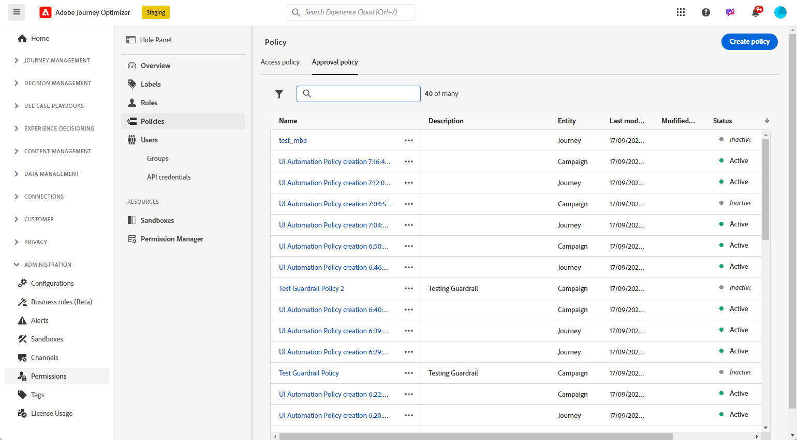
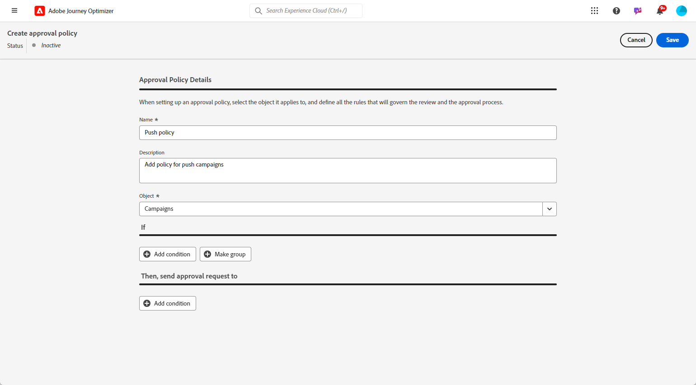
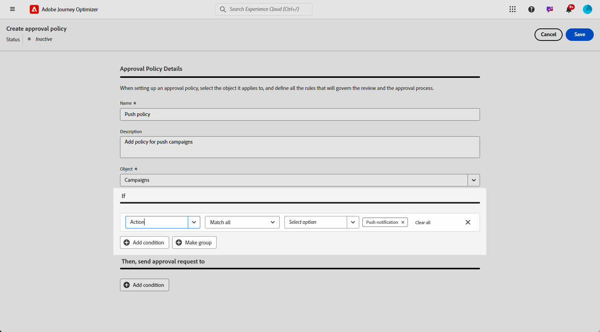
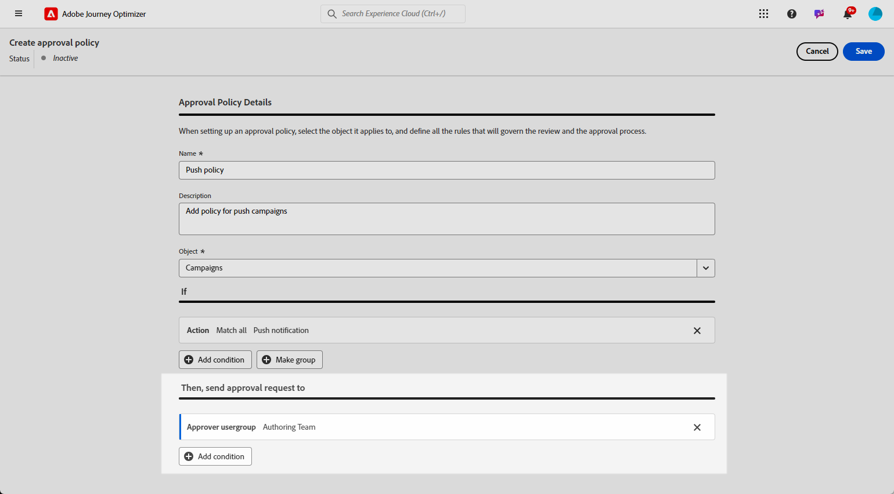
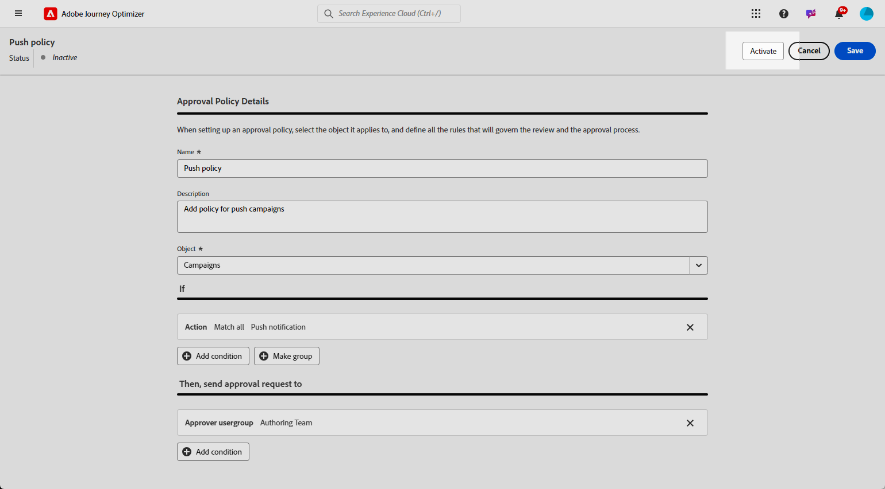
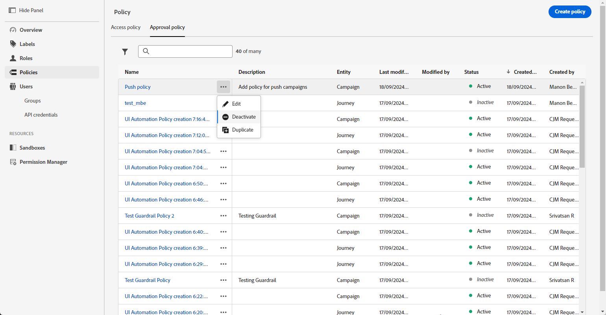

# 建立和管理核准原則 {#approval-policies}

>[!CONTEXTUALHELP]
>id="ajo_approval_policy_request_approval"
>title="請求核准"
>abstract="請求核准"

>[!CONTEXTUALHELP]
>id="ajo_approval_policy_request_change"
>title="請求變更"
>abstract="請求變更"

>[!NOTE]
>
>若要建立核准原則，您必須在Adobe Experience Platform中擁有系統或產品管理員許可權。 [了解更多](https://experienceleague.adobe.com/en/docs/experience-platform/access-control/home)

核准政策可讓管理員建立歷程與行銷活動的驗證流程。 此系統概述特定條件，決定是否需要核准歷程或行銷活動。 這些原則在複雜性上可能有所不同。 它們只需要要求所有行銷活動由特定使用者或團隊檢閱，或根據行銷活動的建立者建立條件。

您可以使用彈性條件（例如，標籤、行銷活動/歷程名稱、管道型別或請求者資訊）來鎖定核准政策。 例如，您可以要求核准所有標示為「高風險」的物件，或任何符合特定命名模式的促銷活動。

## 建立核准原則 {#create-policies}

>[!CONTEXTUALHELP]
>id="ajo_permissions_approval_policy"
>title="全新核准原則"
>abstract="在此畫面中，輸入名稱並選取核准原則的情境，接著建置條件以確定誰可以發起核准要求、誰可以進行驗證。"

若要建立核准政策，請遵循下列步驟：

1. 從&#x200B;**[!UICONTROL 中的]**&#x200B;管理[!DNL Journey Optimizer]功能表，存取&#x200B;**[!UICONTROL 許可權]**&#x200B;然後&#x200B;**[!UICONTROL 原則]**。

   

1. 在&#x200B;**[!UICONTROL 核准原則]**&#x200B;索引標籤中按一下&#x200B;**[!UICONTROL 建立]**，選擇&#x200B;**[!UICONTROL 核准原則]**，然後按一下&#x200B;**[!UICONTROL 確認]**。

1. 輸入原則的&#x200B;**[!UICONTROL 名稱]**&#x200B;和&#x200B;**[!UICONTROL 描述]**。

1. 選取原則將套用至&#x200B;**[!UICONTROL 歷程]**&#x200B;或&#x200B;**[!UICONTROL 行銷活動]**。

1. 啟用&#x200B;**[!UICONTROL 區塊自行核准]**，以防止歷程/行銷活動建立者核准自己的物件。

   

您現在可以調整條件，以指定誰可以起始核准要求，以及誰可以驗證核准要求。

## 設定核准政策的條件 {#conditions}

核准政策提供彈性的目標定位選項，以符合您的治理需求。 您可以根據各種條件建立核准政策，包括：

* **行銷活動/歷程名稱**：依名稱鎖定特定物件
* **標籤**：將原則套用至具有特定標籤的所有行銷活動或歷程
* **頻道型別**：特定動作（電子郵件、簡訊、推播等）需要核准
* **行銷活動型別**：為[動作與API觸發的行銷活動設定不同的規則](../campaigns/get-started-with-campaigns.md#campaign-types)
* **要求者**：根據建立行銷活動或歷程的人定義原則

若要定義與核准原則相關的條件，請遵循下列步驟：

1. 存取您的&#x200B;**[!UICONTROL 核准原則]**。

1. 在&#x200B;**[!UICONTROL If]**&#x200B;功能表下，按一下&#x200B;**[!UICONTROL 新增條件]**&#x200B;以定義將觸發核准要求的物件或使用者。

1. 選擇適當的&#x200B;**[!UICONTROL 類別]**、**[!UICONTROL 相符規則]**&#x200B;和&#x200B;**[!UICONTROL 選項]**。

   例如，「如果動作符合任何直接郵件」或「如果請求者使用者名稱符合John Doe」。

   

   +++ 進一步瞭解可用的類別和選項
   <table>
    <tr>
      <th>類別</th>
      <th>選項</th>
    </tr>
    <tr>
      <td rowspan="3">行銷活動類型</td>
      <td>已排程（行銷）</td>
    </tr>
    <tr>
    <td>API 觸發 (行銷)</td>
    </tr>
    <tr>
    <td>API 觸發 (交易型)</td>
    </tr>
    <tr>
    <td rowspan="8">動作</td>
    <td>應用程式內</td>
    </tr>
    <tr>
    <td>推播通知</td>
   </tr>
    <tr>
    <td>簡訊</td>
    </tr>
    <tr>
    <td>電子郵件</td>
    </tr>
    <tr>
    <td>直接郵件</td>
    </tr>
    <tr>
    <td>網頁</td>
    </tr>
    <tr>
    <td>程式碼型</td>
    </tr>
    <tr>
    <td>內容卡</td>
    </tr>
    <tr>
    <td>標記</td>
    <td>用來組織對象的標籤名稱。 </td>
    </tr>
    <tr>
    <td>物件名稱</td>
    <td>物件的名稱。</td>
    </tr>
    <tr>
    <td>請求者使用者名稱</td>
    <td>指定要求者的名稱和電子郵件地址</td>
    </tr>
    <tr>
    <td>要求者使用者群組</td>
    <td>指定要求者的使用者群組名稱</td>
    </tr>
    </table>

1. 若要新增更多條件，請按一下[新增條件] **[!UICONTROL 以定義其他規則，並選取[]** And **或[]** Or **以指定連線條件的方式。]**

1. 在&#x200B;**[!UICONTROL Then，傳送核准要求至]**&#x200B;功能表下，按一下&#x200B;**[!UICONTROL 新增條件]**&#x200B;以定義哪些使用者可以接受核准要求。

1. 從&#x200B;**[!UICONTROL 類別]**&#x200B;下拉式清單中，選取您要選擇使用者群組還是個別使用者。

1. 然後，從&#x200B;**[!UICONTROL 選項]**&#x200B;下拉式清單中，選取特定使用者群組或使用者。

   所選的使用者或使用者群組將負責驗證核准請求。

   

1. 若要新增更多條件，請按一下[新增條件] **[!UICONTROL 以定義其他規則，並選取[]** And **或[]** Or **以指定連線條件的方式。]**

1. 完成原則設定後，請按一下[儲存]。****

您現在可以啟用核准原則以套用它。

## 啟用和管理核准原則 {#activate-policies}

若要套用您的核准政策，您必須將其啟用。 若要執行此動作，請依照下列步驟執行：

1. 存取您的&#x200B;**[!UICONTROL 核准原則]**。

1. 然後，按一下[啟動]****，將設定的條件套用至您的環境。

   >[!NOTE]
   >
   >原則一經啟用即無法編輯。 若要修改條件，請先停用原則。

   

1. 從&#x200B;**[!UICONTROL 原則]**&#x200B;功能表，開啟進階選項，以視需要&#x200B;**[!UICONTROL 編輯]**、**[!UICONTROL 停用]**&#x200B;或&#x200B;**[!UICONTROL 複製]**&#x200B;原則。

   
