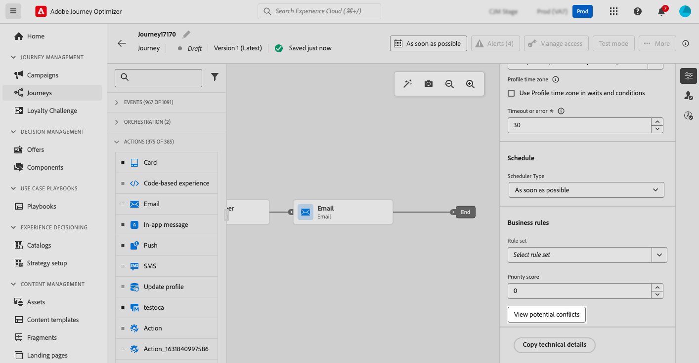
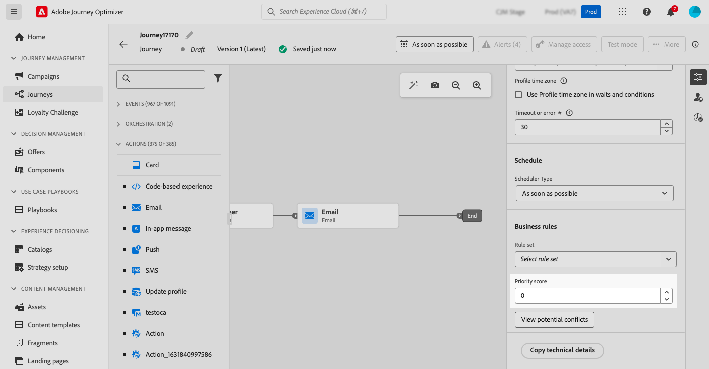

# 衝突管理與優先順序 {#conflict-prioritization}

>[!AVAILABILITY]
>
>衝突管理和優先順序工具目前僅供選定使用者作為測試版使用。

在Journey Optimizer中，管理行銷活動和歷程的數量和時機是避免客戶因太多互動而感到不知所措的關鍵。 以下兩節介紹有助於您有效維持平衡並排定通訊優先順序的重要工具

## 識別歷程和促銷活動中的潛在衝突 {#conflict}

>[!CONTEXTUALHELP]
>id="ajo_campaigns_campaign_conflict"
>title="行銷活動中的衝突檢視器"
>abstract="此工具可以協助您確定是否與其他歷程、促銷活動或管道設定有所重疊。如果您希望確認客群、開始與結束日期、管道設定、管道或規則集之重疊情況，您可以在此檢視潛在衝突。"

>[!CONTEXTUALHELP]
>id="ajo_journey_conflict"
>title="歷程中的衝突檢視器"
>abstract="此工具可以協助您確定是否與其他歷程、促銷活動或管道設定有所重疊。如果您希望確認客群、開始與結束日期、管道設定、管道或規則集之重疊情況，您可以在此檢視潛在衝突。"

隨著行銷人員在Journey Optimizer中增加行銷活動和歷程的數量，行銷人員越來越難以知道他們是否透過過多的行銷互動轟炸其客戶。 因此，必須輕鬆識別何時有重疊的行銷活動和歷程，以確保在行銷通訊之間取得正確的平衡，同時降低客戶疲勞的風險。

要監控潛在重疊的主要區域包括：

* **時間表** （開始和結束日期）：同時執行過多歷程嗎？
* **對象**：我的歷程對象中有多少百分比同時屬於其他歷程？
* **頻道**：是否有其他通訊已排程為相同的時間範圍，如果是，有多少通訊？
* **上限規則集**：我為哪些型別的歷程設定上限，而且這些歷程中有重疊？
* **頻道設定**：是否有其他歷程或行銷活動使用同一歷程或行銷活動中使用的任何頻道設定，以防止向一般使用者顯示歷程或行銷活動？

### Journey Optimizer如何偵測衝突 {#detection}

以下為Journey Optimizer識別歷程與行銷活動潛在衝突的方式摘要：

* **衝突識別範圍**：僅針對即時或排程的行銷活動和歷程顯示衝突。
* **單一歷程**：如果選取的歷程是單一的，則會顯示以相同事件開始的其他歷程，因為此事件將會觸發所有此類歷程。
* **對象資格和讀取對象/商業事件**&#x200B;歷程：如果選取的歷程是對象資格或讀取對象/商業事件歷程，則會顯示具有有效對象的所有相同型別歷程資料，因為對象之間可能會重疊。
* **行銷活動**：由於所有行銷活動都是以對象為目標，而且沒有事件的概念，因此所有行銷活動都可能與區段觸發的歷程衝突（從讀取對象活動開始）。
* **即時/排程行銷活動**：即時/排程行銷活動可能會因為可能的對象重疊而互相衝突。 對於任何特定行銷活動，所有即時或排程的行銷活動都會列在衝突檢視器中。

### 檢視指定歷程或行銷活動的已識別衝突 {#view}

製作歷程或行銷活動時，Journey Optimizer可讓您檢查與其他歷程或行銷活動重疊的可能性。 要執行此操作，請依照下列步驟執行：

1. 在編寫歷程或行銷活動時，按一下歷程或行銷活動屬性中的&#x200B;**[!UICONTROL 檢視潛在衝突]**&#x200B;按鈕。

   

   >[!NOTE]
   >
   >當您指派下列任何設定時，**[!UICONTROL 檢視潛在衝突]**&#x200B;按鈕就會可供選取： **[!UICONTROL 開始/結束日期]**、**[!UICONTROL 對象]**、**[!UICONTROL 頻道]**、**[!UICONTROL 頻道設定]**&#x200B;以及&#x200B;**[!UICONTROL 規則集]**。 請確定您在指派這些設定後選取&#x200B;**[!UICONTROL 儲存]**，因為除非儲存變更，否則按鈕無法選取。

1. 會開啟&#x200B;**[!UICONTROL 潛在衝突]**&#x200B;視窗，讓您以視覺效果呈現與目前歷程/行銷活動重疊的所有元素。

   您可以選取名稱，從此畫面直接開啟重疊歷程或行銷活動。

   

   >[!NOTE]
   >
   >由於已實作快取，新發佈的行銷活動最長可能需要5分鐘才會顯示在衝突檢視器中

若要進一步縮小潛在重疊的搜尋範圍，您可以根據相關的欄位來篩選行銷活動和歷程清單。 若要這麼做，請在詳細目錄檢視中選取篩選器圖示。 [瞭解如何使用篩選器](../start/search-filter-categorize.md#filter-lists)

### 解決衝突 {#resolve}

以下是識別潛在衝突後減少這些衝突的一些秘訣：

* 調整&#x200B;**開始/結束日期**，以避免行銷活動或歷程重疊。
* 調整&#x200B;**對象目標定位**&#x200B;以最小化歷程之間的重疊。
* 實作&#x200B;**頻率上限**&#x200B;以防止客戶接收太多通訊。
* 減少&#x200B;**作用中歷程**&#x200B;的數量，以更有效地管理客戶體驗。
* 設定傳入動作的&#x200B;**優先順序**，以確保向客戶顯示最重要的動作。

運用這些功能，您就能確保行銷努力一致，並在溝通策略中維持正確的平衡。

## 指派歷程和促銷活動的優先順序分數 {#priority}

>[!CONTEXTUALHELP]
>id="ajo_journey_priority"
>title="優先順序"
>abstract="為歷程指派優先順序分數，範圍從 0 到 100。 數字越高表示優先順序越高。 此處插入的優先順序值將由這個歷程所包含的任何傳入動作 (例如應用程式內) 繼承。如果遇到其他促銷活動或歷程使用相同傳入管道設定的情況，將為收件者顯示優先順序分數最高的傳入動作。如果多個歷程或促銷活動具有相同的分數，將選擇最近修改的元素。"

>[!CONTEXTUALHELP]
>id="ajo_campaigns_campaign_priority"
>title="優先順序"
>abstract="為行銷活動指派優先順序分數，範圍從 0 到 100。 數字越高表示優先順序越高。 如果遇到其他促銷活動或歷程使用相同傳入管道設定的情況 (例如應用程式內)，則為收件者顯示優先等級分數最高的傳入動作。如果多個歷程或促銷活動具有相同的分數，將選擇最近修改的元素。"

Journey Optimizer可讓您為歷程或行銷活動指派優先順序分數。 當有強制的限制（例如頻率上限）時，優先順序對於優先處理歷程、行銷活動或動作至關重要。 如果客戶符合許多歷程、行銷活動或通訊的資格，而您想要選擇他們應該輸入和接收的欄位，則應利用此欄位。

>[!NOTE]
>
>傳入頻道（網頁、應用程式內和程式碼型頻道）有優先順序分數可供使用。 在歷程中，只有&#x200B;**應用程式內**&#x200B;和&#x200B;**程式碼型**&#x200B;管道有優先順序分數。

指派優先順序分數對於傳入通訊（例如Web、行動和應用程式內）至關重要。 如果您有多個使用相同管道設定的行銷活動（例如網頁頂端的橫幅），可能會造成問題，因為只顯示一個行銷活動的內容是可行的。 當收件者可能有資格參加多個行銷活動時，優先順序分數是您將插入應顯示哪個行銷活動的偏好設定的位置。

若要指派優先順序分數給歷程或行銷活動，請在歷程或行銷活動屬性中的&#x200B;**[!UICONTROL 優先順序分數]**&#x200B;欄位中輸入數值（從0到100）。 請注意，數字越高，優先順序越高。 如果您創作此行銷活動，且想確定此行銷活動內容已顯示，您可以給予100分。

若是兩個行銷活動有相同優先順序分數的情況，將會顯示最先啟用的行銷活動。
