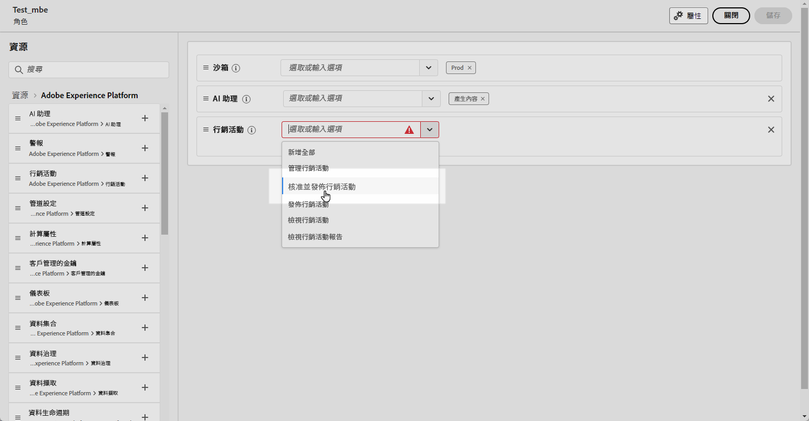
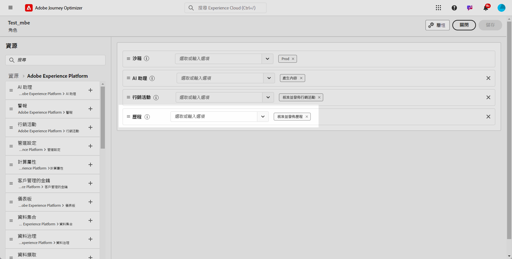
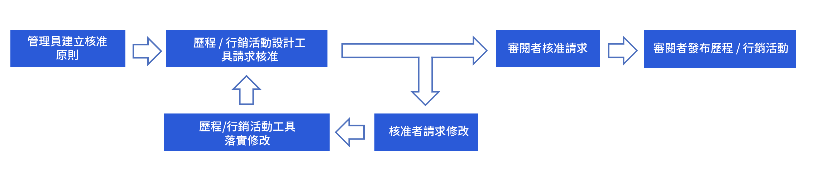
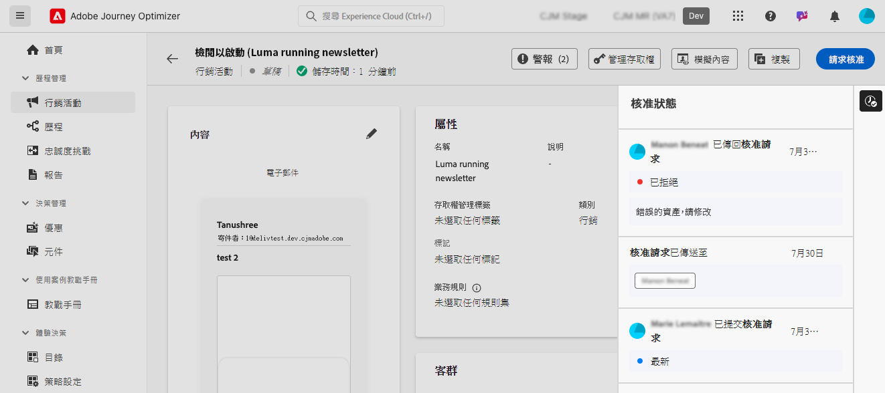

# 開始使用歷程及行銷活動核准 {#send-proofs}

## 開始使用核准原則 {#gs}

[!DNL Journey Optimizer]可讓您設定核准程式，讓行銷團隊確保在行銷活動和歷程上線之前，由適當的利害關係人稽核和簽署。

核准原則直接在使用者介面中導入結構化工作流程，而不再需要如電子郵件或任務管理工具等的外部媒介，並確保會集中管理和追蹤所有核准。

此外，此功能可加強控制歷程和行銷活動發佈作業：透過 Journey Optimizer 嵌入的核准程序，行銷活動與歷程在審核期間會維持在「鎖定」狀態，確保所有必要的核准就緒前，不會發生變更或遭到意外啟用。

## 先決條件 {#prerequisites}

開始之前，請確定已設定下列權限。

若要核准和發佈歷程與行銷活動，使用者需要被授予&#x200B;**核准和發佈行銷活動**&#x200B;和&#x200B;**核准和發佈歷程**&#x200B;許可權。 [了解更多](../administration/permissions.md)

+++  瞭解如何指派核准相關許可權

1. 在&#x200B;**權限**&#x200B;產品中，前往&#x200B;**角色**&#x200B;標籤，然後選取所需的&#x200B;**角色**。

1. 按一下&#x200B;**編輯**&#x200B;以修改權限。

1. 新增&#x200B;**行銷活動**&#x200B;資源，然後從下拉式選單中，選取&#x200B;**核准和發佈行銷活動**。

   {zoomable="yes"}

1. 新增&#x200B;**歷程**&#x200B;資源，然後從下拉式選單中，選取&#x200B;**核准和發佈歷程**。

   {zoomable="yes"}

1. 按一下&#x200B;**儲存**，以套用所做的變更。

任何已指派給此角色的使用者都會自動更新其權限。

1. 若要將此角色指派給新使用者，請瀏覽至&#x200B;**角色**&#x200B;儀表板中的&#x200B;**使用者**&#x200B;標籤，然後按一下&#x200B;**新增使用者**。

1. 輸入使用者的名稱、電子郵件地址，或從清單當中選擇，然後按一下&#x200B;**儲存**。

1. 如果使用者先前未建立，請參閱[此檔案](https://experienceleague.adobe.com/zh-hant/docs/experience-platform/access-control/abac/permissions-ui/users)。

使用者將會收到一封電子郵件，提供存取執行個體的指示。

+++

## 核准程序概觀 {#process}

全域核准程序如下：

{zoomable="yes"}

1. **核准原則設定**

   管理員使用者會建立核准原則，定義該原則應用於歷程或行銷活動的條件。 例如，您可以建立核准原則，要求指定使用者建立的所有排程行銷活動在啟用前皆須核准。 [了解如何建立核准原則](approval-policies.md)

1. **提交行銷活動/歷程以進行核准**

   行銷活動/歷程建立者會建立歷程或行銷活動，並提交以進行核准。 行銷活動/歷程進入「審核中」狀態，在此期間除非請求遭到取消，否則無法進行任何編輯。[了解如何請求核准](request-approval.md)

   >[!NOTE]
   >
   >若使用核准原則，只需要提交行銷活動與歷程以進行核准。若未使用這類原則，建立者無需進行核准，就可以直接發佈行銷活動或歷程。

1. **審核與核准**

   套用至歷程或行銷活動的核准原則中定義的核准者，都會收到通知。他們可以審核歷程或行銷活動內容、對象和設定。如需變更，核准者會提出請求，將行銷活動傳回為「草稿」以供修訂。準備就緒後，即可啟用並啟動歷程或行銷活動。[了解如何審核與核准請求](review-approve-request.md)

## 監視核准請求 {#monitor}

您可以監視對指定歷程或行銷活動提交的所有核准和變更請求。若要執行此操作，請按一下位於歷程版面或行銷活動審核畫面右上角的&#x200B;**[!UICONTROL 顯示稽核軌跡]**&#x200B;圖示。

## 其他資源

* **[建立核准原則](approval-policies.md)** - 了解如何設定核准原則，以強制執行行銷活動和歷程的審閱工作流程。
* **[請求核准](request-approval.md)** - 了解如何提交內容以供核准及追蹤核准狀態。
* **[審閱及核准請求](review-approve-request.md)** - 了解如何以核准者身分審閱、核准或拒絕核准請求。
* **[使用範例輸入進行模擬](simulate-sample-input.md)** - 了解如何使用範例輪廓資料來測試及驗證內容。
