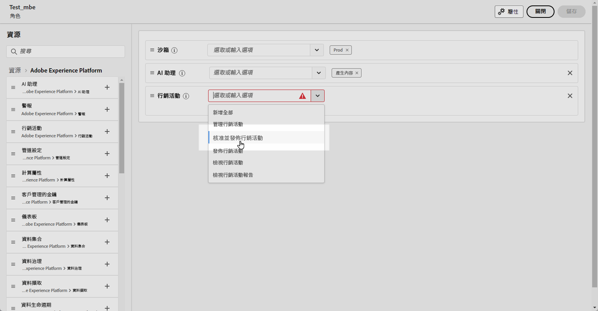
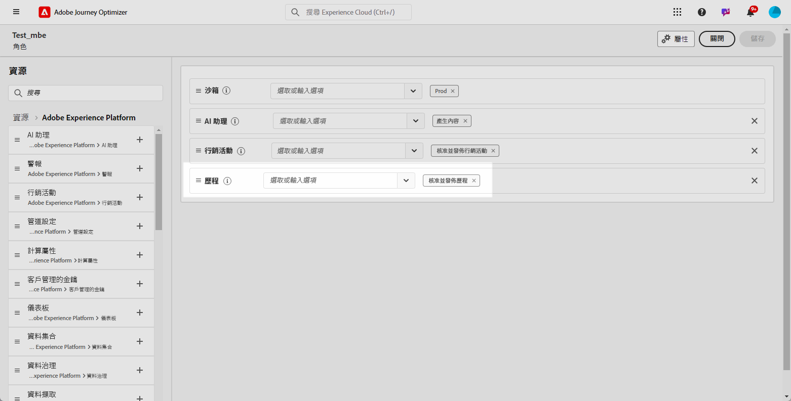
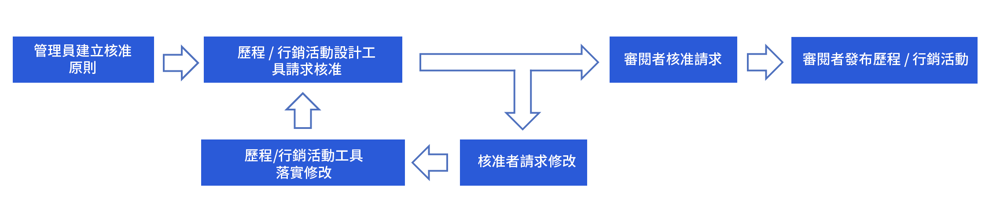
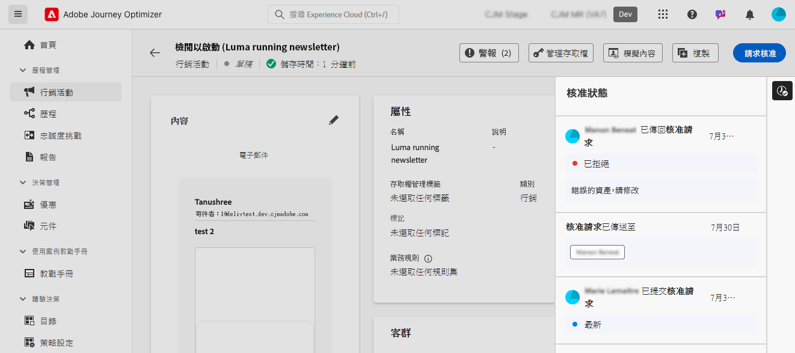

# 開始使用歷程及行銷活動核准 {#send-proofs}

## 開始使用核准原則 {#gs}

[!DNL Journey Optimizer] 可讓您設定核准程序，允許行銷團隊用以確保行銷活動和歷程在正式上線之前，會先由合適的利害關係人負責審核並簽核。

核准原則直接在使用者介面中導入結構化工作流程，而不再需要如電子郵件或任務管理工具等的外部媒介，並確保會集中管理和追蹤所有核准。

此外，此功能可加強控制歷程和行銷活動發佈作業：透過 Journey Optimizer 嵌入的核准程序，行銷活動與歷程在審核期間會維持在「鎖定」狀態，確保所有必要的核准就緒前，不會發生變更或遭到意外啟用。

## 先決條件 {#prerequisites}

開始之前，請確定已設定下列權限。

若要核准和發佈歷程與行銷活動，需要將&#x200B;**核准和發佈行銷活動**&#x200B;與&#x200B;**核准和發佈歷程**&#x200B;權限授予使用者。 [了解更多](../administration/permissions.md)

+++  瞭解如何指派核准相關權限

1. 在&#x200B;**權限**&#x200B;產品中，前往&#x200B;**角色**&#x200B;標籤，然後選取所需的&#x200B;**角色**。

1. 按一下&#x200B;**編輯**&#x200B;以修改權限。

1. 新增&#x200B;**行銷活動**&#x200B;資源，然後從下拉式選單中，選取&#x200B;**核准和發佈行銷活動**。

   {zoomable="yes"}

1. 新增&#x200B;**歷程**&#x200B;資源，然後從下拉式選單中，選取&#x200B;**核准和發佈歷程**。

   {zoomable="yes"}

1. 按一下&#x200B;**儲存**，以套用所做的變更。

任何已指派給此角色的使用者都會自動更新其權限。

1. 若要將此角色指派給新使用者，請瀏覽至&#x200B;**角色**&#x200B;儀表板中的&#x200B;**使用者**&#x200B;標籤，然後按一下&#x200B;**新增使用者**。

1. 輸入使用者的名稱、電子郵件地址，或從清單當中選擇，然後按一下&#x200B;**儲存**。

1. 如果之前未建立使用者，請參閱[此文件](https://experienceleague.adobe.com/zh-hant/docs/experience-platform/access-control/abac/permissions-ui/users)。

使用者將會收到一封電子郵件，提供存取執行個體的指示。

+++

## 核准程序概觀 {#process}

全域核准程序如下：

{zoomable="yes"}

1. **核准原則設定**

   管理員使用者會建立核准原則，定義原則應套用至歷程或行銷活動的條件。 例如，您可以建立核准原則，要求指定使用者建立的所有排程行銷活動在啟用前，皆需經過核准。 [了解如何建立核准原則](approval-policies.md)

1. **提交行銷活動/歷程以進行核准**

   行銷活動/歷程建立者建置歷程或行銷活動，並提交以進行核准。 行銷活動/歷程進入「審核中」狀態，在此期間除非請求遭到取消，否則無法進行任何編輯。 [了解如何請求核准](request-approval.md)

   >[!NOTE]
   >
   >若使用核准原則，只需要提交行銷活動與歷程以進行核准。 若未使用這類原則，建立者無需進行核准，就可以直接發佈行銷活動或歷程。

1. **審核與核准**

   套用至歷程或行銷活動的核准原則中定義的核准者，都會收到通知。 他們可以審核歷程或行銷活動內容、對象和設定。 如需變更，核准者會提出請求，將行銷活動傳回為「草稿」以供修訂。 準備就緒後，即可啟用並啟動歷程或行銷活動。 [了解如何審核與核准請求](review-approve-request.md)

## 監視核准請求 {#monitor}

您可以監視對指定歷程或行銷活動提交的所有核准和變更請求。 若要執行此操作，請按一下位於歷程版面或行銷活動審核畫面右上角的&#x200B;**[!UICONTROL 顯示稽核軌跡]**&#x200B;圖示。

## 常見問題 {#faq}

+++我是否需要為每個行銷活動或歷程建立核准原則？

否。 核准原則是有條件的。 只有當您想要強制審查特定行銷活動或歷程集 (例如，特定團隊建立的所有已排程行銷活動) 時，才需要建立原則。 如果行銷活動或歷程未套用任何原則，則建立者無需請求核准即可直接發佈。

+++

+++如果核准者沒空，會發生什麼情況？

請求會保持「審閱中」狀態，直到核准者對其採取行動為止。 您可以取消請求 (項目返回「草稿」狀態)，並在核准者有空時重新提交。 管理員也可以更新核准原則以新增其他核准者。

+++

+++我是否可以在行銷活動或歷程處於待核准狀態時對其進行編輯？

否。 提交核准後，行銷活動或歷程即處於鎖定的「審閱中」狀態。 若要進行變更，建立者或核准者必須先取消請求。 項目會返回「草稿」狀態，可以編輯後再重新提交。

+++

+++我在下拉式清單中看不到核准與發佈權限，我該檢查什麼？

請先確認您新增了正確的資源。 **核准和發佈行銷活動**&#x200B;權限需要將&#x200B;**行銷活動**&#x200B;資源新增到角色，而&#x200B;**核准和發佈歷程**&#x200B;需要&#x200B;**歷程**&#x200B;資源。 兩者必須分別新增。 [瞭解如何指派核准相關權限](#prerequisites)

+++

+++如果有多個原則相符，[!DNL Journey Optimizer] 如何決定套用哪個核准原則？

當多個作用中核准原則可套用至相同歷程或行銷活動時，**最近啟用**&#x200B;的原則會優先套用。 該原則中定義的核准者使用者群組是收到通知並負責處理請求的群組。

[瞭解更多](approval-policies.md#multiple-policies)

+++

+++如果請求者屬於多個使用者群組，他們是否可以選擇將核准請求傳送至哪個群組？

否。 請求者無法手動選取要接收或路由核准請求的使用者群組。 依據[原則優先順序](approval-policies.md#multiple-policies)，在套用的核准原則中指定的使用者群組會自動收到通知。

+++

## 其他資源

* **[建立核准原則](approval-policies.md)** - 了解如何設定核准原則，以強制執行行銷活動和歷程的審閱工作流程。
* **[請求核准](request-approval.md)** - 了解如何提交內容以供核准及追蹤核准狀態。
* **[審閱及核准請求](review-approve-request.md)** - 了解如何以核准者身分審閱、核准或拒絕核准請求。
* **[使用範例輸入進行模擬](simulate-sample-input.md)** - 了解如何使用範例輪廓資料來測試及驗證內容。
