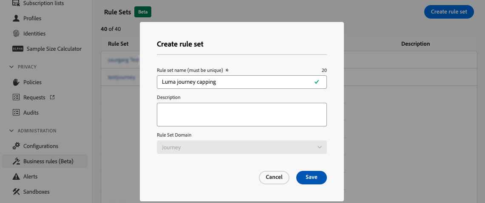
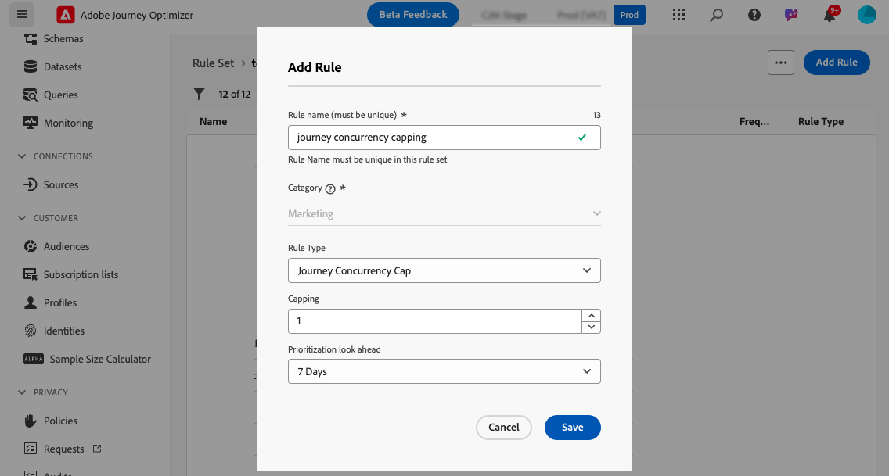
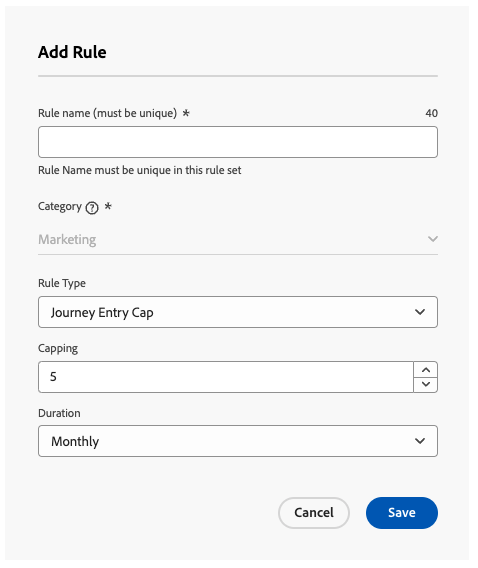
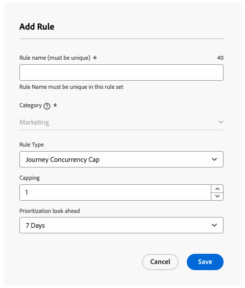
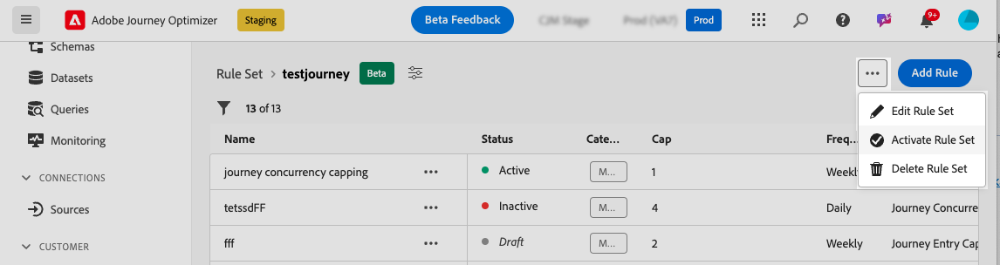

# 歷程上限與仲裁 {#journey-capping}

>[!BEGINSHADEBOX]

本文件指南會提供以下內容：

* [開始使用衝突管理和優先順序](gs-conflict-prioritization.md)
* [偵測歷程與行銷活動中的潛在衝突](conflicts.md)
* [指派歷程和行銷活動的優先順序分數](priority-scores.md)
* **[歷程上限與仲裁](journey-capping.md)**

>[!ENDSHADEBOX]

>[!AVAILABILITY]
>
>衝突管理和優先順序工具目前僅供選定使用者作為有限可用性使用。

歷程上限可幫助您限制設定檔可註冊的歷程次數，防止通訊過載。 在Journey Optimizer中，您可以設定兩種型別的上限規則：

* **專案上限**&#x200B;會限制設定檔在指定期間內的歷程專案數。
* **並行上限**&#x200B;會限制設定檔可同時註冊的歷程數。

這兩種型別的歷程上限都利用優先順序分數來仲裁專案。

➡️ [在影片中探索此功能](#video)

## 建立歷程上限規則 {#create-rule}

若要建立歷程上限規則，請遵循下列步驟：

1. 導覽至&#x200B;**[!UICONTROL 商業規則(Beta)]**&#x200B;功能表以存取規則集詳細目錄。

1. 選取您要新增上限規則的規則集，或建立新規則集：

   * 若要使用現有的規則集，請從清單中選取它。 歷程上限規則只能新增到具有「歷程」網域的規則集。 您可以在&#x200B;**[!UICONTROL 網域]**&#x200B;欄的規則集清單中檢查此資訊。

     

   * 若要在新規則集內建立上限規則，請按一下&#x200B;**[!UICONTROL 建立規則集]**，指定規則集的唯一名稱，並從&#x200B;**[!UICONTROL 規則集網域]**&#x200B;下拉式清單中選取「歷程」，然後按一下&#x200B;**[!UICONTROL 儲存]**。

     

1. 在規則集畫面中，按一下&#x200B;**[!UICONTROL 新增規則]**&#x200B;按鈕，然後設定符合您需求的規則：

   

   * 為規則提供唯一名稱。

   * 在&#x200B;**[!UICONTROL 規則型別]**&#x200B;下拉式清單中，指定規則的上限型別。

      * **[!UICONTROL 歷程專案上限]**：限制設定檔在指定期間內進入歷程的專案數。
      * **[!UICONTROL 歷程並行上限]**：限制設定檔可同時註冊的歷程數。

   * 展開下列各節以瞭解如何設定每種型別的上限：

     +++設定歷程專案上限規則

      1. 在&#x200B;**[!UICONTROL 上限]**&#x200B;欄位中，設定設定檔可輸入的歷程數目上限。
      1. 在&#x200B;**[!UICONTROL 期間]**&#x200B;欄位中，定義要考慮的時間段。 請注意，持續時間是根據UTC時區。 例如，每日上限將在UTC午夜重設。

     在此範例中，我們要限制設定檔在一個月內輸入超過「5」個歷程。

     

     >[!NOTE]
     >
     >系統會考量套用此相同規則之即將排程歷程的優先順序。
     >
     >在此範例中，如果行銷人員已輸入4個歷程，而本月有另一個具有較高優先順序的即將排程歷程，則會抑制客戶進入較低優先順序的歷程。

+++

     +++設定歷程並行上限規則

      1. 在&#x200B;**[!UICONTROL 上限]**&#x200B;欄位中，設定設定檔可同時註冊的歷程數上限。

      1. 使用&#x200B;**[!UICONTROL 優先順序檢視]**&#x200B;欄位，根據所選期間（例如1天、7天、30天）的優先順序分數仲裁歷程專案。 如果設定檔符合多個歷程的資格，這有助於排定進入較高價值歷程的優先順序。

     在此範例中，如果設定檔已註冊到包含相同規則集的另一個歷程，我們會限制設定檔進入歷程。 如果未來7天內的另一個歷程有較高的優先順序分數，則設定檔不會進入此歷程。

     {width="50%" zommable="yes"}

+++

1. 當上限規則準備好套用至歷程時，請按一下其名稱旁邊的省略符號按鈕以啟動它。

   

1. 按一下畫面右上角「新增規則」按鈕旁的省略符號按鈕，啟動整個規則集。

   

## 將上限規則套用至歷程 {#apply-capping}

若要將上限規則套用至歷程，請存取歷程並開啟其屬性。 在&#x200B;**[!UICONTROL 上限規則]**&#x200B;下拉式清單中，選取相關的規則集。

一旦啟動歷程，規則集中定義的上限規則將生效。

>[!IMPORTANT]
>
>如果立即啟動歷程，系統最多可能需要15分鐘才能開始抑制客戶。 為了防止這種可能性，您可以將歷程排程為至少15分鐘後再開始。

## 操作說明影片 {#video}

>[!VIDEO](https://video.tv.adobe.com/v/3435530?quality=12)
