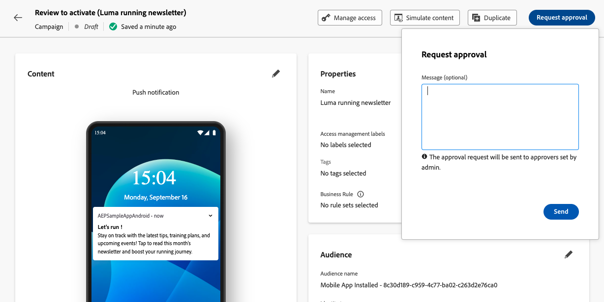
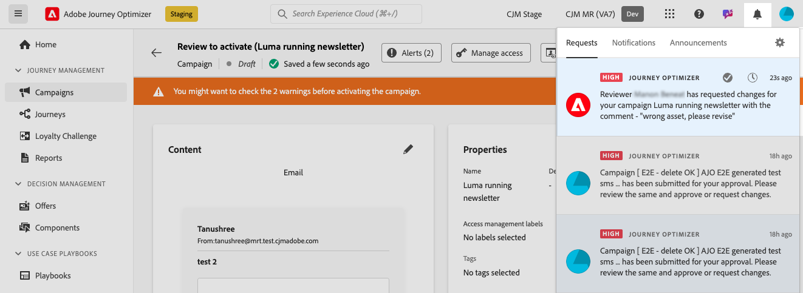

# 請求核准 {#request-approval}

存取核准工作流程取決於您的特定使用案例：

* **沒有使用中的核准原則**

   * **行銷活動**：如果沙箱中的行銷活動物件沒有有效的核准原則，行銷活動將會顯示&#x200B;**[!UICONTROL 啟用]**&#x200B;按鈕，可讓您在不需要核准的情況下啟用它們。

   * **歷程**：如果歷程物件沒有有效的核准原則，歷程會顯示&#x200B;**[!UICONTROL 發佈]**&#x200B;按鈕，讓您直接發佈。

* **存在使用中的核准原則**

   * **行銷活動**：如果沙箱中的Campaign物件存在一或多個作用中核准原則，則所述沙箱中的所有行銷活動都會顯示&#x200B;**[!UICONTROL 要求核准]**按鈕。
如果按一下**[!UICONTROL 請求核准]**&#x200B;按鈕時沒有核准原則套用至選取的物件，則會觸發自動核准工作流程。

   * **歷程**：如果沙箱中的Journey物件存在一或多個使用中的核准原則，則所有歷程都會顯示&#x200B;**[!UICONTROL 要求核准]**按鈕。
如果按一下**[!UICONTROL 請求核准]**&#x200B;按鈕時沒有核准原則套用至選取的物件，則會觸發自動核准工作流程。

## 傳送核准請求

建立行銷活動或歷程後，按一下&#x200B;**[!UICONTROL 要求核准]**&#x200B;按鈕。 這將檢查您的沙箱中是否有適用於行銷活動或歷程的有效核准原則。

* 如果找到適用的核准原則，則會傳送您的行銷活動或歷程以供檢閱。

* 如果按一下&#x200B;**[!UICONTROL 請求核准]**&#x200B;按鈕後，沒有任何核准原則適用於行銷活動或歷程，則行銷活動或歷程將會自動核准並啟動或發佈。

**[!UICONTROL 要求核准]**&#x200B;窗格開啟。 視需要提供訊息給核准者，然後按一下[傳送]**[!UICONTROL 以提交您的要求。]**

當行銷活動或歷程為&#x200B;**[!UICONTROL 稽核]**&#x200B;狀態時，您可以選擇取消核准請求。 按一下&#x200B;**[!UICONTROL 取消請求]**&#x200B;按鈕後，行銷活動或歷程將返回草稿階段，並傳送通知給稽核者，通知他們請求已取消。 然後，您可以進行必要的編輯，並重新提交行銷活動或歷程以進行核准。

## 管理核准請求

將核准要求傳送給核准者後，核准者可以檢閱核准要求，並啟動歷程/行銷活動使其上線，或視需要請求變更。 [瞭解如何檢閱及核准請求](review-approve-request.md)

如果核准者要求變更，系統會透過電子郵件和Journey Optimizer警示通知您；按一下畫面右上角的鈴鐺圖示，即可在&#x200B;**[!UICONTROL 要求]**&#x200B;索引標籤中存取該警示。

若要處理變更請求，請從電子郵件或警報中將其開啟，以存取歷程或促銷活動，並進行請求的變更。 當您的歷程/行銷活動準備好再次接受檢閱時，請使用&#x200B;**[!UICONTROL 請求核准]**&#x200B;按鈕傳送新的核准請求。
