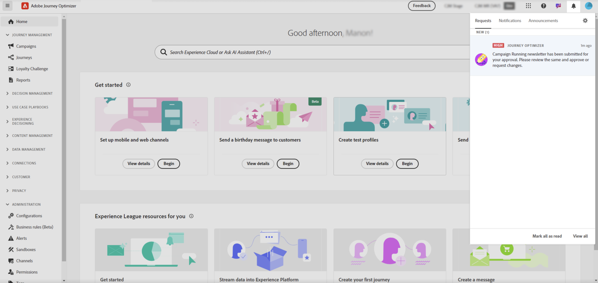
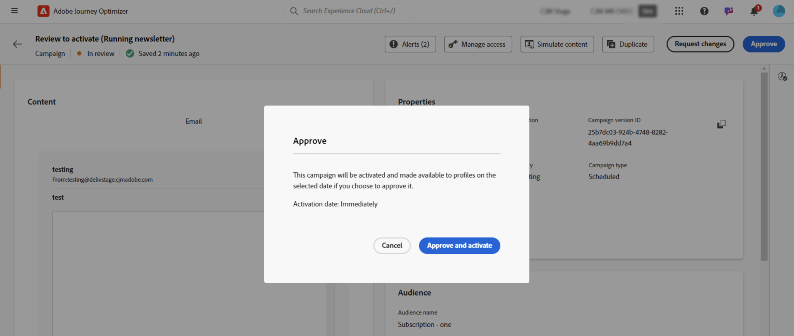
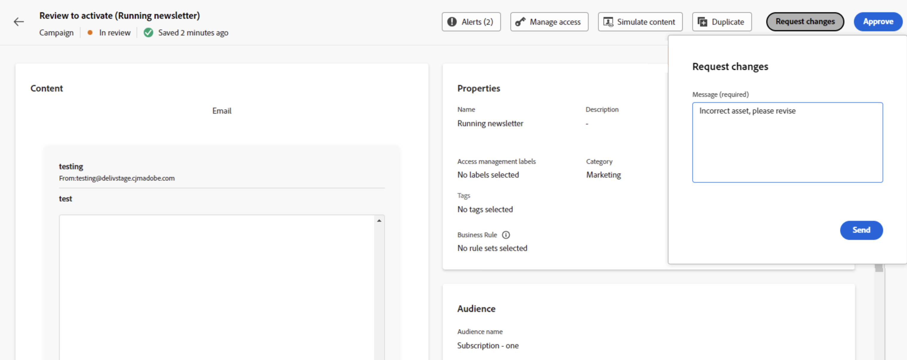

# 檢閱及核准請求 {#approve-requests}

如果核准原則適用於歷程或行銷活動，則需要提交核准才能發佈。 為此，歷程/行銷活動建立者傳送請求給核准原則中定義的核准者，且歷程/行銷活動獲得&#x200B;**[!UICONTROL 稽核中]**&#x200B;狀態。

如果您已被選為核准者，系統會透過電子郵件和Journey Optimizer警示通知您；按一下畫面右上角的鈴鐺圖示，即可在&#x200B;**[!UICONTROL 要求]**&#x200B;索引標籤中存取該警示。

若要檢閱歷程/行銷活動，請從電子郵件或警報中將其開啟，並檢查其設定，例如對象、內容或設定。
完成後，您可以[核准並發佈歷程/行銷活動](#approve)，或在啟用它之前[要求變更](#changes)。

>[!NOTE]
>
>檢閱行銷活動是唯讀步驟：您可以將其所有設定視覺化，但無法對其執行任何動作。
>
>在檢閱歷程或行銷活動之前，請確定您擁有必要的許可權。

## 核准並發佈歷程/行銷活動 {#approve}

如果歷程或行銷活動已準備好上線，您可以按一下&#x200B;**[!UICONTROL 核准]**&#x200B;按鈕來核准它。

在顯示的視窗中，按一下&#x200B;**[!UICONTROL 核准並啟動]**，讓歷程/行銷活動上線。

## 要求變更歷程/行銷活動 {#changes}

如果已傳送以供核准的歷程或行銷活動中需要變更，您可以將請求傳送給建立者，以便他們進行必要的變更。

若要這麼做，請按一下&#x200B;**[!UICONTROL 要求變更]**&#x200B;按鈕。 在開啟的窗格中，提供詳述您請求的訊息，然後按一下&#x200B;**[!UICONTROL 傳送]**&#x200B;以提交您的請求。

傳送請求後，歷程/行銷活動建立者會透過電子郵件和Journey Optimizer警報收到通知。 行銷活動會回到「草稿」狀態。 整合變更後，歷程/行銷活動建立者可以重新提交以進行核准。

>[!NOTE]
>
> 如果您未透過電子郵件收到核准通知，則需要更新Experience Cloud設定檔中的訂閱偏好設定。 [了解更多](https://experienceleague.adobe.com/zh-hant/docs/core-services/interface/features/account-preferences)
