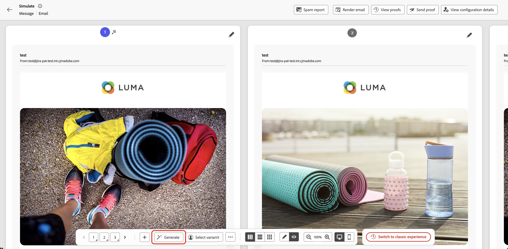
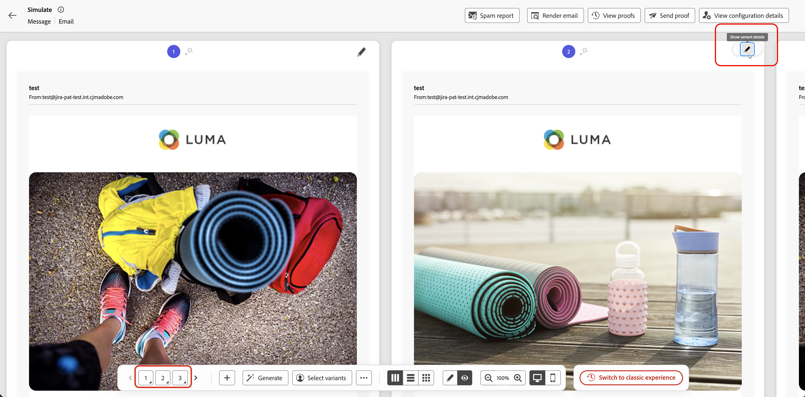
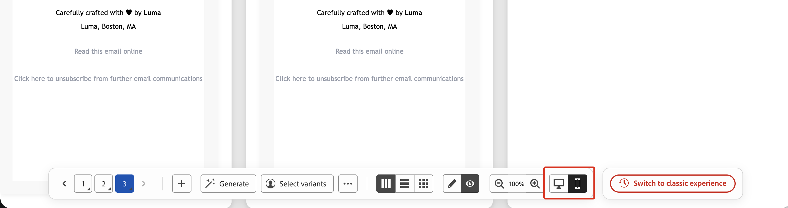

# 模擬內容變化版本 {#simulate-content-variations}

>[!BEGINSHADEBOX]

**在此頁面上：**&#x200B;在並排的格線中預覽您的所有內容變體，從整合的底部動作列管理它們，並隨時切換回傳統體驗。

>[!ENDSHADEBOX]

**[!UICONTROL 模擬內容變體]**&#x200B;體驗已重新設計，讓測試與比較變體更快速輕鬆。 所有變體現在都會在單一可捲動格線中一起呈現，而您需要的每個控制項都可從單一底部動作列取得。

若要存取新體驗，請從您的內容按一下[模擬內容] **[!UICONTROL 以開啟內容模擬畫面。]**&#x200B;如果變體已經可用，則會立即顯示預覽格線。 如果沒有任何變體存在，則會顯示空白變體，您可以透過以下所述的任何方法開始建立變體。

如果您偏好上一個版面，可隨時在底部動作列按一下&#x200B;**[!UICONTROL 切換到傳統體驗]**。 傳統體驗檔案可在[模擬內容變數（傳統體驗）](simulate-sample-input.md)取得。

## 建立和管理變體 {#manage-variants}

變體可透過不同方式建立：逐一手動或匯入檔案、透過AI產生變體，或選取現有的模擬使用者。 您可以手動或透過檔案上傳新增最多30種變體。 使用AI產生時，根據內容的複雜性，最多可以建立40個變體。

### 手動新增變體 {#add-variants}

若要手動新增空白變體，請按一下底部動作列中的&#x200B;**[!UICONTROL +]**。 會新增一個空白變體，您可以直接輸入屬性值。

您也可以使用&#x200B;**[!UICONTROL ...]** > **上傳變體**&#x200B;來匯入CSV、JSON或JSONLINES檔案，其中每一列或專案會變成變體。 從上傳對話方塊下載檔案範本以使用正確格式。

### 自動產生變體 {#auto-generate}

若要使用AI自動產生變體，請按一下底部動作列中的&#x200B;**[!UICONTROL 產生]**&#x200B;按鈕。 系統會分析您的內容、識別個人化欄位和條件式分支，並視需要產生許多變體，以真實的值加以涵蓋。 AI產生的變體可透過卡片上顯示的耀眼圖示來識別。

>[!CAUTION]
>
>按一下「產生&#x200B;**[!UICONTROL 」]**&#x200B;會取代所有現有的變體，包括手動新增或從檔案新增的任何變體。

### 從模擬的使用者中選取變體 {#simulated-users}

您可以讓變體以&#x200B;**模擬使用者**&#x200B;為基礎，這些使用者是可重複使用的、類似設定檔的測試實體，可跨工作階段儲存並可與其他使用者共用。 和手動輸入的變體不同，模擬的使用者會儲存超過目前的瀏覽器作業階段。

從歷程&#x200B;**[!UICONTROL 模擬]**&#x200B;功能建立和管理模擬使用者。 如需完整程式，請參閱[建立和管理模擬的使用者](../building-journeys/simulate-journey.md#test-users)。

若要使用模擬使用者做為變體：

1. 按一下底部動作列中的&#x200B;**[!UICONTROL 選取變體]**。
1. 從清單中選取您要使用的模擬使用者，然後按一下&#x200B;**[!UICONTROL 選取]**。

選取的模擬使用者會新增為變體。 您可以在本機編輯變體的屬性值以進行測試，但是這些變更不會儲存回模擬的使用者記錄。

### 匯出變體 {#export-variants}

您可以將所有目前的變體（不論是手動新增、透過AI產生，還是從模擬使用者中選取）匯出至CSV檔案。 按一下底部動作列中的&#x200B;**[!UICONTROL ...]**，然後選取&#x200B;**[!UICONTROL 匯出變體]**。

## 預覽變體 {#preview-grid}

### 在變數之間切換 {#switch-variants}

在預覽模式中，所有變體都會並排呈現，頂端會有編號指示器。 若要在變體之間切換，請按一下數字，或使用底部動作列中的&#x200B;**&lt; >**&#x200B;導覽按鈕。

### 在預覽或編輯模式中顯示變體 {#edit-variants}

您可以在預覽或編輯模式中顯示變體，以便直接編輯內容和屬性值。 按一下底部動作列中的&#x200B;**[!UICONTROL 預覽]**&#x200B;或&#x200B;**[!UICONTROL 編輯]**，在兩個模式之間一次切換所有預覽。

若要個別切換單一變體，請按一下其卡片頂端的&#x200B;**[!UICONTROL 顯示預覽]**&#x200B;或&#x200B;**[!UICONTROL 顯示變體詳細資料]**&#x200B;按鈕，或在底部動作列中長按其數字（或使用Alt +向上鍵/向下鍵）。

### 變更版面 {#change-layout}

若要變更變體的顯示方式，請使用&#x200B;**底部動作列**，在並排、垂直棧疊或包裝佈局之間切換。

### 在桌上型電腦和行動檢視之間切換 {#switch-views}

若要顯示變體在不同裝置上的呈現方式，請按一下底部動作列中的圖示，在案頭和行動檢視之間切換。 預覽格線會更新，以顯示變體在選取裝置上的外觀。

## 電子郵件通道的其他功能 {#email-capabilities}

類比電子郵件內容時，頂端列會提供其他電子郵件專用工具。

* **[!UICONTROL 垃圾郵件報告]** — 針對垃圾郵件篩選器分析您的電子郵件內容，並取得傳遞能力分數。 [了解更多](../content-management/spam-report.md)
* **[!UICONTROL 轉譯電子郵件]** — 預覽您的電子郵件在常見電子郵件使用者端與裝置間的轉譯方式。 [了解更多](../content-management/rendering.md)
* **[!UICONTROL 傳送校樣]** — 傳送一或多個變體的校樣給一組電子郵件收件者。 按一下&#x200B;**[!UICONTROL 傳送校樣]**、新增最多10個收件者地址、選取要包含的變體，然後按一下&#x200B;**[!UICONTROL 傳送校樣]**&#x200B;以進行確認。 若要檢閱先前傳送的校樣，請按一下&#x200B;**[!UICONTROL 檢視校樣]**。 [了解更多](../content-management/proofs.md)
* **[!UICONTROL 檢視設定詳細資料]** — 檢閱套用至此內容的頻道設定。
