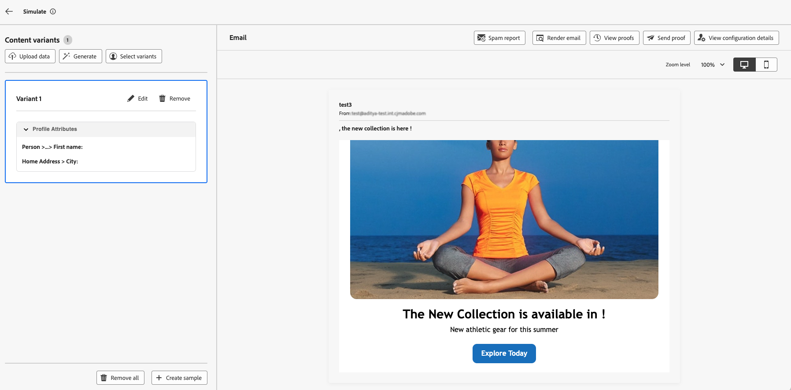
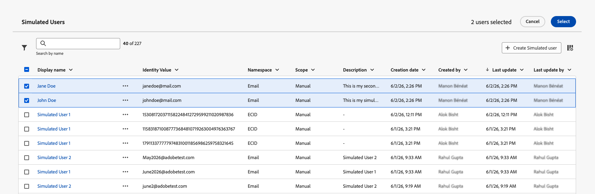
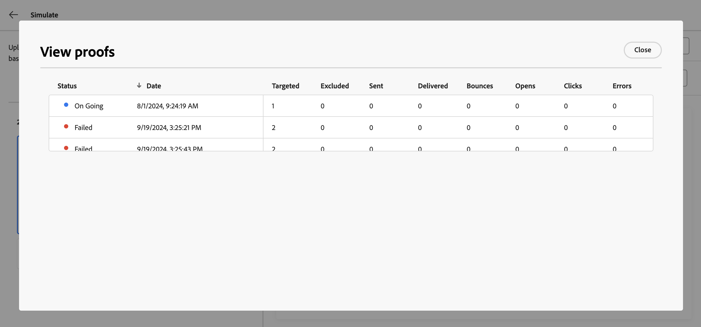

# 模擬內容變化版本 {#custom-profiles}

>[!CONTEXTUALHELP]
>id="ajo_simulate_sample_profiles"
>title="使用範例輸入進行模擬"
>abstract="在此畫面中，您可以使用AI自動產生內容變體、透過CSV或JSON範本新增值、手動輸入內容變體或使用測試設定檔，以測試內容變體。"

當您的內容包含個人化或條件式邏輯時，您必須先驗證其是否正確呈現每個型別的收件者，才能進行傳送。

[!DNL Journey Optimizer]中的&#x200B;**[!UICONTROL 模擬內容變化]**&#x200B;體驗可讓您從單一熒幕測試您內容的多個變化、透過AI自動產生、手動輸入、從檔案匯入，或根據可重複使用的模擬使用者，以解決此問題。 您可以預覽每個變體轉譯和傳送校樣的方式，完全無須預先在Adobe Experience Platform中建立持續性設定檔。

從您的內容中，選取&#x200B;**[!UICONTROL 模擬內容]**&#x200B;然後&#x200B;**[!UICONTROL 模擬內容變化]**&#x200B;以開啟單一體驗，您可以：

* **使用AI自動產生變體**，以涵蓋個人化和條件式分支
* **手動新增變體**，或從CSV或JSON檔案新增
* **使用模擬的使用者**，以儲存且可重複使用的測試資料來預覽和校訂
* 針對選取的變體，**預覽**&#x200B;演算及&#x200B;**傳送電子郵件校樣**

系統會自動偵測內容中用於個人化的所有屬性。 變體是內容的版本，其屬性的值不同。

>[!NOTE]
>
>變體僅會作為您目前內容的測試用途。 它們不會儲存在Adobe Experience Platform中，而是儲存在您的使用者瀏覽器工作階段中，這表示在登出或從其他裝置工作時，不會顯示它們。

## 護欄與限制 {#limitations}

開始使用範例輸入資料來測試內容之前，請考量下列護欄和先決條件。

* **管道** — 模擬內容變化可用於：

   * 電子郵件、簡訊和推播通知頻道；
   * 所有傳入頻道（網頁、程式碼型體驗、應用程式內、內容卡）。

* **支援的功能** — 內容變化可搭配[!DNL Journey Optimizer]多語言內容與內容實驗功能使用。 這可讓您以多種語言測試訊息，並透過實驗最佳化內容。

  您也可以善用內容變數來測試您的內容範本。

  >[!NOTE]
  >
  >目前，目前的體驗無法使用收件匣轉譯和垃圾郵件報告。 若要使用這些功能，請從您的內容中選取&#x200B;**[!UICONTROL 模擬內容]**&#x200B;按鈕，以存取先前的使用者介面。

* **屬性** — 同時支援設定檔和內容屬性。

* **資料型別** — 為您的變體輸入資料時，僅支援下列資料型別：數字（整數與小數）、字串、布林值和日期型別。 任何其他資料型別都會顯示錯誤。

* **變體數目** — 您最多可以新增30個變體，以使用檔案、手動或透過自動產生來測試您的內容。

## 建立內容變體

若要建立內容的變化，請按一下[模擬內容]按鈕&#x200B;]**，然後選擇[模擬內容變化]]**。**[!UICONTROL **[!UICONTROL 


您可以透過下列方式建立變體：

* [手動或從檔案](#profiles)新增變體。
* [使用AI自動產生變體](#auto-generate-variants)。
* [從現有的模擬使用者中選取變體](#simulated-users)。

建立變體後，您可以[預覽內容並傳送校樣](#preview-proofs)。

### 手動或從檔案新增變體 {#profiles}

存取內容變數體驗時，系統會自動偵測內容中使用的所有個人化欄位，並顯示於空白變數中。

例如，如果您的電子郵件包含兩個個人化欄位「First name」和「City」，它們會出現在清單中。 一開始不會輸入任何值，且預覽窗格中不會顯示任何個人化內容。



您可以手動新增變體，或從檔案上傳變體。

+++ 手動新增變體

若要編輯預設變體的值，請按一下&#x200B;**[!UICONTROL 編輯]**&#x200B;按鈕，為每個個人化欄位提供自訂值。 預覽窗格將會更新，以顯示您的內容如何以輸入的值呈現。

若要新增變體，請按一下&#x200B;**[!UICONTROL 建立樣本]**&#x200B;按鈕。 出現新的空白變體，包含所有偵測到的個人化欄位。 您可以視需要編輯新變體。


+++

+++ 從檔案新增變體

您可以上傳包含預先定義變體和值的檔案來加速此程式。

1. 按一下&#x200B;**[!UICONTROL 上傳資料]**&#x200B;按鈕，開啟檔案上傳畫面。
1. 選取「**[!UICONTROL 下載範例]**」以下載CSV、JSON或JSONLINES檔案範本。
1. 開啟範本檔案，並為每個設定檔屬性填入所需的值。 此範本包含用於內容中個人化之每個設定檔屬性的欄。

   JSON語法範例：

   ```json
   {
   "profile": {
       "attributes": {
       "person": {
           "name": {
               "lastName": "Doe",
               "firstName": "John"
               }
           }
       }
   }
   }
   ```

1. 檔案準備就緒後，請選取&#x200B;**[!UICONTROL 確認]**&#x200B;以載入檔案。 上傳後，新變體會新增到檔案中每個專案的清單中。

+++

### 自動生成內容變體 {#auto-generate-variants}

[!DNL Journey Optimizer]可以使用AI型模擬來自動產生內容變體，這樣您就可以驗證個人化邏輯，而不需要手動建立變體。 在呈現內容以進行模擬或校訂時，系統會分析您的內容、識別個人化欄位，並以有意義的值取代它們，以獲得逼真的預覽。

若要自動產生變體，請按一下&#x200B;**[!UICONTROL 產生]**&#x200B;按鈕，然後等待系統產生變體。 檢閱變體清單中產生的變體及其轉譯。


>[!NOTE]
>
>產生會產生單一變體。 按一下「產生」****&#x200B;會將清單中的所有現有內容變體（包括您手動新增或從檔案新增的任何內容）取代為一個產生的變體。

### 從模擬的使用者中選取變體 {#simulated-users}

在&#x200B;**[!UICONTROL 模擬內容變化]**&#x200B;中，您可以根據&#x200B;**模擬的使用者**&#x200B;來設定變體。 模擬使用者是為測試而建立的臨時、類似設定檔的實體，不使用Adobe Experience Platform中的持續設定檔。 不同於只為目前瀏覽器工作階段新增的變體，模擬使用者會儲存起來，並可跨歷程和其他使用者重複使用。

從歷程&#x200B;**[!UICONTROL 模擬]**&#x200B;功能建立和管理模擬使用者。 如需建立、儲存和重複使用它們的完整程式，請參閱[建立和管理模擬的使用者](../building-journeys/simulate-journey.md#test-users)。

建立模擬的使用者後，您就可以使用這些使用者來預覽您的內容。 若要這麼做，請依照以下步驟進行：

1. 按一下&#x200B;**[!UICONTROL 選取變體]**&#x200B;按鈕。
1. 在現有模擬使用者清單中，選取您要使用的使用者，然後按一下[選取]。****

   

1. 選取的模擬使用者會新增至您的內容變體清單，您可以在其中預覽內容及其屬性值。 您也可以手動編輯變體的值進行測試，但這些變更不會儲存回模擬的使用者。

## 預覽內容並傳送校樣 {#preview-proofs}

新增變體後，您就可以使用這些變體在右窗格中預覽您的內容，並傳送電子郵件校樣。

### 預覽內容變數 {#preview}

若要使用變體預覽您的內容，請從清單中選取相關變體，以使用為此變體輸入的資訊更新預覽窗格中的內容。

在以下範例中，我們已為電子郵件主旨行新增兩種變體：

| 變體1選擇 | 變體2選擇 |
|----------|-------------|
|  |  |

<!--
For multilingual content and experimentation, a dropdown is available to switch between the different language variants or treatments.


-->

### 發送校訂 {#proofs}

Journey Optimizer可讓您傳送校樣到電子郵件地址，同時模擬您在模擬畫面中新增的一或多個變體。 步驟如下：

1. 確認已新增變體以測試您的內容，然後按一下&#x200B;**[!UICONTROL 傳送校樣]**&#x200B;按鈕。

1. 在&#x200B;**[!UICONTROL 收件者]**&#x200B;欄位中，輸入您要傳送證明的電子郵件地址，然後按一下&#x200B;**[!UICONTROL 新增]**。 重複操作，將校樣傳送至其他電子郵件地址。 您最多可以新增10個校訂收件者。

1. 在熒幕的底部，選取您要在校樣中使用的變體。 您可以選取多個變體，在這種情況下，電子郵件將包含與所選變體相同數量的校樣。

   如需變體的詳細資訊，請選取&#x200B;**[!UICONTROL 檢視設定檔詳細資料]**&#x200B;連結。 這可讓您顯示在先前畫面中針對不同變體輸入的資訊。

   

1. 按一下&#x200B;**[!UICONTROL 傳送校樣]**&#x200B;按鈕以開始傳送校樣。

1. 若要追蹤校訂傳送，請按一下模擬內容畫面中的&#x200B;**[!UICONTROL 檢視校訂]**&#x200B;按鈕。


