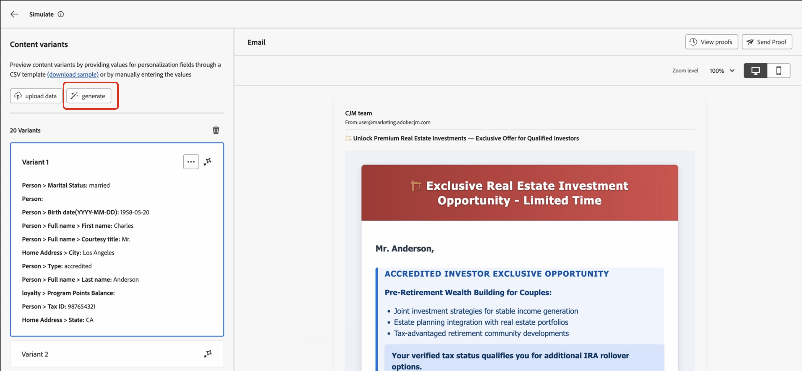

# 自動產生內容變體(Beta){#auto-generate-variants}

>[!AVAILABILITY]
>
>此功能目前在&#x200B;**私人測試版**&#x200B;中，可能無法在您的環境中使用。 請聯絡您的 Adobe 代表以取得存取權。

[!DNL Journey Optimizer]引入以AI為基礎的模擬，可自動產生多個變體以測試您的內容。 此功能可減少手動建立變體的需求，更輕鬆地跨複雜範本驗證個人化邏輯。

呈現內容以進行模擬或校訂時，系統會分析您的內容並識別所有個人化Token和分支規則。 它以有意義的值取代個人化代號，可提供近乎逼真的最終內容預覽。

請考慮具有以&#x200B;**投資者型別**、**年齡群組**、**婚姻狀況**、**稅務ID驗證**&#x200B;及&#x200B;**地點**&#x200B;為基礎之分支邏輯的金融服務電子郵件範本。 若不產生變體，您必須手動建立數十個變體以驗證所有路徑。 使用自動產生的變體，系統會產生代表性變體來自動涵蓋這些條件。  每個產生的變體都會在預覽窗格中轉譯，明確顯示套用的區塊和條件。

## 產生內容變體

若要產生內容的變體並加以預覽，請遵循下列步驟：

1. 開啟您的內容並選取&#x200B;**[!UICONTROL 模擬內容]** / **[!UICONTROL 模擬內容變化]**。

   

2. 按一下&#x200B;**[!UICONTROL 產生]**&#x200B;按鈕。

   

3. [!DNL Journey Optimizer]會根據偵測到的屬性自動產生變體。

4. 在左窗格中檢閱產生的變體清單，並選取變體以在預覽窗格中檢視其個人化呈現。

>[!NOTE]
>
>此功能與標準模擬內容變數功能的運作方式相同。 如需內容變化模擬以及相關護欄和限制的詳細資訊，請參閱本節： [模擬內容變化](../test-approve/simulate-sample-input.md)
