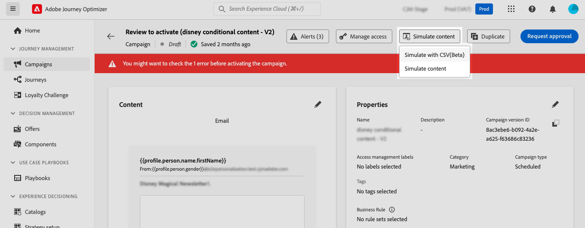
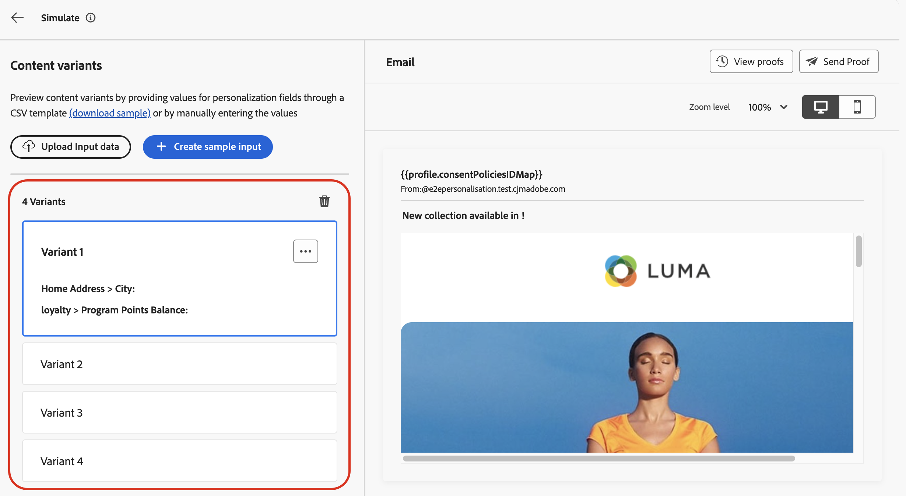
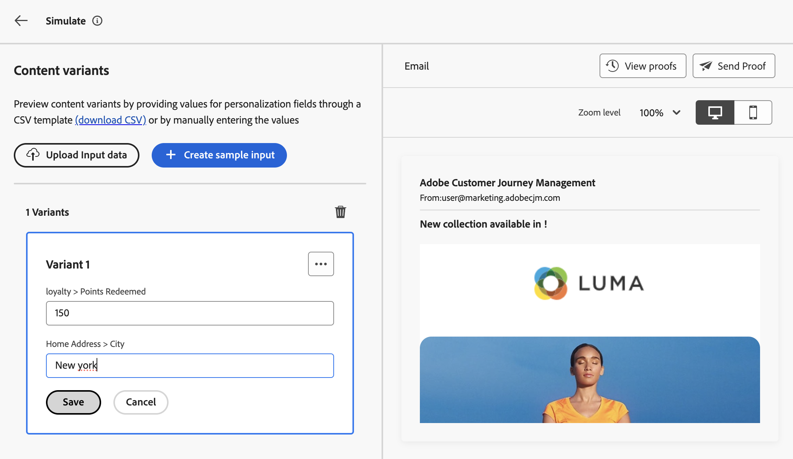
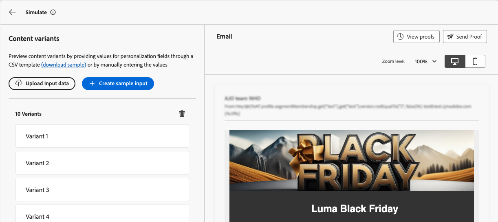
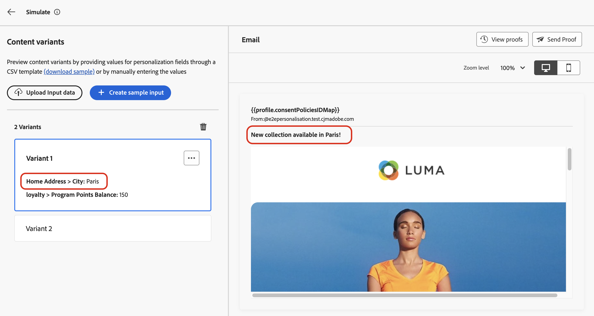
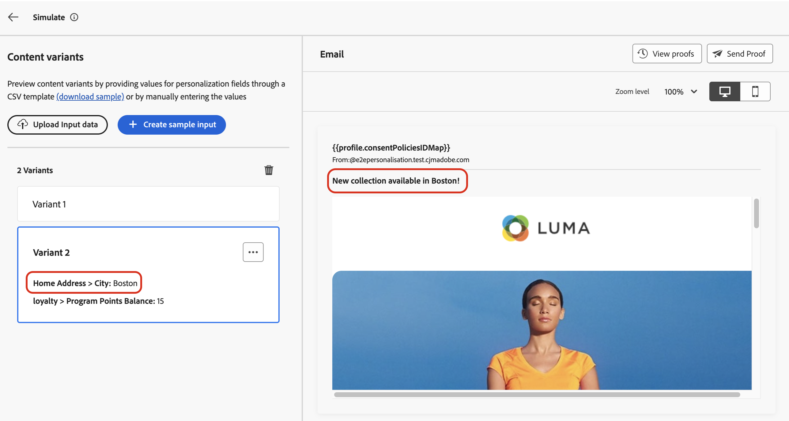
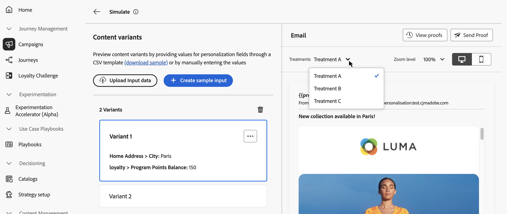
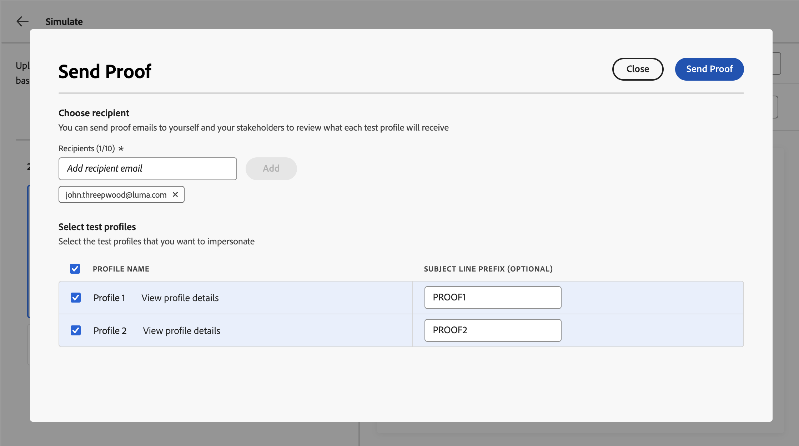
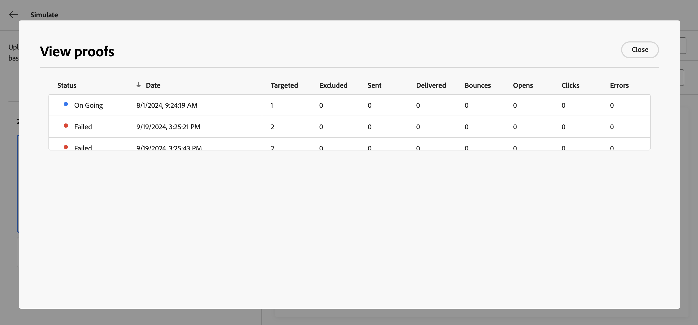

# 模擬內容變化版本 {#custom-profiles}

>[!CONTEXTUALHELP]
>id="ajo_simulate_sample_profiles"
>title="使用範例輸入進行模擬"
>abstract="在這個畫面中，您可以透過 CSV 或 JSON 範本為個人化欄位提供值，或手動輸入值來測試內容的不同變體。"

[!DNL Journey Optimizer]可讓您使用從CSV或JSON檔案上傳或手動新增的範例輸入資料，預覽您內容的不同變體。

系統會自動偵測您在內容中用於個人化的所有屬性，這些屬性可用於測試以建立多個變體。 變體是指具有不同屬性值的內容版本。

>[!NOTE]
>
>變體僅會作為您目前內容的測試用途。 它們不會儲存在Adobe Experience Platform中，而是儲存在您的使用者瀏覽器工作階段中，這表示在登出或從其他裝置工作時，不會顯示它們。

## 護欄與限制 {#limitations}

開始使用範例輸入資料來測試內容之前，請考量下列護欄和先決條件。

* **管道** — 模擬內容變化可用於：

   * 電子郵件、簡訊和推播通知頻道；
   * 所有傳入頻道（網頁、程式碼型體驗、應用程式內、內容卡）。

* **支援的功能** — 內容變化可搭配[!DNL Journey Optimizer]多語言內容與內容實驗功能使用。 這可讓您以多種語言測試訊息，並透過實驗最佳化內容。

  您也可以善用內容變數來測試您的內容範本。

  >[!NOTE]
  >
  >目前，目前的體驗無法使用收件匣轉譯和垃圾郵件報告。 若要使用這些功能，請從您的內容中選取&#x200B;**[!UICONTROL 模擬內容]**&#x200B;按鈕，以存取先前的使用者介面。

* **屬性** — 同時支援設定檔和內容屬性。

* **資料型別** — 為您的變體輸入資料時，僅支援下列資料型別：數字（整數與小數）、字串、布林值和日期型別。 任何其他資料型別都會顯示錯誤。

* **變體數目** — 您可以使用檔案或手動新增最多30個變體來測試您的內容。

## 新增和預覽內容變數

若要建立內容變化並預覽，請按一下[模擬內容]按鈕&#x200B;**[!UICONTROL ，然後選擇[模擬內容變化]]**&#x200B;**[!UICONTROL 。]**



測試內容的主要步驟如下：

1. **新增變體** — 透過上傳檔案或手動新增資料，使用範例輸入資料新增最多30個變體。 [瞭解如何新增變體](#profiles)
1. **預覽內容變體** — 使用不同的變體檢查內容的預覽。 [瞭解如何預覽您的內容](#preview)
1. **傳送電子郵件校樣** — 針對電子郵件內容，使用不同的變體將最多10個校樣傳送至電子郵件地址。 [瞭解如何傳送校樣](#proofs)

### 新增變體 {#profiles}

存取內容變數體驗時，系統會自動偵測內容中使用的所有個人化欄位，並顯示於空白變數清單中。

例如，如果您的電子郵件包含兩個個人化欄位「城市」和「方案積分餘額」，它們將會顯示在清單中。 一開始不會輸入任何值，且預覽窗格中不會顯示任何個人化內容。



若要編輯變體的值：

1. 按一下變體旁邊的省略符號按鈕。
1. 選取「**[!UICONTROL 編輯]**」，為每個個人化欄位提供自訂值。
1. 預覽窗格將會更新，以顯示您的內容如何以輸入的值呈現。

若要新增變體：

1. 按一下&#x200B;**[!UICONTROL 建立範例輸入]**&#x200B;按鈕。
1. 出現新的空白變體，包含所有偵測到的個人化欄位。
1. 視需要編輯新變體。



您也可以上傳包含預先定義變體和值的檔案，以加速處理作業。

1. 按一下&#x200B;**[!UICONTROL 下載範例]**&#x200B;以下載檔案範本。
1. 選擇檔案格式：CSV、JSON或JSONLINES。
1. 開啟範本檔案，並為每個設定檔屬性填入所需的值。 此範本包含用於內容中個人化之每個設定檔屬性的欄。

   JSON語法範例：

   ```
   {
   "profile": {
       "attributes": {
       "person": {
           "name": {
               "lastName": "Doe",
               "firstName": "John"
               }
           }
       }
   }
   }
   ```

1. 檔案準備就緒後，請按一下&#x200B;**[!UICONTROL 上傳輸入資料]**&#x200B;以載入該檔案。
1. 上傳後，新變體會新增到檔案中每個專案的清單中。

   

新增變體後，您就可以使用這些變體在右窗格中預覽您的內容，並傳送電子郵件校樣。

### 預覽內容變數 {#preview}

若要使用變體預覽您的內容，請從清單中選取相關變體，以使用為此變體輸入的資訊更新預覽窗格中的內容。

在以下範例中，我們已為電子郵件主旨行新增兩種變體：

| 變體1選擇 | 變體2選擇 |
|----------|-------------|
|  |  |

對於多語言內容和實驗，下拉式清單可用於在不同的語言變體或處理之間切換。



您可以隨時使用右上角的省略符號按鈕並選取&#x200B;**[!UICONTROL 移除]**&#x200B;來移除變體。 若要編輯變體的資訊，請按一下省略符號按鈕，然後選取&#x200B;**[!UICONTROL 編輯]**。

### 發送校訂 {#proofs}

Journey Optimizer可讓您傳送校樣到電子郵件地址，同時模擬您在模擬畫面中新增的一或多個變體。 步驟如下：

1. 確認已新增變體以測試您的內容，然後按一下&#x200B;**[!UICONTROL 傳送校樣]**&#x200B;按鈕。

1. 在&#x200B;**[!UICONTROL 收件者]**&#x200B;欄位中，輸入您要傳送證明的電子郵件地址，然後按一下&#x200B;**[!UICONTROL 新增]**。 重複操作，將校樣傳送至其他電子郵件地址。 您最多可以新增10個校訂收件者。

1. 在熒幕的底部，選取您要在校樣中使用的變體。 您可以選取多個變體，在這種情況下，電子郵件將包含與所選變體相同數量的校樣。

   如需變體的詳細資訊，請選取&#x200B;**[!UICONTROL 檢視設定檔詳細資料]**&#x200B;連結。 這可讓您顯示在先前畫面中針對不同變體輸入的資訊。

   

1. 按一下&#x200B;**[!UICONTROL 傳送校樣]**&#x200B;按鈕以開始傳送校樣。

1. 若要追蹤校訂傳送，請按一下模擬內容畫面中的&#x200B;**[!UICONTROL 檢視校訂]**&#x200B;按鈕。


